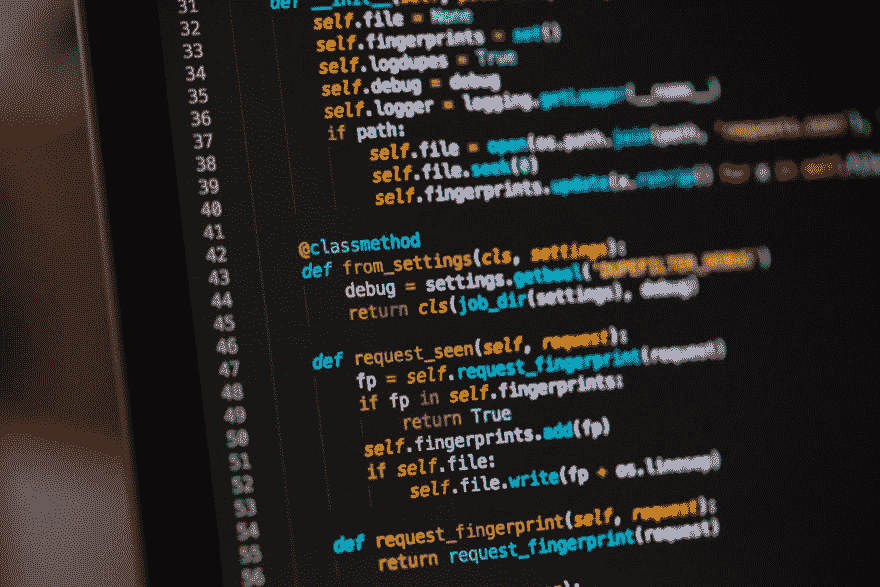

# 面向编程初学者的提示和技巧

> 原文：<https://dev.to/siddhantdubey/tips-and-tricks-for-programming-beginners-840>

如何在编码时不失去理智

[继续在介质上读取](https://medium.com/@sid12.dubey/tips-and-tricks-for-programming-beginners-f22e0ce24516?source=rss-65edcdb268ba------2)