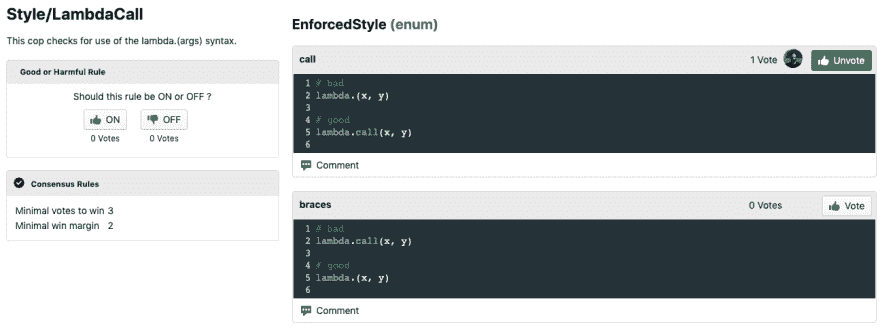
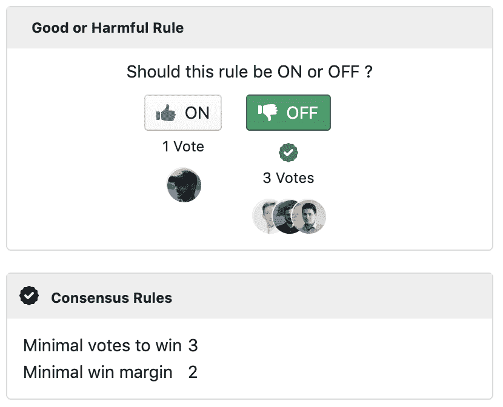
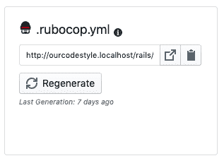
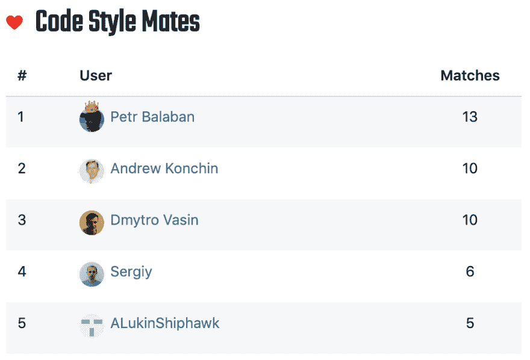

# Come up to style guide consensus with your team using voting

> 原文：[https://dev.to/fuksito/come-up-to-style-guide-consensus-with-your-team-using-voting-1bn5](https://dev.to/fuksito/come-up-to-style-guide-consensus-with-your-team-using-voting-1bn5)

# How to create Style Guide for your team that will suit everyone

[OurCodeStyle](https://ourcodestyle.com) - create style guide that will best suit your team, or just have fun voting for code style options, find people who have same preferences.

Ruby and JavaScript both have static code analyzers and formatters, like
RuboCop, and ESLint, among most used.

This tools come with a set of rules, and rule options which can be configured based on your preferences, the problem is that people in the team might have different preferences.

Me and my team have been using this tools for a while, and we find some rules useful, some are of ambiguous benefit. For such cases we used Slack bot to vote if we want some rule to be ON or on particular configs of the rule.

But Slack is not very convenient for this, so in my free time I have made a site which contains all the rules from RuboCop and ESLint with their options and params, which can then generate proper .rubocop.yml file based on voting.

But why limit to only own team, I have made it accessible for everyone.

### Voting

At above example there is 2 options for a Cop Style/LambdaCall: call, braces.
You can see examples of each option, and vote for your option.

See in action: [Style/LambdaCall](https://ourcodestyle.com/organizations/master/style-guides/8/rules/1646)

### Consensus

By default an option wins when it has at least 2 votes more than other options, and at least 3 votes in total (it can be configured for each team separately).
I found it that 50%+1 vote is usually not a good idea, you should configure this for your team needs.

### Config Generation

After you have some consensus on options you can generate configuration for linter.
You receive a static link to your generated config, you can either download it and put into project, or add it to your current config as external inheritance source.

### Code Style Mates

As you start to vote on options more and more, you can notice that your votes are matching with some other people on your team. To track this better there is a widget in your profile showing people you have most matches, it means your taste on code style is very similar.

### Master Style Guide & Your Own

You can use site in 2 ways:

1.  You can create your organization, create style guides in it and vote with your team
2.  Or there is one public organization, called Master, where everyone can vote, this way we can build a collective mind style guide.

### Free Form Guide

In addition to RuboCop and ESLint, you can create a free form guide, which you can populate with your own pools, for example if you can solve one problem in several ways and don't know which to choose, just crate an Enum type pool, paste your code blocks and ask your teammates to vote. Syntax highlighting for free form is:

*   ruby
*   javascript
*   python
*   java
*   php
*   go
*   kotlin
*   perl
*   rust
*   elixir

Please comment if you find it useful or have any issues or proposals