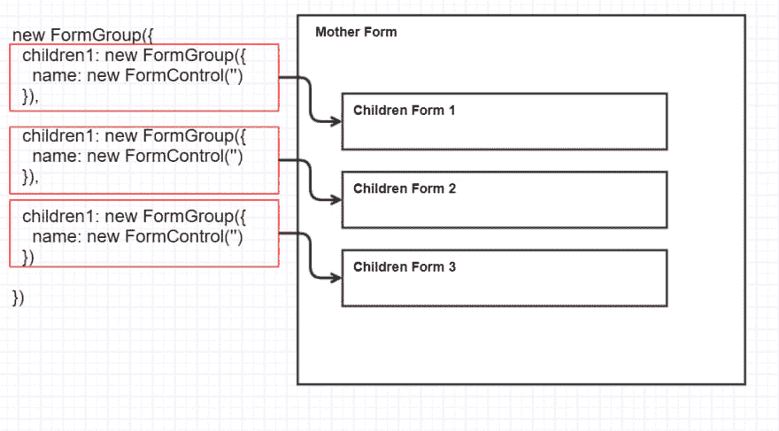
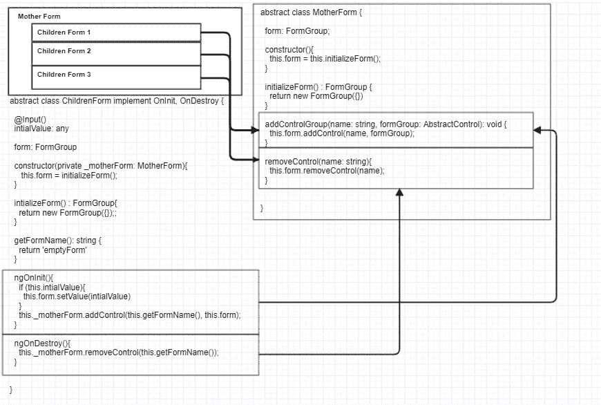
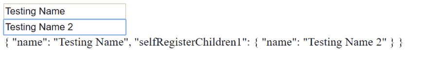

# 角度的复杂动态形态设计(第一部分——形态组)

> 原文：<https://dev.to/imben1109/nested-custom-component-and-form-group-part-1-1f97>

# 简介

在现代 Web 应用程序中，表单可能非常非常复杂。这将需要一个花哨的布局，动态的，有效的，功能性的，还有性能。

这些都使得 Web 应用程序的开发变得困难，并且耗费了大量的资源。所有开发的框架都试图让它变得更容易，但仍然非常非常非常困难。

在这里，我想分享一些处理它的方法。

*   表单组作为参数(表单组方法)
*   自助注册表单(表单组方法)
*   上下文服务(RxJs 方法)
*   角度输入输出处理(输入输出方法)
*   角度双向绑定方法(输入输出方法)
*   NgRx 商店方法(Redux 方法)

## 表格组为参数

[](https://res.cloudinary.com/practicaldev/image/fetch/s--PzHimmkb--/c_limit%2Cf_auto%2Cfl_progressive%2Cq_auto%2Cw_880/https://thepracticaldev.s3.amazonaws.com/i/bbgbmjqx436tede8hrac.png)

## 自注册表单组

当子窗体被初始化和销毁时，需要母窗体为窗体提供 addControl 机制。例如，ngFor 和 ngIf 的情况应该得到满足。

[](https://res.cloudinary.com/practicaldev/image/fetch/s--3lSvvSrD--/c_limit%2Cf_auto%2Cfl_progressive%2Cq_auto%2Cw_880/https://thepracticaldev.s3.amazonaws.com/i/g3asre7c8nk46ecg2trt.png)

母表单

```
abstract class MotherForm {
  form: FormGroup;
  constructor(){
    this.from = this.initializeForm();
  }

  initializeForm(): FormGroup {
    return new FormGroup({})
  }
  addControlGroup(name: string, formGroup: AbstractControl): void {
    this.form.addControl(name, formGroup);
  }
  removeControl(name: string){
    this.form.removeControl(name);
  }
} 
```

儿童表格

```
abstract class ChildrenForm implements OnInit, OnDestroy {
  @Input()
  intialValue: any
  form: FormGroup
  constructor(@Host private _motherForm: MotherForm){
    this.form = this.initializeForm();
  }
  initializeForm() : FormGroup{
    return new FormGroup({});
  }
  getFormName(): string {
    return 'emptyForm'
  }
  ngOnInit(){
    if (this.intialValue){
      this.form.setValue(this.initialValue)
    }
    this._motherForm.addControlGroup(this.getFormName(), this.form);
  }
  ngOnDestroy(){
    this._motherForm.removeControlGroup(this.getFormName());
  }
} 
```

现在，实现类将利用这些抽象类进行自我注册。

app-self-register . component . ts

```
import { Component, OnInit } from '@angular/core';
import MotherForm from './mother-form';
import { FormGroup, FormControl } from '@angular/forms';
@Component({
  selector: 'app-self-register',
  templateUrl: './self-register.component.html',
  styleUrls: ['./self-register.component.css']
})
export class SelfRegisterComponent extends MotherForm {
  constructor() {
   super();
  }
  initializeForm(){
    return new FormGroup({
      name: new FormControl('')
    })
  }
} 
```

app-self-register.component.html

```
<form [formGroup]="form">
  <input formControlName="name"/>
  <app-self-register-children1></app-self-register-children1>
</form>
{{form.value | json}} 
```

自助注册-children1.component.ts

```
import { FormGroup, FormControl } from '@angular/forms';
import { Component, OnInit, Host } from '@angular/core';
import ChildrenForm from '../children-form';
import { SelfRegisterComponent } from '../self-register.component';
@Component({
  selector: 'app-self-register-children1',
  templateUrl: './self-register-children1.component.html',
  styleUrls: ['./self-register-children1.component.css']
})
export class SelfRegisterChildren1Component extends ChildrenForm  {
  constructor(@Host() _motherForm: SelfRegisterComponent) {
    super(_motherForm);
  }
  initializeForm(): FormGroup{
    return new FormGroup({
      name: new FormControl('')
    })
  }
  getFormName(): string {
    return "selfRegisterChildren1";
  }
} 
```

self-register-children1.component.html

```
<form [formGroup]="form">
  <input formControlName="name"/>
</form> 
```

结果
[](https://res.cloudinary.com/practicaldev/image/fetch/s--OW6_h0MX--/c_limit%2Cf_auto%2Cfl_progressive%2Cq_auto%2Cw_880/https://thepracticaldev.s3.amazonaws.com/i/c0pwcarw8p90wmcpi9um.png)

## 引用

*   [https://medium . com/self-learning/nested-custom-component-and-form-group-53806 a2 cd0f 5](https://medium.com/self-learning/nested-custom-component-and-form-group-53806a2cd0f5)