# 理解设计模式:Decorator 使用长夜(GOT)示例！

> 原文：<https://dev.to/carlillo/understanding-design-patterns-decorator-using-long-night-got-example-276c>

有 23 种经典的设计模式，在原书《设计模式:可重用面向对象软件的元素》中有描述。这些模式为软件开发中经常重复出现的特定问题提供解决方案。

在本文中，我将描述什么是**装饰模式**；以及如何和何时应用它。

## 装饰者模式:基本思想

> 在面向对象编程中，**装饰模式**是一种设计模式，它允许动态地将行为添加到单个对象中，而不会影响来自同一类的其他对象的行为——Wikipedia
> 
> 动态地将附加责任附加到对象上。Decorators 为扩展功能提供了子类化的灵活替代方案——设计模式:可重用的面向对象软件的元素

这种模式的主要特点是，它允许您动态地(在运行时)将额外的责任附加到一个对象上。因此，这是该模式解决的两个问题:

1.  当您需要能够在运行时向对象分配额外的行为，而不破坏使用这些对象的代码时。

2.  当不能使用继承来扩展类时。

总而言之，装饰模式允许在运行时使用聚合而不是继承来给对象添加新的行为。这个模式的 UML 图如下所示:

[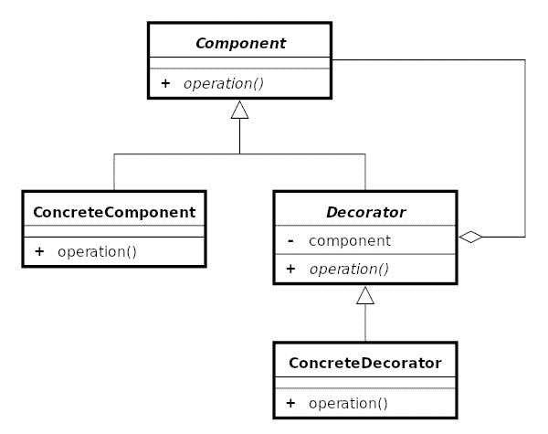](https://res.cloudinary.com/practicaldev/image/fetch/s--2P8NRXFO--/c_limit%2Cf_auto%2Cfl_progressive%2Cq_auto%2Cw_880/https://cdn-images-1.medium.com/max/1000/1%2AvpKzhzeL-y2EdVBmam3wxQ.jpeg)

`Component`类是一个接口，它定义了必须在每个`ConcreteComponent`或`Decorator`家族中实现的不同操作。
`Decorator`类使用组合而不是继承来改进组件。因此，`Decorator`类包装了`Component`来定义每个`Decorator`的公共接口，并将公共操作委托给`Component`。最后，`ConcreteDecorator`被实现来在运行时添加、修改或删除对象的行为。

1.  您需要动态地、透明地向单个对象添加职责，也就是说，不影响其他对象。

2.  你需要加上随时可以收回的责任。

3.  当使用继承的行为非常复杂时，因为必须创建大量的类。

装饰模式有几个优点，概括起来有以下几点:

*   代码**更容易使用、理解和测试**，因为装饰器使用了**单一责任**，因为你可以将行为分成几个更小的类(装饰器)。

*   由于使用了聚合，无需创建新的子类就可以扩展对象的行为。

*   责任可以在运行时从对象中添加或删除。

*   可以通过将一个对象包装到多个装饰器中来组合这些职责。

我现在将向您展示如何使用 JavaScript/TypeScript 实现这种模式。在应用这个模式之前，意识到你试图解决的问题是很有趣的。如果你看下面的 UML 图，它显示了从实现组件接口的组件(ComponentBase)继承的三个组件(ComponentA、ComponentB 和 ComponentC)的传统继承。这些组件中的每一个都实现了特定的行为和属性，并且是不同的(遵守 Liskov 的替换原则)。

[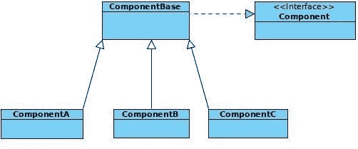](https://res.cloudinary.com/practicaldev/image/fetch/s--qvC44SVe--/c_limit%2Cf_auto%2Cfl_progressive%2Cq_auto%2Cw_880/https://cdn-images-1.medium.com/max/2000/0%2ASIR1bPMvjYKG73u0.jpg)

软件在发展，我们需要具有不同组件的属性和行为的对象。

因此，我们得到了下面的 UML 图。

[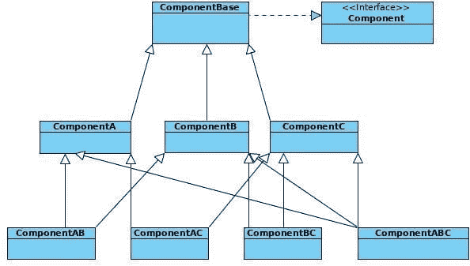](https://res.cloudinary.com/practicaldev/image/fetch/s--B1rdckAk--/c_limit%2Cf_auto%2Cfl_progressive%2Cq_auto%2Cw_880/https://cdn-images-1.medium.com/max/2000/0%2AV-JMUmvhFhi8Z3-L.jpg)

首先出现的问题是大量类的出现。有一个类将每个组件相互联系起来。如果一个新的组件(ComponentD)出现，那么类的爆炸式增长会继续增加，因为我们的问题的架构是基于继承的。最后，对类爆炸的一个小改进是重新组织类的继承，这样所有的类都从一个类继承，如与我们正在解决的问题相关的最后一个图所示。

[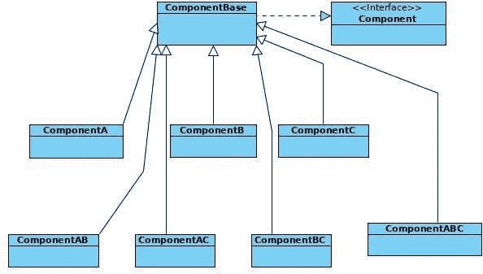](https://res.cloudinary.com/practicaldev/image/fetch/s--SOYhCaFB--/c_limit%2Cf_auto%2Cfl_progressive%2Cq_auto%2Cw_880/https://cdn-images-1.medium.com/max/2000/0%2Ae4jPIw3bjgfpciAF.jpg)

相关的组件和组件库代码如下:

[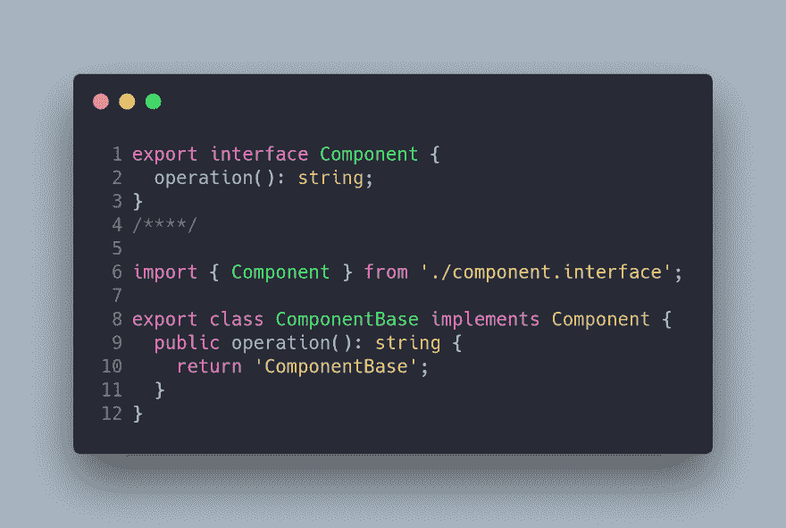](https://res.cloudinary.com/practicaldev/image/fetch/s--0dmDPlOg--/c_limit%2Cf_auto%2Cfl_progressive%2Cq_auto%2Cw_880/https://cdn-images-1.medium.com/max/2400/1%2ADUe4WwtLip0dy3ujVjyrwQ.png)

最后，与每个类相关的代码如下:

[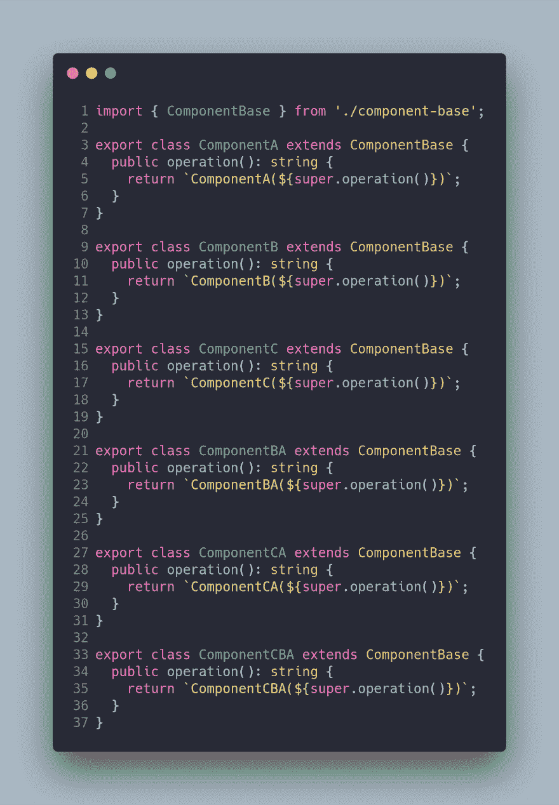](https://res.cloudinary.com/practicaldev/image/fetch/s--YL-nwleQ--/c_limit%2Cf_auto%2Cfl_progressive%2Cq_auto%2Cw_880/https://cdn-images-1.medium.com/max/2368/1%2A3e8M89SrMHGuFu3ga203Mg.png)

解决方案是使用装饰模式。使用这种模式的新 UML 图如下所示:

[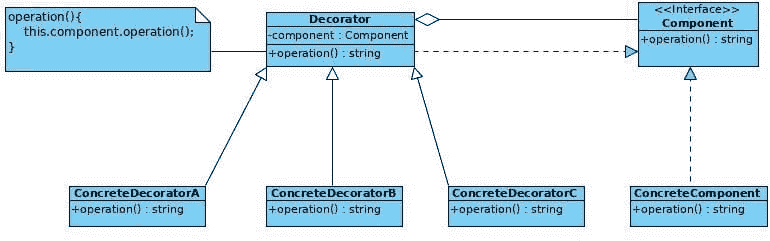](https://res.cloudinary.com/practicaldev/image/fetch/s--i1UllQCS--/c_limit%2Cf_auto%2Cfl_progressive%2Cq_auto%2Cw_880/https://cdn-images-1.medium.com/max/2000/0%2AQ3tiQmLtrs99SOqu.jpg)

因此，解决方案是使用聚合而不是继承。在这个模式中，组件接口被维护，它定义了装饰者和具体组件必须执行的操作。注意，ConcreteComponent 和 Decorator 类都实现了组件接口。除此之外，Decorator 类有一个使用依赖注入的组件实例。可以看出，委托责任是通过注入对象来执行或补充行为的。

最后，每个 decorators 都实现了一个具体的行为，可以根据需要进行组合。此刻，我们正在应用**单一责任**的原则，因为每个装饰者执行一个单一的任务，并且有唯一的责任。

我们现在来看看实现这种模式所生成的代码:

[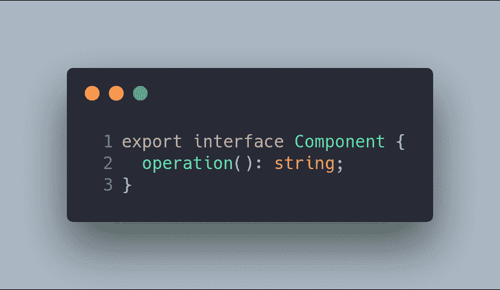](https://res.cloudinary.com/practicaldev/image/fetch/s--G68mJnqr--/c_limit%2Cf_auto%2Cfl_progressive%2Cq_auto%2Cw_880/https://cdn-images-1.medium.com/max/2000/1%2AJT-b0b-pQKvVC9GnpCV20A.png)

[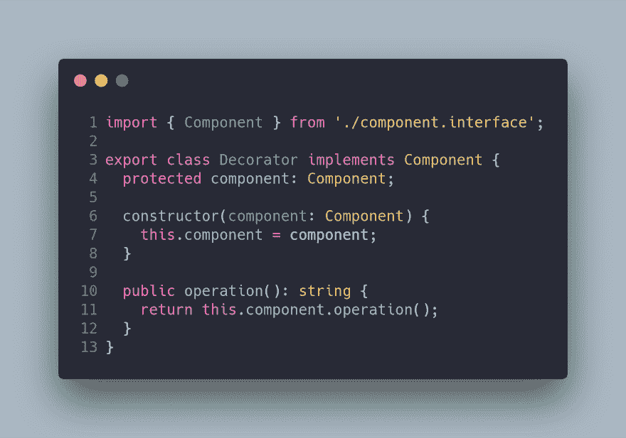](https://res.cloudinary.com/practicaldev/image/fetch/s--tAAq1LR5--/c_limit%2Cf_auto%2Cfl_progressive%2Cq_auto%2Cw_880/https://cdn-images-1.medium.com/max/2400/1%2A-yLh2JWVRaE86aAV7fwGXw.png)

与 ConcreteComponent 组件相关联的代码如下所示，该组件是将应用装饰器的基类:

[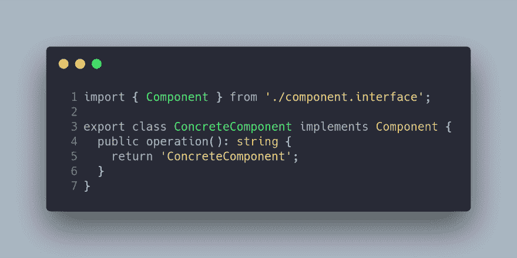](https://res.cloudinary.com/practicaldev/image/fetch/s--9-mvDIZt--/c_limit%2Cf_auto%2Cfl_progressive%2Cq_auto%2Cw_880/https://cdn-images-1.medium.com/max/2504/1%2Aj2VELSm4ibPNlzC54epzWw.png)

最后，每个装饰器实现一个单一的功能，比如基于继承的解决方案，但是没有类的爆炸。

[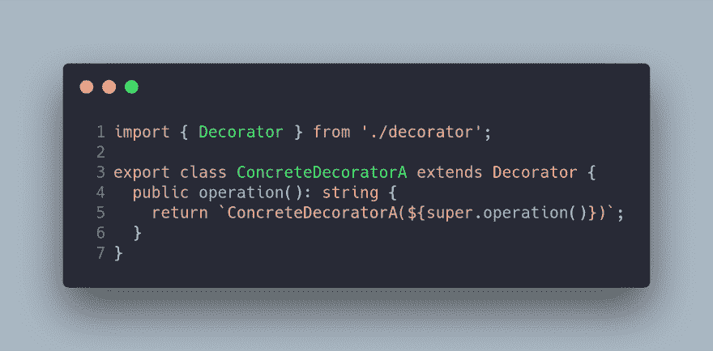](https://res.cloudinary.com/practicaldev/image/fetch/s--9OU6jc71--/c_limit%2Cf_auto%2Cfl_progressive%2Cq_auto%2Cw_880/https://cdn-images-1.medium.com/max/2536/1%2AZOpyir9j0_A4fDfxXaI3aA.png)

[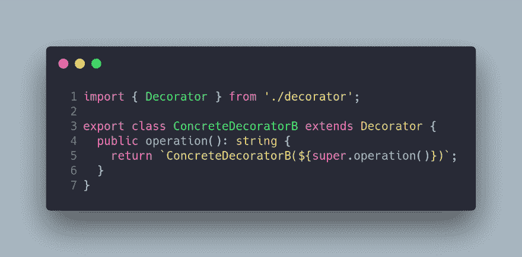](https://res.cloudinary.com/practicaldev/image/fetch/s--n-JrV2kZ--/c_limit%2Cf_auto%2Cfl_progressive%2Cq_auto%2Cw_880/https://cdn-images-1.medium.com/max/2536/1%2AbBN05oEw4kEDvrLrnr_7GQ.png)

最后，每个装饰器实现一个单一的功能，就像使用基于继承的解决方案一样，优点是没有以前的类爆炸。

[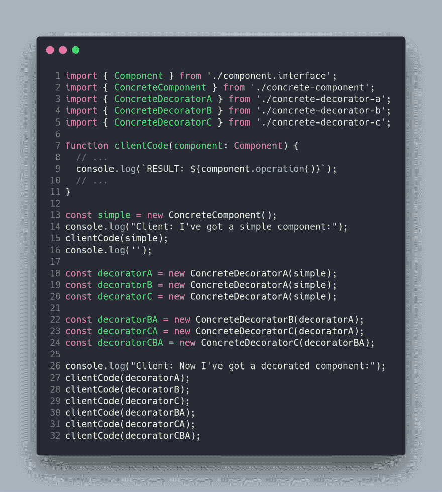](https://res.cloudinary.com/practicaldev/image/fetch/s--vn_k1UXn--/c_limit%2Cf_auto%2Cfl_progressive%2Cq_auto%2Cw_880/https://cdn-images-1.medium.com/max/2740/1%2A9N7VQfNUp7jOaV3nBcr4oA.png)

在应用迭代器模式后，我创建了几个 npm 脚本来运行这里显示的代码示例。

npm 运行示例 1-问题
npm 运行示例 1-装饰器-解决方案-1

## 装饰者模式—例 2:《权力的游戏:漫漫长夜！

想象一下，我们必须模拟《权力的游戏》(GOT)的漫漫长夜之战，其中我们有以下先决条件:

1.  有简单的角色(人类)可以攻击，防御，并有一个随着战斗的进行而被减去的生命。

2.  最初有一个领主夜是一个特殊的白色行者，因为它有很大的力量和生命。

3.  当一个人类(简单角色)死亡时，它会在运行时被重新转换成白色行者，战斗继续。

4.  有两支军队会一直战斗到其中一支全军覆没。

5.  最初，白色行者的军队仅由夜之王组成。

装饰模式将允许我们在运行时将 SimpleCharacter 的行为更改为 WhiteWalker。

我们将展示一个例子，其中一个装饰器扩展另一个装饰器(LordNight 从 WhiteWalker 扩展)，而不是让几个装饰器具有不同的功能。

在下面的 UML 图中，您可以看到针对此问题提出的解决方案:

[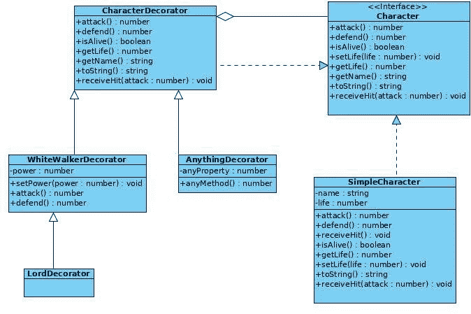](https://res.cloudinary.com/practicaldev/image/fetch/s--yc1kddyN--/c_limit%2Cf_auto%2Cfl_progressive%2Cq_auto%2Cw_880/https://cdn-images-1.medium.com/max/2000/0%2Ag2TivRcsZj8SPt5v.jpg)

好了，第一步是定义将由 SimpleCharacter 和 CharacterDecorator 实现的字符接口，正如您在下面的代码中看到的:

[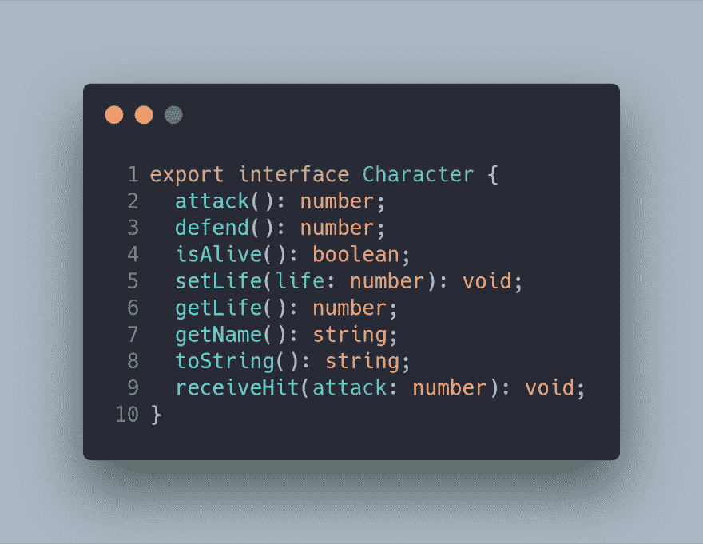](https://res.cloudinary.com/practicaldev/image/fetch/s---svzq96x--/c_limit%2Cf_auto%2Cfl_progressive%2Cq_auto%2Cw_880/https://cdn-images-1.medium.com/max/2000/1%2A9qFCyhHaqlZbpzmn8DCdHg.png)

SimpleCharacter 类表示一个基本角色(人类),我们将使用 decorators 向其添加/修改行为。

[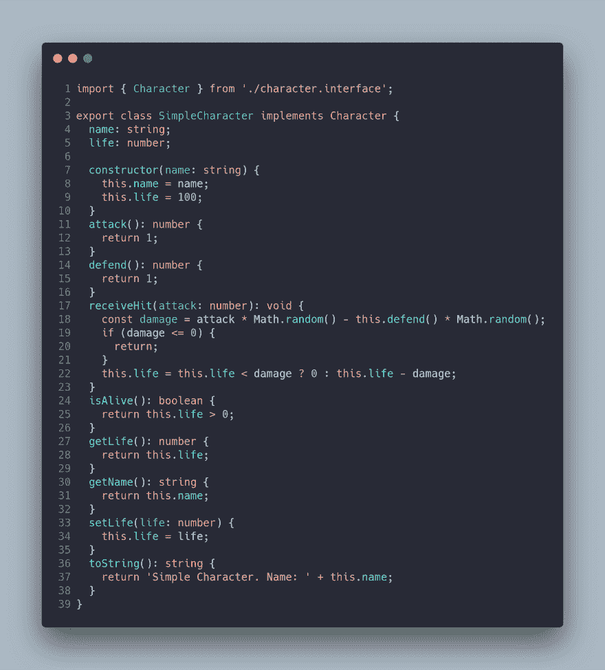](https://res.cloudinary.com/practicaldev/image/fetch/s--n-Jnv33l--/c_limit%2Cf_auto%2Cfl_progressive%2Cq_auto%2Cw_880/https://cdn-images-1.medium.com/max/3212/1%2Ad62bkyOwoebIaamfSFzE4Q.png)

将在战斗中使用的方法是 receiveHit，它计算角色被削弱时的伤害。这个方法将会告诉我们是否必须将一个简单的字符转换成 WhiteWalker。

因此，与 CharacterDecorator 相关联的代码如下，它将责任委托给 Character:

[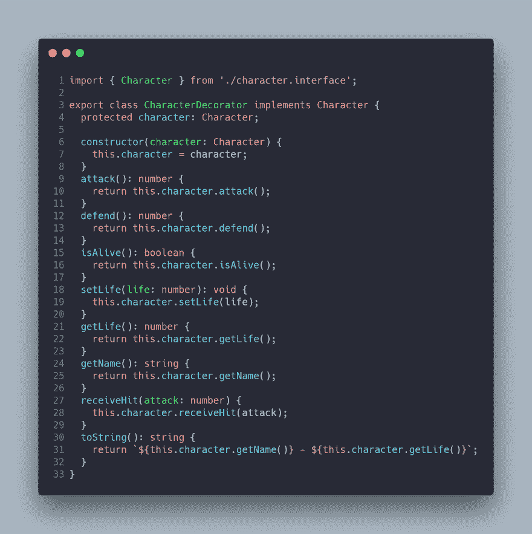](https://res.cloudinary.com/practicaldev/image/fetch/s--Ly_bGBn2--/c_limit%2Cf_auto%2Cfl_progressive%2Cq_auto%2Cw_880/https://cdn-images-1.medium.com/max/3112/1%2AeUutsroC9HqDFGpjfztLmA.png)

现在，我们需要实现 decorators 的具体实现来解决我们的问题。

[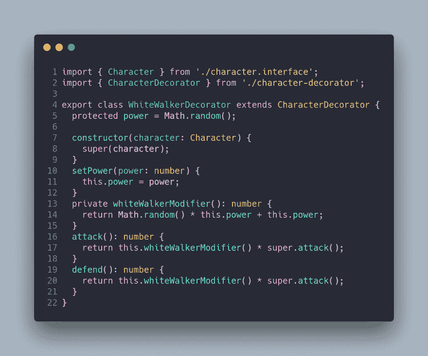](https://res.cloudinary.com/practicaldev/image/fetch/s--ZrQBwKdR--/c_limit%2Cf_auto%2Cfl_progressive%2Cq_auto%2Cw_880/https://cdn-images-1.medium.com/max/2808/1%2AFO0ZQpcHIo8BxfzMj2FtbQ.png)

白行者在攻击中有一个修正值，这个修正值总是比简单角色的小。

最后，与夜之王有关的装饰者继承了一个白色行者的行为，在运行时改变一个简单角色的能力和生活。注意，对于这种类型的对象，我们没有静态类。也就是说，任何一个基本角色都有可能成为夜之王。

我们只需要看到与客户端相关的代码，我们已经实现了一个模拟战斗的基本代码，但是真正有趣的是看到 WhiteWalker 装饰器如何在运行时应用于对象以改变它们的行为。

我需要一支 150 人的军队来打败夜之王。比真实系列更有趣的东西:-P .我希望你已经能够观察到装饰者为我们提供的力量，尤其是关于类的爆炸。

然而，装饰器的不良使用会导致我们当前存在的问题，因为它被过度使用，而不是创建类或应用另一个更好地适应问题环境的模式。

我已经创建了一个 npm 脚本，在应用了装饰器模式和 CLI 界面之后，它运行这里显示的示例。

npm 运行示例 2-装饰者-解决方案 1

## 结论

装饰器模式可以避免项目中不必要的和僵化的类激增。这种模式允许我们在运行时改变对象的行为，并允许我们应用两个著名的原则，如**单一责任**和**打开/关闭**。

您可以避免项目中不必要的和僵化的类激增。该模式允许您在运行时更改对象的行为，并允许您应用两个著名的

最重要的事情不是实现我向你展示的模式，而是能够识别这个特定模式可以解决的问题，以及你何时可以或不可以实现所述模式。这一点至关重要，因为实现会因您使用的编程语言而异。

## 越多越多……

*   设计模式:可重用的面向对象软件的元素，伽马，赫尔姆，约翰逊，& Vlissides，Addison Wesley，1995

*   [refactoring.guru](https://refactoring.guru/design-patterns/decorator)

*   装饰者模式——维基百科。

*   [https://www . do factory . com/JavaScript/decorator-design-pattern](https://www.dofactory.com/javascript/decorator-design-pattern)

*   [https://github . com/sohamkamani/JavaScript-design-patterns-for-humans #-decorator](https://github.com/sohamkamani/javascript-design-patterns-for-humans#-decorator)

*   这个帖子的 **GitHub** 分支是[https://GitHub . com/Caballerog/blog/tree/master/decorator-pattern](https://github.com/Caballerog/blog/tree/master/adapter-pattern)

*最初发布于[https://www . carloscaballero . io](https://www.carloscaballero.io/design-patterns-decorator)2019 年 6 月 29 日。*