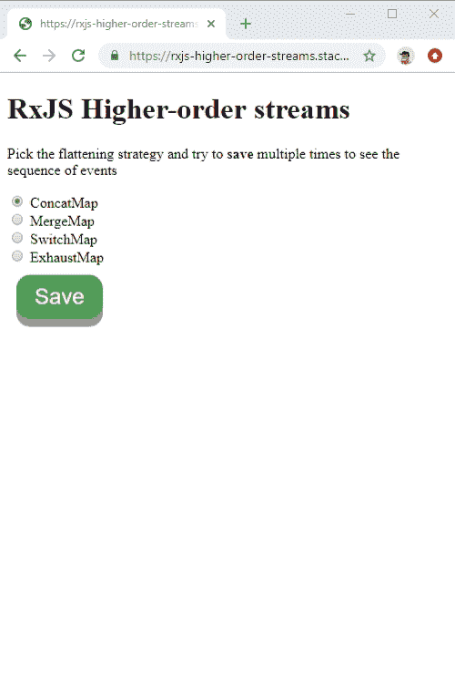

# RxJS 开关映射、串联映射、合并映射、耗尽映射

> 原文：<https://dev.to/angular/rxjs-switchmap-concatmap-mergemap-exhaustmap-13io>

*本文最初由 [@pietrucha](https://twitter.com/pietrucha/) 发布在[角形学院](https://angular-academy.com/rxjs-switchmap-concatmap-mergemap-exhaustmap/)上。*

在 RxJS 在前端开发中变得相当流行之前，我们都在用承诺来处理 AJAX 请求。承诺很容易使用和理解，但在一些更复杂的情况下，还不够。在本文中，我将解释如何在四种不同的场景中使用四种不同的扁平化策略有效地使用高阶可观察流- `mergeMap`、`concatMap`、`switchMap`和`exhaustMap`。

## 简介

在浏览器中执行 HTTP 请求本质上是异步的。这意味着我们可以用 RxJS 可观测量来建模。在 Angular 中，我们有一个`HttpClient`服务，它的方法对应于 HTTP 操作(get、post、put 等)。这些方法返回我们可以订阅的可观测量。但是执行 HTTP 操作通常发生在之后的**，例如*点击*事件。我们也可以将这样的浏览器*点击*事件建模为一个可观察的流，因为这些事件可能在未来的任何时间出现，多次出现。所以现在我们有了两个我们想要顺序使用的流- *click* 事件应该触发 HTTP 调用(在这个例子中我使用了`save()`方法)。简单的方法是订阅*点击*事件，并在订阅函数中订阅`save()`方法。** 

```
fromEvent(saveBtn, 'click')
  .subscribe(click => {
    save().subscribe(result => {
      // handle result
    })
   }); 
```

Enter fullscreen mode Exit fullscreen mode

上面的代码是可行的，但是首先，它包含了嵌套订阅，这让我们想起了**回调地狱**，看起来不是很干净。其次，它不允许我们使用扁平化策略，当我们想要处理后续的*点击*事件在 `save()`操作流发出其最终结果之前**发生的情况时，扁平化策略是有用的。想象一下当 HTTP 请求还没有返回结果时，用户第二次点击按钮的场景。应该会发生什么？我们是否应该等待第一个 HTTP 请求完成，然后开始第二个请求？还是应该放弃第一个 HTTP 查询，立即执行第二个？或者，当仍然有一个未决的 HTTP 调用时，我们根本不允许后续的 HTTP 调用？正如你所看到的，有不同的方法来处理这个棘手的问题。通过使用适当的展平操作(我们将在接下来的章节中讨论),我们可以很容易地实现一个适合我们的解决方案。**

## 高阶可观测量

我们可以将我们的第一段代码改写成下面的代码。这里，我们没有立即订阅 *click* 流，而是将它`map`到`save()`方法的调用中。因为`save()`方法返回可观察值本身，我们创建了一个**高阶可观察值**。这种可观测量通常由两股流组成。在我们的例子中，有一个外部流发出点击事件，内部流发出`save()`方法的结果。

```
fromEvent(saveBtn, 'click')
  .pipe(map(click => save()))
  .subscribe(result => {
    // result is a stream!
  }); 
```

Enter fullscreen mode Exit fullscreen mode

> **高阶可观测值**是一个可观测值，它发出的事件本身就是可观测的；换句话说，它是可观察的可观察的。

上面代码片段中有趣的部分是订阅。由于我们将 *click* 事件映射到另一个流中，订阅的结果也将是一个流！我们可以通过订阅第一个订阅函数中的`result`来使用 HTTP 查询的最终结果，但是我们将再次以嵌套订阅结束。现在是酷的时候了！RxJS 带有特殊的操作符，将高阶可观察量转换为一阶可观察量，我们可以只订阅一个，并从内部流接收事件(不是内部流的订阅)。

## 展平高阶可观测量

将高阶流转换成一阶流的操作称为**展平**。当我们**展平**流时，它不再发出内部流，而是发出来自内部流的事件。用 RxJS 展平非常容易。我们所要做的就是对你的高阶流应用一个合适的运算符。下面的代码片段使用了`concatAll()`操作符来展平流。由于这个原因，订阅中的`result`是由`save()`方法返回的来自内部可观察对象的事件。

```
fromEvent(saveBtn, 'click')
  .pipe(map(click => save()), concatAll())
  .subscribe(result => {
    // result is the result of save()
  }); 
```

Enter fullscreen mode Exit fullscreen mode

因为`map()`和`concatAll()`经常一起使用，所以有一个等价的运算符`concatMap()`可以让我们获得完全相同的结果。下面的代码片段展示了`concatMap()`操作符
的用法

```
fromEvent(saveBtn, 'click')
  .pipe(concatMap(click => save()))
  .subscribe(result => {
    // result is the result of save()
  }); 
```

Enter fullscreen mode Exit fullscreen mode

`concatMap()`并不是 RxJS 中展平高阶流的唯一方法。在下面的章节中，我们将了解`concatMap()`、`mergeMap()`、`switchMap()`和`exhaustMap()`的区别。所有这些运算符都是扁平化运算符，但是它们适用于非常不同的场景。

### 串联图

我们已经问了一个关于在内部流完成它的执行之前，外部流发出一个事件(即用户点击按钮)**的场景的问题。处理这种情况的策略之一是等到内部流完成后再订阅下一个流。这正是我们`concatMap()`会为我们做的。看看下面录制的演示。**

[](https://res.cloudinary.com/practicaldev/image/fetch/s--6M6F7sVT--/c_limit%2Cf_auto%2Cfl_progressive%2Cq_66%2Cw_880/https://thepracticaldev.s3.amazonaws.com/i/tmmo8z3t7p8j7rp9drnm.gif)

在本例中，在模拟 HTTP 查询的执行过程中，第二次单击了 **Save** 按钮。计数代表该查询的执行。因为第二个点击事件发生在保存查询完成之前，所以第二个查询被*排队*以便稍后执行。这样我们*串接*内部流执行。

`concatMap()`是首次提出的高阶流扁平化策略。当我们的用例需要*顺序性*时，可以使用它。需要注意的是，浏览器端 HTTP 查询的顺序可能与服务器接收它们的顺序不同。我们可以想象这样一种情况，当有两个 HTTP 查询时，假设查询 **A** 和查询 **B** ，浏览器首先发送查询 **A** ，然后立即发送查询 **B** 。不能保证服务器会以相同的顺序接收这些查询。由于网络条件的原因，服务器可能会先接收查询 **B** ，然后再接收查询 **A** 。这就是为什么在浏览器端有一个合适的策略是如此重要。

### 合并地图

另一种处理外部流在内部流执行期间发出事件的方法是用`mergeMap()`操作符合并执行。在这种情况下，我们不关心任何顺序，只同时执行内部流*和*。下面录制的演示说明了这种情况。我们可以看到，第二次单击 save 按钮时，模拟的 HTTP 查询立即开始，并与第一个查询同时执行*和*。

[](https://res.cloudinary.com/practicaldev/image/fetch/s--4lA18jkE--/c_limit%2Cf_auto%2Cfl_progressive%2Cq_66%2Cw_880/https://thepracticaldev.s3.amazonaws.com/i/x4wtdpw30vdnaz48rdqo.gif)

下面的源代码片段展示了如何应用`mergeMap()`操作符来实现这个结果。

```
fromEvent(saveBtn, 'click')
  .pipe(mergeMap(click => save()))
  .subscribe(result => {
    // result is the result of save()
  }); 
```

Enter fullscreen mode Exit fullscreen mode

### [交换机映射](#switchmap)

我们已经学习了将高阶流转换为一阶流的两种策略。它们都适用于不同的用例，但是下一个可能是你最喜欢的。当我们应用这种扁平化时，外部流事件(即用户点击)的发生导致**从当前内部流的正在进行的执行中取消订阅**。当我们只关心 HTTP 查询的最近执行时，这种策略很有用。想象一下预输入搜索实现。用户键入搜索查询的第一个字母，HTTP 呼叫开始，并且用户键入查询的下一个字母。在这种情况下，我们不关心任何先前 HTTP 请求的结果，所以`switchMap()`是一个完美的选择。下面的动画展示了该展平操作符的行为。你也可以看看我关于这个话题的视频: [RxJS 带角料预搜索](https://www.youtube.com/watch?v=HfVTp4yo12A)。

[](https://res.cloudinary.com/practicaldev/image/fetch/s--YMD7HV0W--/c_limit%2Cf_auto%2Cfl_progressive%2Cq_66%2Cw_880/https://thepracticaldev.s3.amazonaws.com/i/lal1odsmeajhssvlvjtv.gif)

下面的源代码片段展示了如何应用`switchMap()`操作符。

```
fromEvent(saveBtn, 'click')
  .pipe(switchMap(click => save()))
  .subscribe(result => {
    // result is the result of save()
  }); 
```

Enter fullscreen mode Exit fullscreen mode

### 耗尽图

本文中我们要探讨的最后一个操作符是`exhaustMap()`。当我们想简单地**忽略**来自外层流的事件，在执行内层流时，`exhaustMap()`是正确的选择。因此，当使用这种映射策略时，如果外部事件出现在内部流完成之前，我们根本不执行映射。当我们想要最小化从浏览器发出的 HTTP 调用的数量时，这可能是有用的。您可以在下面的动画中注意到，在第一个模拟查询完成之前单击后续按钮不会产生任何影响。

[](https://res.cloudinary.com/practicaldev/image/fetch/s--xQ5cvxWW--/c_limit%2Cf_auto%2Cfl_progressive%2Cq_66%2Cw_880/https://thepracticaldev.s3.amazonaws.com/i/os0z0wrtj3cz21nt842j.gif)

下面的源代码片段展示了如何应用`exhaustMap()`操作符。

```
fromEvent(saveBtn, 'click')
  .pipe(exhaustMap(click => save()))
  .subscribe(result => {
    // result is the result of save()
  }); 
```

Enter fullscreen mode Exit fullscreen mode

## 总结

与简单地使用承诺相比，对 HTTP 请求使用 Observables 乍一看可能很奇怪。在本文中，我们已经了解到，在某些情况下，使用具有适当扁平化策略的可观测量对于实现预期结果和避免讨厌的错误是有用的，即使不是必需的。

**Stackblitz** 演示:【https://stackblitz.com/edit/rxjs-higher-order-streams
T5】GitHub 源代码:[https://github.com/bartosz-io/rxjs-higher-order-streams](https://github.com/bartosz-io/rxjs-higher-order-streams)

我希望你学到了一些新东西，如果你在社交媒体上与你的朋友分享这篇文章，我会非常感激:)如果你有任何问题，请不要犹豫，在评论区提出来——我会回复所有问题。保重！

如果你喜欢这个内容，可以去[角学园](https://angular-academy.com/)多看看。