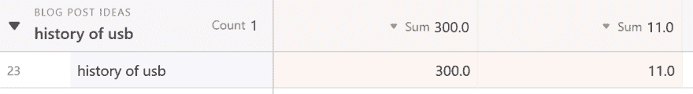
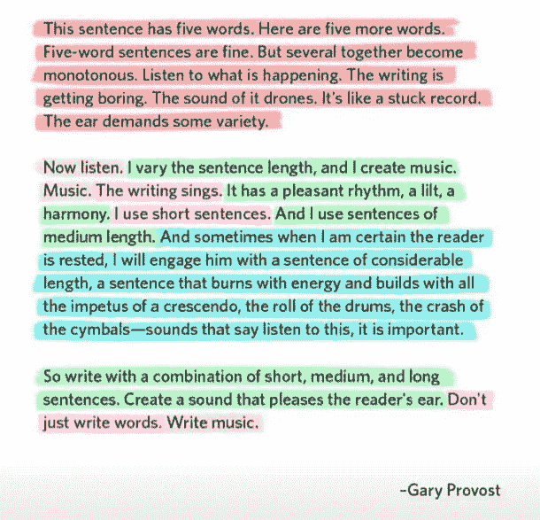
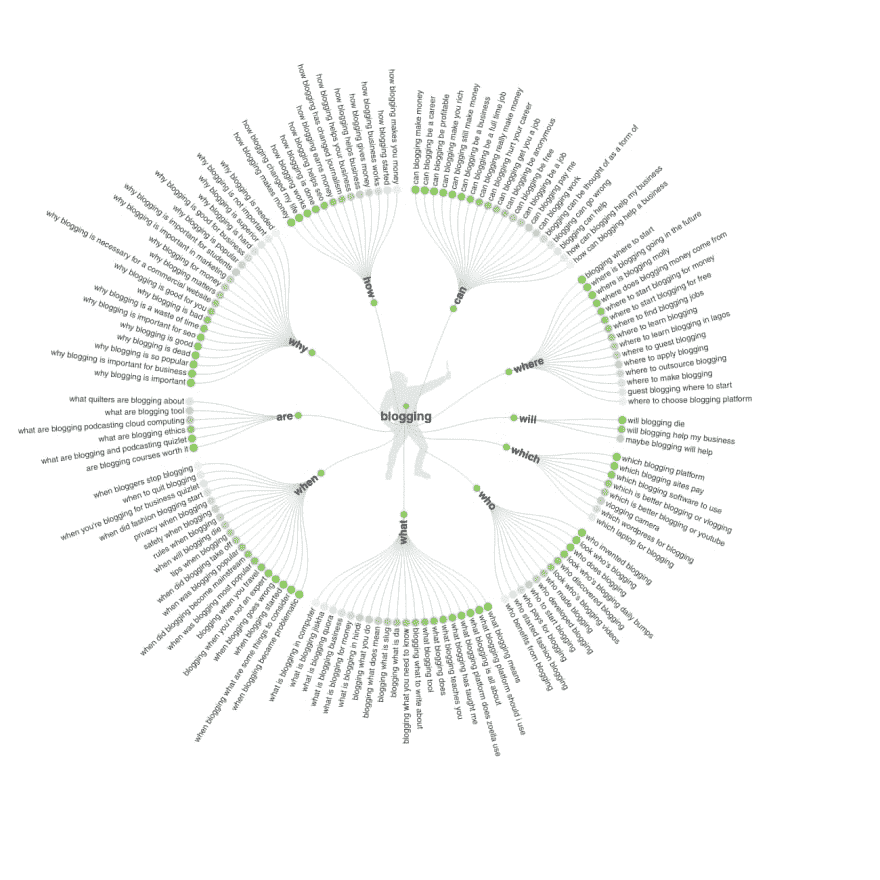

# 如何从三观到 1，000，308

> 原文：<https://dev.to/brandonskerritt/how-to-go-from-3-views-to-1-000-308-30a9>

**为什么要写？**

你写的每一个字都是一颗种子。

随着时间的推移，这些种子会长成天堂花园。

这是你的天堂。

内容建立在自身和复合的基础上。

当有人在路边注意到一朵花时，他们会过来看一看。

他们喜欢这种花。然后他们看到你的花园。

他们在你的花园里呆上几个小时。

你种的种子越多，就越有可能有人在你的花园里花很多时间。

内容指数增长你的读者。

当你晚上睡着的时候，你的内容为你工作。

它出去寻找人和机会。

你可以睡着，让额外的 5 万人看你的内容。

你醒来时发现有工作邀请、演讲演出、播客出现等等。

你种的这个花园从不睡觉。

它全天候为你服务。为你打造更好的生活。

**为自己写作，不为别人**

景色很酷。

但这不是我写作的原因。

我写信是为了查明真相。

对某一学科了解更多。

我的主要观众是我自己。

其他人都是次要的。

这是写好的关键。

如果你从中得到什么，那就是这个。

**写得简洁明了**

> “我没有时间写一封短信，所以我写了一封长信”

删除。

能删多少就删多少。

你写的太长了。

你需要长话短说。

如果你的文章太长，没人会在意。

不要写得太简洁，以免让读者困惑

想象一个钟形曲线。

太短了，很混乱。

太长了，很混乱。

你想在中间。

只有你知道这是哪里。

我仍然不完全知道。

通过练习和时间，你会学会的。

**永远不要去寻找内容**

我从来没有搜索过想法。

灵感出现在最奇怪的地方。

作为作家，你的工作就是阅读。

广泛阅读，深入阅读。

我最喜欢的文章是那些来自奇怪地方的文章。

Python 邮件列表中 2002 年发送的电子邮件。

中央处理器使用手册。

记下你的想法。

**我应该使用什么平台？**

没关系。

我用幽灵。

如果你刚开始，用中等的。

我从中等开始。

在我决定离开之前，我在 Medium 上获得了 78 万次浏览。

我没有为我的博客花一分钱。

你也不用付钱，但是如果你想的话可以。

你在上面写什么并不重要。

只要你写。

如何验证你的想法

列出你所有的想法。

使用搜索引擎优化工具。我用芒果。

在 Mangools 关键词搜索工具中搜索你的想法。

调出一份电子表格。我用 Airtable。

3 列。

关键字名称。

搜索流量。

难度。

找到那些搜索量高，难度低的话题。

这就是你验证一篇博客文章的方法。

但是，不要让这个限制你写什么。

我最受欢迎的帖子在我写出来之前没有搜索量。

这个技巧可以帮助你决定写什么。

倾听你的读者，但不要让他们左右你的创作。

亨利·福特曾经说过:

> 如果我问顾客他们想要什么，他们会告诉我，“一匹更快的马！”

你的读者不知道他们想要什么。

他们可能知道方向，并且通常知道如何改进。

我制作的一些内容——我的读者以前从未听说过。

你不想创造一个只有你的读者群知道的东西的回音室。

你想拓宽你的话题来扩大你的读者群。

**让你的内容可浏览**

没人有时间看你写的东西。

让你的内容易于阅读。尽可能节省。

使用这些工具，让你的作品看起来更有价值

*   标点
*   要点
*   图片
*   书写主义
*   图片说明
*   引用
*   水平分隔线
*   改变句子长度。

**第 1 天的电子邮件**

无论你使用什么平台，你都需要从第一天开始收集邮件。

写在介质上？

FreeCodeCamp 一夜之间毫无预警地将他们的整个博客从 Medium 上移走了。

你所有的追随者。死了。

你不再有读者了。

在 Blogger 上写？

如果谷歌也杀了它呢？

推特粉丝？Instagram 关注者？脸书的追随者？

都在拥有它们的社交网络的控制之下。

你的整个品牌会在一夜之间消亡。

但是邮件订阅者。

没有一家大公司能在一夜之间删除你所有的邮件。

这就是我如何从媒体转向我的个人博客。

从第一天起，我就建立了一个电子邮件列表。

它对我的伤害没有对其他人的伤害大。

电子邮件。不管怎样。

即使你认为你不需要他们-你需要。

**让您的内容“完整”**

谷歌奖励那些“完整”的内容。

这意味着你要回答每个人可能提出的关于某个话题的问题。

这意味着这个网站是该主题的最佳去处。

想知道维基百科是如何排名第一的吗？

因为每一页都尽可能的完整。

确保你的写作是相同的。

使用“回答公众”这样的工具来了解人们对某个话题的疑问。

我每天使用的工具使我的博客增加了 10 倍:

(这些是附属链接。如果你使用它们，我赚的钱不会额外增加你的成本。)

[观念](https://www.notion.so/?r=78f792ed67b04b509901e6b3a62fd230)

我住在这里。

这是一个笔记应用程序，可以让你做任何事情。

我强烈推荐。太棒了。10/10 我用过的最好的应用。

所有的博客文章都写在这里。所有邮件回复都写在这里。博客的新想法。为博客列出清单。

我正在努力改进博客体验的任何应用程序。都在这里了。

[气动工作台](https://airtable.com/invite/r/ebisY1bl)

我也住在这里。

混合了关系数据库的电子表格。

如果与我的博客相关的东西不在这里，它就在这里。

观点。成本。利润。博客帖子创意(如您之前所见)。

[芒果](https://mangools.com#a5ca77515feebf85ba3aea0bb)

我也住在这里。

一个搜索引擎优化工具。

随着你博客的增长，SEO 变得越来越重要。

重要的是你要有一个好的工具，能做好每一件事，而且不要花太多钱。

芒果棒极了。

[Ghost.org](//ghost.org)

我的博客在 Ghost 上运行。

[ConvertKit](https://mbsy.co/convertkit/45348740)

我的电子邮件+登陆页面都是通过 Convertkit 完成的。

你的电子邮件是博客第二重要的部分。

1.  内容
2.  电子邮件营销
3.  搜索引擎优化
4.  博客看起来和感觉都很好
5.  社会化媒体

使用 Convertkit 获得正确的结果。

[语法](https://app.grammarly.com)

我的写作很糟糕。

语法上有助于确保它不会很烂。

[海明威](http://www.hemingwayapp.com/)

见上文。

[谷歌搜索控制台](https://search.google.com/search-console/about)

如果你有一个网站，你需要使用谷歌的这个免费工具。

有什么问题吗？

请在下面留下评论

我来回答你。