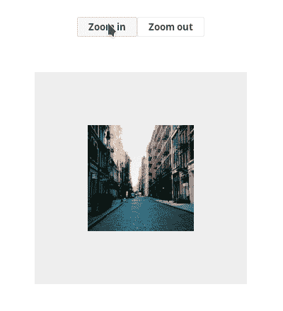
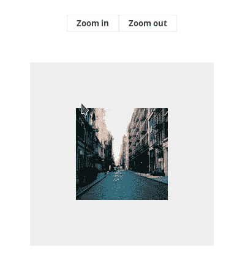

# 让我们写一个 useImageZoom React 钩子

> 原文：<https://dev.to/bgord/let-s-write-a-useimagezoom-react-hook-5354>

在这篇文章中，我将介绍一个基本的 React 钩子，负责处理图像的“缩放”功能。

## 我们要建造什么

[](https://i.giphy.com/media/fSvVcoSiGiCoAHjIYf/giphy.gif)

目标是创建一个提供三个处理程序的`useImageZoom`钩子:

*   放大
*   缩小
*   重置缩放

记住这一点，我们已经可以计划 hook 可能公开的 API 了。

```
const [zoomStyles, handlers] = useImageZoom(); 
```

<svg width="20px" height="20px" viewBox="0 0 24 24" class="highlight-action crayons-icon highlight-action--fullscreen-on"><title>Enter fullscreen mode</title></svg> <svg width="20px" height="20px" viewBox="0 0 24 24" class="highlight-action crayons-icon highlight-action--fullscreen-off"><title>Exit fullscreen mode</title></svg>

按照流行的惯例，它返回一个两元素数组。

第一个元素是应用于图像的样式对象，第二个元素包含前面提到的处理程序。

## 挂钩实现

```
// App.jsx

import React from "react":

function useImageZoom(maxZoomLevel = 5) {
  const minZoomLevel = 1;

  const [zoomLevel, setZoomLevel] = React.useState(minZoomLevel);

  function zoomIn() {
    setZoomLevel(zoomLevel =>
      zoomLevel < maxZoomLevel ? zoomLevel + 1 : zoomLevel
    );
  }

  function zoomOut() {
    setZoomLevel(zoomLevel =>
      zoomLevel > minZoomLevel ? zoomLevel - 1 : minZoomLevel
    );
  }

  function resetZoom() {
    setZoomLevel(minZoomLevel);
  }

  const zoomStyles = {
    transform: `scale(${zoomLevel})`,
  };

  const handlers = {
    zoomIn,
    zoomOut,
    resetZoom
  }

  return [zoomStyles, handlers];
} 
```

<svg width="20px" height="20px" viewBox="0 0 24 24" class="highlight-action crayons-icon highlight-action--fullscreen-on"><title>Enter fullscreen mode</title></svg> <svg width="20px" height="20px" viewBox="0 0 24 24" class="highlight-action crayons-icon highlight-action--fullscreen-off"><title>Exit fullscreen mode</title></svg>

简单说一下实现。

如果我们希望 CSS 处理图像缩放，我们需要使用`transform`属性并将`scale(x)`作为一个值传递。默认情况下，`x`等于 **1** ，所以我们将 **1** 赋给`minZoomLevel`变量。

`maxZoomLevel`是钩子接受的唯一参数，默认为 **5** 。

在`zoomIn`和`zoomOut`功能中，我们分别增加和降低缩放级别，但保持在`maxZoomLevel`和`minZoomLevel`边界内。

`resetZoom`简单设置`minZoomLevel`值。

## 用法

```
// App.jsx

import React from "react";
import ReactDOM from "react-dom";

import "./styles.css";

// function useImageZoom(maxZoomLevel = 5) {
//   ...
// }

function App() {
  const [zoomStyles, handlers] = useImageZoom();

  return (
    <div className="app">
      <div className="buttons">
        <button onClick={handlers.zoomIn}>Zoom in</button>
        <button onClick={handlers.zoomOut}>Zoom out</button>
      </div>
      <div className="preview">
        
      </div>
    </div>
  );
}

const rootElement = document.getElementById("root");
ReactDOM.render(<App />, rootElement); 
```

<svg width="20px" height="20px" viewBox="0 0 24 24" class="highlight-action crayons-icon highlight-action--fullscreen-on"><title>Enter fullscreen mode</title></svg> <svg width="20px" height="20px" viewBox="0 0 24 24" class="highlight-action crayons-icon highlight-action--fullscreen-off"><title>Exit fullscreen mode</title></svg>

```
/* styles.css */

.app {
  display: flex;
  flex-direction: column;
  align-items: center;
  font-family: sans-serif;
  text-align: center;
}

.buttons {
  margin-top: 50px;
}

.preview {
  display: flex;
  align-items: center;
  justify-content: center;
  height: 300px;
  width: 300px;
  margin-top: 50px;
  background: #eee;
  overflow: auto;
  position: relative;
} 
```

<svg width="20px" height="20px" viewBox="0 0 24 24" class="highlight-action crayons-icon highlight-action--fullscreen-on"><title>Enter fullscreen mode</title></svg> <svg width="20px" height="20px" viewBox="0 0 24 24" class="highlight-action crayons-icon highlight-action--fullscreen-off"><title>Exit fullscreen mode</title></svg>

让我们看看它的实际效果。

[](https://i.giphy.com/media/lSgQKiX3YqrciMpLP5/giphy.gif)

你可能已经注意到了，我们有一个问题。当我们放大时，图像的两边逐渐被裁剪。

## 改进

问题是`transform-origin`的初始值等于`"50% 50%"`，相当于给定图像的中心。要了解这个属性的作用，请参考[本页](https://developer.mozilla.org/en-US/docs/Web/CSS/transform-origin)。

要应用该解决方案，请将`zoomStyles`对象更改为以下内容:

```
const zoomStyles = {
  transform: `scale(${zoomLevel})`,
  transformOrigin: "top left"
}; 
```

<svg width="20px" height="20px" viewBox="0 0 24 24" class="highlight-action crayons-icon highlight-action--fullscreen-on"><title>Enter fullscreen mode</title></svg> <svg width="20px" height="20px" viewBox="0 0 24 24" class="highlight-action crayons-icon highlight-action--fullscreen-off"><title>Exit fullscreen mode</title></svg>

让我们看看会发生什么。

[](https://i.giphy.com/media/d96VPH6TXYw9m01nTB/giphy.gif)

好吧，图像没有被裁剪，但还有另一个问题。你有没有注意到在预览框的左边和顶部有一个空白区域？我们可以强制图像填充整个可用空间，但仍保持初始居中位置。

我们可以通过将图像绝对定位在预览框的左上角来做到这一点，但前提是应用了大于 1 的缩放级别。

将`zoomStyles`对象更改为以下内容:

```
const zoomStyles = {
  transform: `scale(${zoomLevel})`,
  transformOrigin: "top left",
  position: zoomLevel > 1 ? "absolute" : undefined,
  top: zoomLevel > 1 ? 0 : undefined,
  left: zoomLevel > 1 ? 0 : undefined
}; 
```

<svg width="20px" height="20px" viewBox="0 0 24 24" class="highlight-action crayons-icon highlight-action--fullscreen-on"><title>Enter fullscreen mode</title></svg> <svg width="20px" height="20px" viewBox="0 0 24 24" class="highlight-action crayons-icon highlight-action--fullscreen-off"><title>Exit fullscreen mode</title></svg>

瞧，成功了！

[](https://i.giphy.com/media/fSvVcoSiGiCoAHjIYf/giphy.gif)

最终版本可在 [codesandbox](https://codesandbox.io/s/epic-moon-suhcj?fontsize=14) 上获得。

在下一篇文章中，我们将使`useImageZoom` hook 更加灵活和易于使用。敬请期待！