# React 仪表盘——开源和免费

> 原文：<https://dev.to/sm0ke/react-dashboards-open-source-apps-1c7j>

你好编码器，

如果您计划使用 React 构建您的下一个管理仪表板，这个带有开源模板的列表可能会对您有所帮助。本文列出的所有 **React 仪表盘**都适用于业余爱好和商业产品，并得到了发行商的积极支持。对于新手来说， **React** 是一个开源的前端 JavaScript 库，用于构建用户界面或 UI 组件，由脸书积极支持。

* * *

> *披露* - **本帖包含附属链接**。

如果你用这些链接买东西(没有额外的费用)，我可能会赚取佣金，产品或服务。**谢谢！**

* * *

## [反应柔和的仪表盘](https://appseed.us/product/soft-ui-dashboard/api-server-nodejs/react/) `fullstack`

用一个创新的管理模板为 **Material-UI** 和 **React** 开始你的开发。[软 UI Dashboard React](https://appseed.us/product/soft-ui-dashboard/api-server-nodejs/react/) 由 70 多个前端独立元素组成，如按钮、输入、导航条、导航标签、卡片或提醒，让您自由选择和组合。该产品附带了一个简单的 JWT 认证流程:登录/注册/注销。

> 🚀内置有 **[React App 生成器](https://appseed.us/generator/react/)**

*   ✅创新**软 UI 设计** -由[创意制作-Tim](https://bit.ly/3fKQZaL)
*   ✅反应，还原，还原-坚持
*   ✅认证:`JWT Tokens`，
*   ✅ `OAuth` via GitHub
*   ✅全栈就绪使用:
    *   [节点 API](https://github.com/app-generator/api-server-nodejs) `free product`
    *   [节点 API Mongo](https://github.com/app-generator/api-server-nodejs) `free product`

* * *

## ✨ [材料仪表盘反应过来](https://www.creative-tim.com/product/material-dashboard-react?AFFILIATE=128200)

材料仪表板 React 是基于 Creative-Tim 发布的 React 的最新免费 MUI 管理模板。如果您是一名开发人员，希望创建一个对开发人员友好的、功能丰富的、高度可定制的管理仪表板，下面是您的选择。

*   👉[材料仪表盘反应过来](https://www.creative-tim.com/product/material-dashboard-react?AFFILIATE=128200) - `product page`
*   👉[材料仪表盘反应过来](https://demos.creative-tim.com/material-dashboard-react/#/dashboard?AFFILIATE=128200) - `LIVE demo`

* * *

## [反应纯度仪表盘](https://appseed.us/product/purity-dashboard/api-server-nodejs/react/) `fullstack`

从一个创新的管理模板开始你的开发，该模板用于 **Chakra UI** 和 **React** 。 [Purity UI Dashboard](https://appseed.us/product/purity-dashboard/api-server-nodejs/react/) 内置超过 70 个前端独立元素，如按钮、输入、导航条、导航标签、卡片或提醒，让你自由选择和组合。

> 🚀内置有 **[React App 生成器](https://appseed.us/generator/react/)**

*   ✅创新脉轮用户界面设计-由[创意-蒂姆](https://bit.ly/3fKQZaL)创造
*   ✅反应，还原，还原-坚持
*   ✅认证:JWT 登录/注册/注销
*   ✅全栈准备使用 **[节点 JS API 服务器](https://github.com/app-generator/api-server-nodejs)** (开源项目)
    *   功能:Typescript / SQLite / TypeORM / Joy(验证)/ Passport 库- `passport-jwt`策略。

[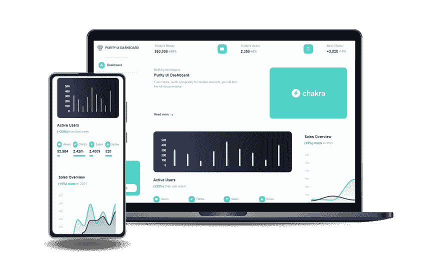](https://res.cloudinary.com/practicaldev/image/fetch/s--fa7TGsgs--/c_limit%2Cf_auto%2Cfl_progressive%2Cq_auto%2Cw_880/https://user-images.githubusercontent.com/51070104/205427640-007904ec-9cd5-4060-86c6-47675b36cda1.png)

* * *

## ✨ [Flexy React 管理](https://www.wrappixel.com/templates/free-material-ui-template/?ref=157)

Flexy React Dashboard Lite 是精心手工制作的最小管理模板，其构建采用模块化和现代设计。Flexy React Dashboard Lite 完全免费下载，可用于您的个人和商业项目。

*   👉[灵活反应管理员](https://www.wrappixel.com/templates/free-material-ui-template/?ref=157) - `product page`
*   🎁更多由 WrapPixel 制作的 [React 模板](https://www.wrappixel.com/templates/category/react-templates/?ref=157)

[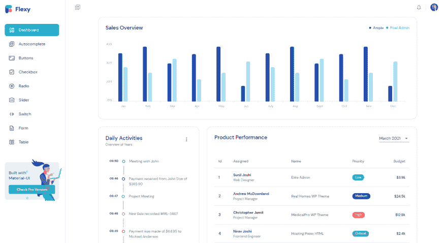](https://res.cloudinary.com/practicaldev/image/fetch/s--xmzfvi5r--/c_limit%2Cf_auto%2Cfl_progressive%2Cq_auto%2Cw_880/https://dev-to-uploads.s3.amazonaws.com/uploads/articles/owngp7my58wrrhjuxstt.png)

* * *

## ✨ [氩仪表板脉轮](https://www.creative-tim.com/product/argon-dashboard-chakra?AFFILIATE=128200)

使用创新的 Chakra UI 管理模板开始您的开发，并做出反应。如果你喜欢现在最热门的设计趋势，氩仪表板脉轮的外观和感觉，你会爱上这个仪表板！它的特点是大量的组件组装在一起，看起来很棒。

*   👉[氩仪表板脉轮](https://www.creative-tim.com/product/argon-dashboard-chakra?AFFILIATE=128200) - `product page`
*   👉[氩仪表板脉轮](https://demos.creative-tim.com/argon-dashboard-chakra/#/admin/dashboard?AFFILIATE=128200) - `LIVE Demo`

* * *

## ✨ [电晕反应自由](https://www.bootstrapdash.com/product/corona-react-free-admin-template?ref=23)

对于所有黑暗模式的粉丝来说，这是 Corona React 的免费版本，一个来自 BootstrapDash 的免费 React 管理模板。这是新的和改进版本的电晕反应与一个新的面貌，以提高易读性和审美！

*   👉[电晕反应游离](https://www.bootstrapdash.com/product/corona-react-free-admin-template?ref=23) - `product page`
*   👉[电晕反应游离](https://www.bootstrapdash.com/demo/corona-react-free/template/demo_1/preview/dashboard?ref=23) - `LIVE demo`

这个漂亮的模板是为眼睛设计的，确保所有夜猫子都有舒适的观看体验，而且超级容易设置。

[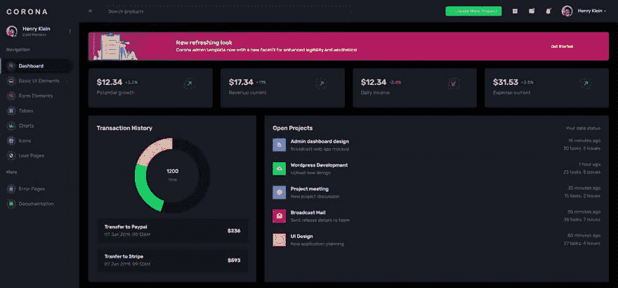](https://res.cloudinary.com/practicaldev/image/fetch/s--A01bWofk--/c_limit%2Cf_auto%2Cfl_progressive%2Cq_auto%2Cw_880/https://user-images.githubusercontent.com/51070104/202862009-282b090f-7355-448f-a306-6bde4b365f70.jpg)

* * *

## ✨ [明星管理员反应](https://www.bootstrapdash.com/product/star-admin-react-free?ref=23)

Star Admin React Free 的设计看起来简单而漂亮，拥有大量的组件和元素，这将为用户提供无限的选择。这种设计使您可以访问各种各样的基本元素，从而为您的 web 应用程序带来独特的风格。

*   👉[明星管理员反应](https://www.bootstrapdash.com/product/star-admin-react-free?ref=23) - `product page`
*   👉[明星管理员反应](https://www.bootstrapdash.com/demo/star-admin-free/react/template/demo_1/preview/dashboard?ref=23) - `LIVE demo`

该模板具有精心制作的仪表板，其中包含大量排列整齐、组织有序的组件，能够简化数据可视化过程。

[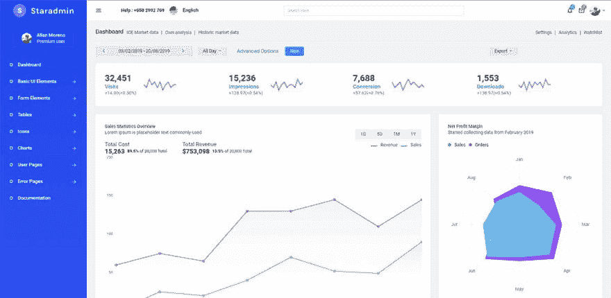](https://res.cloudinary.com/practicaldev/image/fetch/s--0lvv16Pl--/c_limit%2Cf_auto%2Cfl_progressive%2Cq_auto%2Cw_880/https://user-images.githubusercontent.com/51854817/197687898-e9012660-576a-488a-bf32-11c82162d29c.png)

* * *

## ✨ [纯度反应仪表盘](https://www.creative-tim.com/product/purity-ui-dashboard?AFFILIATE=128200)

专为那些喜欢现代 UI 元素和漂亮网站的人设计 **Purity React Dashboard** 由数百个元素、设计好的块和完全编码的页面组成。Purity UI Dashboard 由超过 70 个前端独立元素组成，如按钮、输入、导航条、导航标签、卡片或提醒，让您自由选择和组合。

*   👉[纯度反应仪表盘](https://www.creative-tim.com/product/purity-ui-dashboard?AFFILIATE=128200) - `product page`
*   👉[纯度反应仪表盘](https://demos.creative-tim.com/purity-ui-dashboard/#/admin/dashboard?AFFILIATE=128200) - `LIVE Demo`

[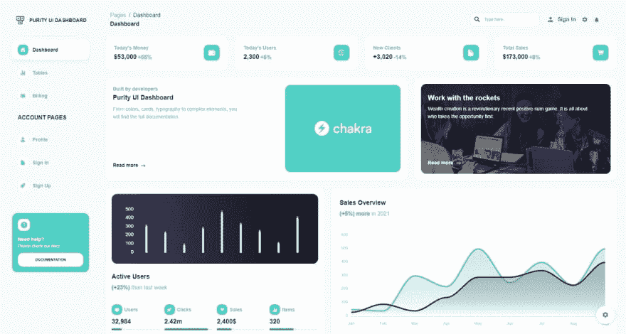](https://res.cloudinary.com/practicaldev/image/fetch/s--nCptcTV2--/c_limit%2Cf_auto%2Cfl_progressive%2Cq_auto%2Cw_880/https://dev-to-uploads.s3.amazonaws.com/uploads/articles/qbdaujzokhlc35qgoyjf.png)

* * *

## ✨ [螳螂反应过来的材料 UI](https://mantisdashboard.io/)

Mantis 是一个免费的开源 React redux 仪表板模板，使用 Material UI React 组件库制作，旨在实现灵活性和更好的可定制性。该产品带有完全专业级的用户界面，可用于任何类型的后端项目。

*   👉[螳螂反应材料 UI](https://github.com/codedthemes/mantis-free-react-admin-template) - `source code`
*   👉[螳螂反应材料 UI](https://mantisdashboard.io/free/) - `LIVE demo`

* * *

## ✨ [氩仪表盘 2 梅](https://www.creative-tim.com/product/argon-dashboard-material-ui?AFFILIATE=128200)

从创新的 MUI 和 React 管理模板开始开发。如果你喜欢现在最热门的设计趋势，氩的外观和感觉，你会爱上这个仪表板！它的特点是大量的组件组装在一起，看起来很棒。

*   👉[氩气仪表盘 2 梅](https://www.creative-tim.com/product/argon-dashboard-material-ui?AFFILIATE=128200) - `product page`
*   👉[氩气仪表盘 2 梅](https://demos.creative-tim.com/argon-dashboard-material-ui/#/dashboard?AFFILIATE=128200) - `LIVE demo`

* * *

## ✨ [缪斯蚁。设计反应](https://www.creative-tim.com/product/muse-ant-design-dashboard?AFFILIATE=128200)

Muse Ant Design Dashboard 是一个免费的管理模板，基于两个流行的前端技术:Ant Design & React。它旨在简化开发人员的工作，并带有一个受 Ant Design 启发的全新设计。它的所有组件都被构建成彼此完美匹配，同时符合 Ant 的设计理念。

*   👉[缪斯蚂蚁。设计反应](https://www.creative-tim.com/product/muse-ant-design-dashboard?AFFILIATE=128200) -产品页面
*   👉[缪斯蚂蚁。设计反应](https://demos.creative-tim.com/muse-ant-design-dashboard/#/dashboard?AFFILIATE=128200) -现场演示

* * *

## [T2】✨](#dashboard-black-raw-react-v18-endraw-)[仪表盘黑色](https://www.creative-tim.com/product/black-dashboard-react?AFFILIATE=128200)t0】

React Dashboard Black 是一个漂亮的引导程序(Reactstrap) **管理仪表板**有大量的组件构建在一起，看起来很棒。

*   👉[反应仪表盘黑色](https://www.creative-tim.com/product/black-dashboard-react?AFFILIATE=128200) - `product page`
*   👉[反应仪表盘黑色](https://demos.creative-tim.com/black-dashboard-react/#/admin/dashboard?AFFILIATE=128200) - `LIVE demo`

如果您正在寻找一种工具来管理和可视化关于您的业务的数据，这个仪表板是你的事情。它结合了悦目的颜色、宽敞的卡片、漂亮的排版和图形。

[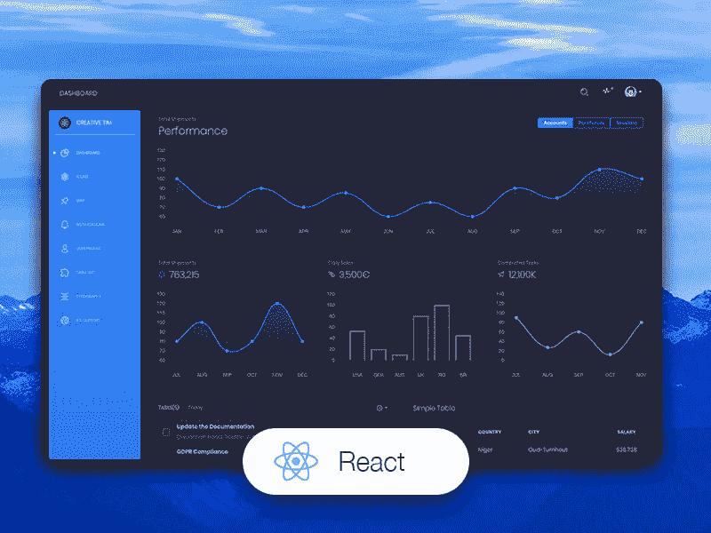](https://res.cloudinary.com/practicaldev/image/fetch/s--P5buYmgx--/c_limit%2Cf_auto%2Cfl_progressive%2Cq_auto%2Cw_880/https://dev-to-uploads.s3.amazonaws.com/uploads/articles/mlh1u2qngoo5tsudfgda.png)

* * *

## [t1】✨](#react-materialpro-lite)[react material pro lite](https://www.wrappixel.com/templates/materialpro-react-admin-lite/?ref=157)

材料 React Admin Lite 是 2019 年精心手工制作的美丽 React Admin 仪表板模板。它采用模块化的现代设计理念。Material React Admin Lite 完全免费下载，可用于您的个人和商业项目。

*   👉[反应材料建兴](https://www.wrappixel.com/templates/materialpro-react-admin-lite/?ref=157) - `product page`
*   🎁更多 [React 模板](https://www.wrappixel.com/templates/category/react-templates/?ref=157)由`WrapPixel`精心制作

[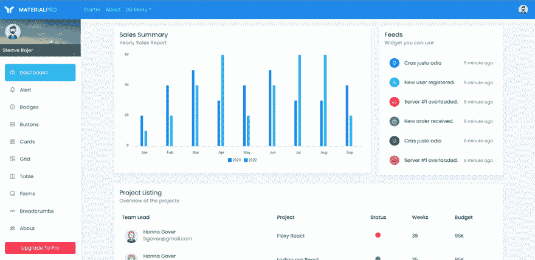](https://res.cloudinary.com/practicaldev/image/fetch/s--BY0mdyCY--/c_limit%2Cf_auto%2Cfl_progressive%2Cq_auto%2Cw_880/https://dev-to-uploads.s3.amazonaws.com/uploads/articles/qn4mdc5rjvulepa4wrvu.png)

* * *

## ✨ [软 UI 仪表盘反应](https://www.creative-tim.com/product/soft-ui-dashboard-react?AFFILIATE=128200)

使用创新的管理模板为`MUI`和`React`开始开发。如果你喜欢现在最热门的设计潮流&的外观，**的软 UI** ，你会爱上这个仪表盘！它的特点是大量的组件组装在一起，看起来很棒。

*   👉[软 UI 仪表盘反应](https://www.creative-tim.com/product/soft-ui-dashboard-react?AFFILIATE=128200) - `product page`
*   👉[软 UI 仪表盘反应](https://demos.creative-tim.com/soft-ui-dashboard-react/#/dashboard?AFFILIATE=128200) - `LIVE Demo`

* * *

## [反应地平线 UI](https://appseed.us/product/horizon-ui/api-server-nodejs/) `Full-Stack`

基于`Chakra UI`和`React`的开源全栈 seed 项目。该产品附带了一个简单的 JWT 认证流程:登录/注册/注销，由开源节点 JS API 后端提供支持。基于许可(麻省理工学院)许可证， **React Horizon UI** 可用于商业项目和电子学习活动。

*   👉 [React Horizon UI](https://appseed.us/product/horizon-ui/api-server-nodejs/) - `product page`
*   👉 [React Horizon UI](https://react-horizon-ui-chakra.appseed-srv1.com/#/auth/sign-in/default) - `LIVE Demo`

* * *

## ✨ [反应过来节点 JS](https://appseed.us/product/berry-dashboard/api-server-nodejs/react/) 贝里

**Berry** 是一款有创意的免费 **React 仪表盘**由 **CodedThemes** 机构使用 Material-UI 打造。它旨在通过高度可定制的功能丰富的页面提供最佳用户体验。它是一个完全改变游戏规则的 React 仪表盘模板，具有简单直观的响应设计，就像在 retina 屏幕或笔记本电脑上一样。该产品附带了一个简单的 JWT 认证流程:登录/注册/注销。

*   👉[反应节点 JS 贝里](https://appseed.us/product/berry-dashboard/api-server-nodejs/react/) - `product page`
*   👉[反应节点 JS 贝里](https://react-node-js-berry-dashboard.appseed-srv1.com/) - `LIVE Demo`

* * *

## ✨ [反应氩轮 UI](https://www.creative-tim.com/product/argon-dashboard-chakra?AFFILIATE=128200)

从一个创新的管理模板开始你的开发，该模板用于 **Chakra UI** 和 **React** 。Argon Dashboard Chakra 由 70 多个前端独立元素组成，如按钮、输入、导航条、导航标签、卡片或提醒，让您自由选择和组合。

*   👉[反应氩脉](https://www.creative-tim.com/product/argon-dashboard-chakra?AFFILIATE=128200) - `product page`
*   👉[氩仪表板脉轮](https://demos.creative-tim.com/argon-dashboard-chakra/#/admin/dashboard?AFFILIATE=128200) - `LIVE Demo`

这个开源软件`Chakra UI Dashboard`带有预建的设计模块，所以开发过程是无缝的，从我们的页面切换到真正的网站非常容易。

[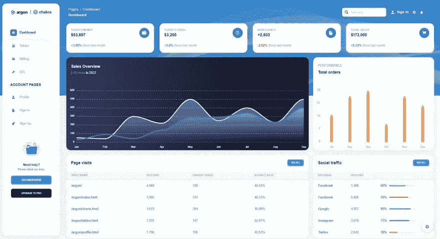](https://res.cloudinary.com/practicaldev/image/fetch/s--9YitkiSo--/c_limit%2Cf_auto%2Cfl_progressive%2Cq_auto%2Cw_880/https://dev-to-uploads.s3.amazonaws.com/uploads/articles/6bsxkzrwlmkniacjhin0.jpg)

* * *

## ✨ [React 节点 JS 软仪表盘](https://appseed.us/product/node-js-react-soft-dashboard)

软 UI Dashboard REACT，由 Creative-Tim 精心制作的现代材质 UI 设计，现在配置了 Node JS API 后端。

软 UI 材料-UI React 由 70 多个前端独立元素组成，如按钮、输入、导航条、导航标签、卡片或提醒，让您自由选择和组合。

*   👉 [React Node JS 软仪表盘](https://appseed.us/product/node-js-react-soft-dashboard) - `product page`
*   👉 [React Node JS 软仪表板](https://node-js-react-soft-dashboard.appseed-srv1.com/authentication/sign-in) -现场演示

[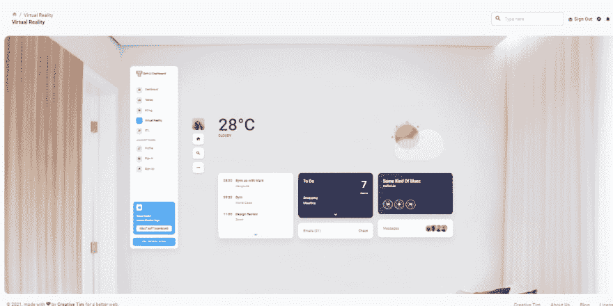](https://res.cloudinary.com/practicaldev/image/fetch/s--vZgtj2OL--/c_limit%2Cf_auto%2Cfl_progressive%2Cq_auto%2Cw_880/https://dev-to-uploads.s3.amazonaws.com/uploads/articles/uxgnemo4sf6kgifeub9z.png)

* * *

## ✨ [物质顺风反应](https://www.creative-tim.com/product/material-tailwind-dashboard-react?AFFILIATE=128200)

material**Tailwind**Dashboard React 是一个免费的管理模板，基于两个流行的前端技术: [Tailwind CSS 和 React](https://dev.to/sm0ke/react-tailwind-free-dashboards-3mkn) 。它旨在简化开发人员的工作，并采用了受谷歌材料设计启发的全新设计。它的所有组件都设计得彼此完美契合，同时符合材料概念。

*   👉[物料顺风反应](https://www.creative-tim.com/product/material-tailwind-dashboard-react?AFFILIATE=128200) - `product page`
*   👉[物料顺风反应](https://demos.creative-tim.com/material-tailwind-dashboard-react/#/?AFFILIATE=128200) - `LIVE demo`

[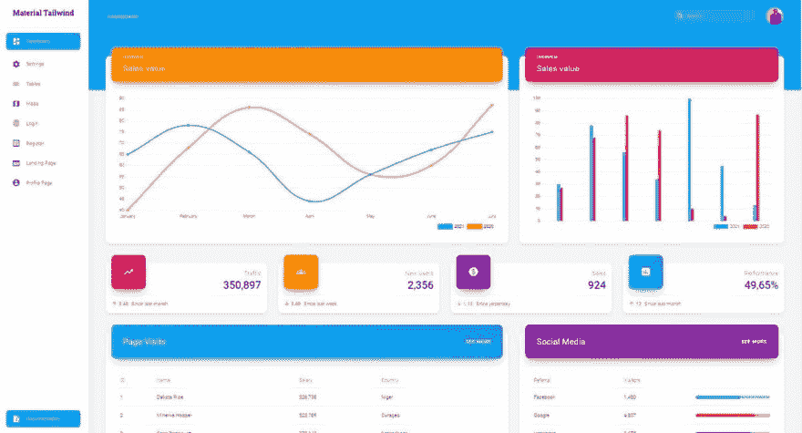](https://res.cloudinary.com/practicaldev/image/fetch/s--hrGk0svp--/c_limit%2Cf_auto%2Cfl_progressive%2Cq_auto%2Cw_880/https://dev-to-uploads.s3.amazonaws.com/uploads/articles/nd423xdiije2wktdr7dm.png)

* * *

## ✨ [顺风反应仪表盘](https://www.creative-tim.com/product/notus-react?AFFILIATE=128200)

**Notus React** 由超过 100 个独立组件组成，让您自由选择和组合。所有组件的颜色都可以变化，您可以使用 Tailwind CSS 类轻松修改这些颜色。

*   👉[顺风反应仪表盘](https://www.creative-tim.com/product/notus-react?AFFILIATE=128200) - `product page`
*   👉[顺风反应仪表盘](https://demos.creative-tim.com/notus-react/#/?AFFILIATE=128200) - `LIVE Demo`

[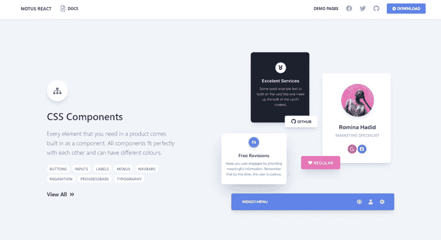](https://res.cloudinary.com/practicaldev/image/fetch/s--Krc0104X--/c_limit%2Cf_auto%2Cfl_progressive%2Cq_auto%2Cw_880/https://dev-to-uploads.s3.amazonaws.com/uploads/articles/evr15voqao7r5x05gdir.png)

* * *

## ✨·贝里反应过来仪表板

Berry 是一个使用材质 UI 创建的极小的免费模板。它旨在提供高度可定制的最佳用户体验。它是一个完全改变游戏规则的 React 仪表盘模板，具有简单直观的响应设计，就像在 retina 屏幕或笔记本电脑上一样。

*   👉 [Berry React 仪表盘](https://github.com/codedthemes/berry-free-react-admin-template) -源代码(麻省理工学院许可)

[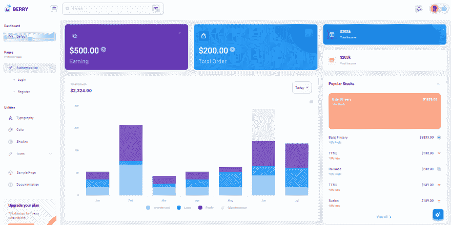](https://res.cloudinary.com/practicaldev/image/fetch/s--TRhThI4n--/c_limit%2Cf_auto%2Cfl_progressive%2Cq_auto%2Cw_880/https://raw.githubusercontent.com/admin-dashboards/berry-free-react-admin-template/main/media/react-dashboard-berry-screen.png)

* * *

> **感谢阅读！**如需更多资源，请随时访问:

*   ✨更多[免费仪表盘](https://appseed.us/admin-dashboards/open-source)在 Django 制作，Flask 和 [React](https://appseed.us/apps/react)
*   ✨更多[管理仪表板](https://www.admin-dashboards.com/) -一个巨大的产品索引