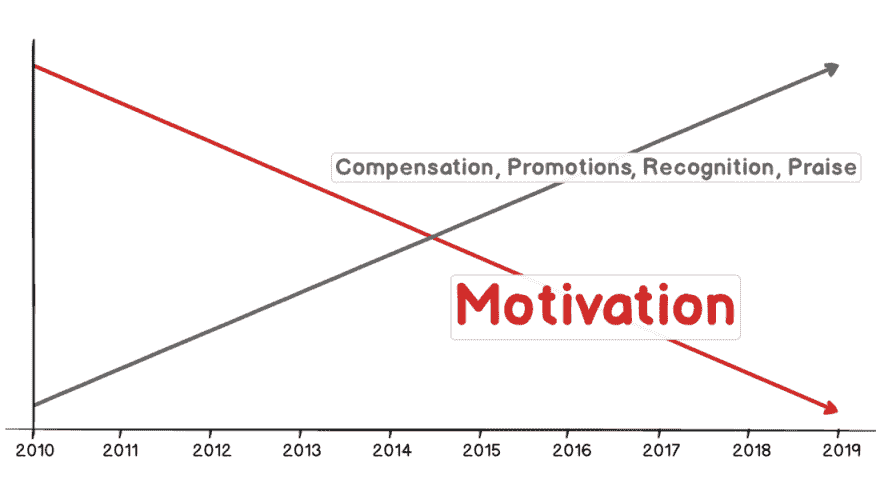

# 为什么我辞去了亚马逊 50 万美元的工作，为自己工作

> 原文：<https://dev.to/dvassallo/why-i-quit-a-500k-job-at-amazon-to-work-for-myself-2id7>

## 只有内在的动机才能持久

去年 2 月，我辞去了在亚马逊工作了 8 年的轻松工作。尽管不断得到晋升、补偿、认可和表扬，我还是没有足够的动力再干一年。

我把全部时间都花在了 AWS 为开发者构建工具上。我非常喜欢这个领域，如果能在这个领域工作一辈子，我会很满足的。

我加入亚马逊时是一名初级开发人员。在 3.5 年内，我两次被提升为高级工程师，如果我留下来，今年几乎肯定会再次被提升为首席工程师。有人告诉我，我在公司的潜力很大。

随着时间的推移，我在公司的声望越来越高，我被认为是我所在领域的专家和领导者。人们尊敬我，尊敬我。

我第一年赚了 7.5 万美元，到最后一年逐渐增长到 51.1 万美元。如果我再呆几年，我可能会再赚 100 万美元。

尽管亚马逊名声在外，但我的工作生活平衡得也很好。我不再需要证明自己，我可以在每周 40 小时内完成所有的事情。我的团队每周有一天在家工作，我很少在晚上或周末打开笔记本电脑。

此外，和我一起工作的人都很出色。我总共有三个经理，他们都很慷慨，富有同情心。我非常感激和我一起工作的每一个人。

一切都很顺利，而且越来越好。但尽管如此，我每天早上去上班的动力却在减少——几乎与我的职业和收入增长趋势相反。

如果我得到了另一次晋升，或另一次加薪，或另一个大项目，那么期待我的动力开始增加，这将是愚蠢的。但是我的动力中还有其他东西在下降。这是我的自由。

### 动力下降

头几年，我的动力高得惊人。我主要是和另一个人一起开发一个内部工具，很少有人关注它。那段时间，我在选择如何工作和做什么方面有很大的独立性——至少相对于最近几年来说是这样。只有我和另一个人改进这个东西，与用户交谈，发布更新，测试它，以及其他一切事情。我们觉得重要的事情，通常都会去做。为了工作本身，我们尽了最大努力，而且大部分时间我们都是自我指导的。

然而，过去几年却完全不同。我领导着我部门历史上最重要的项目，有许多利益相关者和复杂的目标。我所能做的总是受限于我说服所有相关人员这是实现我们目标的最佳方式的能力。

在亚马逊，我总是要按照别人的条件工作。这些术语在开始时很简单(不断地解决问题)，但是随着时间的推移变得越来越复杂(最大化所有目标；满足所有利益相关者)。此外，在大型组织中工作还有其他固有的限制，比如如何工作、做什么工作、设定什么目标以及什么业务值得从事。这种情况迫使我去做我不愿意做的事情，反之亦然。

### 寻找新的动力

如果要我永远做下去，我会做什么工作？不是我在达到某个里程碑(退出)之前做的事情，而是如果我继续做直到 80 岁我会认为满意的事情。我能做什么让我在接下来的 45 年里每天醒来都兴奋不已，还能赚到足够的钱来支付我的开销？这是不是太没志气了？我不这么认为。因为有两种类型的司机在早上把我从床上拉起来。

一种来自外部，以胡萝卜或大棒的形式。例如，我不会被自动驱使去做每年四月的纳税申报单，但我会确保这样做，因为我不想进监狱。或者我可能不想做我不喜欢的事情，但我还是会这样做，因为我可能需要支付账单，或者想买一辆漂亮的车。这些是外在的激励因素。

另一个来自内部。当没有胡萝卜或大棒时，这就是驱使我去做事情的原因。兴趣爱好是受此驱动的一种活动。但我寻找的是我能以此谋生的东西，也是由这种类型的动机驱动的:内在的那种。

回到这个问题，这是不是太没有野心了。你看，我意识到外在的动机不会持久。每当我得到提升，这种感觉会持续一周，然后就结束了。当我第一次达到 10 万美元的收入时，我会在几天内看一眼我的 W2，欣赏这六位数，但后来它就消失了。当我达到 20 万美元、30 万美元、40 万美元和 50 万美元时，情况是一样的。认为挣 100 万美元或 1000 万美元会让事情突然变得不同，这是我的错觉。我对其他外在的奖励或物质财富也有同样的感觉。得到它们的感觉会好一会儿，但这种感觉会很快消失。

那些不会消失的事情是我从小就一直在做的，那时没有任何事情强迫我去做。比如写代码，卖我的作品，画我自己的路线，就像我看到的那样称呼它。我知道自己的优势，也知道什么能激励我，所以为什么不一直这样做呢？我很幸运生活在这样一个时代，我可以在我的专业领域独立做一些事情，而不需要大量的资本或外部投资者。这就是我正在做的。

### 接下来是什么？

我要在独立上孤注一掷，我要尝试白手起家，努力谋生。我不期望只做我喜欢的事情，但是会按照我的方式。我的目标是在我耗尽积蓄之前支付我的家庭开支，同时做一些内在激励我的事情。我还想要什么来满足我的工作呢？

* * *

**更新:**这是我决定下一步要做的事情。你可以[跟我去那里](https://twitter.com/dvassallo)，我会继续记录我的旅程。

> 丹尼尔瓦萨洛[【dvassallo](https://dev.to/dvassallo)好了，我决定建立这个并尝试以此为生:
> 
> 一个用于 web/移动应用的端到端加密无服务器平台，提供用户 auth、db、&文件存储服务。最终用户获得了隐私。应用程序开发者从处理用户数据的责任&负担中解脱出来。[twitter.com/dvassallo/stat…](https://t.co/6ewNTFz51Z)2019 年 5 月 10 日下午 19:02丹尼尔瓦萨洛[@德瓦萨洛](https://dev.to/dvassallo)用户数据是负债。这是我现在正在认真探索的问题。你知道为什么@1Password 永远看不到你的密码，即使它们保存在云中？想象一下，如果有一种简单的方法，任何人都可以用它来构建 web 应用程序。10129

* * *

*最初发布于[danielvassallo.com](https://danielvassallo.com/only-intrinsic-motivation-lasts/)2019 年 2 月 9 日。*