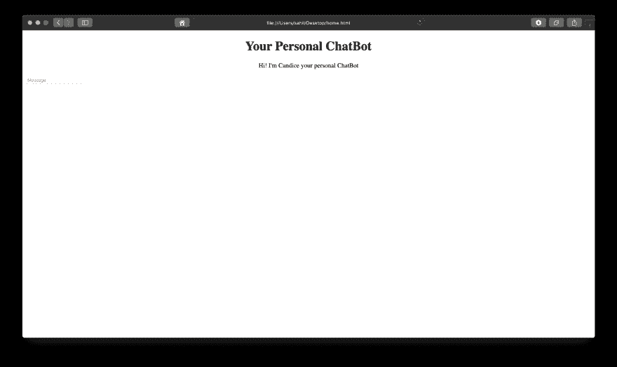
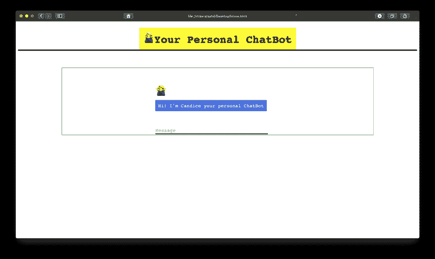
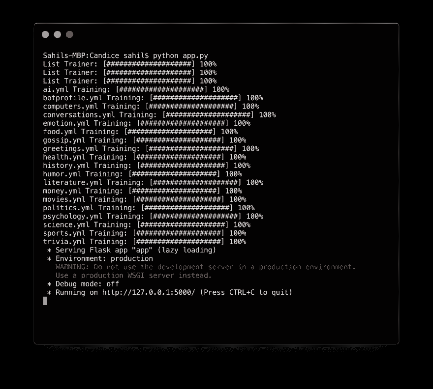
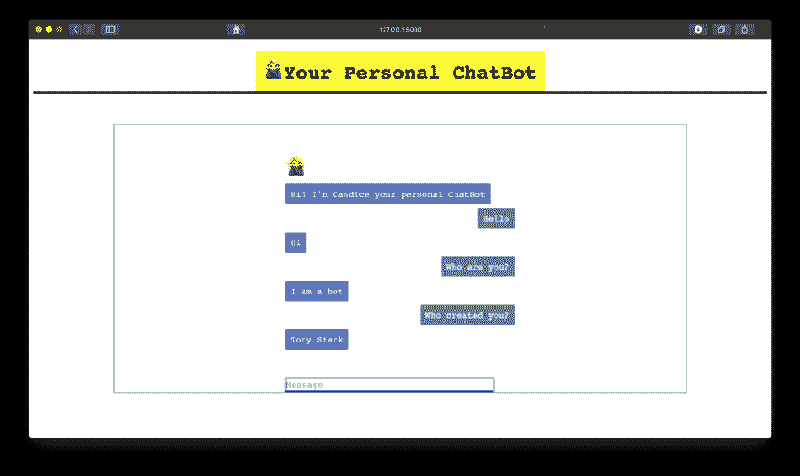

# 用烧瓶在 5 分钟内建造一个聊天机器人

> 原文：<https://dev.to/sahilrajput/build-a-chatbot-using-flask-in-5-minutes-574i>

几周前，我写了一篇文章[用 5 分钟构建你的第一个聊天机器人。](https://dev.to/sahilrajput/build-your-first-chatbot-in-5-minutes--15e3)

那个机器人很酷，你可以通过终端通话。今天，让我们试着用 [Flask](http://flask.pocoo.org/) 构建同一个 bot。

因此，我们将使用 [ChatterBot](https://chatterbot.readthedocs.io/en/stable/) 这是一个机器学习，对话引擎，用于创建聊天机器人。

如果你没有看过我之前的帖子，请点击这里

#### 安装聊天机器人

`$ pip install ChatterBot`

#### 安装烧瓶

`$ pip install Flask`

#### 创建文件

`app.py`并打开它

```
#import files from flask import Flask, render_template, request
from chatterbot import ChatBot
from chatterbot.trainers import ChatterBotCorpusTrainer
from chatterbot.trainers import ListTrainer 
```

<svg width="20px" height="20px" viewBox="0 0 24 24" class="highlight-action crayons-icon highlight-action--fullscreen-on"><title>Enter fullscreen mode</title></svg> <svg width="20px" height="20px" viewBox="0 0 24 24" class="highlight-action crayons-icon highlight-action--fullscreen-off"><title>Exit fullscreen mode</title></svg>

创建一个烧瓶应用程序

```
app = Flask(__name__) 
```

<svg width="20px" height="20px" viewBox="0 0 24 24" class="highlight-action crayons-icon highlight-action--fullscreen-on"><title>Enter fullscreen mode</title></svg> <svg width="20px" height="20px" viewBox="0 0 24 24" class="highlight-action crayons-icon highlight-action--fullscreen-off"><title>Exit fullscreen mode</title></svg>

正如我们在我的[上一篇文章](https://dev.to/sahilrajput/build-your-first-chatbot-in-5-minutes--15e3)中看到的

```
bot = ChatBot("Candice")
bot.set_trainer(ListTrainer)
bot.set_trainer(ChatterBotCorpusTrainer)
bot.train("chatterbot.corpus.english") 
```

<svg width="20px" height="20px" viewBox="0 0 24 24" class="highlight-action crayons-icon highlight-action--fullscreen-on"><title>Enter fullscreen mode</title></svg> <svg width="20px" height="20px" viewBox="0 0 24 24" class="highlight-action crayons-icon highlight-action--fullscreen-off"><title>Exit fullscreen mode</title></svg>

在这之后

```
@app.route("/")
def home():    
    return render_template("home.html") 
@app.route("/get")
def get_bot_response():    
    userText = request.args.get('msg')    
    return str(bot.get_response(userText)) 
if __name__ == "__main__":    
    app.run() 
```

<svg width="20px" height="20px" viewBox="0 0 24 24" class="highlight-action crayons-icon highlight-action--fullscreen-on"><title>Enter fullscreen mode</title></svg> <svg width="20px" height="20px" viewBox="0 0 24 24" class="highlight-action crayons-icon highlight-action--fullscreen-off"><title>Exit fullscreen mode</title></svg>

因此，正如我们看到的，我们需要创建一个*home.html*文件作为前端。

创建一个文件夹“模板”并在里面创建一个文件*home.html*。

```
templates/home.html 
```

<svg width="20px" height="20px" viewBox="0 0 24 24" class="highlight-action crayons-icon highlight-action--fullscreen-on"><title>Enter fullscreen mode</title></svg> <svg width="20px" height="20px" viewBox="0 0 24 24" class="highlight-action crayons-icon highlight-action--fullscreen-off"><title>Exit fullscreen mode</title></svg>

打开 home.html

```
 <!DOCTYPE html>
<html>
  <title>Candice</title>
  <body>
    <center>
      <h1>
        Your Personal ChatBot
      </h1>
    </center>
      <div>
       <p>
          <center><span>Hi! I'm Candice your personal ChatBot</span></center>
          </p>
       </div>
       <div id="userInput">
          <input id="textInput" type="text" name="msg" placeholder="Message" />
       </div>
  </body>
</html> 
```

<svg width="20px" height="20px" viewBox="0 0 24 24" class="highlight-action crayons-icon highlight-action--fullscreen-on"><title>Enter fullscreen mode</title></svg> <svg width="20px" height="20px" viewBox="0 0 24 24" class="highlight-action crayons-icon highlight-action--fullscreen-off"><title>Exit fullscreen mode</title></svg>

[](https://res.cloudinary.com/practicaldev/image/fetch/s--eAHk25BQ--/c_limit%2Cf_auto%2Cfl_progressive%2Cq_auto%2Cw_880/https://cdn-images-1.medium.com/max/1600/1%2Akowrn6V77r57CVrZIy8mSw.png)

这只是一个基本的结构，让我们给它添加一些 css。我们不是在为 css 创建另一个文件，我们只是在*home.html*
中添加了样式

```
<head>
    <link
      rel="shortcut icon"
      type="image/x-icon"
      href="https://user-images.githubusercontent.com/20112458/49326597-773b7280-f57a-11e8-853d-20ed61d18b0d.png"
    />
    <script src="https://ajax.googleapis.com/ajax/libs/jquery/3.2.1/jquery.min.js"></script>
    <style>
      body {
        font-family: monospace;
      }
      h1 {
        background-color: yellow;
        display: inline-block;
        font-size: 3em;
        margin: 0;
        padding: 14px;
      }
      h3 {
        color: black;
        font-size: 20px;
        margin-top: 3px;
        text-align: center;
      }
      #chatbox {
        margin-left: auto;
        margin-right: auto;
        width: 40%;
        margin-top: 60px;
      }
      #userInput {
        margin-left: auto;
        margin-right: auto;
        width: 40%;
        margin-top: 60px;
      }
      #textInput {
        width: 90%;
        border: none;
        border-bottom: 3px solid black;
        font-family: monospace;
        font-size: 17px;
      }
      .userText {
        color: white;
        font-family: monospace;
        font-size: 17px;
        text-align: right;
        line-height: 30px;
      }
      .userText span {
        background-color: #808080;
        padding: 10px;
        border-radius: 2px;
      }
      .botText {
        color: white;
        font-family: monospace;
        font-size: 17px;
        text-align: left;
        line-height: 30px;
      }
      .botText span {
        background-color: #4169e1;
        padding: 10px;
        border-radius: 2px;
      }
      #tidbit {
        position: absolute;
        bottom: 0;
        right: 0;
        width: 300px;
      }
      .boxed {
        margin-left: auto;
        margin-right: auto;
        width: 78%;
        margin-top: 60px;
        border: 1px solid green;
      }
      .box {
        border: 2px solid black;
      }
    </style>
</head> 
```

<svg width="20px" height="20px" viewBox="0 0 24 24" class="highlight-action crayons-icon highlight-action--fullscreen-on"><title>Enter fullscreen mode</title></svg> <svg width="20px" height="20px" viewBox="0 0 24 24" class="highlight-action crayons-icon highlight-action--fullscreen-off"><title>Exit fullscreen mode</title></svg>

现在，在那之后让我们改变身体的结构。

```
<body>
    <center>
      <h1>
        Your Personal ChatBot
      </h1>
    </center>
<div class="box"></div>
    <div class="boxed">
      <div>
        <div id="chatbox">
          
          <p class="botText">
            <span>Hi! I'm Candice your personal ChatBot</span>
          </p>
        </div>
        <div id="userInput">
          <input id="textInput" type="text" name="msg" placeholder="Message" />
        </div>
      </div>
    </div>
  </body> 
```

<svg width="20px" height="20px" viewBox="0 0 24 24" class="highlight-action crayons-icon highlight-action--fullscreen-on"><title>Enter fullscreen mode</title></svg> <svg width="20px" height="20px" viewBox="0 0 24 24" class="highlight-action crayons-icon highlight-action--fullscreen-off"><title>Exit fullscreen mode</title></svg>

[](https://res.cloudinary.com/practicaldev/image/fetch/s--R7-vTK6h--/c_limit%2Cf_auto%2Cfl_progressive%2Cq_auto%2Cw_880/https://cdn-images-1.medium.com/max/1600/1%2ApdTHnGd_9aZK3nxYn_lNwA.png)

现在，如果我们输入一些东西，什么也不会发生。所以，让我们添加一些*剧本*

```
<script>
        function getBotResponse() {
          var rawText = $("#textInput").val();
          var userHtml = '<p class="userText"><span>' + rawText + "</span></p>";
          $("#textInput").val("");
          $("#chatbox").append(userHtml);
          document
            .getElementById("userInput")
            .scrollIntoView({ block: "start", behavior: "smooth" });
          $.get("/get", { msg: rawText }).done(function(data) {
            var botHtml = '<p class="botText"><span>' + data + "</span></p>";
            $("#chatbox").append(botHtml);
            document
              .getElementById("userInput")
              .scrollIntoView({ block: "start", behavior: "smooth" });
          });
        }
        $("#textInput").keypress(function(e) {
          if (e.which == 13) {
            getBotResponse();
          }
        });
</script> 
```

<svg width="20px" height="20px" viewBox="0 0 24 24" class="highlight-action crayons-icon highlight-action--fullscreen-on"><title>Enter fullscreen mode</title></svg> <svg width="20px" height="20px" viewBox="0 0 24 24" class="highlight-action crayons-icon highlight-action--fullscreen-off"><title>Exit fullscreen mode</title></svg>

现在，你会看到无论你写什么都会显示在聊天框中，但是你的聊天机器人不会给出任何回复。

为此，让我们运行您的 app.py

```
$ python app.py 
```

<svg width="20px" height="20px" viewBox="0 0 24 24" class="highlight-action crayons-icon highlight-action--fullscreen-on"><title>Enter fullscreen mode</title></svg> <svg width="20px" height="20px" viewBox="0 0 24 24" class="highlight-action crayons-icon highlight-action--fullscreen-off"><title>Exit fullscreen mode</title></svg>

[](https://res.cloudinary.com/practicaldev/image/fetch/s--kl0aUaV---/c_limit%2Cf_auto%2Cfl_progressive%2Cq_auto%2Cw_880/https://cdn-images-1.medium.com/max/1600/1%2AHvzXW2m-BEhLBZvirNegIw.png)

因此，请访问该链接，与您的个人聊天机器人聊天

[](https://res.cloudinary.com/practicaldev/image/fetch/s--6762UvwD--/c_limit%2Cf_auto%2Cfl_progressive%2Cq_auto%2Cw_880/https://cdn-images-1.medium.com/max/1600/1%2AHoWut3egxrpXrPlzdl_9yA.png)

你可以在我的 [Github](https://github.com/sahil-rajput/Candice-YourPersonalChatBot) 上找到完整的源代码。