# 开发人员对上周的回购进行总结

> 原文：<https://dev.to/devteam/dev-to-repo-recap-from-the-past-week-38a3>

欢迎回到另一个回购回顾，我们涵盖了上周对 [dev.to 的仓库](https://github.com/thepracticaldev/dev.to)[iOS 回购](https://github.com/thepracticaldev/dev-ios)和[Android 回购](https://github.com/thepracticaldev/dev-android)的贡献。这一期涵盖 6 月 22 日至 6 月 28 日。

# 主回购

## 特性

*   我们已经为通知和评论页面添加了评论上下文！这是提供更有用的通知的第一步。PR by [@ben](https://dev.to/ben) :

# [ 为通知和评论页面添加评论上下文 #3262](https://github.com/thepracticaldev/dev.to/pull/3262) 

[](https://github.com/benhalpern) **[benhalpern](https://github.com/benhalpern)** posted on [<time datetime="2019-06-22T01:17:25Z">Jun 22, 2019</time>](https://github.com/thepracticaldev/dev.to/pull/3262)

## 这是什么类型的公关？(勾选所有适用选项)

*   [ ]重构
*   [x]功能
*   [ ]错误修复
*   [ ]文档更新

## 描述

向通知和单个评论页面添加更多上下文。

[ ](https://user-images.githubusercontent.com/3102842/59957775-d48d0780-9469-11e9-8163-b09be5c388d9.png) [ 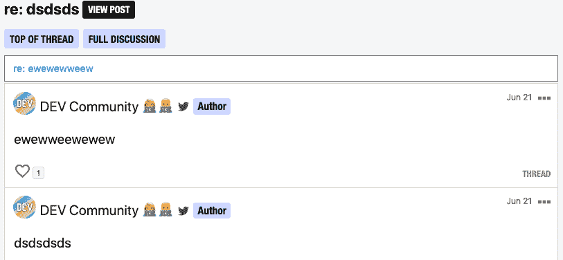](https://user-images.githubusercontent.com/3102842/59957776-d5be3480-9469-11e9-8b5e-6312c6f13429.png)

[View on GitHub](https://github.com/thepracticaldev/dev.to/pull/3262)

*   您现在可以将帖子发布到您的个人资料的顶部了！感谢 [@ben](https://dev.to/ben) 的这项工作。

# [ 给个人资料添加固定文章框 #3269](https://github.com/thepracticaldev/dev.to/pull/3269) 

[](https://github.com/benhalpern) **[benhalpern](https://github.com/benhalpern)** posted on [<time datetime="2019-06-23T02:39:04Z">Jun 23, 2019</time>](https://github.com/thepracticaldev/dev.to/pull/3269)

## 这是什么类型的公关？(勾选所有适用选项)

*   [ ]重构
*   [x]功能
*   [ ]错误修复
*   [ ]文档更新

## 描述

这个功能应该帮助人们突出他们最有影响力的东西，同时也不那么犹豫地发布更简单的讨论/帮助线程等。而不推送他们最好的内容。

[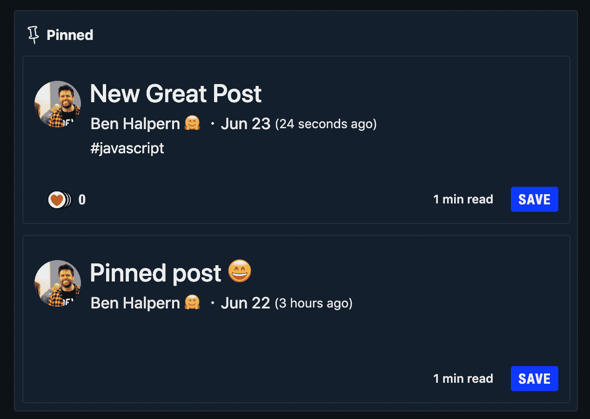](https://camo.githubusercontent.com/e8d324d87242864b3148ac2c6451168c343e098a/68747470733a2f2f636c2e6c792f3339313232383835366335652f496d616765253230323031392d30362d3232253230617425323031302e33372e3230253230504d2e706e67)

[View on GitHub](https://github.com/thepracticaldev/dev.to/pull/3269)

*   标签现在可以有 30 个字符的最大长度。谢谢， [@edueo](https://dev.to/edueo) ！

# [  3035 -将标签长度限制从 20 个字符增加到 30 个字符 #3299](https://github.com/thepracticaldev/dev.to/pull/3299) 

[](https://github.com/jeduardo824) **[jeduardo824](https://github.com/jeduardo824)** posted on [<time datetime="2019-06-24T19:32:37Z">Jun 24, 2019</time>](https://github.com/thepracticaldev/dev.to/pull/3299)

## 这是什么类型的公关？(勾选所有适用选项)

*   [ ]重构
*   [x]功能
*   [ ]错误修复
*   [ ]文档更新

## 描述

解决#3035 该提交将`tag`长度限制从 20 个字符增加到 30 个字符，并将`cached_tag_list`长度限制增加到 126 个字符，旨在保持四个标签的限制。规格是适应尊重的变化。

## 相关车票&单据

## 手机&桌面截图/录音(如有 UI 改动)

## 添加到文档中？

*   [ ]文档开发到
*   [ ]自述文件
*   [ ]不需要文档

## 【可选】哪个 gif 最能描述这个 PR 或者给你的感觉？

[](gif_link)

[View on GitHub](https://github.com/thepracticaldev/dev.to/pull/3299)

*   阅读列表的标题现在显示了你有多少项目。谢谢， [@bolariinwa](https://dev.to/bolariinwa) ！

# [ 添加项目计数到阅读列表标题 #3162](https://github.com/thepracticaldev/dev.to/pull/3162) 

[](https://github.com/bolariin) **[bolariin](https://github.com/bolariin)** posted on [<time datetime="2019-06-14T20:09:49Z">Jun 14, 2019</time>](https://github.com/thepracticaldev/dev.to/pull/3162)

## 这是什么类型的公关？(勾选所有适用选项)

*   [ ]重构
*   [x]功能
*   [ ]错误修复
*   [ ]文档更新

## 描述

在阅读列表标题旁边添加文章计数。这与主页中的阅读列表计数不同，因为这将只显示基于`statusView`的文章计数，因此计数取决于该视图中的文章数量。

## 相关车票&单据

解决#3124

## 手机&桌面截图/录音(如有 UI 改动)

[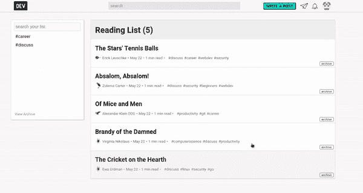](https://user-images.githubusercontent.com/24629960/59535371-c6197b80-8ebe-11e9-9e9f-967baf134786.gif)

## 添加到文档中？

*   [ ]文档开发到
*   [ ]自述文件
*   [x]不需要文档

[View on GitHub](https://github.com/thepracticaldev/dev.to/pull/3162)

*   现在有了职业会员的推荐统计数据——更多关于这在未来意味着什么。谢谢，[@押韵](https://dev.to/rhymes)！

# [  Pro:给仪表盘和单篇文章统计添加推荐人 #3295](https://github.com/thepracticaldev/dev.to/pull/3295) 

[](https://github.com/rhymes) **[rhymes](https://github.com/rhymes)** posted on [<time datetime="2019-06-24T13:29:38Z">Jun 24, 2019</time>](https://github.com/thepracticaldev/dev.to/pull/3295)

## 这是什么类型的公关？(勾选所有适用选项)

*   [ ]重构
*   [x]功能
*   [ ]错误修复
*   [ ]文档更新

## 描述

为专业仪表板和文章统计添加推荐人信息

目前只显示推荐最多的前 20 个域名。

这个 PR 向`page_views`表中添加了两列:`domain`和`path`。我认为这个表很大，对迁移没有帮助，因为`ALTER TABLE ADD COLUMN`重写了这个表，这会导致停机。

**合并前注意事项**:

*   这种迁移可能是巨大而缓慢的
*   有一个临时的 Rake 脚本(将在部署后删除)将回填这些新列

我不知道表格有多大，脚本可以通过只回填统计发布日期(`2019-04-01`)后创建的页面视图来加速，或者目前只针对专业用户。

## 手机&桌面截图/录音(如有 UI 改动)

该框出现在现有统计框下:

[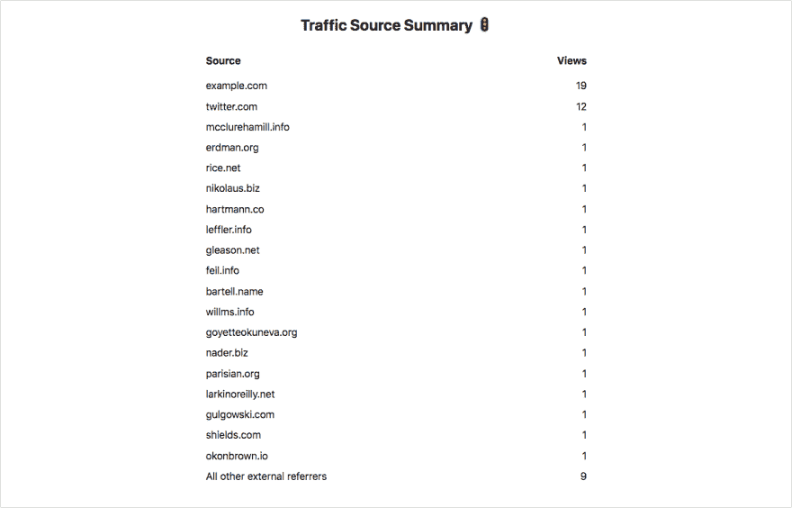](https://user-images.githubusercontent.com/146201/60022824-dab2fc00-9694-11e9-9fee-ebecf1870ebc.png)

## 添加到文档中？

*   [ ]文档开发到
*   [ ]自述文件
*   [x]不需要文档

[View on GitHub](https://github.com/thepracticaldev/dev.to/pull/3295)

*   你现在可以嵌入特定版本的要点。感谢 [@bolariinwa](https://dev.to/bolariinwa) ！

# [ 允许嵌入特定的要诀版本 #3310](https://github.com/thepracticaldev/dev.to/pull/3310) 

[](https://github.com/bolariin) **[bolariin](https://github.com/bolariin)** posted on [<time datetime="2019-06-26T05:33:01Z">Jun 26, 2019</time>](https://github.com/thepracticaldev/dev.to/pull/3310)

## 这是什么类型的公关？(勾选所有适用选项)

*   [ ]重构
*   [x]功能
*   [ ]错误修复
*   [ ]文档更新

## 描述

允许用户嵌入特定的 gist 版本。

## 相关车票&单据

解决#3267

## 添加到文档中？

*   [x]文档开发到
*   [ ]自述文件
*   [ ]不需要文档

[View on GitHub](https://github.com/thepracticaldev/dev.to/pull/3310)

*   您现在还可以在您的个人资料中添加 Instagram 链接。再次感谢， [@bolariinwa](https://dev.to/bolariinwa) ！

# [ 添加 Instagram 网址到个人资料链接 #3307](https://github.com/thepracticaldev/dev.to/pull/3307) 

[](https://github.com/bolariin) **[bolariin](https://github.com/bolariin)** posted on [<time datetime="2019-06-26T03:00:56Z">Jun 26, 2019</time>](https://github.com/thepracticaldev/dev.to/pull/3307)

## 这是什么类型的公关？(勾选所有适用选项)

*   [ ]重构
*   [x]功能
*   [ ]错误修复
*   [ ]文档更新

## 描述

在个人资料链接中增加了 Instagram 链接选项。

## 相关车票&单据

解决#3224

## 手机&桌面截图/录音(如有 UI 改动)

[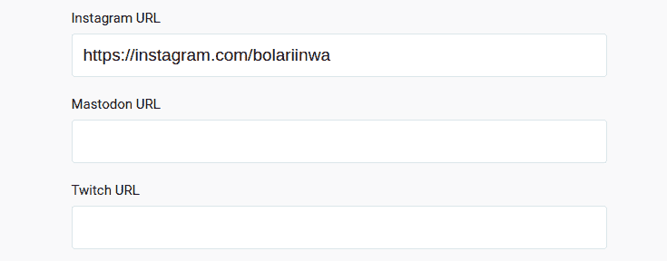](https://user-images.githubusercontent.com/24629960/60147716-8bf08980-979c-11e9-86e5-fcb0aad1079a.png)

[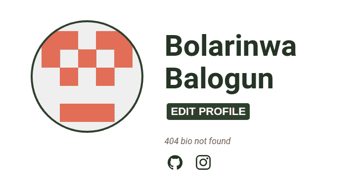](https://user-images.githubusercontent.com/24629960/60147717-8bf08980-979c-11e9-9198-3f5706f5fa96.png)

## 添加到文档中？

*   [ ]文档开发到
*   [ ]自述文件
*   [x]不需要文档

[View on GitHub](https://github.com/thepracticaldev/dev.to/pull/3307)

*   评论中的链接现在有了`rel="nofollow"`，主要是为了遏制垃圾邮件。再次感谢， [@bolariinwa](https://dev.to/bolariinwa) ！

# [ 添加 rel="nofollow "到评论链接 #3304](https://github.com/thepracticaldev/dev.to/pull/3304) 

[](https://github.com/bolariin) **[bolariin](https://github.com/bolariin)** posted on [<time datetime="2019-06-25T16:49:37Z">Jun 25, 2019</time>](https://github.com/thepracticaldev/dev.to/pull/3304)

## 这是什么类型的公关？(勾选所有适用选项)

*   [ ]重构
*   [x]功能
*   [ ]错误修复
*   [ ]文档更新

## 描述

仅在注释中解析降价时，在链接中添加了 rel="nofollow"。

## 相关车票&单据

解决#3236

## 添加到文档中？

*   [x]不需要文档

[View on GitHub](https://github.com/thepracticaldev/dev.to/pull/3304)

## Bug 修复/其他贡献

*   配置文件图像现在有 2 兆字节的最大限制。谢谢， [@bolariinwa](https://dev.to/bolariinwa) ！

# [ 设置个人资料图片的最大文件大小限制 #3313](https://github.com/thepracticaldev/dev.to/pull/3313) 

[](https://github.com/bolariin) **[bolariin](https://github.com/bolariin)** posted on [<time datetime="2019-06-26T15:35:38Z">Jun 26, 2019</time>](https://github.com/thepracticaldev/dev.to/pull/3313)

## 这是什么类型的公关？(勾选所有适用选项)

*   [ ]重构
*   [x]功能
*   [ ]错误修复
*   [ ]文档更新

## 描述

将配置文件图像的最大文件大小限制设置为 2MB。

## 相关车票&单据

解决#3271

## 添加到文档中？

*   [ ]文档开发到
*   [ ]自述文件
*   [x]不需要文档

[View on GitHub](https://github.com/thepracticaldev/dev.to/pull/3313)

*   [@本](https://dev.to/ben)修复了一个评论`title`的编码问题。谢谢你，本！

# [ 修复评论标题编码问题 #3311](https://github.com/thepracticaldev/dev.to/pull/3311) 

[](https://github.com/benhalpern) **[benhalpern](https://github.com/benhalpern)** posted on [<time datetime="2019-06-26T13:46:02Z">Jun 26, 2019</time>](https://github.com/thepracticaldev/dev.to/pull/3311)

## 这是什么类型的公关？(勾选所有适用选项)

*   [ ]重构
*   [x]功能
*   [ ]错误修复
*   [ ]文档更新

## 描述

修复混乱的字符。通过去掉撇号来完全清理事物。所以我先提出来。我想我们会想改变它，在未来做得更好，但现在这是为了解决当前的显示问题。

[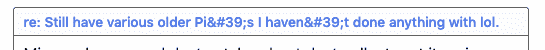](https://user-images.githubusercontent.com/3102842/60185034-32697880-97f7-11e9-9b93-5dd22a87fecc.png)

[View on GitHub](https://github.com/thepracticaldev/dev.to/pull/3311)

*   @lightalloy 增加了更多的测试并重构了播客的获取方式。谢谢安娜。

# [ 更多规格和重构播客抓取 #3245](https://github.com/thepracticaldev/dev.to/pull/3245) 

[](https://github.com/lightalloy) **[lightalloy](https://github.com/lightalloy)** posted on [<time datetime="2019-06-20T12:24:45Z">Jun 20, 2019</time>](https://github.com/thepracticaldev/dev.to/pull/3245)

## 这是什么类型的公关？(勾选所有适用选项)

*   [x]重构

## 描述

*   重构了播客获取的代码(创建和更新)
*   为该逻辑添加的规范保持了逻辑的大部分不变，以使变化是渐进的。

## 相关车票&单据

#2952

[View on GitHub](https://github.com/thepracticaldev/dev.to/pull/3245)

*   我修复了一些推送通知和评论提交响应被破坏的错误。抱歉，如果这影响了你！

# [ 返回原体而不是 nil 进行新评论推送通知 #3273](https://github.com/thepracticaldev/dev.to/pull/3273) 

[](https://github.com/Zhao-Andy) **[Zhao-Andy](https://github.com/Zhao-Andy)** posted on [<time datetime="2019-06-23T23:07:36Z">Jun 23, 2019</time>](https://github.com/thepracticaldev/dev.to/pull/3273)

## 这是什么类型的公关？(勾选所有适用选项)

*   [x]错误修复

## 描述

这修复了一个奇怪的错误，即`comment.title.strip!`将返回`nil`，因此`CGI.unescapeHTML(nil)`将导致运行时错误。

我不确定为什么现在这是一个问题，而不是以前🤷‍♂️

解决#3272

[View on GitHub](https://github.com/thepracticaldev/dev.to/pull/3273)

*   [@押韵](https://dev.to/rhymes)从评论的`title`中删除了不必要的`stripping`。谢谢，[@韵](https://dev.to/rhymes)！

# [ 点评:解除双剥解开逃逸 #3270](https://github.com/thepracticaldev/dev.to/pull/3270) 

[](https://github.com/rhymes) **[rhymes](https://github.com/rhymes)** posted on [<time datetime="2019-06-23T09:54:40Z">Jun 23, 2019</time>](https://github.com/thepracticaldev/dev.to/pull/3270)

## 这是什么类型的公关？(勾选所有适用选项)

*   [ ]重构
*   [ ]功能
*   [x]错误修复
*   [ ]文档更新

## 描述

我注意到在新的评论视图中有一个逃避问题。这就解决了问题

## 手机&桌面截图/录音(如有 UI 改动)

以前

[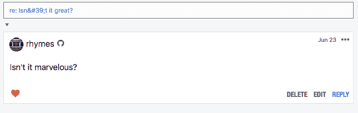](https://user-images.githubusercontent.com/146201/59974528-9a2c8300-95ad-11e9-8089-64095a5f9125.png)

在...之后

[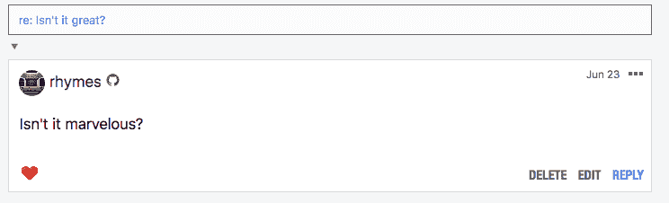](https://user-images.githubusercontent.com/146201/59974531-9ef13700-95ad-11e9-8b3e-8e4853a1e68f.png)

## 添加到文档中？

*   [ ]文档开发到
*   [ ]自述文件
*   [x]不需要文档

[View on GitHub](https://github.com/thepracticaldev/dev.to/pull/3270)

*   [@rhymes](https://dev.to/rhymes) 禁用了一个 Rubocop 风格的规则，并修复了一些与之相关的问题。谢谢，[@韵](https://dev.to/rhymes)！

# [  Rubocop:禁用风格规则并修复一些问题 #3278](https://github.com/thepracticaldev/dev.to/pull/3278) 

[](https://github.com/rhymes) **[rhymes](https://github.com/rhymes)** posted on [<time datetime="2019-06-24T08:01:52Z">Jun 24, 2019</time>](https://github.com/thepracticaldev/dev.to/pull/3278)

## 这是什么类型的公关？(勾选所有适用选项)

*   [ ]重构
*   [ ]功能
*   [x]错误修复
*   [ ]文档更新

## 描述

没有考虑行的长度，这意味着在很多情况下，我们最终得到的代码可读性较差，只是因为它必须停留在一行中。

if/unless 的风格应该由开发者决定，而不是由工具决定，至少我是这么认为的。

琐碎的例子:

```
def body_text
  if false && false && false && false && false && false && false && false && false
    return "a long string that will inevitably result in a long line"
  end
end
```

<svg width="20px" height="20px" viewBox="0 0 24 24" class="highlight-action crayons-icon highlight-action--fullscreen-on"><title>Enter fullscreen mode</title></svg> <svg width="20px" height="20px" viewBox="0 0 24 24" class="highlight-action crayons-icon highlight-action--fullscreen-off"><title>Exit fullscreen mode</title></svg>

这被标记为:

```
Style/IfUnlessModifier: Favor modifier if usage when having a single-line body. Another good alternative is the usage of control flow &&/||. (https://github.com/rubocop-hq/ruby-style-guide#if-as-a-modifier)
    if false && false && false && false && false && false && false && false && false
    ^^ 
```

问题是，如果 auto corrected 将把`if`放在返回中，这使得阅读代码更加困难，此外还不可避免地增加了违反`Metrics/LineLength`的次数。

类似于:

```
def body_text
  return "a long string that will inevitably result in a long line" if false && false && false && false && false && false && false && false && false
end
```

<svg width="20px" height="20px" viewBox="0 0 24 24" class="highlight-action crayons-icon highlight-action--fullscreen-on"><title>Enter fullscreen mode</title></svg> <svg width="20px" height="20px" viewBox="0 0 24 24" class="highlight-action crayons-icon highlight-action--fullscreen-off"><title>Exit fullscreen mode</title></svg>

节省两行代码并不总是值得的。

## 添加到文档中？

*   [ ]文档开发到
*   [ ]自述文件
*   [x]不需要文档

[View on GitHub](https://github.com/thepracticaldev/dev.to/pull/3278)

*   [@nickytonline](https://dev.to/nickytonline) 在我们的回购中加入了 Dependabot 徽章。谢谢， [@nickytonline](https://dev.to/nickytonline) ！

# [ 添加了塌实机器人徽章。 #3268](https://github.com/thepracticaldev/dev.to/pull/3268) 

[](https://github.com/nickytonline) **[nickytonline](https://github.com/nickytonline)** posted on [<time datetime="2019-06-22T21:04:35Z">Jun 22, 2019</time>](https://github.com/thepracticaldev/dev.to/pull/3268)

## 这是什么类型的公关？(勾选所有适用选项)

*   [ ]重构
*   [ ]功能
*   [ ]错误修复
*   [X]文档更新

## 描述

将 Dependabot 徽标添加到自述文件中。

## 相关车票&单据

[https://github.com/dependabot/feedback/issues/6](https://github.com/dependabot/feedback/issues/6)

## 手机&桌面截图/录音(如有 UI 改动)

## 添加到文档中？

*   [ ]文档开发到
*   [ ]自述文件
*   [x]不需要文档

## 【可选】哪个 gif 最能描述这个 PR 或者给你的感觉？

[](https://camo.githubusercontent.com/0a21f63fe75be95d0fad9824f83d02b9bcccd073/68747470733a2f2f6d656469612e67697068792e636f6d2f6d656469612f416b7350444c356b5a656f46692f67697068792d646f776e73697a65642d6c617267652e676966)

[View on GitHub](https://github.com/thepracticaldev/dev.to/pull/3268)

*   [@cyrillefr](https://github.com/cyrillefr) 将`bust_cache`方法移到了自己的`ActiveJobs`中，作为从`DelayedJob`转移到`ActiveJob`的持续努力的一部分。谢谢， [@cyrillefr](https://dev.to/cyrillefr) ！

# [ 在自己的岗位上移动半身像 _ 缓存方法 #3071](https://github.com/thepracticaldev/dev.to/pull/3071) 

[](https://github.com/cyrillefr) **[cyrillefr](https://github.com/cyrillefr)** posted on [<time datetime="2019-06-07T08:45:40Z">Jun 07, 2019</time>](https://github.com/thepracticaldev/dev.to/pull/3071)

*   调用 cache_buster 服务
*   工作+服务的规格
*   用于:分类列表、事件、组织、页面、播客 _ 剧集、播客、标签
*   重构(模型、服务)

## 这是什么类型的公关？(勾选所有适用选项)

*   [x]重构
*   [ ]功能
*   [ ]错误修复
*   [ ]文档更新

## 描述

将 bust_cache 方法移动到它们自己的作业中

## 相关车票&单据

#2497

## 手机&桌面截图/录音(如有 UI 改动)

## 添加到文档中？

*   [ ]文档开发到
*   [ ]自述文件
*   [ ]不需要文档

## 【可选】哪个 gif 最能描述这个 PR 或者给你的感觉？

[](gif_link)

[View on GitHub](https://github.com/thepracticaldev/dev.to/pull/3071)

*   修复了某些历史条目重复的问题。谢谢，[@韵](https://dev.to/rhymes)！

# [  Pro:删除重复历史项目 #3279](https://github.com/thepracticaldev/dev.to/pull/3279) 

[](https://github.com/rhymes) **[rhymes](https://github.com/rhymes)** posted on [<time datetime="2019-06-24T08:34:57Z">Jun 24, 2019</time>](https://github.com/thepracticaldev/dev.to/pull/3279)

## 这是什么类型的公关？(勾选所有适用选项)

*   [ ]重构
*   [ ]功能
*   [x]错误修复
*   [ ]文档更新

## 描述

现在历史记录是重复的，因为每次访问都是分开计算的。

为了正确地显示历史页面(就像浏览器的历史一样),需要对这些项目进行重复数据删除。通过用`distinct: true`建立索引，默认的响应只有独特的访问。

请记住，单独的条目仍然在索引中(可以在查询中使用`distinct: false`来访问它们)。

也许将来我们可以添加频率统计(例如:“这是你访问的前 10 篇文章”)，但这是另一个单独的功能。

**无论谁要合并这个:历史的索引(型号`PageView`和索引名`UserHistory`)需要重建**

## 相关车票&单据

#3220

## 截图

**在**之前

[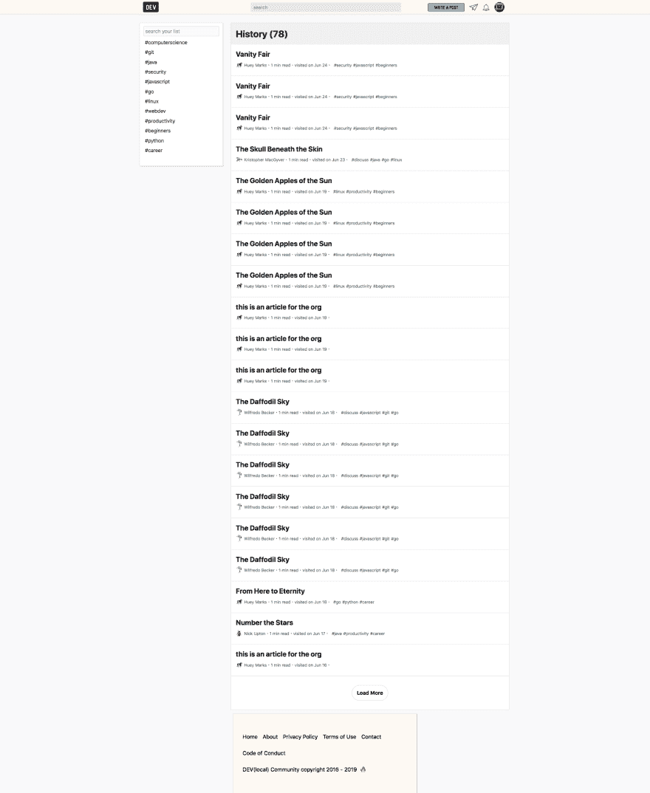](https://user-images.githubusercontent.com/146201/60003589-50a26d80-966b-11e9-8bcb-2b4263690049.png)

之后

 **[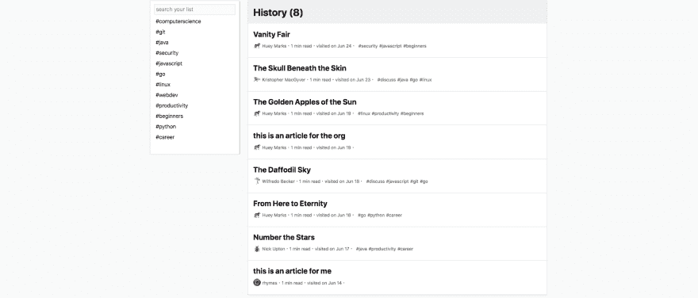](https://user-images.githubusercontent.com/146201/60003702-88a9b080-966b-11e9-8255-81fbe8f91ba3.png)

**当你再次访问一篇你已经访问过的文章时会发生什么**

[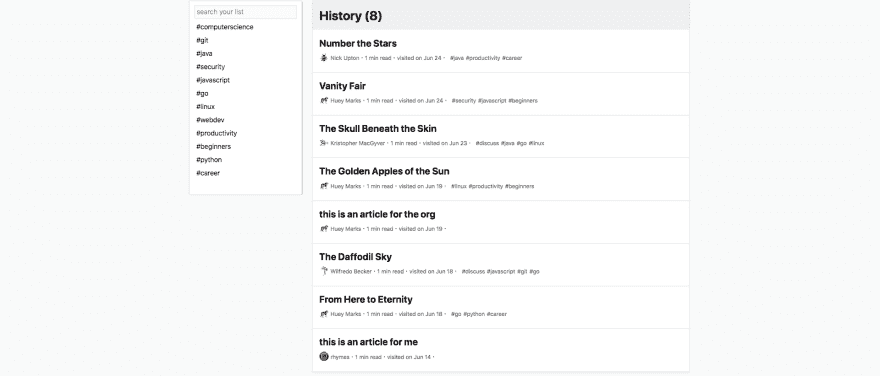](https://user-images.githubusercontent.com/146201/60003715-9101eb80-966b-11e9-8237-0f5c1c89b6dd.png)

注意“数星星”这篇文章是如何回到列表顶端的

## 添加到文档中？

*   [ ]文档开发到
*   [ ]自述文件
*   [x]不需要文档** **[View on GitHub](https://github.com/thepracticaldev/dev.to/pull/3279)** ***   [@mscccc](https://dev.to/mscccc) 改进了社交卡的缓存方式。更多详情请查看公关。谢谢， [@mscccc](https://dev.to/mscccc) ！

# [ 提高社交卡缓存🚀 #3265](https://github.com/thepracticaldev/dev.to/pull/3265) 

[](https://github.com/mscoutermarsh) **[mscoutermarsh](https://github.com/mscoutermarsh)** posted on [<time datetime="2019-06-22T16:31:52Z">Jun 22, 2019</time>](https://github.com/thepracticaldev/dev.to/pull/3265)

这次公关改进了社交卡缓存。 <g-emoji class="g-emoji" alias="zap" fallback-src="https://github.githubassets.cimg/icons/emoji/unicode/26a1.png">⚡️</g-emoji>

## 为什么

由于我们使用生成的 HTML 作为社交卡的[缓存键，如果有任何随机性，它会使命中率非常低(缓存不断重新生成)。](https://github.com/thepracticaldev/dev.to/blob/bfa1bdc37f4bf33c76d767ed815e30a384b369e0/app/lib/html_css_to_image.rb#L16)

这个 PR 增加了随机性测试(以避免回归)，并从 SVG 中删除了`aria`标签(生成图像时不需要随机的&)。

社交卡端点将更好地使用 memcached &甚至更快。 <g-emoji class="g-emoji" alias="zap" fallback-src="https://github.githubassets.cimg/icons/emoji/unicode/26a1.png">⚡️</g-emoji>

## 这是什么类型的公关？(勾选所有适用选项)

*   [ ]重构
*   [ ]功能
*   [X]错误修复
*   [ ]文档更新

## 添加到文档中？

*   [ ]文档开发到
*   [ ]自述文件
*   [X]不需要文档

[View on GitHub](https://github.com/thepracticaldev/dev.to/pull/3265)

*   [@sushant12](https://dev.to/sushant12) 将我们的报名路线改名为`/enter`更有意义。谢谢， [@sushant12](https://dev.to/sushant12) ！

# [ 使用动态路线名称 #3147](https://github.com/thepracticaldev/dev.to/pull/3147) 

[](https://github.com/sushant12) **[sushant12](https://github.com/sushant12)** posted on [<time datetime="2019-06-13T06:30:03Z">Jun 13, 2019</time>](https://github.com/thepracticaldev/dev.to/pull/3147)

## 这是什么类型的公关？(勾选所有适用选项)

*   [X]重构
*   [ ]功能
*   [ ]错误修复
*   [ ]文档更新

## 描述

`users_controller.rb`中的`redirect_to`使用的是硬编码的路由路径，所以我将其改为使用动态路由名称路径

## 添加到文档中？

*   [ ]文档开发到
*   [ ]自述文件
*   [X]不需要文档

[View on GitHub](https://github.com/thepracticaldev/dev.to/pull/3147)

*   我修复了一个新帖子通知显示帖子的创建日期而不是发布日期的问题。

# [ 使用发布日期进行文章通知 #3301](https://github.com/thepracticaldev/dev.to/pull/3301) 

[](https://github.com/Zhao-Andy) **[Zhao-Andy](https://github.com/Zhao-Andy)** posted on [<time datetime="2019-06-25T14:01:28Z">Jun 25, 2019</time>](https://github.com/thepracticaldev/dev.to/pull/3301)

## 这是什么类型的公关？(勾选所有适用选项)

*   [x]错误修复

## 描述

这修正了文章通知显示的是`created_at`日期而不是`published_at`日期的问题。我还添加了一些小的调整，以我们通常处理通知数据的方式来处理它。

解决#3300

[View on GitHub](https://github.com/thepracticaldev/dev.to/pull/3301)

*   @mariocsee 修复了列表中 escape 键不能正常工作的问题(同时修复了一个打字错误)。谢谢，马里奥！

# [ 修复单列表视图中的 escape 键处理和添加空格 #3306](https://github.com/thepracticaldev/dev.to/pull/3306) 

[](https://github.com/mariocsee) **[mariocsee](https://github.com/mariocsee)** posted on [<time datetime="2019-06-26T00:01:55Z">Jun 26, 2019</time>](https://github.com/thepracticaldev/dev.to/pull/3306)

## 这是什么类型的公关？(勾选所有适用选项)

*   [x]错误修复

## 描述

*   通过将事件从 KeyDown 方法传递到 CloseModal 方法并检查键值和 openedListing 状态来处理 escape 键退出。
*   在消息传递模式中，在名称前添加空格

## 相关车票&单据

解析#3302 解析#3303

## 手机&桌面截图/录音(如有 UI 改动)

[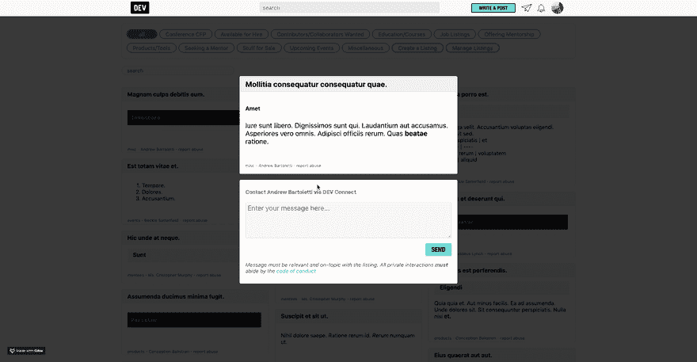](https://user-images.githubusercontent.com/13403332/60141613-0e208400-9784-11e9-8f68-c5e25b709877.gif)

## 添加到文档中？

*   [x]不需要文档

[View on GitHub](https://github.com/thepracticaldev/dev.to/pull/3306)

*   我修复了一个问题，组织仪表板错误地显示了一篇文章的删除按钮。

# [ 隐藏删除非作者文章按钮 #3315](https://github.com/thepracticaldev/dev.to/pull/3315) 

[](https://github.com/Zhao-Andy) **[Zhao-Andy](https://github.com/Zhao-Andy)** posted on [<time datetime="2019-06-26T19:03:05Z">Jun 26, 2019</time>](https://github.com/thepracticaldev/dev.to/pull/3315)

## 这是什么类型的公关？(勾选所有适用选项)

*   [x]错误修复

## 描述

这可以防止非作者(例如，组织管理员、开发管理员)看到仪表板和管理视图中的删除按钮。我们目前不允许组织管理员和开发管理员删除其他人的帖子；这个 PR 获取 UI 来匹配后端。

[View on GitHub](https://github.com/thepracticaldev/dev.to/pull/3315)

*   [@lightalloy](https://dev.to/lightalloy) 重构并优化了获取现有播客剧集的功能。谢谢安娜。

# [ 重构优化获取现有播客剧集 #3319](https://github.com/thepracticaldev/dev.to/pull/3319) 

[](https://github.com/lightalloy) **[lightalloy](https://github.com/lightalloy)** posted on [<time datetime="2019-06-27T12:34:03Z">Jun 27, 2019</time>](https://github.com/thepracticaldev/dev.to/pull/3319)

## 这是什么类型的公关？(勾选所有适用选项)

*   [x]重构
*   [x]错误修复

## 描述

*   优化查询以获得现有的播客剧集(在之前的 pr 中，[@押韵](https://dev.to/rhymes)建议)
*   增加了获取播客的规格
*   修正了`unique_website_url?`为假时的“未定义的方法#to_a”错误

## 相关车票&单据

#2952

[View on GitHub](https://github.com/thepracticaldev/dev.to/pull/3319)

*   [@brarnaudovski](https://dev.to/brarnaudovski) 更新了关于如何访问管理面板的文档(用于开发)。谢谢， [@brarnaudovski](https://dev.to/brarnaudovski) ！

# [ 管理面板文档更新，后端指令 #3323](https://github.com/thepracticaldev/dev.to/pull/3323) 

[](https://github.com/brarnaudovski) **[brarnaudovski](https://github.com/brarnaudovski)** posted on [<time datetime="2019-06-27T21:24:13Z">Jun 27, 2019</time>](https://github.com/thepracticaldev/dev.to/pull/3323)

## 这是什么类型的公关？(勾选所有适用选项)

*   [ ]重构
*   [ ]功能
*   [ ]错误修复
*   [x]文档更新

## 描述

根据管理策略，只有当`ApplicationPolicy#user_admin?`是`true`时，用户才能看到`/admin`页面。此方法的[定义](https://github.com/thepracticaldev/dev.to/blob/7ee0350ac525ede462d98d5af7d27b55246f0c50/app/policies/application_policy.rb#L67)要求用户拥有`:super_admin`角色，而不是文档中的管理员角色

## 相关车票&单据

相关[文件](https://docs.dev.to/backend/admin/)

## 添加到文档中？

*   [x]文档开发到
*   [ ]自述文件
*   [ ]不需要文档

[View on GitHub](https://github.com/thepracticaldev/dev.to/pull/3323)

*   [@bolariinwa](https://dev.to/bolariinwa) 更新了阅读列表标题，当阅读列表为空时显示`empty`而不是`0`。谢谢@bolariinwa！

# [ 当阅读列表为空时，使项目计数为‘空’而不是‘0’# 3320](https://github.com/thepracticaldev/dev.to/pull/3320)

[](https://github.com/bolariin) **[bolariin](https://github.com/bolariin)** posted on [<time datetime="2019-06-27T15:35:56Z">Jun 27, 2019</time>](https://github.com/thepracticaldev/dev.to/pull/3320)

## 这是什么类型的公关？(勾选所有适用选项)

*   [ ]重构
*   [ ]功能
*   [x]错误修复
*   [ ]文档更新

## 描述

我注意到当阅读列表为空时，阅读列表标题的计数显示为“0”。以保持边栏上的项目数一致。当阅读列表为空时，我将计数改为显示“空”。这在最初的采购申请中被错误地忽略了，因为增加了项目数量。

## 手机&桌面截图/录音(如有 UI 改动)

[](https://user-images.githubusercontent.com/24629960/60279714-92cbe900-98cf-11e9-9794-81258351975a.png)

## 添加到文档中？

*   [x]不需要文档

[View on GitHub](https://github.com/thepracticaldev/dev.to/pull/3320)

*   @maestromac 修复了一个奇怪的错误，当 cookies 被禁用时，网站的某些部分会显示不正确。谢谢你，麦克！

# [ 无 cookie 时禁用本地存储 #3322](https://github.com/thepracticaldev/dev.to/pull/3322) 

[](https://github.com/maestromac) **[maestromac](https://github.com/maestromac)** posted on [<time datetime="2019-06-27T20:46:20Z">Jun 27, 2019</time>](https://github.com/thepracticaldev/dev.to/pull/3322)

## 这是什么类型的公关？(勾选所有适用选项)

*   [x]重构
*   [x]错误修复

## 描述

如果 cookie 被禁用，我们对 localStorage 的使用将会破坏页面。

## 相关车票&单据

解析[https://github.com/thepracticaldev/dev.to/issues/3298](https://github.com/thepracticaldev/dev.to/issues/3298)

## 手机&桌面截图/录音(如有 UI 改动)

禁用 cookie[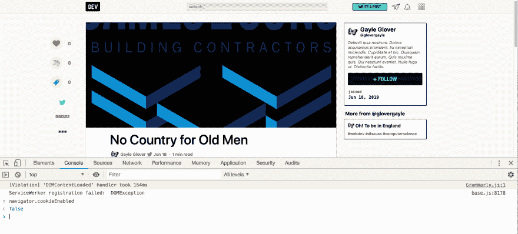](https://user-images.githubusercontent.com/15793250/60299569-046d5c80-98fb-11e9-8a1e-d2458d4aa172.png)

## 添加到文档中？

*   [x]不需要文档

[View on GitHub](https://github.com/thepracticaldev/dev.to/pull/3322)

## 新的问题和讨论

*   @rhymes 请求一个可以提及组织和用户的功能。谢谢，[@韵](https://dev.to/rhymes)！

# [ 在评论中提及组织 #3263](https://github.com/thepracticaldev/dev.to/issues/3263) 

[](https://github.com/rhymes) **[rhymes](https://github.com/rhymes)** posted on [<time datetime="2019-06-22T10:49:39Z">Jun 22, 2019</time>](https://github.com/thepracticaldev/dev.to/issues/3263)

**您的功能请求是否与某个问题相关？请描述一下。**

因为有可能在评论中提到用户，他们会收到通知，如果也能提到组织就更好了，也许组织的管理员会收到这样的通知。

**描述您想要的解决方案**

如果我在评论中键入@devteam 或任何其他组织，那么`@devteam`应该变成一个链接，就像我提到任何其他用户时一样，组织管理员应该会收到评论通知。

[View on GitHub](https://github.com/thepracticaldev/dev.to/issues/3263)

*   [@seangwright](https://dev.to/seangwright) 请求在您的仪表板中显示您帖子的创建时间和最后更新时间的时间戳。谢谢， [@seangwright](https://dev.to/seangwright) ！

# [ 添加【创建日期】和【修改日期】到文章仪表盘项 #3274](https://github.com/thepracticaldev/dev.to/issues/3274) 

[](https://github.com/seangwright) **[seangwright](https://github.com/seangwright)** posted on [<time datetime="2019-06-24T02:10:33Z">Jun 24, 2019</time>](https://github.com/thepracticaldev/dev.to/issues/3274)

**您的功能请求是否与某个问题相关？请描述一下。在任何给定的时间点，我通常会有几个正在进行的帖子的草稿。**

有时它们的发布顺序与我开始工作时不同，所以组织起来会变得很棘手。

**描述您想要的解决方案**将“发布日期”和“修改日期”添加到仪表板上的文章中。

[](https://user-images.githubusercontent.com/1382768/59986151-709e4680-9603-11e9-9ec6-d2157101718d.jpg)

或者...请允许我通过“草稿”和“已发布”进行过滤，这样我就可以很好地了解我的工作进展，而不依赖于我已完成和已发布的内容。

**描述你考虑过的替代方案**我认为目前还没有这方面的信息？

**附加内容**帖子周围有更多元数据，可能对作者有所帮助？这些日期似乎是一个不错的开始。

[View on GitHub](https://github.com/thepracticaldev/dev.to/issues/3274)

*   @michaeltharrington 报告了一个错误，评论的 Twitter 社交卡无法正常显示。谢谢你，迈克尔！

# [ 用于评论的推特社交卡无法正常显示 #3296](https://github.com/thepracticaldev/dev.to/issues/3296) 

[](https://github.com/michael-tharrington) **[michael-tharrington](https://github.com/michael-tharrington)** posted on [<time datetime="2019-06-24T13:38:37Z">Jun 24, 2019</time>](https://github.com/thepracticaldev/dev.to/issues/3296)

一名用户在解释中写道，当试图在 Twitter 上分享评论时，社交卡无法正常显示。他们提供了为什么会发生这种情况的原因。：

[](https://camo.githubusercontent.com/6aa03ce1e7363408166d580fd10c4a39f3c3c73c/68747470733a2f2f636c2e6c792f3839393635313466326363632f496d616765253230323031392d30362d32342532306174253230392e33352e3334253230414d2e706e67)

重复一遍:

1.  复制评论链接-[https://dev.to/codedgar/comment/c9fk](https://dev.to/codedgar/comment/c9fk)
2.  把它放进验钞机-[https://cards-dev.twitter.com/validator](https://cards-dev.twitter.com/validator)

[View on GitHub](https://github.com/thepracticaldev/dev.to/issues/3296)

*   [@douglasfugazi](https://dev.to/douglasfugazi) 请求了一个功能来取消关注您仪表板中的多个项目。谢谢， [@douglasfugazi](https://dev.to/douglasfugazi) ！

# [ 仪表盘上的批量取消关注按钮(跟随) #3305](https://github.com/thepracticaldev/dev.to/issues/3305) 

[](https://github.com/fugazi) **[fugazi](https://github.com/fugazi)** posted on [<time datetime="2019-06-25T19:06:14Z">Jun 25, 2019</time>](https://github.com/thepracticaldev/dev.to/issues/3305)

**您的功能请求是否与某个问题相关？请描述一下。**

I would like a button to unfollow user from Dashboard in the Following section.

**描述您想要的解决方案**

取消关注按钮将向用户显示，以便从仪表板中批量取消关注，而不是访问每个配置文件并取消选中以下功能。[](https://camo.githubusercontent.com/a2dbce2a779209fd57727d5997b8d26108c4fdaa/687474703a2f2f6936382e74696e797069632e636f6d2f6c63716f352e6a7067)

**描述你考虑过的替代方案**

Mass unfollow from Dashboard would be nice.

**附加上下文**

[View on GitHub](https://github.com/thepracticaldev/dev.to/issues/3305)

*   @protium 报告了一个图片上传对话框与编辑器和帮助页面重叠的错误。谢谢， [@protium](https://dev.to/protium) ！

# [ 图片上传对话框重叠编辑/帮助页面 #3316](https://github.com/thepracticaldev/dev.to/issues/3316) 

[](https://github.com/protium-dev) **[protium-dev](https://github.com/protium-dev)** posted on [<time datetime="2019-06-27T02:08:09Z">Jun 27, 2019</time>](https://github.com/thepracticaldev/dev.to/issues/3316)

**描述错误**当我点击“上传图片”时，上传对话框出现，但如果我点击“预览”或“？”按钮，它会停留并重叠预览，如下图所示。

**要重现**点击“上传图像”，然后点击“预览”或“？”按钮。

**预期行为**上传对话框应该关闭

**截图** [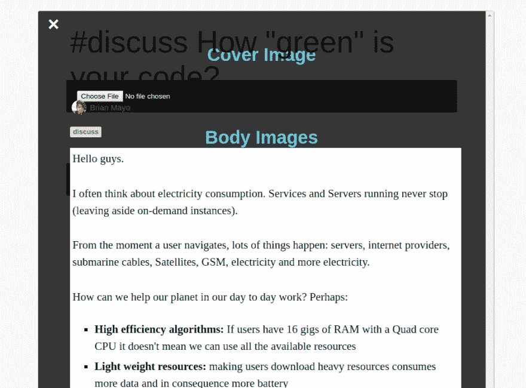 ](https://user-images.githubusercontent.com/43855513/60227782-ef46ee00-9866-11e9-9c5a-fd127d79fd5e.png) [ 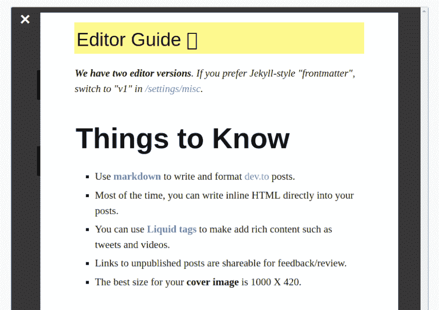](https://user-images.githubusercontent.com/43855513/60227791-f7069280-9866-11e9-95f6-309de52d79d5.png)

**桌面(请填写以下信息):**

*   操作系统:Arch Linux x64
*   浏览器:铬
*   版本:75

**附加背景**移动领域的相同和最差

[View on GitHub](https://github.com/thepracticaldev/dev.to/issues/3316)

*   [@ felipperazio](https://dev.to/felipperegazio)报告了一个移动设备的视觉错误，当键盘处于活动状态时，底部面板与编辑器文本区域重叠。谢谢，[@ felipperagazio](https://dev.to/felipperegazio)！

# [ 移动:键盘活动时底部面板重叠编辑器文本区 #3324](https://github.com/thepracticaldev/dev.to/issues/3324) 

[](https://github.com/felippe-regazio) **[felippe-regazio](https://github.com/felippe-regazio)** posted on [<time datetime="2019-06-27T22:39:33Z">Jun 27, 2019</time>](https://github.com/thepracticaldev/dev.to/issues/3324)

简单的问题，认为图像说明了一切

[](https://user-images.githubusercontent.com/31618881/60305444-ed3a6900-9912-11e9-8793-0b08733df144.png)

如图所示，当键盘处于活动状态时，内部视图变得非常小。

[View on GitHub](https://github.com/thepracticaldev/dev.to/issues/3324)

*   [@georgecoldham](https://dev.to/georgecoldham) 请求了一个无需打开帖子即可报告帖子的功能。谢谢， [@georgecoldham](https://dev.to/georgecoldham) ！

# [ 无需打开即可报告文章 #3329](https://github.com/thepracticaldev/dev.to/issues/3329) 

[](https://github.com/GeorgeColdham) **[GeorgeColdham](https://github.com/GeorgeColdham)** posted on [<time datetime="2019-06-28T13:19:30Z">Jun 28, 2019</time>](https://github.com/thepracticaldev/dev.to/issues/3329)

**您的功能请求是否与某个问题相关？请描述一下。**浏览新文章时，有些文章明显违反了社区准则。其中许多是 NSFW，因此在工作中浏览时，它们不会被打开和报告。

**描述您想要的解决方案**我希望能够从提要中报告文章，而不是必须打开文章。

**描述你考虑过的替代方案**从 feed 中隐藏文章的选项，尽管这并不能解决根本问题。

**附加语境**举例内容: [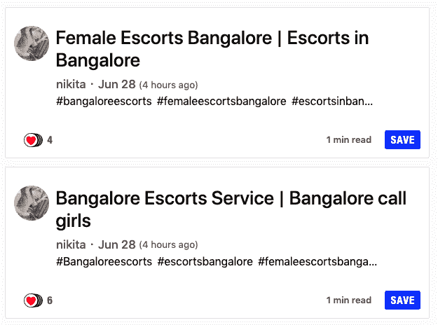](https://user-images.githubusercontent.com/21260083/60344946-b6666080-99af-11e9-8689-183f0791b8c9.png)

[View on GitHub](https://github.com/thepracticaldev/dev.to/issues/3329)

*   [@dylanesque](https://dev.to/dylanesque) 报告了一个错误，每当输入一个字符时，垂直滚动条就会打开和关闭。谢谢， [@dylanesque](https://dev.to/dylanesque) ！

# [ 垂直滚动条随着输入的每隔一个字符切换打开和关闭 #3330](https://github.com/thepracticaldev/dev.to/issues/3330) 

[](https://github.com/dylanesque) **[dylanesque](https://github.com/dylanesque)** posted on [<time datetime="2019-06-28T13:34:46Z">Jun 28, 2019</time>](https://github.com/thepracticaldev/dev.to/issues/3330)

**描述错误**当在文档的 post 编辑器中输入足够长的文本，需要垂直滚动条时(大约在第 21 行左右)，滚动条随着每个输入的字符切换打开和关闭(更确切地说，出现和消失)，导致编写时令人讨厌的页面跳转。

**要重现**如上所述编辑一个 x 长度的文档，查看其行为。

**预期行为**预期行为是垂直滚动条在需要时出现并停留在那里。

**桌面(请填写以下信息):**

*   操作系统:Windows 10 (64 位)
*   浏览器:谷歌浏览器
*   版本:75.03

[View on GitHub](https://github.com/thepracticaldev/dev.to/issues/3330)

*   [@cbrintnall](https://dev.to/cbrintnall) 报告了一个错误，一行代码块在评论预览中溢出。谢谢， [@cbrintnall](https://dev.to/cbrintnall) ！

# [ 代码块溢出预览 #3331](https://github.com/thepracticaldev/dev.to/issues/3331) 

[](https://github.com/cbrintnall) **[cbrintnall](https://github.com/cbrintnall)** posted on [<time datetime="2019-06-28T15:34:02Z">Jun 28, 2019</time>](https://github.com/thepracticaldev/dev.to/issues/3331)

**描述 bug**

在“代码”片段中包含较长的文本(单引号``)会导致它在预览模式下溢出输入框。

**重现**

这里有一个我用过的链接:`https://docs.python.org/3/library/functools.html#functools.lru_cache`

用`[https://docs . python . org/3/library/func tools . html # func tools . LRU _ cache `](https://docs.python.org/3/library/functools.html#functools.lru_cache%60)在文本框中输入，然后预览，应该会溢出。作为参考，我用的是 4k 显示器，所以可能会有影响。

**预期行为**

这个块应该换到下一行。

**截图**

[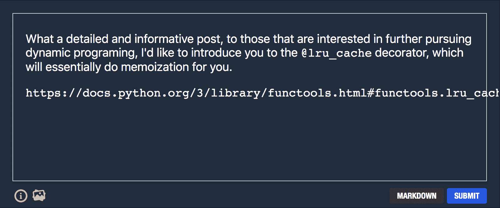](https://camo.githubusercontent.com/970dc226713f8a75f674e4c4b06952cf9fe09dd9/68747470733a2f2f692e696d6775722e636f6d2f4a4a36336e504f2e706e67)

[View on GitHub](https://github.com/thepracticaldev/dev.to/issues/3331)

*   [@thefliik](https://dev.to/thefliik) 开启了一个关于查看单个评论时如何表示评论上下文的讨论。谢谢， [@thefliik](https://dev.to/thefliik) ！

# [ 特色:改进评论链接 UX  #3332](https://github.com/thepracticaldev/dev.to/issues/3332) 

[](https://github.com/thefliik) **[thefliik](https://github.com/thefliik)** posted on [<time datetime="2019-06-28T16:39:37Z">Jun 28, 2019</time>](https://github.com/thepracticaldev/dev.to/issues/3332)

**您的功能请求是否与某个问题相关？请描述一下。**

当你点击 DEV.to 中的一个评论链接时，你会被带到一个单独显示那个评论的页面(这里的[例子是](https://dev.to/ben/comment/329n))。对我来说，以及对我调查过的其他几个人来说，评论本质上是有语境的。我从来没有发现孤立地查看评论是可取的( [ben 自己也表达了类似的感受](https://dev.to/ben/comment/329n))。当点击评论链接时，我的工作流程总是“点击评论链接>点击`VIEW POST` >返回评论”。

简而言之，我发现当前将 UX 联系起来的评论很差，这是一个修复它的请求。

如果有疑问，我想你可以通过亲自调查 DEV.to users 来获得更多关于当前 UX 的反馈。

**描述您想要的解决方案**

我敢肯定，你可能会喜欢修复 UX(我对此没有意见)，但是，为了解决这个问题，需要做的就是更新 UX，使其与大多数网站保持一致:通过锚标签提供评论链接，这样浏览器就可以显示完整页面并滚动到相关部分(非常直观)。例如，这是 github 拥有的 UX。

### 感谢！！！

**描述你考虑过的替代方案**

我不致力于特定的解决方案，只是不是当前的设置。

**附加上下文**

[https://dev . to/John Carroll/poll-why-clicking-a-dev-comment-link-display-the-comment-in-isolation-2k5n](https://dev.to/johncarroll/poll-why-does-clicking-a-dev-comment-link-display-the-comment-in-isolation-2k5n)

[View on GitHub](https://github.com/thepracticaldev/dev.to/issues/3332)

# 开发-iOS

我们本周在 iOS 回购方面没有太多活动。随意[提问题](https://github.com/thepracticaldev/dev-ios/issues/new)，[看代码库](https://github.com/thepracticaldev/dev-ios)，或者[提拉请求](https://github.com/thepracticaldev/dev-ios/pulls)！

# DEV-Android

我们本周在 Android 回购方面也没有太多活动。随意[提问题](https://github.com/thepracticaldev/dev-android/issues/new)，[看代码库](https://github.com/thepracticaldev/dev-android)，或者[提拉请求](https://github.com/thepracticaldev/dev-android/pulls)！

这星期到此为止！敬请关注下周的版本。**