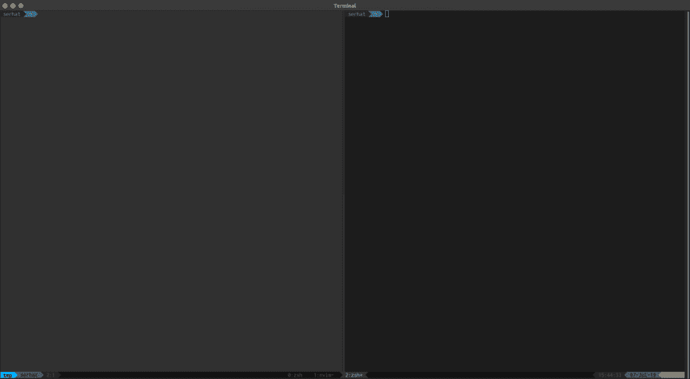

# Tmux 活动窗格焦点

> 原文：<https://dev.to/serhatteker/tmux-active-pane-focus-3h41>

在这篇文章中，我将展示如何为`tmux`的活动和非活动窗格设置窗格颜色。因此，您可以轻松区分活动面板和焦点，如下所示:

[](https://res.cloudinary.com/practicaldev/image/fetch/s---RDO3pzY--/c_limit%2Cf_auto%2Cfl_progressive%2Cq_auto%2Cw_880/https://tech.serhatteker.com/img/tmux-focus.png)

上图显示了非活动窗格是如何略微变灰的，而活动窗格的边框是蓝色的。

## 活动-非活动窗格颜色配置

下面的颜色设置是为那些喜欢深色背景的人准备的。如果你使用**灯光**背景，那么你需要相应地改变颜色。

或者如果你有任何其他偏好，请点击这里`x-term` **256 色**图表可以在这个[维基媒体页面](https://upload.wikimedia.org/wikipedia/commons/1/15/Xterm_256color_chart.svg)找到。

下面的代码块设置活动-非活动窗格的颜色，以及窗格的边框。区分活动-非活动窗格背景的能力是`tmux 2.1`的一个特性。所以请确保你用的是`tmux version >= 2.1`。要检查这个用法:

```
$ tmux -V 
```

Enter fullscreen mode Exit fullscreen mode

如果可以，则将以下内容添加到您的`.tmux.conf` :

```
#-------------------------------------------------------#
# Pane colours
#-------------------------------------------------------#
# set active-inactive window styles
set -g window-style 'fg=colour247,bg=colour236'
set -g window-active-style 'fg=default,bg=colour234'

# Pane border
set -g pane-border-bg default
set -g pane-border-fg colour238

# Active pane border
set -g pane-active-border-bg default
set -g pane-active-border-fg blue
#-------------------------------------------------------#
#
#-------------------------------------------------------# 
```

Enter fullscreen mode Exit fullscreen mode

然后将您的`.tmux.conf`文件作为源文件。

```
$ tmux source-file ~/.tmux.conf 
```

Enter fullscreen mode Exit fullscreen mode

如果你像我一样喜欢使用常用命令的`keybindings`，那么把这个`keybinding`添加到你的`.tmux.conf`文件中，以获得你的 tmux 配置:

```
# reload tmux config
bind R source-file ~/.tmux.conf \; display-message "Tmux config file reloaded." 
```

Enter fullscreen mode Exit fullscreen mode

完成了。

为了将活动-非活动窗口样式也应用到`Vim`窗格，请检查这个: [post](https://dev.to/serhatteker/tmux-vim-active-pane-focus-5378)