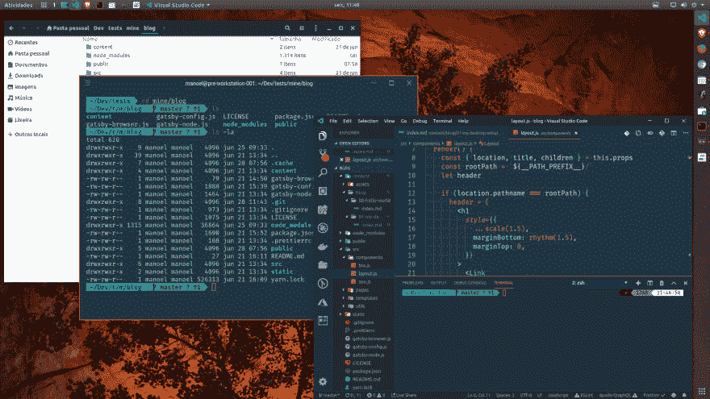
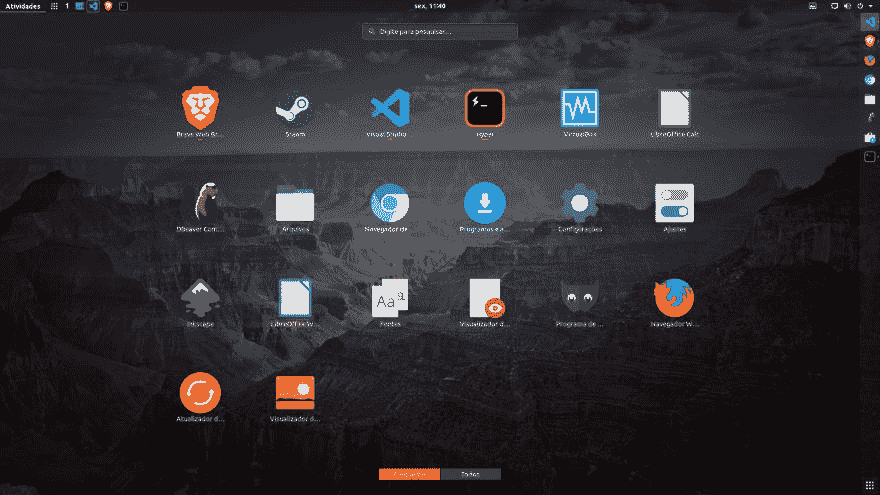

# 我的桌面设置-第 1 部分

> 原文：<https://dev.to/manoeltlobo/my-desktop-setup-part-1-bn1>

自 2012 年以来，我花了大量时间(至少周一到周五，8 个多小时)用 Ubuntu Linux 工作站编程。几年前，我开始调整一个设置，我认为它看起来很好，并尽可能减少眼睛疲劳。

(我之前的设置是在 GitHub 库中注册的，但是从那以后我改变了它，所以现在有了新的外观！)

[](https://res.cloudinary.com/practicaldev/image/fetch/s--d-5l3oP3--/c_limit%2Cf_auto%2Cfl_progressive%2Cq_auto%2Cw_880/https://thepracticaldev.s3.amazonaws.com/i/khagld5fgjupfxtdb4lw.png)

[](https://res.cloudinary.com/practicaldev/image/fetch/s--lSkWjiAD--/c_limit%2Cf_auto%2Cfl_progressive%2Cq_auto%2Cw_880/https://thepracticaldev.s3.amazonaws.com/i/pq2sclp9lsqn7ezek4rb.png)

这个探索的第一步是找到一个我可以长期使用的编辑器，没有太多的干扰，一个轻便快捷的编辑器，但功能足够强大，我不必依赖许多其他工具来完成工作。ide(如 [Eclipse](https://www.eclipse.org/downloads/) 和 [NetBeans](https://netbeans.org/) )非常强大，但是需要很长时间来初始化，并且有很多视觉混乱。所以，我传给了‘轻量级’编辑器:[崇高文本](https://www.sublimetext.com/)、[原子](https://atom.io/)和 [Visual Studio 代码](https://code.visualstudio.com/)。它们各有所长，但我还是选择了 VSCode，原因有几个:从一开始就集成了终端、持续的开发、良好的扩展支持、良好的功能性界面，以及相对的成熟度让我选择了它作为我的编辑器。

除了助手扩展，我还寻找了一个适合一整天的主题。经历了一些不错的基于材料的主题和图标。但我真的很喜欢韦斯·博斯的《钴 2》主题《T1》，以及最近莎拉·德拉斯纳的《t2》中的《夜猫子》。

我还采用了几个噱头的 zsh shell，即 Oh My Zsh 框架和 powerlevel9k 主题；还有 Fura Code 和 Space Mono 字体，由 Ryan Oasis 的 [Nerd 字体](https://nerdfonts.com)进行了修补，以符合类似 PowerShell 的终端装饰。

与此同时，我测试了 Ubuntu 桌面的许多变体(Unity、Kubuntu、Lubuntu、Mate)。最后，我决定使用默认的 Gnome 外壳，加上萨姆·休伊特的 [Adapta GTK 主题](https://github.com/adapta-project/adapta-gtk-theme)和[纸图标](https://snwh.org/paper)。

由于这是一个很长的清单，我认为最好分成几篇文章，而不是创建一个巨大的，令人厌倦的清单。这主要是提醒我自己，万一我不得不重新配置我的桌面，我必须做什么步骤。如果你感兴趣，并想尝试一些/全部我的定制设置，请自便！

对于这第一部分，Ubuntu！

## 配置操作系统

我使用 Ubuntu 的默认发行版，但是根据我的喜好做了一些调整。为此，我使用 Tweaks 工具来选择下一个要安装的主题和图标(如果还没有安装的话，`sudo apt install gnome-tweaks`)

### Adapta GTK 主题

在安装之前，需要将存储库添加到系统源列表:

```
$ sudo add-apt-repository ppa:tista/adapta
$ sudo apt update
$ sudo apt install adapta-gtk-theme 
```

### 纸张图标

同样，添加纸质项目回购:

```
$ sudo add-apt-repository ppa:snwh/pulp
$ sudo apt update
$ sudo apt install paper-icon-theme 
```

### 激活全部

使用命令`gnome-tweaks`从应用程序列表或终端打开调整工具。在*外观*选项卡中，从 GTK+下拉菜单中选择*适配器*(或变体)，从*图标*中选择*纸张*。完成，你就主题化了(好吧，你还需要重启会话)。

* * *

希望这第一部分对某人有用(至少对未来的我有用！).下一篇文章再见！

> 这篇文章最初发表在我的个人博客上， [manoel.tech](https://manoel.tech)