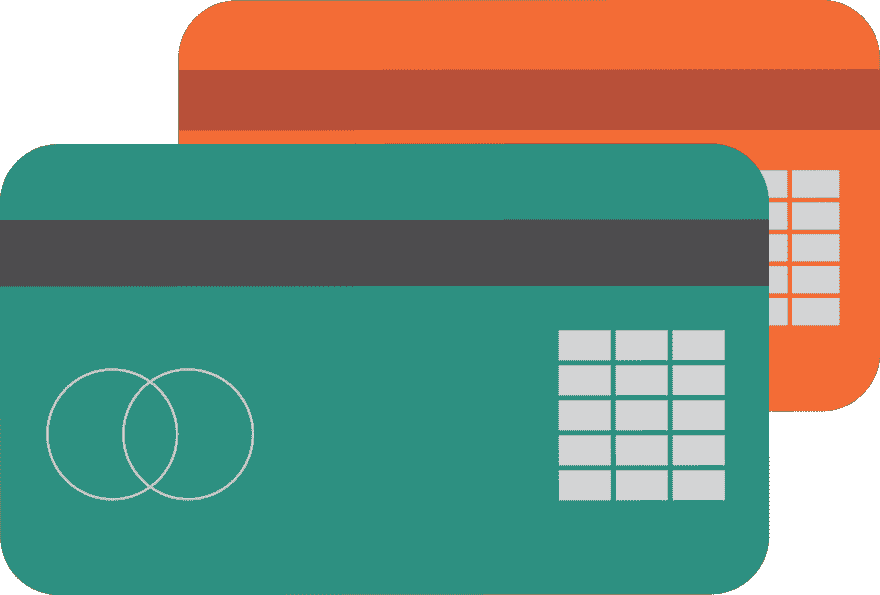

# 没有密码管理器，你就无法在 2019 年运行

> 原文：<https://dev.to/wagslane/you-can-t-function-in-2019-without-a-password-manager-de7>

秘密。你有很多。我不是说把真相延伸到第一次约会的兴趣和爱好，或者作为一个四十岁的男人喜欢我的小马。我说的是**数字机密**。密码、社会安全号码、pin 码、加密货币密钥、信用卡和银行账号定义了我们的在线角色和财务。

## 密码

密码和 2FA 码是我们在网上证明自己身份的方式。它们让我们能够拥有自己的账户，而无需他人冒充我们。

据《数字卫报》报道，在一项研究中，61%的受访用户承认在多个网站上使用同一个密码。这是**让你所有账户被黑的最危险的方法**。只需要一个恶意或低安全性的网站就能让一对**电子邮件/密码泄露**。然后黑客们可以在脸书、推特、Gmail、股票经纪人、涡轮税上自由尝试这种组合。你明白了。

使用免费和[开源的](https://www.howtogeek.com/129967/htg-explains-what-is-open-source-software-and-why-you-should-care/) [密码管理器](https://qvault.io)**为你使用的每个网站生成随机和强密码**，软件会负责加密这些密码，并保持它们的安全和可访问性。

写下密码是不好的做法。纸让同事或路人很容易偷看。纸张也很容易损坏和丢失，在 2019 年，我们都必须有许多密码才能在便利贴上进行现实管理。

## 财务

我们都努力工作，以确保我们有足够的钱度过难关。很少有什么比从我们和我们的家庭手中夺走这些东西更具毁灭性的了。不可挽回的损失可以通过**盗窃银行账号**、信用卡或借记卡号、venmo 账户等来实现。

如果你碰巧拥有任何像比特币或以太坊这样的数字货币，损失就像盗窃一样具有毁灭性。使用一个[开源](https://www.howtogeek.com/129967/htg-explains-what-is-open-source-software-and-why-you-should-care/) [密码管理器](https://qvault.io)是一个很好的方法来确保没有人可以恶意访问你的财务信息。

把这些锁起来:

*   银行账号
*   加密种子和密钥
*   2FA 种子
*   信用卡和借记卡信息
*   秘密问题/答案
*   经纪信息
*   税捐识别码(SSN，开)

## 身份

身份被盗可不是闹着玩的。据[ssa.gov](http://ssa.gov):

> 一个不诚实的人有了你的社会安全号码，就可以用它来获取你的其他个人信息。身份窃贼可以使用你的号码和你的良好信用，以你的名义申请更多的信用。然后，他们使用信用卡，不支付账单，这损害了你的信用。
> 
> <cite>ssa.gov</cite>

**不要将任何身份信息存储在您电脑上的 word 文档中，也不要存储在便利贴上。同样，在一个[安全和私人密码管理解决方案](https://qvault.io)中加密所有这些信息。**

有助于在密码管理器中保持安全和可用的身份信息示例:

*   社会保险号
*   护照号码和有效期
*   驾照号码、发放和到期
*   儿童和家庭成员身份证
*   保险信息

感谢您的阅读，祝您在互联网上保持安全！

来源:

[https://qvault.io](https://qvault.io)

[https://github.com/q-vault/qvault](https://github.com/q-vault/qvault)

[https://www . how togeek . com/129967/htg-explains-什么是开源软件以及你为什么应该关心/](https://www.howtogeek.com/129967/htg-explains-what-is-open-source-software-and-why-you-should-care/)

[https://digital guardian . com/blog/uncovering-password-habits-is-users-password-security-habits-improving-infograph](https://digitalguardian.com/blog/uncovering-password-habits-are-users-password-security-habits-improving-infographic)

[https://www.ssa.gov/pubs/EN-05-10064.pdf](https://www.ssa.gov/pubs/EN-05-10064.pdf)

[https://www . wired . com/2016/03/want-safer-passwords-don-change-勤/](https://www.wired.com/2016/03/want-safer-passwords-dont-change-often/)

跟着我们走！[https://medium.com/qvault](https://medium.com/qvault)

莱恩·瓦格纳