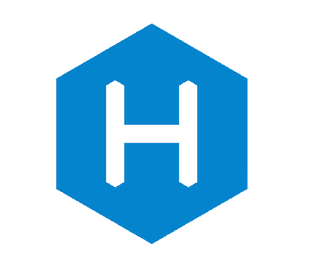
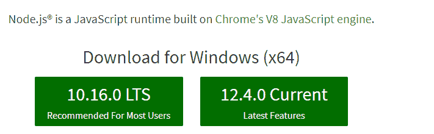
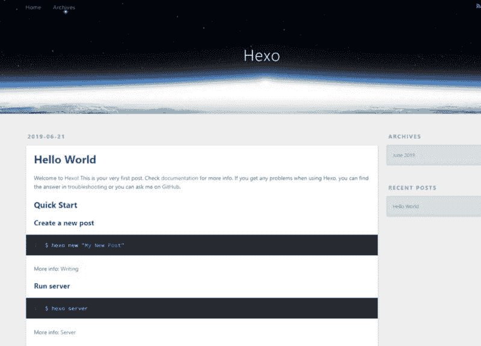
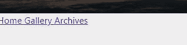

# 使用 Hexo 在 nodejs 中创建博客

> 原文：<https://dev.to/rabehasy/create-a-blog-in-nodejs-using-hexo-l9n>

[](https://res.cloudinary.com/practicaldev/image/fetch/s--ZgjgNl2_--/c_limit%2Cf_auto%2Cfl_progressive%2Cq_auto%2Cw_880/https://miaryrabs.madatsara.cimg/nodejs-blog-powered-hexo_images/39572d5d.png)

**[Hexo](https://hexo.io)** 是一个用 nodejs 构建的框架，可以快速方便地创建博客。像 wordpress 或其他博客平台一样，文章和内容不是存储在数据库中，而是以用 [markdown](https://daringfireball.net/projects/markdown/) 语言编写的文件形式存储。这些降价文件将被编译成 html 文件。

像任何应用程序节点一样，有几个命令可以创建页面、文章、类别、生成静态文件、部署在服务器上:

*   饭桶
*   heroku
*   netlify
*   rsyncSFTP
*   SFTP。

如果你想改变平台，比如从 wordpress，Jekyll，octopress，joomla 到 Hexo 或者导入一个 rss 流，这也是可能的。

# 安装

## 先决条件

如果还没有安装 nodejs，让我们安装它。

*   nodejs

如果还没有完成，安装非常简单。在 Windows 上，去 sur[https://nodejs.org/en/](https://nodejs.org/en/)下载安装程序。

[](https://res.cloudinary.com/practicaldev/image/fetch/s--Fb_qJiWT--/c_limit%2Cf_auto%2Cfl_progressive%2Cq_auto%2Cw_880/https://miaryrabs.madatsara.cimg/nodejs-blog-powered-hexo_images/bbb6e3ea.png)

然后，我们通过在控制台中键入以下命令来检查正确的节点安装:

```
node -v
v12.4.0 
```

<svg width="20px" height="20px" viewBox="0 0 24 24" class="highlight-action crayons-icon highlight-action--fullscreen-on"><title>Enter fullscreen mode</title></svg> <svg width="20px" height="20px" viewBox="0 0 24 24" class="highlight-action crayons-icon highlight-action--fullscreen-off"><title>Exit fullscreen mode</title></svg>

## 安装 Hexo

我们在全球
安装 **hexo-cli**

```
npm i hexo-cli -g 
```

<svg width="20px" height="20px" viewBox="0 0 24 24" class="highlight-action crayons-icon highlight-action--fullscreen-on"><title>Enter fullscreen mode</title></svg> <svg width="20px" height="20px" viewBox="0 0 24 24" class="highlight-action crayons-icon highlight-action--fullscreen-off"><title>Exit fullscreen mode</title></svg>

从控制台返回

```
+ hexo-cli@2.0.0 
```

<svg width="20px" height="20px" viewBox="0 0 24 24" class="highlight-action crayons-icon highlight-action--fullscreen-on"><title>Enter fullscreen mode</title></svg> <svg width="20px" height="20px" viewBox="0 0 24 24" class="highlight-action crayons-icon highlight-action--fullscreen-off"><title>Exit fullscreen mode</title></svg>

在 blognodejs 文件夹中创建一个 Hexo 应用程序

```
hexo init blognodejs 
```

<svg width="20px" height="20px" viewBox="0 0 24 24" class="highlight-action crayons-icon highlight-action--fullscreen-on"><title>Enter fullscreen mode</title></svg> <svg width="20px" height="20px" viewBox="0 0 24 24" class="highlight-action crayons-icon highlight-action--fullscreen-off"><title>Exit fullscreen mode</title></svg>

我们进入这个文件夹并设置依赖关系。

```
cd blognodejs/
npm install 
```

<svg width="20px" height="20px" viewBox="0 0 24 24" class="highlight-action crayons-icon highlight-action--fullscreen-on"><title>Enter fullscreen mode</title></svg> <svg width="20px" height="20px" viewBox="0 0 24 24" class="highlight-action crayons-icon highlight-action--fullscreen-off"><title>Exit fullscreen mode</title></svg>

我们希望立即生成静态文件(。html、css、javascript)放在公共文件夹中。该文件夹的内容需要在 FTP 空间中发送，以便通过 URL 访问该博客。只需运行这个命令。

```
hexo generate 
```

<svg width="20px" height="20px" viewBox="0 0 24 24" class="highlight-action crayons-icon highlight-action--fullscreen-on"><title>Enter fullscreen mode</title></svg> <svg width="20px" height="20px" viewBox="0 0 24 24" class="highlight-action crayons-icon highlight-action--fullscreen-off"><title>Exit fullscreen mode</title></svg>

如果我们想自动生成。创建/修改后的 html 文件——我们添加参数——观察

```
hexo generate --watch 
```

<svg width="20px" height="20px" viewBox="0 0 24 24" class="highlight-action crayons-icon highlight-action--fullscreen-on"><title>Enter fullscreen mode</title></svg> <svg width="20px" height="20px" viewBox="0 0 24 24" class="highlight-action crayons-icon highlight-action--fullscreen-off"><title>Exit fullscreen mode</title></svg>

在将博客部署到生产服务器之前，让我们首先观察本地呈现。

Hexo 有一个服务器可以让我们很容易地看到这一点。你要做的就是跑:

```
hexo server --draft --open 
```

<svg width="20px" height="20px" viewBox="0 0 24 24" class="highlight-action crayons-icon highlight-action--fullscreen-on"><title>Enter fullscreen mode</title></svg> <svg width="20px" height="20px" viewBox="0 0 24 24" class="highlight-action crayons-icon highlight-action--fullscreen-off"><title>Exit fullscreen mode</title></svg>

该参数是:

*   **-草稿**允许显示草稿(因为它们默认是隐藏的)
*   **-打开**启动浏览器，当服务器准备就绪后打开 [http://localhost:4000](http://localhost:4000)

如果 4000 端口已经被另一个实例使用，您可以通过像这样传递-p 参数来选择另一个端口

```
hexo server -p 4500
INFO  Start processing                                                          
INFO  Hexo is running at http://localhost:4500 . Press Ctrl+C to stop. 
```

<svg width="20px" height="20px" viewBox="0 0 24 24" class="highlight-action crayons-icon highlight-action--fullscreen-on"><title>Enter fullscreen mode</title></svg> <svg width="20px" height="20px" viewBox="0 0 24 24" class="highlight-action crayons-icon highlight-action--fullscreen-off"><title>Exit fullscreen mode</title></svg>

查看现有 URL 的列表。

```
hexo list page 
```

<svg width="20px" height="20px" viewBox="0 0 24 24" class="highlight-action crayons-icon highlight-action--fullscreen-on"><title>Enter fullscreen mode</title></svg> <svg width="20px" height="20px" viewBox="0 0 24 24" class="highlight-action crayons-icon highlight-action--fullscreen-off"><title>Exit fullscreen mode</title></svg>

以下是该订单的退货单

```
INFO  Start processing                                                          
Date        Title          Path                                                 
2019-06-21  About me       about/me.md                                          
2019-06-21  Bonjour        bonjour.md                                           
2019-06-21  Bonjour Miary  hello/miary.md 
```

<svg width="20px" height="20px" viewBox="0 0 24 24" class="highlight-action crayons-icon highlight-action--fullscreen-on"><title>Enter fullscreen mode</title></svg> <svg width="20px" height="20px" viewBox="0 0 24 24" class="highlight-action crayons-icon highlight-action--fullscreen-off"><title>Exit fullscreen mode</title></svg>

## 有点偷窥博客。

[](https://res.cloudinary.com/practicaldev/image/fetch/s--G4Og80Kd--/c_limit%2Cf_auto%2Cfl_progressive%2Cq_auto%2Cw_880/https://miaryrabs.madatsara.cimg/nodejs-blog-powered-hexo_images/ee6dec68.jpeg)

我们现在想在博客的所有页面上显示一个动态菜单。

让我们创建一个案例文件。

```
mkdir -p source/_data 
```

<svg width="20px" height="20px" viewBox="0 0 24 24" class="highlight-action crayons-icon highlight-action--fullscreen-on"><title>Enter fullscreen mode</title></svg> <svg width="20px" height="20px" viewBox="0 0 24 24" class="highlight-action crayons-icon highlight-action--fullscreen-off"><title>Exit fullscreen mode</title></svg>

让我们向该文件夹添加一个 menu.yml 文件。

```
touch source/_data/menu.yml 
```

<svg width="20px" height="20px" viewBox="0 0 24 24" class="highlight-action crayons-icon highlight-action--fullscreen-on"><title>Enter fullscreen mode</title></svg> <svg width="20px" height="20px" viewBox="0 0 24 24" class="highlight-action crayons-icon highlight-action--fullscreen-off"><title>Exit fullscreen mode</title></svg>

其中将包含以下代码。

```
Accueil: /
Photos: /photos/
Articles: /archives/ 
```

<svg width="20px" height="20px" viewBox="0 0 24 24" class="highlight-action crayons-icon highlight-action--fullscreen-on"><title>Enter fullscreen mode</title></svg> <svg width="20px" height="20px" viewBox="0 0 24 24" class="highlight-action crayons-icon highlight-action--fullscreen-off"><title>Exit fullscreen mode</title></svg>

*   (在“:”的左边):菜单标题
*   右(来自":"):目标 URL

在所有页面上显示这些菜单。为此，修改/themes/landscape/layout/_ partial/header . ejs 并添加

```
<% for (var link in site.data.menu) { %>
<a href="<%= site.data.menu[link] %>"> <%= link %> </a>
<% } %> 
```

<svg width="20px" height="20px" viewBox="0 0 24 24" class="highlight-action crayons-icon highlight-action--fullscreen-on"><title>Enter fullscreen mode</title></svg> <svg width="20px" height="20px" viewBox="0 0 24 24" class="highlight-action crayons-icon highlight-action--fullscreen-off"><title>Exit fullscreen mode</title></svg>

这是结果

[](https://res.cloudinary.com/practicaldev/image/fetch/s--ogQxAePK--/c_limit%2Cf_auto%2Cfl_progressive%2Cq_auto%2Cw_880/https://miaryrabs.madatsara.cimg/nodejs-blog-powered-hexo_images/725e755a.jpeg)

### 插件

* * *

和 wordpress 一样，Hexo 可以安装[插件](https://hexo.io/plugins/)来增加我们需要的有用特性。

我们首先需要以下插件:

*   hexo-browsersync
*   hexo-lazyload-image 影像
*   hexo-wordcount

### 六边形浏览器同步

因为我们不想在每次做出更改时都刷新页面，所以我们让浏览器来做。我们需要安装下一个软件包。

```
npm install hexo-browsersync --save 
```

<svg width="20px" height="20px" viewBox="0 0 24 24" class="highlight-action crayons-icon highlight-action--fullscreen-on"><title>Enter fullscreen mode</title></svg> <svg width="20px" height="20px" viewBox="0 0 24 24" class="highlight-action crayons-icon highlight-action--fullscreen-off"><title>Exit fullscreen mode</title></svg>

通过执行( **CTRL+C** )再次停止服务器，然后通过下面的命令再次运行它:

```
hexo server 
```

<svg width="20px" height="20px" viewBox="0 0 24 24" class="highlight-action crayons-icon highlight-action--fullscreen-on"><title>Enter fullscreen mode</title></svg> <svg width="20px" height="20px" viewBox="0 0 24 24" class="highlight-action crayons-icon highlight-action--fullscreen-off"><title>Exit fullscreen mode</title></svg>

## hexo-lazyload-image

允许在实际显示图像之前显示加载图标。

我们安装

```
npm install hexo-lazyload-image --save 
```

<svg width="20px" height="20px" viewBox="0 0 24 24" class="highlight-action crayons-icon highlight-action--fullscreen-on"><title>Enter fullscreen mode</title></svg> <svg width="20px" height="20px" viewBox="0 0 24 24" class="highlight-action crayons-icon highlight-action--fullscreen-off"><title>Exit fullscreen mode</title></svg>

在/_config.yml 文件中，添加插件参数

```
lazyload:
  enable: true
  onlypost: false
  loadingImg: # egimg/loading.gif 
```

<svg width="20px" height="20px" viewBox="0 0 24 24" class="highlight-action crayons-icon highlight-action--fullscreen-on"><title>Enter fullscreen mode</title></svg> <svg width="20px" height="20px" viewBox="0 0 24 24" class="highlight-action crayons-icon highlight-action--fullscreen-off"><title>Exit fullscreen mode</title></svg>

通过执行( **CTRL+C** )再次停止服务器，然后通过下面的命令再次运行它:

```
hexo server 
```

<svg width="20px" height="20px" viewBox="0 0 24 24" class="highlight-action crayons-icon highlight-action--fullscreen-on"><title>Enter fullscreen mode</title></svg> <svg width="20px" height="20px" viewBox="0 0 24 24" class="highlight-action crayons-icon highlight-action--fullscreen-off"><title>Exit fullscreen mode</title></svg>

在显示图像之前，会出现一个加载图标。

[](https://res.cloudinary.com/practicaldev/image/fetch/s--8UIpzS81--/c_limit%2Cf_auto%2Cfl_progressive%2Cq_66%2Cw_880/https://miaryrabs.madatsara.cimg/loader.gif)

## hexo-字数

允许添加有用的信息，例如字数，预计阅读时间。

我们安装

```
npm install hexo-wordcount --save 
```

<svg width="20px" height="20px" viewBox="0 0 24 24" class="highlight-action crayons-icon highlight-action--fullscreen-on"><title>Enter fullscreen mode</title></svg> <svg width="20px" height="20px" viewBox="0 0 24 24" class="highlight-action crayons-icon highlight-action--fullscreen-off"><title>Exit fullscreen mode</title></svg>

### 部署

我们写完了第一篇文章。是时候把它发送到服务器上了，因为这篇文章需要快速阅读。

在开始部署之前，我们需要做一些更改。

在我们的例子中，我们将在 [Gitlab](https://gitlab.com) 上推送(`git push`)源代码。然后一个 Webhook 会联系我们的服务器来拉(`git pull`)提交。

让我们安装 hexo-deployer-git 插件来通过 git
进行部署

```
npm install hexo-deployer-git --save 
```

<svg width="20px" height="20px" viewBox="0 0 24 24" class="highlight-action crayons-icon highlight-action--fullscreen-on"><title>Enter fullscreen mode</title></svg> <svg width="20px" height="20px" viewBox="0 0 24 24" class="highlight-action crayons-icon highlight-action--fullscreen-off"><title>Exit fullscreen mode</title></svg>

让我们更改/_config.yml 文件并添加这个

```
deploy:
  type: git
  repo: git@gitlab.com:miary/hexo.git
  branch: prod 
  message: # messg laisser vide - par défaut "Site updated: {{ now('YYYY-MM-DD HH:mm:ss') }}" 
```

<svg width="20px" height="20px" viewBox="0 0 24 24" class="highlight-action crayons-icon highlight-action--fullscreen-on"><title>Enter fullscreen mode</title></svg> <svg width="20px" height="20px" viewBox="0 0 24 24" class="highlight-action crayons-icon highlight-action--fullscreen-off"><title>Exit fullscreen mode</title></svg>

然后让我们开始部署

```
hexo clean && hexo deploy 
```

<svg width="20px" height="20px" viewBox="0 0 24 24" class="highlight-action crayons-icon highlight-action--fullscreen-on"><title>Enter fullscreen mode</title></svg> <svg width="20px" height="20px" viewBox="0 0 24 24" class="highlight-action crayons-icon highlight-action--fullscreen-off"><title>Exit fullscreen mode</title></svg>

返回

```
INFO  Deleted database.
INFO  Deleted public folder.
INFO  Start processing
INFO  Files loaded in 575 ms
INFO  Generated: index.html
INFO  Generated: archives/index.html
...
INFO  17 files generated in 1.39 s 
```

<svg width="20px" height="20px" viewBox="0 0 24 24" class="highlight-action crayons-icon highlight-action--fullscreen-on"><title>Enter fullscreen mode</title></svg> <svg width="20px" height="20px" viewBox="0 0 24 24" class="highlight-action crayons-icon highlight-action--fullscreen-off"><title>Exit fullscreen mode</title></svg>

* * *

### *奖金

* * *

#### 写在减价单上

如上所述，页面必须遵循 Markdown 格式。开始学习这种语言并不容易，尽管当你习惯了这种语言后，它变得实用而简单。

一个免费的在线工具 wysiwyg(所见即所得)可以帮助我们写 Markdown。这个工具叫做 **[stackedit](https://stackedit.io/)** 。

#### 降价插件

我主要用 PHPSTORM 做 IDE。我添加了 2 个插件来帮助我写 Markdown:

*   [Markdown Navigator](https://github.com/vsch/idea-multimarkdown):Markdown 编辑器比软件提供的默认编辑器更完整。附加工具栏允许您:添加链接、表格、项目符号列表…
*   [将图像粘贴到 Markdown](https://github.com/holgerbrandl/pasteimages) 允许添加复制的图像并将该图像保存在特定文件夹中。

#### 书签和网络地图

*   [牛逼的 hexo](https://github.com/hexojs/awesome-hexo)
*   [插件的 hex](https://hexo.io/plugins/)
*   [主题牛逼 hexo](https://github.com/devjin0617/awesome-hexo-theme)
*   [后端 hexo-admin](https://github.com/jaredly/hexo-admin)

本文来源:[https://miaryrabs . madatsara . com/2019/06/23/en-nodejs-blog-powered-hexo/](https://miaryrabs.madatsara.com/2019/06/23/en-nodejs-blog-powered-hexo/)