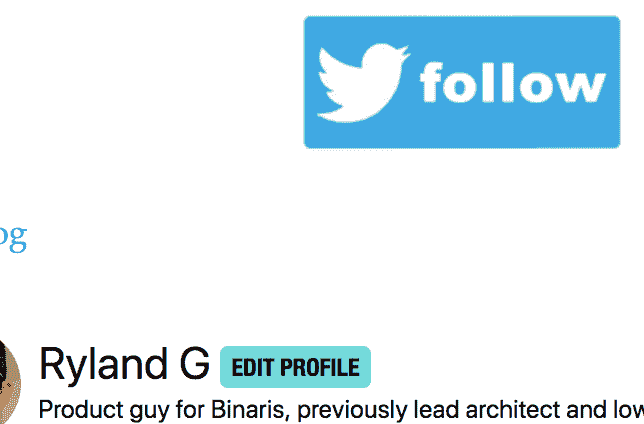

# 如何在 Dev.to 上制作按钮

> 原文：<https://dev.to/taillogs/how-to-make-a-button-on-dev-to-55kb>

如果你读过我最近的几篇文章，你可能会注意到我开始在文章的最后添加了一张 twitter 图片。你可能没有意识到它实际上是一个功能齐全的按钮。

[](https://res.cloudinary.com/practicaldev/image/fetch/s--BDkqjJoC--/c_limit%2Cf_auto%2Cfl_progressive%2Cq_auto%2Cw_880/https://thepracticaldev.s3.amazonaws.com/i/cqhuz8x1jf0fylxwe565.png)

我以前从没见过有人这样做。幸运的是，Dev.to 是开源的，所以很容易看出 markdown 解析器允许一个简单的图像按钮。我在下面提供了一个例子。

```
<a href="https://twitter.com/<YOUR_TWITTER_HERE>" rel="some text">
![Foo]
(https://thepracticaldev.s3.amazonaws.com/i/gmrz82bjwhej1f1iqb1e.png)</a> 
```

<svg width="20px" height="20px" viewBox="0 0 24 24" class="highlight-action crayons-icon highlight-action--fullscreen-on"><title>Enter fullscreen mode</title></svg> <svg width="20px" height="20px" viewBox="0 0 24 24" class="highlight-action crayons-icon highlight-action--fullscreen-off"><title>Exit fullscreen mode</title></svg>

或者(如@Artemix 建议)

```
[](https://twitter.com/<YOUR_TWITTER_HERE>) 
```

<svg width="20px" height="20px" viewBox="0 0 24 24" class="highlight-action crayons-icon highlight-action--fullscreen-on"><title>Enter fullscreen mode</title></svg> <svg width="20px" height="20px" viewBox="0 0 24 24" class="highlight-action crayons-icon highlight-action--fullscreen-off"><title>Exit fullscreen mode</title></svg>

该代码(添加了您自己的 twitter URL)将在帖子中为您的 twitter 显示一个关注按钮。下面的例子

[](https://twitter.com/taillogs)