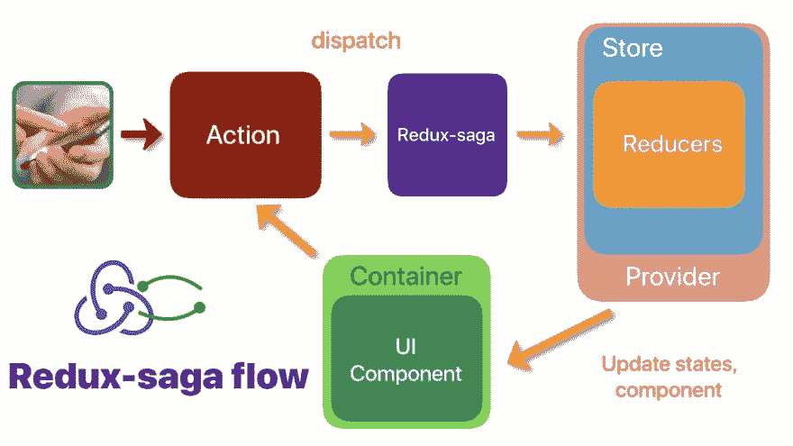
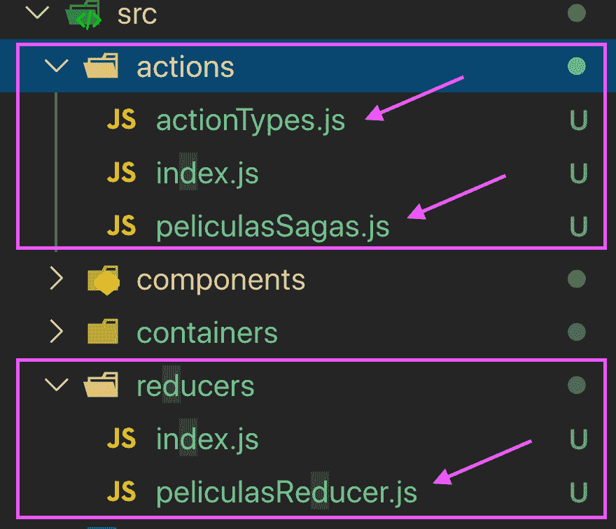

# react capítulo 3-CRUD Redux/Sagas/Axios

> 原文：<https://dev.to/danmatlam/react-series-2-redux-sagas-axios-1pp1>

[](https://res.cloudinary.com/practicaldev/image/fetch/s--GwZB6IEe--/c_limit%2Cf_auto%2Cfl_progressive%2Cq_auto%2Cw_880/https://thepracticaldev.s3.amazonaws.com/i/t4kzbhmxsrkqrbp59fpf.jpeg)

## **传说/事迹**。

这些是订阅 web 服务(get/post/put/delete)的函数，当响应成功或失败时，将触发节流器。

## **减速器**。

*   **Redux** :是让我们管理全球状态的工具。
*   **减速器**:其作用是更新整体状态中的一个项目。
*   我们可以从应用程序的任何位置访问全球状态的每个元素。

## **动作类型**。

它们是 id，使我们能够链接:

*   展望
*   Sagas/Actions (Funciones 网络服务)
*   减速器(国家管理局)

[https://thepractical dev . S3 . Amazon AWS . com/I/zsh 6a T1 ycbaltgrmvve . jpg](https://thepracticaldev.s3.amazonaws.com/i/zsh6at1ycbaltgrgmvve.jpg)

# 必要的依存关系

```
npm i react-redux redux redux-saga axios 
```

[](https://res.cloudinary.com/practicaldev/image/fetch/s--T4-Mkwv3--/c_limit%2Cf_auto%2Cfl_progressive%2Cq_auto%2Cw_880/https://thepracticaldev.s3.amazonaws.com/i/q2jrooalo0wf5h76doux.png)