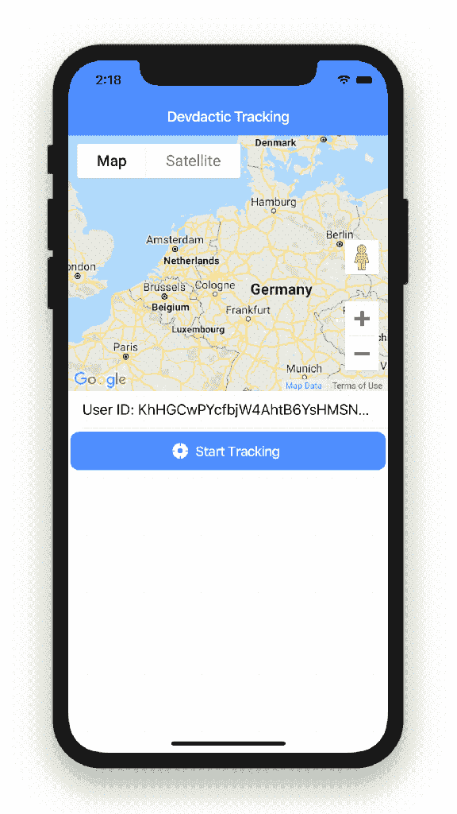
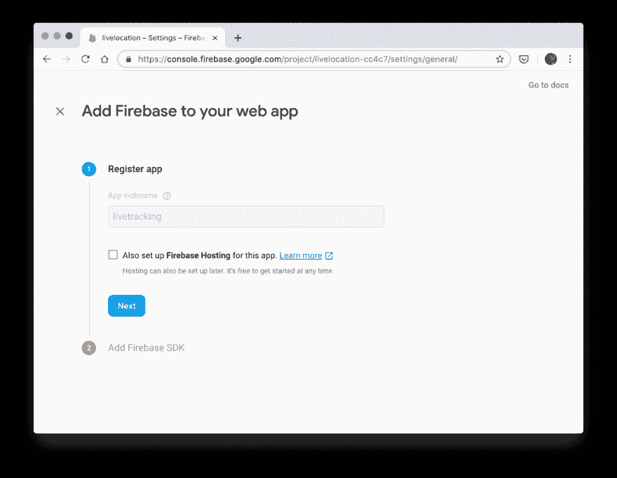
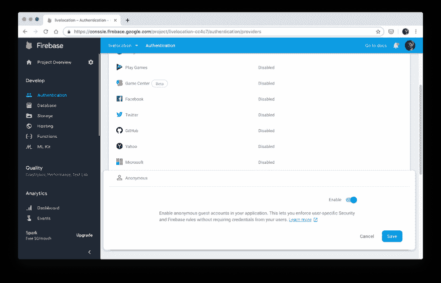
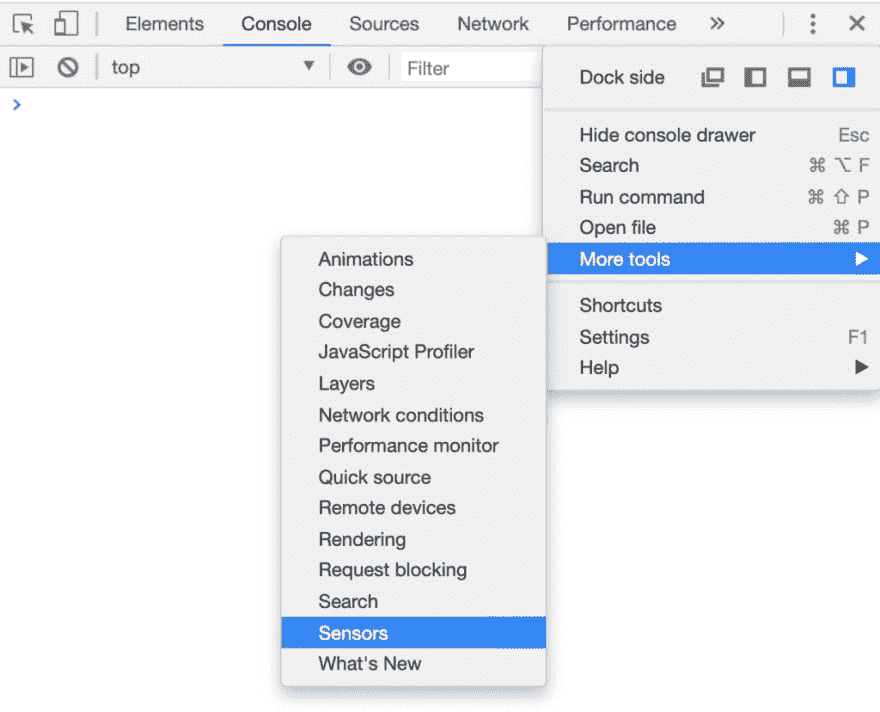

# 用电容和谷歌地图建立一个 Ionic 4 Firebase 位置跟踪器

> 原文：<https://dev.to/ionic/building-an-ionic-4-firebase-location-tracker-with-capacitor-google-maps-h3j>

随着电容器 1.0 几天前发布，是时候进入它了——还有什么比刷新和更新最受欢迎的教程之一更好的场景呢？

在本教程中，我们将通过离子 4，Firebase 集成和谷歌地图构建一个电容器应用程序的步骤。

[](https://res.cloudinary.com/practicaldev/image/fetch/s--_98o6vjg--/c_limit%2Cf_auto%2Cfl_progressive%2Cq_66%2Cw_880/https://i2.wp.com/devdactic.com/wp-content/uploads/2019/07/ionic-4-firebase-capcitor.gif%3Fresize%3D576%252C1024%26ssl%3D1)

这意味着我们将结合不同的技术，但没有一项技术本身是难以处理的，所以只要跟着做，你很快就会有你的第一个[电容器](https://capacitor.ionicframework.com/)应用程序！

## 设置我们的离子 App，电容& Firebase

作为一个小先决条件，确保你有一个 Firebase 应用程序，所以只需创建一个免费帐户，并开始一个新项目，就像你也可以在[我以前的 Firebase 教程](https://devdactic.com/ionic-4-firebase-angularfire-2/)中看到的！

要使用电容器，您不必安装任何特定的东西，您有两个集成选项:

*   启动一个新的 Ionic 项目并自动集成它
*   向现有项目添加电容器

我们采用第一种选择，但第二种也完全可以。

所以只需运行下面的命令来创建一个新项目，**构建项目一次**(这很重要)，然后就可以添加本地平台:

```
ionic start devdacticTracking blank --capacitor
cd devdacticTracking
npm install firebase @angular/fire

// Build at least once to have a www folder
ionic build

npx cap add android
npx cap add ios 
```

<svg width="20px" height="20px" viewBox="0 0 24 24" class="highlight-action crayons-icon highlight-action--fullscreen-on"><title>Enter fullscreen mode</title></svg> <svg width="20px" height="20px" viewBox="0 0 24 24" class="highlight-action crayons-icon highlight-action--fullscreen-off"><title>Exit fullscreen mode</title></svg>

我们将使用来自 Capacitor 的地理定位插件，通常 Cordova 会自动为 iOS 和 Android 添加一些权限。

但是，电容器不同。你可以在[发布帖](https://blog.ionicframework.com/announcing-capacitor-1-0/)以及关于[原生项目](https://capacitor.ionicframework.com/docs/cordova#native-project-management)的信息中读到更多。

总的来说，这意味着原生的 iOS/Android 项目现在应该成为你项目的一个真正的部分—**而不仅仅是一个你不能碰的自动生成的文件夹**！

因此，你必须进入原生项目，并指定正确的权限，就像对 iOS[和安卓](https://capacitor.ionicframework.com/docs/apis/geolocation#ios-notes)[所描述的那样。](https://capacitor.ionicframework.com/docs/apis/geolocation#android-notes)

但从我的观察来看，iOS 的变化已经在前面应用了。

如果你在 Mac 上遇到问题，也一定要检查你的 pods 版本:

```
pod --version #should be >= 1.6
# Update if needed
sudo gem install cocoapods
pod setup 
```

<svg width="20px" height="20px" viewBox="0 0 24 24" class="highlight-action crayons-icon highlight-action--fullscreen-on"><title>Enter fullscreen mode</title></svg> <svg width="20px" height="20px" viewBox="0 0 24 24" class="highlight-action crayons-icon highlight-action--fullscreen-off"><title>Exit fullscreen mode</title></svg>

因此，如果需要的话，更新你的豆荚，这是一个像 NPM 的本地 iOS 应用程序管理依赖关系的系统。

现在你的电容应用已经基本准备好了，但是我们还需要集成一些东西。

## 准备我们的应用

因为我们想显示一个位置的地图，我们需要从谷歌的 API 键。显然，这可以在链接之后的几秒钟[内完成，并生成新的密钥。](https://developers.google.com/maps/documentation/javascript/get-api-key)

一旦你得到了密钥，打开你的**index.html**，并在`head`块的末尾添加这个代码片段:

```
<script src="https://maps.googleapis.com/maps/api/js?key=YOURKEY"></script> 
```

<svg width="20px" height="20px" viewBox="0 0 24 24" class="highlight-action crayons-icon highlight-action--fullscreen-on"><title>Enter fullscreen mode</title></svg> <svg width="20px" height="20px" viewBox="0 0 24 24" class="highlight-action crayons-icon highlight-action--fullscreen-off"><title>Exit fullscreen mode</title></svg>

现在我们还需要告诉我们的应用程序关于 Firebase 的信息，因为我们正在使用 [Angularfire](https://github.com/angular/angularfire2) 我们需要用来自 Firebase 的信息初始化它。

[](https://res.cloudinary.com/practicaldev/image/fetch/s--uWXNQxAb--/c_limit%2Cf_auto%2Cfl_progressive%2Cq_auto%2Cw_880/https://i1.wp.com/devdactic.com/wp-content/uploads/2019/05/ionic-firebase-capacitor-dialog.png%3Fresize%3D1024%252C792%26ssl%3D1)

在前一部分中，您应该已经创建了一个 Firebase 项目，现在是时候复制项目设置了，在您将平台添加到项目中之后，您应该会看到这些设置。这些信息直接进入您的**environments/environment . ts**文件，应该是这样的:

```
export const environment = {
  production: false,
  firebase: {
    apiKey: "",
    authDomain: "",
    databaseURL: "",
    projectId: "",
    storageBucket: "",
    messagingSenderId: ""
  }
}; 
```

<svg width="20px" height="20px" viewBox="0 0 24 24" class="highlight-action crayons-icon highlight-action--fullscreen-on"><title>Enter fullscreen mode</title></svg> <svg width="20px" height="20px" viewBox="0 0 24 24" class="highlight-action crayons-icon highlight-action--fullscreen-off"><title>Exit fullscreen mode</title></svg>

现在，我们只需要将这个环境信息加载到我们的 **app/app.module.ts** 中，并导入 Auth 和 Store 模块，这样我们就可以访问我们需要的所有功能:

```
import { NgModule } from '@angular/core';
import { BrowserModule } from '@angular/platform-browser';
import { RouteReuseStrategy } from '@angular/router';

import { IonicModule, IonicRouteStrategy } from '@ionic/angular';
import { SplashScreen } from '@ionic-native/splash-screen/ngx';
import { StatusBar } from '@ionic-native/status-bar/ngx';

import { AppComponent } from './app.component';
import { AppRoutingModule } from './app-routing.module';

import { environment } from '../environments/environment';

import { AngularFireModule } from '@angular/fire';
import { AngularFirestoreModule } from '@angular/fire/firestore';
import { AngularFireAuthModule } from '@angular/fire/auth';

@NgModule({
  declarations: [AppComponent],
  entryComponents: [],
  imports: [BrowserModule, IonicModule.forRoot(), AppRoutingModule,
    AngularFireModule.initializeApp(environment.firebase),
    AngularFirestoreModule,
    AngularFireAuthModule],
  providers: [
    StatusBar,
    SplashScreen,
    { provide: RouteReuseStrategy, useClass: IonicRouteStrategy }
  ],
  bootstrap: [AppComponent]
})
export class AppModule {} 
```

<svg width="20px" height="20px" viewBox="0 0 24 24" class="highlight-action crayons-icon highlight-action--fullscreen-on"><title>Enter fullscreen mode</title></svg> <svg width="20px" height="20px" viewBox="0 0 24 24" class="highlight-action crayons-icon highlight-action--fullscreen-off"><title>Exit fullscreen mode</title></svg>

由于我们使用的是简单的匿名登录，请确保在您的 Firebase 身份验证设置中也启用它！

[](https://res.cloudinary.com/practicaldev/image/fetch/s---ac_qa-1--/c_limit%2Cf_auto%2Cfl_progressive%2Cq_auto%2Cw_880/https://i2.wp.com/devdactic.com/wp-content/uploads/2019/05/ionic-capacitor-firebase-anon-auth.png%3Fresize%3D1024%252C657%26ssl%3D1)

我们不需要电容器的任何其他东西，因为我们已经用它设置了我们的应用程序，它已经包括在内。地理定位插件已经是核心 API 的一部分了！

## 构建我们的地理位置跟踪器

现在是时候进入文章的核心了，在文章中我们构建并组合了所有的东西。

首先，我们的应用程序需要在启动时加载谷歌地图，为了防止任何打字错误，我们可以简单地在顶部声明变量谷歌。记住，我们已经将地图脚本添加到我们的**index.html**中，所以我们不需要任何其他的包。

我们还将自动登录一个用户—**匿名**。这使得教程变得简单了一些，但是当然你也可以简单地添加一个登录和认证系统。

在爱奥尼亚学院也有关于这个主题的[很棒的课程！](https://ionicacademy.com/)

自动登录后，我们在`locations/${this.user.uid}/track`建立了到我们的 **Firebase 集合**的连接。这意味着，我们可以将每个匿名用户的地理定位点存储在他们自己单独的列表中。

现在继续将这第一段代码添加到你的**app/home/home . page . ts**:

```
import { Component, ViewChild, ElementRef } from '@angular/core';
import { AngularFireAuth } from '@angular/fire/auth';
import {
  AngularFirestore,
  AngularFirestoreCollection
} from '@angular/fire/firestore';
import { Observable } from 'rxjs';
import { map } from 'rxjs/operators';

import { Plugins } from '@capacitor/core';
const { Geolocation } = Plugins;

declare var google;

@Component({
  selector: 'app-home',
  templateUrl: 'home.page.html',
  styleUrls: ['home.page.scss']
})
export class HomePage {
  // Firebase Data
  locations: Observable<any>;
  locationsCollection: AngularFirestoreCollection<any>;

  // Map related
  @ViewChild('map') mapElement: ElementRef;
  map: any;
  markers = [];

  // Misc
  isTracking = false;
  watch: string;
  user = null;

  constructor(private afAuth: AngularFireAuth, private afs: AngularFirestore) {
    this.anonLogin();
  }

  ionViewWillEnter() {
    this.loadMap();
  }

  // Perform an anonymous login and load data
  anonLogin() {
    this.afAuth.auth.signInAnonymously().then(res => {
      this.user = res.user;

      this.locationsCollection = this.afs.collection(
        `locations/${this.user.uid}/track`,
        ref => ref.orderBy('timestamp')
      );

      // Make sure we also get the Firebase item ID!
      this.locations = this.locationsCollection.snapshotChanges().pipe(
        map(actions =>
          actions.map(a => {
            const data = a.payload.doc.data();
            const id = a.payload.doc.id;
            return { id, ...data };
          })
        )
      );

      // Update Map marker on every change
      this.locations.subscribe(locations => {
        this.updateMap(locations);
      });
    });
  }

  // Initialize a blank map
  loadMap() {
    let latLng = new google.maps.LatLng(51.9036442, 7.6673267);

    let mapOptions = {
      center: latLng,
      zoom: 5,
      mapTypeId: google.maps.MapTypeId.ROADMAP
    };

    this.map = new google.maps.Map(this.mapElement.nativeElement, mapOptions);
  }
} 
```

<svg width="20px" height="20px" viewBox="0 0 24 24" class="highlight-action crayons-icon highlight-action--fullscreen-on"><title>Enter fullscreen mode</title></svg> <svg width="20px" height="20px" viewBox="0 0 24 24" class="highlight-action crayons-icon highlight-action--fullscreen-off"><title>Exit fullscreen mode</title></svg>

会有一些错误，因为一些功能仍然丢失，但我们现在会得到那里。

您可以看到，我们还在 Firebase 集合数据上应用了标准 map()，这也是**从对象**中检索 ID 所需要的！稍后引用和删除单个条目时也需要该 ID。

我们还将订阅对数组的任何更改，并在获得新数据后更新我们的地图，以便显示所有标记(并清除旧标记)。

现在，我们还可以深入了解电容器，并基本上像您以前使用科尔多瓦和离子原生一样使用它。我们观察任何位置的变化，每当我们得到一个新的位置，我们将使用我们的`locationsCollection`添加带有时间戳的地理位置到 Firebase。

我想说更多，但这已经是所有的魔法了—**就这么简单**！

现在在你的 **app/home/home.page.ts** 中添加以下函数:

```
// Use Capacitor to track our geolocation
startTracking() {
  this.isTracking = true;
  this.watch = Geolocation.watchPosition({}, (position, err) => {
    if (position) {
      this.addNewLocation(
        position.coords.latitude,
        position.coords.longitude,
        position.timestamp
      );
    }
  });
}

// Unsubscribe from the geolocation watch using the initial ID
stopTracking() {
  Geolocation.clearWatch({ id: this.watch }).then(() => {
    this.isTracking = false;
  });
}

// Save a new location to Firebase and center the map
addNewLocation(lat, lng, timestamp) {
  this.locationsCollection.add({
    lat,
    lng,
    timestamp
  });

  let position = new google.maps.LatLng(lat, lng);
  this.map.setCenter(position);
  this.map.setZoom(5);
}

// Delete a location from Firebase
deleteLocation(pos) {
  this.locationsCollection.doc(pos.id).delete();
}

// Redraw all markers on the map
updateMap(locations) {
  // Remove all current marker
  this.markers.map(marker => marker.setMap(null));
  this.markers = [];

  for (let loc of locations) {
    let latLng = new google.maps.LatLng(loc.lat, loc.lng);

    let marker = new google.maps.Marker({
      map: this.map,
      animation: google.maps.Animation.DROP,
      position: latLng
    });
    this.markers.push(marker);
  }
} 
```

<svg width="20px" height="20px" viewBox="0 0 24 24" class="highlight-action crayons-icon highlight-action--fullscreen-on"><title>Enter fullscreen mode</title></svg> <svg width="20px" height="20px" viewBox="0 0 24 24" class="highlight-action crayons-icon highlight-action--fullscreen-off"><title>Exit fullscreen mode</title></svg>

当我们开始跟踪时，我们还会跟踪 ID，以便稍后我们可以再次用该 ID 清除手表。

关于我们的地图——我们在这里没有真正完成代码，但所有这些都被谷歌很好地记录了下来。因此，每当我们想要更新我们的标记时，我们在所有现有的标记上将地图设置为 null，然后创建新的标记。当然，可以随意改进这种逻辑，保留旧的逻辑，只改变需要改变的逻辑。

如果你现在也想在这些点之间画一条路线，[看看我关于创建地理位置跟踪器的教程](https://devdactic.com/ionic-location-tracker-map-track/)！

我们现在只想得到我们的地图，几个按钮开始/停止跟踪和一个列表，以查看我们的 Firebase 数据实时更新，所以总的来说只是一些基本的元素。

注意，我们的`locations`数组仍然是可观察的，所以我们需要使用异步管道来自动获取这里的最新数据。

此外，我们使用了一个滑动项，这样我们就可以从一侧拉进那个小小的删除图标，去掉我们不想在列表中出现的位置！

现在把你的 **app/home/home.page.html** 改成:

```
<ion-header>
  <ion-toolbar color="primary">
    <ion-title>
      Devdactic Tracking
    </ion-title>
  </ion-toolbar>
</ion-header>

<ion-content>

  <div #map id="map" [hidden]="!user"></div>

  <div *ngIf="user">

    <ion-item>
      <ion-label>User ID: {{ user.uid }}</ion-label>
    </ion-item>

    <ion-button expand="block" (click)="startTracking()" *ngIf="!isTracking">
      <ion-icon name="locate" slot="start"></ion-icon>
      Start Tracking
    </ion-button>

    <ion-button expand="block" (click)="stopTracking()" *ngIf="isTracking">
      <ion-icon name="hand" slot="start"></ion-icon>
      Stop Tracking
    </ion-button>

    <ion-list>
      <ion-item-sliding *ngFor="let pos of locations | async">
        <ion-item>
          <ion-label text-wrap>
            Lat: {{ pos.lat }}
            Lng: {{ pos.lng }}
            <p>
              {{ pos.timestamp | date:'short' }}
            </p>
          </ion-label>
        </ion-item>

        <ion-item-options side="start">
          <ion-item-option color="danger" (click)="deleteLocation(pos)">
            <ion-icon name="trash" slot="icon-only"></ion-icon>
          </ion-item-option>
        </ion-item-options>

      </ion-item-sliding>
    </ion-list>

  </div>

</ion-content> 
```

<svg width="20px" height="20px" viewBox="0 0 24 24" class="highlight-action crayons-icon highlight-action--fullscreen-on"><title>Enter fullscreen mode</title></svg> <svg width="20px" height="20px" viewBox="0 0 24 24" class="highlight-action crayons-icon highlight-action--fullscreen-off"><title>Exit fullscreen mode</title></svg>

现在你不会看到地图，因为它需要一些 CSS 才能看到。您可以在您的 **app/home/home.page.scss** 中从以下内容开始，当然，您也可以根据自己的需求进行调整！

```
#map {
  width: 100%;
  height: 300px;
} 
```

<svg width="20px" height="20px" viewBox="0 0 24 24" class="highlight-action crayons-icon highlight-action--fullscreen-on"><title>Enter fullscreen mode</title></svg> <svg width="20px" height="20px" viewBox="0 0 24 24" class="highlight-action crayons-icon highlight-action--fullscreen-off"><title>Exit fullscreen mode</title></svg>

现在你可以在你的浏览器上运行应用程序，你应该可以得到你的位置(是的，电容插件直接在你的浏览器上工作！)您还可以在 Chrome 中伪造您的位置，以便足不出户就能看到新添加的积分:

在调试区内点击 3 个圆点-> **更多工具**->-**传感器**。

[](https://res.cloudinary.com/practicaldev/image/fetch/s--ESo-cVaX--/c_limit%2Cf_auto%2Cfl_progressive%2Cq_auto%2Cw_880/https://i1.wp.com/devdactic.com/wp-content/uploads/2019/05/capacitor-fake-location-chrome-1.png%3Fresize%3D1024%252C828%26ssl%3D1)

从那里你可以控制你的地理位置，并伪造到其他地方！

## 打造你的离子+电容应用

如果您现在想要构建本地项目，例如 iOS，只需运行:

```
npx cap sync
npx cap open ios 
```

<svg width="20px" height="20px" viewBox="0 0 24 24" class="highlight-action crayons-icon highlight-action--fullscreen-on"><title>Enter fullscreen mode</title></svg> <svg width="20px" height="20px" viewBox="0 0 24 24" class="highlight-action crayons-icon highlight-action--fullscreen-off"><title>Exit fullscreen mode</title></svg>

电容器的工作方式与开头所说的不同——本地项目持续存在，我们只将我们的 web 应用程序文件与本地项目同步。这也意味着，你的构建比以前使用科尔多瓦的时候要快得多！

## 结论

虽然最初的任务可能听起来令人生畏，但实际上结合所有这些服务和技术非常容易。即使在一个网站，而不是一个真正的应用程序！

关于电容还有很多要说的，我很快就会谈到。如果你想看电容器的任何细节，请在下面给我留言。

你也可以在下面观看这篇文章的视频版本。

[https://www.youtube.com/watch?v=Sq0NbvQihrk](https://www.youtube.com/watch?v=Sq0NbvQihrk)