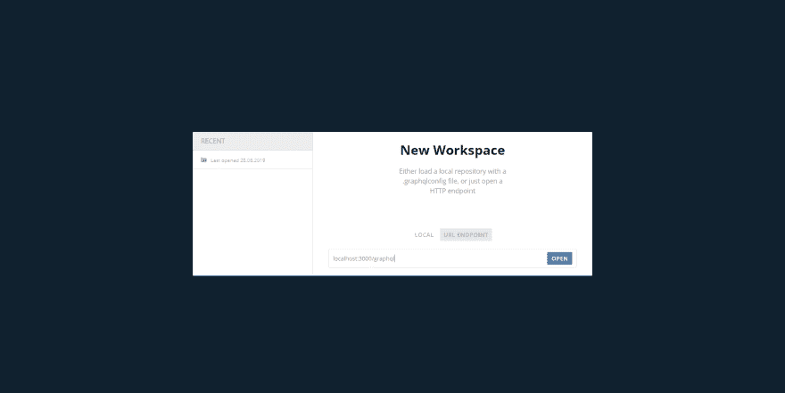
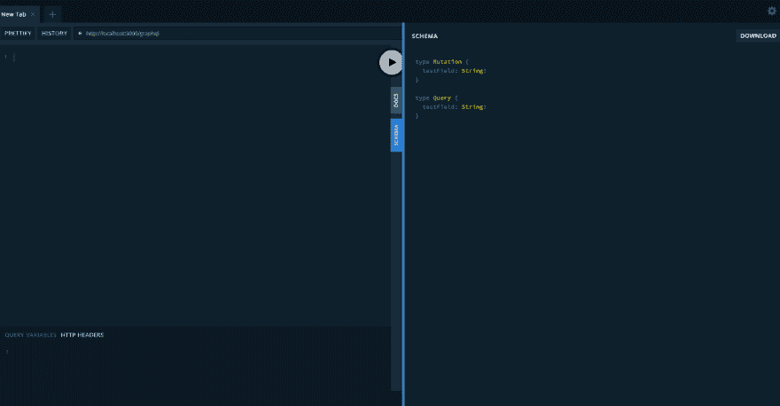

# [教程]使用 Rails 6 和 GraphQL 创建简单的博客应用程序第 1 部分

> 原文：<https://dev.to/kuskoman/tutorial-creating-simple-blog-app-with-rails-6-and-graphql-part-1-5gif>

在这篇文章中，我将尝试向你展示如何用 GraphQL 创建一个简单的博客应用程序。GraphQL 是今年最受欢迎的话题之一，但是我不会试图解释它是什么。关于它的文章已经很多了。另外，不要把这篇文章当作唯一伟大的真理，我甚至还没有使用这项技术创建“真正的”应用程序，但是我认为我可以制作一个关于这项技术用法的基本教程。

这是我在这里的第一个帖子，所以大家好！请留下你的反馈，不管这个教程有多糟糕。老实说，我想象它会更好，但在花了几个小时后，我不想删除它(我认为创建这样的东西更快)。另外，如果你在本教程中看到错误，请纠正我。

## 简介

在本教程中，我将使用:

*   Rails 6.0.0.rc1
*   RSpec-Rails 4.0.0.beta2
*   Graphql gem for Rails，1.9.7 版

有一个 github repo，代码来自该指南 available([https://github.com/kuskoman/Rails-GraphQL-tutorial](https://github.com/kuskoman/Rails-GraphQL-tutorial))

让我们从在纯 API 模式下创建新的 Rails 应用程序开始，无需测试框架。

```
rails new graphql-blog --api -T 
```

现在我们需要添加一些宝石到我们的宝石文件中。让我们修改我们的:开发和:测试团队。

```
group :development, :test do
  [...]
  gem 'rspec-rails', '~> 4.0.0.beta2'
  gem 'factory_bot_rails', '~> 5.0', '>= 5.0.2'
  gem 'faker', '~> 1.9', '>= 1.9.4'
end 
```

然后，让我们创建:测试组如下。

```
group :test do
  gem 'database_cleaner', '~> 1.7'
  gem 'shoulda-matchers', '~> 4.1'
end 
```

让我们就我们的测试栈和为什么我们需要测试依赖说几句话:开发:它们不是必需的。然而，如果您在开发依赖项中不需要 RSpec，您将需要从测试环境中执行与 RSpec 相关的命令。此外，规范文件不会由生成器自动创建。带有工厂机器人轨道的 Faker 也非常有用——它们允许我们非常快速地从控制台植入数据库(例如`FactoryBot.create_list(:article, 30)`)。

让我们安装我们的宝石。

```
bundle 
```

然后，我们可以开始准备我们的测试环境。让我们从 RSpec 安装开始。

```
rails g rspec:install 
```

然后，我们可以要求我们的工厂机器人方法。为此，我们需要通过添加
来更改`spec/rails_helper.rb`文件

```
RSpec.configure do |config|
  [...]
  config.include FactoryBot::Syntax::Methods
  [...]
end 
```

现在，让我们将`database_cleaner`配置添加到同一个文件中。

```
RSpec.configure do |config|
  [...]
  config.include FactoryBot::Syntax::Methods
  [...]
  config.before(:suite) do
    DatabaseCleaner.clean_with(:truncation)
    DatabaseCleaner.strategy = :transaction
  end

  # start the transaction strategy as examples are run
  config.around(:each) do |example|
    DatabaseCleaner.cleaning do
      example.run
    end
  end
  [...] 
```

然后，我们需要配置合适的匹配器。这个配置也存储在同一个文件中，但是**在**之外`RSpec.configure`。

```
Shoulda::Matchers.configure do |config|
  config.integrate do |with|
    with.test_framework :rspec
    with.library :rails
  end
end 
```

耶！我们完成了测试套件的设置。现在我们可以转移到...正在安装 GraphQL。

让我们回到我们的 gemfile，并添加 graphql gem。

```
[...]
gem 'graphql', '~> 1.9', '>= 1.9.7'
[...] 
```

现在我们可以使用 rails generator 生成它的安装。

```
rails g graphql:install 
```

由于项目创建期间的`--api`标志，我们可能会在控制台中看到此信息:

```
Skipped graphiql, as this rails project is API only
  You may wish to use GraphiQL.app for development: https://github.com/skevy/graphiql-app 
```

GraphQL 是一个类似 Postman 的应用程序，但只为 graph QL 设计，并在 web 浏览器中工作。当然，我们将需要一个工具，而不是网络版的 GraphiQL。我们可以[使用它的独立版本](https://github.com/graphql/graphiql)，或者例如 [GraphQL Playground](https://github.com/prisma/graphql-playground) (不幸的是，它是建立在电子上的，也有一些烦人的问题。但还没有讨厌到迫使我在 Github 上创建问题)。
最近[邮递员](https://www.getpostman.com/)也开始支持 GraphQL。

好了，让我们回到主题。正如我们所见，我们在`app/graphql`文件夹中创建了整个文件结构。让我说几句关于他们的话。
`mutations`是一个(对，那是意料之外的)突变的地方。您可以像对待 REST api 中的 post 操作一样对待它们。
`types`是存储类型和查询的地方，存储在`query_type.rb`。我们可以改变这种行为，但我们不会在本教程中这样做。

不幸的是，在我们开始制作 GraphQL 之前，我们需要创建模型，这和其他应用程序一样。让我们从用户模型开始。这个型号会有安全密码，所以我们需要添加

```
gem 'bcrypt', '~> 3.1', '>= 3.1.13' 
```

到我们的 Gemfile(然后显然运行`bundle`)。

因为我(通常)喜欢 TDD，所以我会从生成用户模型开始，然后立即转向它的规范。

```
rails g model user name:string password:digest 
```

现在，让我们为我们的用户模型创建规范。
T2`spec/models/user_spec.rb`

```
require 'rails_helper'

RSpec.describe User, type: :model do
  let!(:user) { build(:user) }

  it 'has a valid factory' do
    expect(user).to be_valid
  end

  describe 'validation' do
    it { should validate_presence_of(:name) }
    it { should validate_presence_of(:password) }

    it { should validate_length_of(:name).is_at_least(2).is_at_most(32) }
    it { should validate_length_of(:password).is_at_least(6).is_at_most(72) }

    it { should validate_uniqueness_of(:name).case_insensitive }

    context 'username validation' do
      it 'should accept valid usernames' do
    valid_usernames = ['fqewqf', 'fFA-Ef231', 'Randy.Lahey', 'jrock_1337', '1234234235' ]

        valid_usernames.each do |username|
          user.name = username
            expect(user).to be_valid
          end
        end
      end

    it 'should not accept invalid usernames' do
      invalid_usernames = ['!@3', 'ff ff', '...', 'dd@dd.pl', 'wqre2123-23-', '-EW213123ed_d', '', '---', 'pozdro_.dla-_wykopu']

      invalid_usernames.each do |username|
        user.name = username

        expect(user).to be_invalid
      end
    end
  end
end 
```

现在我们可以使用`rspec`命令运行我们的测试，并看到 7 个例子中有 5 个失败(是的，在实际的 TDD 中是 7/7)。

让我补充一些关于密码验证-我想让用户使用所有字母数字字符和。、-和 _，但在一行中不能超过一次，并且不能出现在昵称的开头和结尾。

让我们用代码填充我们的用户模型。

```
class User < ApplicationRecord
  has_secure_password

  validates :name, presence: true, length: { minimum: 3, maximum: 32 },
    format: { with: /\A[0-9a-zA-Z]+([-._]?[0-9a-zA-Z]+)*\Z/}, uniqueness: { case_sensitive: false }
  # actually pasword from has_secure_password has a 72 character limit anyway, but w/e
  validates :password, presence: true, length: { minimum: 6, maximum: 72 }
end 
```

现在所有测试都应该通过了。然而，在我们开始创建类型之前，让我们改变一下位于`spec/factories/user.rb`的用户工厂，增加一点随机性。

```
FactoryBot.define do
  factory :user do
    name { Faker::Internet.username(separators = %w(._-)) }
    password { Faker::Internet.password(6, 72) }
  end
end 
```

现在我们终于可以转向 GraphQL 了。

让我们从创建用户类型开始。让我们(我认为我用这个词有点太频繁了，有点令人困惑)在`app/graphql/types`目录中创建`user_type.rb`。

```
module Types
    class UserType < Types::BaseObject
      description "Just user, lol"
      field :id, ID, null: false
      field :name, String, null: false
      field :created_at, GraphQL::Types::ISO8601DateTime, null: false
    end
end 
```

GraphQL Ruby 语法非常清楚，我不认为我需要解释这段代码中的任何内容(改变我的想法)。

现在让我们进行第一个查询。
让我们转到`app/graphql/types/query_type.rb`。我们将看到由命令`rails g graphql:install`生成的示例文件。

```
module Types
  class QueryType < Types::BaseObject
    # Add root-level fields here.
    # They will be entry points for queries on your schema.

    # TODO: remove me
    field :test_field, String, null: false,
      description: "An example field added by the generator"
    def test_field
      "Hello World!"
    end
  end
end 
```

如果我们愿意，我们可以测试它是如何工作的。让我们启动`rails server`并使用前面提到的工具之一连接到它。我将使用 [GraphQL Playground](https://github.com/prisma/graphql-playground) ，因为我觉得使用这个工具最舒服。打开后，它会问我们关于本地文件或端点。让我们选择端点并输入我们的应用程序 graphql 端点地址(通常是`localhost:3000/graphql`)。

[](https://res.cloudinary.com/practicaldev/image/fetch/s--jaBMmrbP--/c_limit%2Cf_auto%2Cfl_progressive%2Cq_auto%2Cw_880/https://thepracticaldev.s3.amazonaws.com/i/k1e9fvn8lx2l9s0df98j.png)

我们现在应该可以访问我们当前的模式了。

[](https://res.cloudinary.com/practicaldev/image/fetch/s--EQeJTpqz--/c_limit%2Cf_auto%2Cfl_progressive%2Cq_auto%2Cw_880/https://thepracticaldev.s3.amazonaws.com/i/i73wyrlnrn71bvzp2zio.png)

默认情况下，GraphQL Playground 会每隔 2000 毫秒向服务器询问当前模式，如果我们打开控制台，这真的很烦人。我们可以通过编辑配置文件来改变这种行为。

我们需要点击应用程序顶栏的`Application -> Settings`，或者直接点击`ctrl + comma`。
现在我们应该可以看到负责刷新模式的行了。

```
{  "schema.polling.interval":  2000,  } 
```

我们可以改变它的值，但是我们需要记住，刷新模式不够频繁也不是一个好主意。现在让我们回到我们的 GraphQL 端点。现在，我们能够对自动生成的虚拟字段进行查询和变异。例如，我们可以查询:

```
query  {  testField  } 
```

并从服务器接收 json 作为响应。

```
{  "data":  {  "testField":  "Hello World!"  }  } 
```

我们现在应该为我们的第一个查询做一个测试，但是因为它非常简单(是的，它不是一个借口)，我将跳过它。如果你想先做测试，你可以跳到这部分指南的底部，阅读测试突变。查询测试非常相似。
无论如何，让我们再次移动到`app/graphql/types/query_type.rb`并像这样输入代码:

```
module Types
  class QueryType < Types::BaseObject
    field :user, UserType, null: false do
      description "Find user by ID"
      argument :id, ID, required: true
    end

    def user(id:)
      User.find(id)
    end
  end
end 
```

现在让我们说点什么吧。
`field :user`将创建一个名为用户的新字段，并自动查找方法用户。
`null: false`告知该字段不能为空。这意味着查询不存在的用户会产生错误。
`description ...`将创建类似文档的东西，我们可以从我们的工具中使用它。
`argument :id, ID, required: true`需要指定用户 id 才能使用该查询。

让我们手动测试它是如何工作的。

```
query  {  user(id:  1)  {  name  }  } 
```

上面的代码应该会引发错误，因为这个值不能为空，而且我们还没有创建第一个用户。

```
{  "error":  {  "error":  {  "message":  "Couldn't find User with 'id'=1",  "backtrace":  [...],  "data":  {}  }  } 
```

让我们通过向数据库添加用户来解决这个问题。
打开 Rails 控制台
`rails c`
，产生一些用户
`FactoryBot.create_list(:user, 10)`

现在，如果我们再次查询，我们应该会看到 JSON 格式的请求用户数据。

```
{  "data":  {  "user":  {  "name":  "keren"  }  }  } 
```

我们可以创建另一个查询。
T2`app/graphql/types/query_type.rb`

```
module Types
  class QueryType < Types::BaseObject
    field :user, UserType, null: false do
      description "Find user by ID"
      argument :id, ID, required: true
    end

    field :all_users, [UserType], null: true do
      description "Find all users"
    end

    def user(id:)
      User.find(id)
    end

    def all_users
      User.all
    end
  end
end 
```

现在我们可以开始创造第一个突变。

因为缺乏组织 GraphQL 的工具和/或仅仅因为我缺乏相关的知识，我们将把整个变异作为一个字符串放在测试文件中。当然，如果我们愿意，我们可以将它移动到另一个支持文件中，但是我不喜欢这样做。
前段时间我在[这篇文章](https://pradyumna.io/2018/05/20/testing-your-graphql-rails-app.html)中发现了一段非常有用的代码。
我们将从把它复制到`spec/support/graphql/mutation_variables.rb`文件开始。

```
module GraphQL
    module MutationVariables
        def mutation_variables(factory, input = {})
            attributes = attributes_for(factory)

            input.reverse_merge!(attributes)

            camelize_hash_keys(input).to_json
        end

        def camelize_hash_keys(hash)
            raise unless hash.is_a?(Hash)

            hash.transform_keys { |key| key.to_s.camelize(:lower) }
        end
    end
end 
```

它是做什么的？它将:factory 和可选属性作为参数。当我们经过工厂时，它正在转换它，允许我们使用它们作为变异变量。如果我们也传递额外的参数，它们将替换来自工厂的属性([这里我们可以读到 camelize_hash_keys 方法](https://apidock.com/rails/Hash/reverse_merge))。

创建这个模块后，我们可以将它包含到 RSpec 测试中。

`spec/rails_helper.rb`

```
RSpec.configure do |config|
  [...]
  config.include GraphQL::MutationVariables
  [...]
end 
```

另外一个我很喜欢的 helper 是我在(本教程)里看到的 RequestSpecHelper[[https://scotch . io/tutorials/build-a-restful-JSON-API-with-rails-5-part-one](https://scotch.io/tutorials/build-a-restful-json-api-with-rails-5-part-one)。

看起来是这样的:

```
module RequestSpecHelper
  def json
    JSON.parse(response.body)
  end
end 
```

然后我们还需要加上

```
RSpec.configure do |config|
  [...]
  config.include RequestSpecHelper
  [...]
end 
```

在我们的`rails_helper.rb`。

现在我们将创建一个并不真正有用的突变，只是为了展示它是如何工作的。
我们要做的第一件事是在`app/graphql/mutations`中创建新文件。让我们把它命名为`create_user.rb`。在填充这个文件之前，让我们创建`spec/graphql/mutations/create_user_spec.rb`并移动到这个文件。

```
require 'rails_helper'

RSpec.describe 'createUser mutation', type: :request do
    describe 'user creation' do
        before do
            post('/graphql', params: {
              query: %(
                    mutation CreateUser(
                        $name: String!,
                        $password: String!,
                    ) {
                        createUser(input: {
                            name:$name,
                            password:$password,
                        }) {
                            user {
                                id
                                name
                            }
                            errors,
                        }
                    }
                ),
              variables: mutation_variables(:user, input_variables)
            })
        end

        context 'when input is valid' do
            let(:user_attrs) { attributes_for(:user) }
            let(:input_variables) { user_attrs }

            it 'returns no errors' do
                errors = json["data"]["createUser"]["errors"]
                expect(errors).to eq([])
            end

            it 'returns username' do
                user_name = json["data"]["createUser"]["user"]["name"]
                expect(user_name).to eq(user_attrs[:name])
            end
        end

        context 'when input is invalid' do
            context 'when username is empty' do
                let(:input_variables) { {"name": ""} }

                it 'returns errors' do
                    errors = json["data"]["createUser"]["errors"]
                    expect(errors).not_to be_empty
                end

                it 'does not return user' do
                    user = json["data"]["createUser"]["user"]
                    expect(user).to be_nil
                end
            end

            context 'when password is invalid' do
                let(:input_variables) { {"password": "d"} }

                it 'returns errors' do
                    errors = json["data"]["createUser"]["errors"]
                    expect(errors).not_to be_empty
                end

                it 'does not return user' do
                    user = json["data"]["createUser"]["user"]
                    expect(user).to be_nil
                end
            end
        end
    end
end 
```

运行`rspec`之后，我们应该看到结果:
`14 examples, 6 failures`

让我们创建基础突变文件:
`app/graphql/mutations/base_mutation.rb`

```
module Mutations
    class BaseMutation < GraphQL::Schema::RelayClassicMutation
        object_class Types::BaseObject
        input_object_class Types::BaseInputObject
    end
end 
```

然后让我们填充我们的突变。
`app/graphql/mutations/create_user.rb`

模块突变
类创建用户<基础突变
参数:名称，字符串，必需:真
参数:密码，字符串，必需:真

```
 field :user, Types::UserType, null: true
    field :errors, [String], null: false

    def resolve(name:, password:)
        user = User.new(name: name, password: password)
        if user.save
            {
                user: user,
                errors: [],
            }
        else
            {
                user: nil,
                errors: user.errors.full_messages,
            }
        end
    end
end 
```

结束

再次运行`rspec`后，我们将看到同样的结果。这是因为我们还需要向 mutation_type.rb 添加突变，就像我们对 query 和 query_type 所做的那样。
默认`app/graphql/types/mutation_type.rb`好像是这样:

```
module Types
  class MutationType < Types::BaseObject
    # TODO: remove me
    field :test_field, String, null: false,
      description: "An example field added by the generator"
    def test_field
      "Hello World"
    end
  end
end 
```

我们需要将其替换为:

```
module Types
  class MutationType < Types::BaseObject
    field :create_user, mutation: Mutations::CreateUser
  end
end 
```

让我们回到我们的突变。这里发生了什么事？
`argument :name, String, required: true`我们这里要求的是名称，没有这个参数的突变将返回错误。我们还指定了输入对象的类型(字符串)。
`argument :password, String, required: true`同上，只是和密码有关。

`field :user, Types::UserType, null: true`
`field :errors, [String], null: false`
我们返回两个对象——UserType，如果没有创建用户，它可以是 null；errors，如果创建了用户，它是一个空数组，如果没有创建，它有`user.errors.full_messages,`。

现在我们可以在我们最喜欢的 GraphQL 工具中玩我们的变种了。

```
mutation  {  createUser(input:{  name:"DDD",  password:"leszkesmieszke"  })  {  user  {  id  name  }  }  } 
```

```
{  "data":  {  "createUser":  {  "user":  {  "id":  "15",  "name":  "DDD"  }  }  }  } 
```

这是教程的第一部分。老实说，我不确定我是否会创造其他的，这可能取决于这一个的反应。正如我所说的，我认为这个教程比实际情况要好很多。