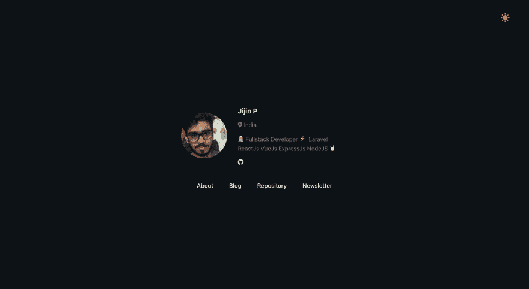

# 让我们用 Github 和 Medium 或 Dev.to 帐户创建一个个人网站。

> 原文：<https://dev.to/pjijin/let-s-create-a-personal-website-with-github-and-medium-or-dev-to-account-525p>

我用 Github 创建了一个简单的个人网站制作工具。配置简单。它需要的只是你在 Github 和 Dev/Medium 上的用户名。

##  [ PJijin ](https://github.com/PJijin) / [个人网站](https://github.com/PJijin/Personal-Website)

### 🙋‍♂️Create 你的个人网站和博客与 Github，媒体或开发

<article class="markdown-body entry-content container-lg" itemprop="text">

# 个人网站模板

### 其他项目:

*   <g-emoji class="g-emoji" alias="cityscape" fallback-src="https://github.githubassets.cimg/icons/emoji/unicode/1f3d9.png">🏙</g-emoji> [封面图片生成器](https://github.com/PJijin/Cover-Image-Generator)——为你的博客文章在线生成封面图片。
*   <g-emoji class="g-emoji" alias="bookmark" fallback-src="https://github.githubassets.cimg/icons/emoji/unicode/1f516.png">🔖</g-emoji> [降价](https://github.com/JP1016/Markdown) -现场降价生成器
*   <g-emoji class="g-emoji" alias="spiral_notepad" fallback-src="https://github.githubassets.cimg/icons/emoji/unicode/1f5d2.png">🗒</g-emoji> [论文](https://github.com/JP1016/Paper)——一款“无云”笔记 app，分享“无网络”。
*   <g-emoji class="g-emoji" alias="man_technologist" fallback-src="https://github.githubassets.cimg/icons/emoji/unicode/1f468-1f4bb.png">👨‍💻</g-emoji> [ShowPath](https://github.com/PJijin/Show-Path) -程序员的学习之路

[](https://github.com/PJijin/Personal-Website)

<sub>代码用<g-emoji class="g-emoji" alias="hearts" fallback-src="https://github.githubassets.cimg/icons/emoji/unicode/2665.png">♥️</g-emoji>T3】</sub>

* * *

[ ](https://github.com/PJijin/Personal-Website/archive/master.zip) [ ](https://www.buymeacoffee.com/PJijin)

# 特色 <g-emoji class="g-emoji" alias="sparkles" fallback-src="https://github.githubassets.cimg/icons/emoji/unicode/2728.png">✨</g-emoji>

在你的个人网站上自动显示你的 GitHub 公开报告、博客文章(开发者或媒体)。

*   显示 Github Repo

*   显示博客文章的媒体或开发者

# 使用

1.  克隆存储库

    ```
     git clone https://github.com/PJijin/Personal-Website.git 
    ```

2.  运行此命令安装依赖项

    ```
     npm install 
    ```

3.  打开 src/config.js，然后输入您的社交媒体帐户用户名。

4.  从 src/components/About/about.js 自定义“关于我们”页面

5.  奔跑

    ```
    npm run start 
    ```

# <g-emoji class="g-emoji" alias="handshake" fallback-src="https://github.githubassets.cimg/icons/emoji/unicode/1f91d.png">🤝</g-emoji>贡献

欢迎投稿、问题和功能请求！

# 表示你的支持

如果这个项目对你有帮助，给一个⭐️奖吧！

</article>

[View on GitHub](https://github.com/PJijin/Personal-Website)

该网站由 Github 资源库组合和来自 Dev.to 或 Medium 的博客帖子、关于美国部分、基本个人资料信息组成。

如果你喜欢这个项目，就去⭐️😍，请随意提出问题🎉

github:[https://github.com/PJijin/Personal-Website](https://github.com/PJijin/Personal-Website)

演示:[https://personal-website.pjijin1.now.sh/](https://personal-website.pjijin1.now.sh/)

在推特上关注:[https://twitter.com/PJijin](https://twitter.com/PJijin)

### 用法

1 克隆存储库

```
 git clone https://github.com/PJijin/Personal-Website.git 
```

<svg width="20px" height="20px" viewBox="0 0 24 24" class="highlight-action crayons-icon highlight-action--fullscreen-on"><title>Enter fullscreen mode</title></svg> <svg width="20px" height="20px" viewBox="0 0 24 24" class="highlight-action crayons-icon highlight-action--fullscreen-off"><title>Exit fullscreen mode</title></svg>

2 运行该命令安装依赖项

```
 npm install 
```

<svg width="20px" height="20px" viewBox="0 0 24 24" class="highlight-action crayons-icon highlight-action--fullscreen-on"><title>Enter fullscreen mode</title></svg> <svg width="20px" height="20px" viewBox="0 0 24 24" class="highlight-action crayons-icon highlight-action--fullscreen-off"><title>Exit fullscreen mode</title></svg>

3 打开 src/config.js，然后输入您的社交媒体帐户用户名、姓名、职务。

```
const config = {
    name: 'Jijin',
    title: "Hi I'm Jijin 👋🏻",
    blog: 'Dev', // Dev.to or Medium (Make blank if you don't need the blog)

    // Social media profile username
    github: '', // [REQUIRED] Github Username
    twitter: '', // Twitter Username
    stackoverflow: '', // Eg: 3211944
    medium: '', // without @ symbol
    instagram: '',
    dev: 'pjijin',
    youtube: '', // Channel ID
    linkedin: ''
}; 
```

<svg width="20px" height="20px" viewBox="0 0 24 24" class="highlight-action crayons-icon highlight-action--fullscreen-on"><title>Enter fullscreen mode</title></svg> <svg width="20px" height="20px" viewBox="0 0 24 24" class="highlight-action crayons-icon highlight-action--fullscreen-off"><title>Exit fullscreen mode</title></svg>

4 从 src/components/About/about.js 定制关于我们的页面

5 运行

```
npm run start 
```

<svg width="20px" height="20px" viewBox="0 0 24 24" class="highlight-action crayons-icon highlight-action--fullscreen-on"><title>Enter fullscreen mode</title></svg> <svg width="20px" height="20px" viewBox="0 0 24 24" class="highlight-action crayons-icon highlight-action--fullscreen-off"><title>Exit fullscreen mode</title></svg>