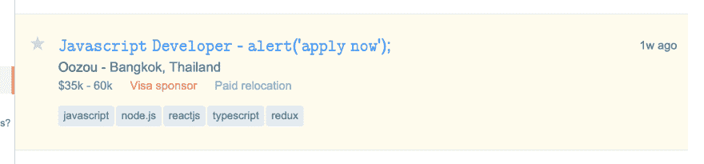

# 𝙷𝚘𝚠 𝚒𝚜 𝚝𝚑𝚒𝚜 𝚖𝚘𝚗𝚘𝚜𝚙𝚊𝚌𝚎?

> 原文：[https://dev.to/squgeim/-3pig](https://dev.to/squgeim/-3pig)

Recently I was scrolling through Stack Overflow's Jobs section and an entry caught my eye (<small>[posting](https://stackoverflow.com/jobs/274306/oozou?so=i&pg=1&offset=15)</small>):

[](https://res.cloudinary.com/practicaldev/image/fetch/s---mj_aA5s--/c_limit%2Cf_auto%2Cfl_progressive%2Cq_auto%2Cw_880/https://thepracticaldev.s3.amazonaws.com/i/c2g0xsqga466qrfn5zgq.png)

The font of the title caught my attention immediately. At first, I was just curious about what the font was (as I am always looking for my next coding font). I applied my usual strategy for when I see an interesting font on the internet: open Developer Inspector and look at the styles for the font's name.

In this case, the CSS rules said this font must be Arial--but it clearly wasn't.

On a closer look, there was definitely something weird happening. The text was monospace in the browser title and in the inspector as well. So there must be something about the characters themselves that made the browser render it in monospace everywhere.

First hint, the first character was not `J`:

```
$0.innerText[0] === 'J' // false 
```

<svg width="20px" height="20px" viewBox="0 0 24 24" class="highlight-action crayons-icon highlight-action--fullscreen-on"><title>Enter fullscreen mode</title></svg> <svg width="20px" height="20px" viewBox="0 0 24 24" class="highlight-action crayons-icon highlight-action--fullscreen-off"><title>Exit fullscreen mode</title></svg>

Also, if you tried to get the code points of the characters, something weird happened:

```
> $0.innerText.charCodeAt(0)
< 55349
> $0.innerText.charCodeAt(1)
< 56953
> $0.innerText.charCodeAt(2)
< 55349 
```

<svg width="20px" height="20px" viewBox="0 0 24 24" class="highlight-action crayons-icon highlight-action--fullscreen-on"><title>Enter fullscreen mode</title></svg> <svg width="20px" height="20px" viewBox="0 0 24 24" class="highlight-action crayons-icon highlight-action--fullscreen-off"><title>Exit fullscreen mode</title></svg>

The first and third characters should not be the same.

When I tried to get the total length of the string, I got:

```
$0.innerText.length() // 74 
```

<svg width="20px" height="20px" viewBox="0 0 24 24" class="highlight-action crayons-icon highlight-action--fullscreen-on"><title>Enter fullscreen mode</title></svg> <svg width="20px" height="20px" viewBox="0 0 24 24" class="highlight-action crayons-icon highlight-action--fullscreen-off"><title>Exit fullscreen mode</title></svg>

But counting the characters manually gets you 42\. Where were the rest of the 32 characters?

When I looked at the text closer, I realized that `(`, `)`, `'`, `-`, `;` and the spaces were not in the same font as the rest of the characters. If we removed these characters we got a count of 32 (42 - 10).

So that's how it got to 74--the monospace letters were occupying two character spaces: 32 * 2 + 10 = 74\. I knew this happened for many Unicode characters, most commonly in emojis. That's why the first and third characters code points were the same.

Now on to figure out what Unicode characters these were specifically.

Some Googling to figure out what these codes meant led me to this awesome website: [http://unicode.scarfboy.com](http://unicode.scarfboy.com)

You can enter any Unicode code point and get an explanation for it. I could not find anything when I searched for the codes themselves, but pasting the character directly got me a result.

Turns out the `J` was actually named `MATHEMATICAL MONOSPACE CAPITAL J`.

This opened up a whole world of specialized​ monospace and other fancy characters meant to be used in Mathematical formula​.

*Resources:*

Full list of Mathematical alphanumeric characters:
[https://www.unicode.org/charts/PDF/U1D400.pdf](https://www.unicode.org/charts/PDF/U1D400.pdf)

A video explaining why Flag emoji are 2 characters by Tom Scott:
[https://www.youtube.com/watch?v=sTzp76JXsoY](https://www.youtube.com/watch?v=sTzp76JXsoY)

A tool to map what you write to these Unicode characters:
[https://yaytext.com/monospace/](https://yaytext.com/monospace/)