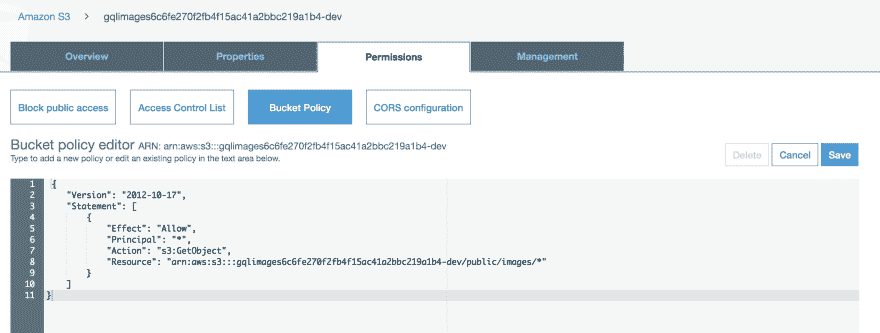

# GraphQL 教程-如何使用 AWS AppSync 和 AWS Amplify 管理图像和文件的上传和下载

> 原文：<https://dev.to/dabit3/graphql-tutorial-how-to-manage-image-file-uploads-downloads-with-aws-appsync-aws-amplify-hga>

### 如何通过 AWS AppSync、AWS Amplify 和亚马逊 S3 使用 GraphQL 创建&查询图像和文件

[](https://res.cloudinary.com/practicaldev/image/fetch/s--qRZ8aMAL--/c_limit%2Cf_auto%2Cfl_progressive%2Cq_auto%2Cw_880/https://thepracticaldev.s3.amazonaws.com/i/8663e9ww7x7d51j5x09l.png)

存储和查询图像和视频之类的文件是大多数应用程序的常见需求，但是如何使用 GraphQL 实现这一点呢？

一种选择是对图像进行 Base64 编码，并在突变中作为字符串发送。这带来了一些缺点，如编码后的文件比原始的二进制文件大，运算量大，以及正确编码和解码的复杂性增加。

另一种选择是使用单独的服务器(或 API)来上传文件。这是我们将在本教程中介绍的首选方法和技术。

> 要查看或试用最终的示例项目，请点击[此处](https://github.com/dabit3/react-amplify-appsync-files-s3)。

## 这一切是如何运作的

要做到这一点，您通常需要几样东西:

1.  一个 GraphQL API
2.  用于保存文件的存储服务或数据库
3.  数据库，用于存储包括对文件位置的引用的 GraphQL 数据

以电子商务应用程序中的产品模式为例:

```
type Product {
  id: ID!
  name: String!
  description: String
  price: Int
  image: ?
} 
```

<svg width="20px" height="20px" viewBox="0 0 24 24" class="highlight-action crayons-icon highlight-action--fullscreen-on"><title>Enter fullscreen mode</title></svg> <svg width="20px" height="20px" viewBox="0 0 24 24" class="highlight-action crayons-icon highlight-action--fullscreen-off"><title>Exit fullscreen mode</title></svg>

我们如何使用这个`image`字段，并让它与我们的应用程序一起存储和引用图像？让我们来看看这是如何处理存储在亚马逊 S3 的图片的。

使用亚马逊 S3 有两种主要的访问方式:**私人**和**公共**。

**公共访问**意味着任何拥有该文件 url 的人都可以随时查看或下载它。在这个用例中，我们可以引用图像 url 作为 GraphQL 模式中的图像字段。因为图片的 url 是公开的，所以我们不关心谁可以查看图片。

**私人访问**意味着只有从你的应用程序调用 API 的用户才能查看或下载文件。在这个用例中，我们将只存储一个对图像键的引用(即`images/mycoolimage.png`)作为 GraphQL 模式中的图像字段。使用这个密钥，我们可以获取一个临时签名的 url，以便在需要的时候从 S3 查看这个图像，只要我们希望有人查看它。

在本教程中，您将学习如何做到这两点。

## 创建客户端

在本教程中，我将在 React 中编写客户端代码，但您可以使用 Vue、Angular 或任何其他 JavaScript 框架，因为我们将编写的 API 调用不是 React 特定的。

创建一个新的客户端项目，进入目录并安装 amplify 和 uuid 依赖项:

```
npx create-react-app gqlimages

cd gqlimages

npm install aws-amplify @aws-amplify/ui-react uuid 
```

<svg width="20px" height="20px" viewBox="0 0 24 24" class="highlight-action crayons-icon highlight-action--fullscreen-on"><title>Enter fullscreen mode</title></svg> <svg width="20px" height="20px" viewBox="0 0 24 24" class="highlight-action crayons-icon highlight-action--fullscreen-off"><title>Exit fullscreen mode</title></svg>

## 公开访问

我们将创建的第一个示例是一个具有公共图像访问的 GraphQL API。

我们将使用的 GraphQL 类型是一个带有`image`字段的`Product`。我们希望该产品的图像是公开的，这样任何查看该应用程序的人都可以共享和看到它，无论他们是否登录。

我们将使用的 GraphQL 模式是这样的:

```
type Product @model {
  id: ID!
  name: String!
  description: String
  price: Int
  image: String
} 
```

<svg width="20px" height="20px" viewBox="0 0 24 24" class="highlight-action crayons-icon highlight-action--fullscreen-on"><title>Enter fullscreen mode</title></svg> <svg width="20px" height="20px" viewBox="0 0 24 24" class="highlight-action crayons-icon highlight-action--fullscreen-off"><title>Exit fullscreen mode</title></svg>

我们如何为此实现 API 呢？

#### 为突变

1.  将图像存储在 S3
2.  发送一个变异，使用图像引用和其他产品数据在 GraphQL API 中创建产品

#### 进行查询

1.  从 GraphQL API 查询产品数据。因为图像 url 是公共的，所以我们可以立即呈现图像字段。

### 创建服务

要构建这个 API，我们需要以下内容:

1.  存储图像的 S3 桶
2.  GraphQL API 来存储图像引用和关于类型的其他数据
3.  对用户进行身份验证的身份验证服务(仅在将文件上传到 S3 时需要)

我们要做的第一件事是创建认证服务。为此，我们将初始化一个 Amplify 项目并添加身份验证。

> 如果您尚未安装和配置 Amplify CLI，请点击[此处](https://www.youtube.com/watch?v=fWbM5DLh25U)观看视频演示。

```
amplify init

amplify add auth

? Do you want to use the default authentication and security configuration? Default configuration
? How do you want users to be able to sign in when using your Cognito User Pool? Username
? What attributes are required for signing up? Email 
```

<svg width="20px" height="20px" viewBox="0 0 24 24" class="highlight-action crayons-icon highlight-action--fullscreen-on"><title>Enter fullscreen mode</title></svg> <svg width="20px" height="20px" viewBox="0 0 24 24" class="highlight-action crayons-icon highlight-action--fullscreen-off"><title>Exit fullscreen mode</title></svg>

接下来，我们将创建存储服务(亚马逊 S3):

```
amplify add storage

? Please select from one of the below mentioned services: Content (Images, audio, video, etc.)
? Please provide a friendly name for your resource that will be used to label this category in the project: gqls3
? Please provide bucket name: <YOUR_UNIQUE_BUCKET_NAME>
? Who should have access: Auth and guest users
? What kind of access do you want for Authenticated users?
  ❯◉ create/update
   ◉ read
   ◉ delete
? What kind of access do you want for Guest users?
 ◯ create/update
❯◉ read
 ◯ delete
? Do you want to add a Lambda Trigger for your S3 Bucket? N 
```

<svg width="20px" height="20px" viewBox="0 0 24 24" class="highlight-action crayons-icon highlight-action--fullscreen-on"><title>Enter fullscreen mode</title></svg> <svg width="20px" height="20px" viewBox="0 0 24 24" class="highlight-action crayons-icon highlight-action--fullscreen-off"><title>Exit fullscreen mode</title></svg>

最后，我们将创建 GraphQL API:

```
amplify add api

? Please select from one of the below mentioned services (Use arrow keys): GraphQL
? Provide API name: (gqls3)
? Choose an authorization type for the API: API key
? Do you have an annotated GraphQL schema? N
? Do you want a guided schema creation? Y
? What best describes your project: Single object with fields
? Do you want to edit the schema now? Y 
```

<svg width="20px" height="20px" viewBox="0 0 24 24" class="highlight-action crayons-icon highlight-action--fullscreen-on"><title>Enter fullscreen mode</title></svg> <svg width="20px" height="20px" viewBox="0 0 24 24" class="highlight-action crayons-icon highlight-action--fullscreen-off"><title>Exit fullscreen mode</title></svg>

当出现提示时，用以下内容更新位于**/amplify/back end/API/gqls 3/schema . graph QL**的模式:

```
type  Product  @model  {  id:  ID!  name:  String!  description:  String  price:  Int  image:  String  } 
```

<svg width="20px" height="20px" viewBox="0 0 24 24" class="highlight-action crayons-icon highlight-action--fullscreen-on"><title>Enter fullscreen mode</title></svg> <svg width="20px" height="20px" viewBox="0 0 24 24" class="highlight-action crayons-icon highlight-action--fullscreen-off"><title>Exit fullscreen mode</title></svg>

接下来，我们可以使用以下代码部署 API:

```
amplify push

? Do you want to generate code for your newly created GraphQL API Yes
? Choose the code generation language target javascript
? Enter the file name pattern of graphql queries, mutations and subscriptions src/graphql/**/*.js
? Do you want to generate/update all possible GraphQL operations - queries, mutations and subscriptions Yes
? Enter maximum statement depth [increase from default if your schema is deeply nested] 2 
```

<svg width="20px" height="20px" viewBox="0 0 24 24" class="highlight-action crayons-icon highlight-action--fullscreen-on"><title>Enter fullscreen mode</title></svg> <svg width="20px" height="20px" viewBox="0 0 24 24" class="highlight-action crayons-icon highlight-action--fullscreen-off"><title>Exit fullscreen mode</title></svg>

接下来，我们将配置 **index.js** 来识别 Amplify 应用:

```
import Amplify from 'aws-amplify'
import config from './aws-exports'
Amplify.configure(config) 
```

<svg width="20px" height="20px" viewBox="0 0 24 24" class="highlight-action crayons-icon highlight-action--fullscreen-on"><title>Enter fullscreen mode</title></svg> <svg width="20px" height="20px" viewBox="0 0 24 24" class="highlight-action crayons-icon highlight-action--fullscreen-off"><title>Exit fullscreen mode</title></svg>

现在服务已经部署好了，我们需要更新 S3 存储区，以拥有一个公共的 **/images** 文件夹，这样任何人都可以查看存储在该文件夹中的任何内容。

> 警告:当公开一个 S3 文件夹时，你应该确保你*永远不要*在这里存储任何敏感或私人信息，因为该文件夹对任何人都是完全开放的。在这种情况下，我们正在模拟一个电子商务应用程序，其中有我们产品的公共图像，这些图像将出现在主网站上。

在[https://s3.console.aws.amazon.com](https://s3.console.aws.amazon.com)打开 S3 控制台，找到您在上一步创建的铲斗。

接下来，单击**权限**选项卡来更新存储桶策略。

[](https://res.cloudinary.com/practicaldev/image/fetch/s--n3pcuakR--/c_limit%2Cf_auto%2Cfl_progressive%2Cq_auto%2Cw_880/https://thepracticaldev.s3.amazonaws.com/i/tz9uzlv73y4eze4ca07k.png)

将策略更新为以下内容。您需要将**资源**字段更新为您的时段的资源名称(即`arn:aws:s3:::gqlimages6c6fev-dev`需要替换为您的时段的名称):

```
{  "Version":  "2012-10-17",  "Statement":  [  {  "Effect":  "Allow",  "Principal":  "*",  "Action":  "s3:GetObject",  "Resource":  "arn:aws:s3:::gqlimages6c6fev-dev/publimg/*"  }  ]  } 
```

<svg width="20px" height="20px" viewBox="0 0 24 24" class="highlight-action crayons-icon highlight-action--fullscreen-on"><title>Enter fullscreen mode</title></svg> <svg width="20px" height="20px" viewBox="0 0 24 24" class="highlight-action crayons-icon highlight-action--fullscreen-off"><title>Exit fullscreen mode</title></svg>

### 从客户端应用程序与 API 交互

既然后端已经创建好了，我们如何与它交互来上传和读取图像呢？

下面的代码不仅可以将文件保存到我们的 API 中，还可以在 UI 中查询和呈现它们。

有两个主要功能:

1.  `createProduct` -将产品图像上传到 S3，并将产品数据以 GraphQL 的形式保存到 AppSync
2.  `listProducts` -查询所有产品的 GraphQL API

```
import React, { useEffect, useState } from 'react';
import { Storage, API, graphqlOperation } from 'aws-amplify'
import { v4 as uuid } from 'uuid'
import { withAuthenticator } from '@aws-amplify/ui-react'

import { createProduct as CreateProduct } from './graphql/mutations'
import { listProducts as ListProducts } from './graphql/queries'
import config from './aws-exports'

const {
  aws_user_files_s3_bucket_region: region,
  aws_user_files_s3_bucket: bucket
} = config

function App() {
  const [file, updateFile] = useState(null)
  const [productName, updateProductName] = useState('')
  const [products, updateProducts] = useState([])
  useEffect(() => {
    listProducts()
  }, [])

  // Query the API and save them to the state
  async function listProducts() {
    const products = await API.graphql(graphqlOperation(ListProducts))
    updateProducts(products.data.listProducts.items)
  }

  function handleChange(event) {
    const { target: { value, files } } = event
    const fileForUpload = files[0]
    updateProductName(fileForUpload.name.split(".")[0])
    updateFile(fileForUpload || value)
  }

  // upload the image to S3 and then save it in the GraphQL API
  async function createProduct() {
    if (file) {
      const extension = file.name.split(".")[1]
      const { type: mimeType } = file
      const key = `images/${uuid()}${productName}.${extension}`      
      const url = `https://${bucket}.s3.${region}.amazonaws.com/public/${key}`
      const inputData = { name: productName , image: url }

      try {
        await Storage.put(key, file, {
          contentType: mimeType
        })
        await API.graphql(graphqlOperation(CreateProduct, { input: inputData }))
      } catch (err) {
        console.log('error: ', err)
      }
    }
  }

  return (
    <div style={styles.container}>
      <input
        type="file"
        onChange={handleChange}
        style={{margin: '10px 0px'}}
      />
      <input
        placeholder='Product Name'
        value={productName}
        onChange={e => updateProductName(e.target.value)}
      />
      <button
        style={styles.button}
        onClick={createProduct}>Create Product</button> 
      {
        products.map((p, i) => (
          
        ))
      }
    </div>
  );
}

const styles = {
  container: {
    width: 400,
    margin: '0 auto'
  },
  image: {
    width: 400
  },
  button: {
    width: 200,
    backgroundColor: '#ddd',
    cursor: 'pointer',
    height: 30,
    margin: '0px 0px 8px'
  }
}

export default withAuthenticator(App); 
```

<svg width="20px" height="20px" viewBox="0 0 24 24" class="highlight-action crayons-icon highlight-action--fullscreen-on"><title>Enter fullscreen mode</title></svg> <svg width="20px" height="20px" viewBox="0 0 24 24" class="highlight-action crayons-icon highlight-action--fullscreen-off"><title>Exit fullscreen mode</title></svg>

要启动应用程序，请运行`npm start`。

> 要查看完整的项目代码，点击[此处](https://github.com/dabit3/react-amplify-appsync-files-s3)并打开`src/Products.js`文件。

## 私人访问

我们将创建的下一个例子是一个 GraphQL API，它的类型有一个私有的 image 字段。

此图片只能由使用我们的应用程序的人访问。如果有人试图直接获取此图像，他们将无法查看它。

对于 image 字段，我们将创建一个 GraphQL 类型，它保存我们需要的所有信息，以便从 S3 存储桶中创建和读取私有文件，包括存储桶名称和区域，以及我们希望从存储桶中读取的键。

我们将使用的 GraphQL 类型是一个带有`avatar`字段的`User`。我们希望这个头像图像是私人的，所以它只能被登录到应用程序的人看到。

我们将使用的 GraphQL 模式是这样的:

```
type User @model {
  id: ID!
  username: String!
  avatar: S3Object
}

type S3Object {
  bucket: String!
  region: String!
  key: String!
} 
```

<svg width="20px" height="20px" viewBox="0 0 24 24" class="highlight-action crayons-icon highlight-action--fullscreen-on"><title>Enter fullscreen mode</title></svg> <svg width="20px" height="20px" viewBox="0 0 24 24" class="highlight-action crayons-icon highlight-action--fullscreen-off"><title>Exit fullscreen mode</title></svg>

我们如何实现 API 来实现这一点呢？

#### 为突变

1.  将图像存储在 S3
2.  发送一个变异，使用图像引用和其他用户数据在 GraphQL API 中创建用户

#### 进行查询

1.  从 API 查询用户数据(包括图像引用)
2.  在另一个 API 调用中从 S3 获取图像的签名 URL

要构建此应用程序，我们需要以下内容:

1.  对用户进行认证的认证服务
2.  存储图像的 S3 存储桶
3.  GraphQL API 来存储图像引用和关于类型的其他数据

### 构建 app

> 如果您没有在前面的示例中构建应用程序，请返回并构建上面的项目(创建认证服务、GraphQL API 和 S3 桶)以便继续。

我们现在可以更新位于**/amplify/back end/API/gqls 3/schema . graph QL**的模式，并添加以下类型:

```
type  User  @model  {  id:  ID!  username:  String!  avatar:  S3Object  }  type  S3Object  {  bucket:  String!  region:  String!  key:  String!  } 
```

<svg width="20px" height="20px" viewBox="0 0 24 24" class="highlight-action crayons-icon highlight-action--fullscreen-on"><title>Enter fullscreen mode</title></svg> <svg width="20px" height="20px" viewBox="0 0 24 24" class="highlight-action crayons-icon highlight-action--fullscreen-off"><title>Exit fullscreen mode</title></svg>

接下来，我们可以部署变更:

```
amplify push

? Do you want to update code for your updated GraphQL API Yes
? Do you want to generate GraphQL statements (queries, mutations and
subscription) based on your schema types? This will overwrite your cu
rrent graphql queries, mutations and subscriptions Yes 
```

<svg width="20px" height="20px" viewBox="0 0 24 24" class="highlight-action crayons-icon highlight-action--fullscreen-on"><title>Enter fullscreen mode</title></svg> <svg width="20px" height="20px" viewBox="0 0 24 24" class="highlight-action crayons-icon highlight-action--fullscreen-off"><title>Exit fullscreen mode</title></svg>

### 从客户端应用程序与 API 交互

既然后端已经创建好了，我们如何与它交互来上传和读取图像呢？

下面的代码不仅可以将文件保存到我们的 API 中，还可以在 UI 中查询和呈现它们。

有三个主要功能:

1.  `createUser` -(将用户图像上传到 S3，并将用户数据保存到 GraphQL 变体中的 AppSync)
2.  `fetchUsers` -查询所有用户的 GraphQL API
3.  `fetchImage` -获取图像的签名 S3 url，以便我们渲染它，并在 UI 中渲染它。

```
import React, { useState, useReducer, useEffect } from 'react'
import { withAuthenticator } from 'aws-amplify-react'
import { Storage, API, graphqlOperation } from 'aws-amplify'
import { v4 as uuid } from 'uuid'
import { createUser as CreateUser } from './graphql/mutations'
import { listUsers } from './graphql/queries'
import { onCreateUser } from './graphql/subscriptions'
import config from './aws-exports'

const {
  aws_user_files_s3_bucket_region: region,
  aws_user_files_s3_bucket: bucket
} = config

const initialState = {
  users: []
}

function reducer(state, action) {
  switch(action.type) {
    case 'SET_USERS':
      return { ...state, users: action.users }
    case 'ADD_USER':
      return { ...state, users: [action.user, ...state.users] }
    default:
      return state
  }
}

function App() {
  const [file, updateFile] = useState(null)
  const [username, updateUsername] = useState('')
  const [state, dispatch] = useReducer(reducer, initialState)
  const [avatarUrl, updateAvatarUrl] = useState('')

  function handleChange(event) {
    const { target: { value, files } } = event
    const [image] = files || []
    updateFile(image || value)
  }

  async function fetchImage(key) {
    try {
      const imageData = await Storage.get(key)
      updateAvatarUrl(imageData)
    } catch(err) {
      console.log('error: ', err)
    }
  }

  async function fetchUsers() {
    try {
     let users = await API.graphql(graphqlOperation(listUsers))
     users = users.data.listUsers.items
     dispatch({ type: 'SET_USERS', users })
    } catch(err) {
      console.log('error fetching users')
    }
  }

  async function createUser() {
    if (!username) return alert('please enter a username')
    if (file && username) {
        const { name: fileName, type: mimeType } = file  
        const key = `${uuid()}${fileName}`
        const fileForUpload = {
            bucket,
            key,
            region,
        }
        const inputData = { username, avatar: fileForUpload }

        try {
          await Storage.put(key, file, {
            contentType: mimeType
          })
          await API.graphql(graphqlOperation(CreateUser, { input: inputData }))
          updateUsername('')
          console.log('successfully stored user data!')
        } catch (err) {
          console.log('error: ', err)
        }
    }
  }
  useEffect(() => {
    fetchUsers()
    const subscription = API.graphql(graphqlOperation(onCreateUser))
      .subscribe({
        next: async userData => {
          const { onCreateUser } = userData.value.data
          dispatch({ type: 'ADD_USER', user: onCreateUser })
        }
      })
    return () => subscription.unsubscribe()
  }, [])

  return (
    <div style={styles.container}>
      <input
        label="File to upload"
        type="file"
        onChange={handleChange}
        style={{margin: '10px 0px'}}
      />
      <input
        placeholder='Username'
        value={username}
        onChange={e => updateUsername(e.target.value)}
      />
      <button
        style={styles.button}
        onClick={createUser}>Save Image</button>
      {
        state.users.map((u, i) => {
          return (
            <div
              key={i}
            >
              <p
                style={styles.username}
               onClick={() => fetchImage(u.avatar.key)}>{u.username}</p>
            </div>
          )
        })
      }
      
    </div>
  )
}

const styles = {
  container: {
    width: 300,
    margin: '0 auto'
  },
  username: {
    cursor: 'pointer',
    border: '1px solid #ddd',
    padding: '5px 25px'
  },
  button: {
    width: 200,
    backgroundColor: '#ddd',
    cursor: 'pointer',
    height: 30,
    margin: '0px 0px 8px'
  }
}

export default withAuthenticator(App) 
```

<svg width="20px" height="20px" viewBox="0 0 24 24" class="highlight-action crayons-icon highlight-action--fullscreen-on"><title>Enter fullscreen mode</title></svg> <svg width="20px" height="20px" viewBox="0 0 24 24" class="highlight-action crayons-icon highlight-action--fullscreen-off"><title>Exit fullscreen mode</title></svg>

要启动应用程序，请运行`npm start`。

> 要查看或试用最终的示例项目，请点击[此处](https://github.com/dabit3/react-amplify-appsync-files-s3)。
> 
> 我的名字是纳德·达比特。我是亚马逊网络服务的一名开发者倡导者，负责像 [AWS AppSync](https://aws.amazon.com/appsync/) 和 [AWS Amplify](https://aws-amplify.github.io/) 这样的项目。我专门从事跨平台&云应用开发。