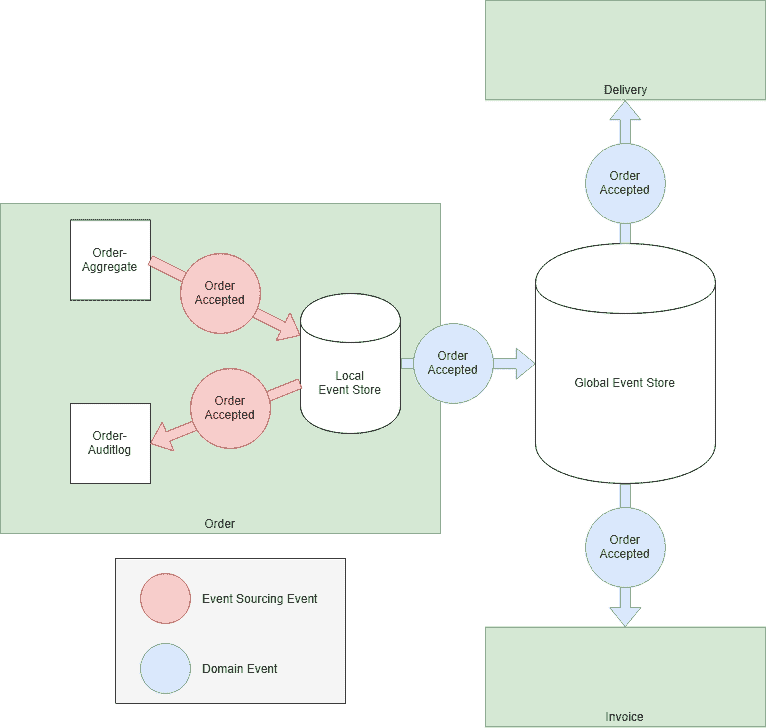
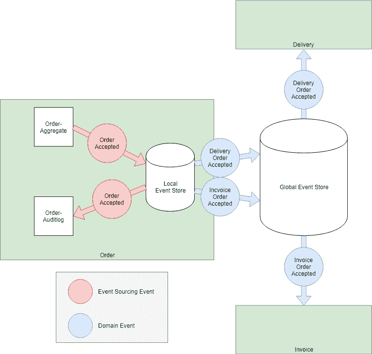

# 事件源为什么事件源是微服务通信反模式

> 原文：<https://dev.to/olibutzki/why-event-sourcing-is-a-microservice-anti-pattern-3mcj>

在过去几年中，事件驱动架构，尤其是事件源，获得了越来越多的关注。这种趋势是由我们努力构建具有弹性和可伸缩性的模块化系统这一事实引起的。*微服务*是在这种情况下经常使用的术语。在我看来，微服务只是实现有界上下文的一种方式。模块化系统的核心是模块的边界，如何识别这些边界的最有前途的想法是由 Eric Evans 的领域驱动设计引入的[战略设计](https://en.wikipedia.org/wiki/Domain-driven_design#Strategic_domain-driven_design)。它帮助你通过它们的边界([有界上下文](https://martinfowler.com/bliki/BoundedContext.html))来识别/发现你的模块，并描述这些有界上下文是如何相互关联的(上下文图)。

注意:我会预先假定一些关于某些术语的预知，因为我不想第一千次解释它们。我决定链接到[微服务. io](https://microservices.io/) 、[维基百科](https://en.wikipedia.org)或[马丁·福勒的 Bliki](https://martinfowler.com/bliki/) 的解释，所以如果你对自己的知识感到不舒服，就看你自己了。

# 领域事件作为无处不在的语言之心

虽然在 Eric 的书中没有明确提到，但是领域事件很好地促进了 DDD 概念的形成。Alberto Brandolini 的[事件风暴](https://en.wikipedia.org/wiki/Event_storming)等技术将对事件的关注从技术层面转移到组织/业务层面。我们不讨论像*按钮点击事件*这样的 UI 层事件，而是讨论作为业务领域一部分的领域事件，这些事件是业务专家所说和理解的。这些领域事件是一流的概念，并且提供了一种很好的方式来形成[无处不在的语言](https://martinfowler.com/bliki/UbiquitousLanguage.html)，所有的参与者(领域专家，开发人员，...)同意。

# 域事件用于跨边界通信

领域事件可用于促进有界上下文之间的通信。假设我们有一个在线商店，它有三个有界的上下文:订单、交货、发票。

订单上下文的域事件是*订单被接受*。发票和交货上下文对该事件的发生感兴趣，因为它会导致一些内部流程启动。

# 脱钩神话

使用域事件有助于开发分离的模块。模块可能会暂时脱机。域事件不关心不可用的模块，它们描述过去发生的事情。这取决于其他模块处理事件的速度。你得到的是一个有弹性的系统。

除了时间解耦，域事件还有另一个优点，至少初看起来是这样:
订单上下文不需要知道发票和交付上下文监听它的事件。实际上，它甚至不需要知道这些上下文的存在。

这很酷，但是具有挑战性的部分是事件负载。哪些数据被放入事件中？

# 简单的答案:事件采购！

事件是有用的，所以为什么不给它们尽可能多的权力(和责任)呢？这就是[事件源](https://microservices.io/patterns/data/event-sourcing.html)的基本思想。您不是通过更新数据(CRUD)来存储聚合的状态，而是通过应用事件流来存储。

除了可以重放事件来重建应用程序状态之外，Event Sourcing 一个很好的特性是可以免费获得完整可靠的审计日志。因此，当需要这样的审计日志时，在评估持久性策略时，一定要考虑事件来源。

# 事件采购仅仅是一种持续性策略吗？

你可能想知道为什么我从领域事件直接到持久性策略，因为这些概念显然在不同的层/抽象层次上工作。

...这就是我的观点:事件采购是由一个有限的上下文做出的局部决策！这些事件不应该暴露给外界！其他有界上下文不知道彼此的持久性策略，因此它们不知道也不关心另一个有界上下文是否使用事件源。

如果您在全球范围内使用事件源，您就公开了您的持久层。

您的持久性成为您的公共 API。每次有界上下文调整其持久数据时，我们都必须处理公共 API 的变化。

我确信每个人都同意，由于开发和运行时的耦合，不同的有界上下文[在一个(关系)数据库](https://microservices.io/patterns/data/shared-database.html)中共享数据是一个坏主意。但是区别在哪里呢？

没有。我们是否共享事件或数据库表并不重要。在这两种情况下，我们共享我们的持久性细节。

# 有出路

我仍然认为领域事件非常适合有界上下文之间的通信，但是这些事件不应该对应于用于事件源的事件。

我提出的解决方案是一个合乎逻辑的结果:不管您是使用 CRUD 还是事件源方法来实现持久性，您都要将域事件发布到全局事件存储中。这些域事件是您的有界上下文的公共 API。如果您喜欢在您的有界上下文中使用事件源，您可以将这些事件存储在一个本地事件存储中，该事件存储只能从这个有界上下文中访问

# 选择的自由

在您的公共 API 中拥有专用的领域事件，这为决定如何对这些事件建模提供了可能性。您不会受限于事件来源事件预定义的布局。

对于“真实世界事件”的每次发生，您有两种选择:

## 用发布的语言打开主机服务

仅发布一个域事件，该事件包含其他有界上下文可能需要的所有数据。在 DDD 的术语中，人们会称之为一种公开语言的开放主机服务。

现实世界事件 *Order accepted* 的发生导致一个发布域事件 *OrderAccepted* 。该事件的有效负载包含 Order 期望其他有界上下文感兴趣的所有数据...因此，希望发票和交付上下文能够找到它们需要的所有信息。

## 客户/供应商

发布多个专用域事件，每个事件消费者一个事件。您必须与另一方(消费者)讨论每个特定的领域事件，而不必定义一个共享模型。DDD 称这种关系为客户/供应商。

现实世界事件 *Order accepted* 的发生导致每个消费有界上下文一个发布域事件:*invoiceordercepted*和*deliveryordercepted*。每个域事件都包含消费上下文所请求的数据。

我不想讨论这两种选择的利弊。我只想强调你可以自由选择域事件的数量和它们的有效负载。

这是一个您不应该低估的巨大优势，因为您可以决定如何发展您的有界上下文的 API，而不是致力于您需要的事件源的事件。

# 结论

向外界公开持久性细节是一种众所周知的反模式。当谈到持久性时，我们首先想到的是数据库表，但是我解释了为什么用于事件源的事件只是持久化数据的另一种方式。因此公开这些事件也是一种反模式。

> 🖖Jochen 马德🇪🇺@ codepitball一个好的开发者就像一个狼人:害怕银弹。09:48AM-08 Oct 2016438538

如果以适当的(本地)方式使用，事件源是强大的。乍一看，它似乎是事件驱动架构的银弹，但是如果你深入研究，你会发现它可能会把你引向一个紧密耦合的(分布式)系统...这肯定不是你的目标。

# 参考文献

除了我的个人经历，我还从不同的摘要和会议讨论中获得了很多灵感。我想强调一下 Eberhard Wolff 的演讲*基于事件的架构和 Kafka 与 Atom 的实现*。尤其是章节[活动采购](https://youtu.be/Ecg7lvvm8aU?t=1178)和[有什么活动？](https://youtu.be/Ecg7lvvm8aU?t=655)与本文内容高度相关。我选择的网上商店的例子就是受这个演讲的启发。

如果您想获得更多信息，可以参考其他一些资源:

*   Christian Stettler 的博客文章[领域事件与事件采购](https://www.innoq.com/en/blog/domain-events-versus-event-sourcing/)
*   Hugo Rocha 的博客文章
*   [CQRS DDD 事件采购十年(CQRS/ES 不是顶级架构)](https://youtu.be/LDW0QWie21s?t=1259)Greg Young，会议演讲