# 带示例的在 Selenium 中使用 XPath 的完整指南

> 原文：<https://dev.to/lambdatest/complete-guide-for-using-xpath-in-selenium-with-examples-2656>

识别元素一直是最棘手的部分，因此需要精确和正确的方法。如果您无法通过 ID、类、名称、链接或标记名等简单的方法找到元素，那么 Selenium 中的 XPath 可以帮助您。定位动态元素一直是一个棘手的问题，虽然您希望自动化脚本，但是处理这种失败的唯一希望是 XPath。在我当前的文章中，我将深入探讨在 Selenium 中通过 XPath 示例定位元素的步骤及其各种方式。我们将查看以下部分:
**1。[Selenium 中的 XPath 是什么？](https://www.lambdatest.com/blog/complete-guide-for-using-xpath-in-selenium-with-examples/#testid1?utm_source=dev&utm_medium=Blog&utm_campaign=Sadhvi-28062043&utm_term=Sadhvi)**
**2。[硒中 XPath 的类型](https://www.lambdatest.com/blog/complete-guide-for-using-xpath-in-selenium-with-examples/#testid2?utm_source=dev&utm_medium=Blog&utm_campaign=Sadhvi-28062042&utm_term=Sadhvi)**
2.1 [绝对](https://www.lambdatest.com/blog/complete-guide-for-using-xpath-in-selenium-with-examples/#testid1.1?utm_source=dev&utm_medium=Blog&utm_campaign=Sadhvi-28062042&utm_term=Sadhvi)
2.2 [相对](https://www.lambdatest.com/blog/complete-guide-for-using-xpath-in-selenium-with-examples/#testid1.2?utm_source=dev&utm_medium=Blog&utm_campaign=Sadhvi-28062041&utm_term=Sadhvi)
**3 .[用不同的方式在 Selenium 中编写动态 XPath](https://www.lambdatest.com/blog/complete-guide-for-using-xpath-in-selenium-with-examples/#testid3?utm_source=dev&utm_medium=Blog&utm_campaign=Sadhvi-28062040&utm_term=Sadhvi):**
3.1[基本 XPath](https://www.lambdatest.com/blog/complete-guide-for-using-xpath-in-selenium-with-examples/#testid2.1?utm_source=dev&utm_medium=Blog&utm_campaign=Sadhvi-28062039&utm_term=Sadhvi)
3.2 [使用' OR' &'和'](https://www.lambdatest.com/blog/complete-guide-for-using-xpath-in-selenium-with-examples/#testid2.2?utm_source=dev&utm_medium=Blog&utm_campaign=Sadhvi-28062038&utm_term=Sadhvi)
3.3 [使用 Contains()](https://www.lambdatest.com/blog/complete-guide-for-using-xpath-in-selenium-with-examples/#testid2.3?utm_source=dev&utm_medium=Blog&utm_campaign=Sadhvi-28062037&utm_term=Sadhvi)
3.4 [使用 Starts-With](https://www.lambdatest.com/blog/complete-guide-for-using-xpath-in-selenium-with-examples/#testid2.4?utm_source=dev&utm_medium=Blog&utm_campaign=Sadhvi-28062036&utm_term=Sadhvi)
3.5 [使用 Text()](https://www.lambdatest.com/blog/complete-guide-for-using-xpath-in-selenium-with-examples/#testid2.5?utm_source=dev&utm_medium=Blog&utm_campaign=Sadhvi-28062035&utm_term=Sadhvi)
3.6 [使用索引](https://www.lambdatest.com/blog/complete-guide-for-using-xpath-in-selenium-with-examples/#testid2.6?utm_source=dev&utm_medium=Blog&utm_campaign=Sadhvi-28062034&utm_term=Sadhvi)
3.7 [使用链式 XPath](https://www.lambdatest.com/blog/complete-guide-for-using-xpath-in-selenium-with-examples/#testid2.7?utm_source=dev&utm_medium=Blog&utm_campaign=Sadhvi-28062033&utm_term=Sadhvi)
3.8 [XPath 轴](https://www.lambdatest.com/blog/complete-guide-for-using-xpath-in-selenium-with-examples/#testid2.8?utm_source=dev&utm_medium=Blog&utm_campaign=Sadhvi-28062032&utm_term=Sadhvi)
3 . 8 . 1
3.8.1.1[跟随同级](https://www.lambdatest.com/blog/complete-guide-for-using-xpath-in-selenium-with-examples/#testid2.8.1.1?utm_source=dev&utm_medium=Blog&utm_campaign=Sadhvi-28062029&utm_term=Sadhvi)
3.8.2 [在前](https://www.lambdatest.com/blog/complete-guide-for-using-xpath-in-selenium-with-examples/#testid2.8.2?utm_source=dev&utm_medium=Blog&utm_campaign=Sadhvi-28062028&utm_term=Sadhvi)
3.8.2.1[在前同级](https://www.lambdatest.com/blog/complete-guide-for-using-xpath-in-selenium-with-examples/#testid2.8.2.1?utm_source=dev&utm_medium=Blog&utm_campaign=Sadhvi-28062027&utm_term=Sadhvi)
3 . 8 . 3
3

如果您希望研究定位元素的其他方法，您可以查看下面的文章:
**1。[如何通过 ID](https://www.lambdatest.com/blog/making-the-move-with-id-locator-in-selenium-webdriver/?utm_source=dev&utm_medium=Blog&utm_campaign=Sadhvi-28062023&utm_term=Sadhvi)**
**2 定位元素。[如何通过名称](https://www.lambdatest.com/blog/how-to-use-name-locator-in-selenium-automation-scripts/?utm_source=dev&utm_medium=Blog&utm_campaign=Sadhvi-28062022&utm_term=Sadhvi)**
**定位元素 3。[如何通过标记名](https://www.lambdatest.com/blog/locating-elements-by-tagname-in-selenium/?utm_source=dev&utm_medium=Blog&utm_campaign=Sadhvi-28062021&utm_term=Sadhvi)**
**4 定位元素。[如何通过 CSS 选择器](https://www.lambdatest.com/blog/how-pro-testers-use-css-selectors-in-selenium-automation-scripts/?utm_source=dev&utm_medium=Blog&utm_campaign=Sadhvi-28062020&utm_term=Sadhvi)**
**定位元素 5 .[Selenium web driver 中的不同定位器](https://www.lambdatest.com/blog/locators-in-selenium-webdriver-with-examples/?utm_source=dev&utm_medium=Blog&utm_campaign=Sadhvi-28062019&utm_term=Sadhvi)**

## 那么，硒中的 XPath 是什么？

被称为 XML path 的 XPath 是一种帮助查询 XML 文档的语言。它由路径表达式和特定条件组成，用于定位特定元素。

因此，让我们看看如何用 Selenium 编写 XPath。下面是 [LambdaTest 注册页面](https://accounts.lambdatest.com/register/?utm_source=dev&utm_medium=Blog&utm_campaign=Sadhvi-28062019&utm_term=Sadhvi) :
的 DOM 结构

```
<form method="POST" action="https://accounts.lambdatest.com/register">
<input type="hidden" name="_token" value="W4D7bCygQ4abq2Xa3ckZ2rwG3Wk7f9enPXIIPeuF"> 
<div class="col-sm-12 google-sign-form"><p class="signup-titel" style="text-align: center;">SIGN UP FOR FREE</p></div> <div class="col-sm-12 google-sign-form">
<input type="text" placeholder="Organization/Company Name" name="organization_name" value="" class="form-control sign-up-input-2 ">
 <input type="text" placeholder="Full Name*" name="name" value="" class="form-control sign-up-input-2 ">
 <input type="email" placeholder="Work Email*" name="email" value="" class="form-control sign-up-input-2 "> 
<input type="password" placeholder="Desired Password*" name="password" class="form-control sign-up-input-2 "> <input type="phone" placeholder="Phone*" name="phone" value="" class="form-control sign-up-input-2 "> <p class="terms-cond"><label for="terms_of_service" class="woo">
<input type="checkbox" name="terms_of_service" id="terms_of_service" value="1" class="form-check-input" style="position: relative; margin-left: 0px;"> &nbsp; I agree to the <a target="_blank" href="https://www.lambdatest.com/terms-of-service">Terms
                                    of Service</a>
                                and <a target="_blank" href="https://www.lambdatest.com/privacy">Privacy Policy</a></label></p> <button type="submit" class=" btn sign-up-btn-2 btn-block">Signup for Free</button></div>
 <div class="col-sm-12 link-sect"><p class="login-in-link test-left">Already have an account? <a href="/login">Login</a></p></div></form> 
```

Enter fullscreen mode Exit fullscreen mode

引用的页面截图:

[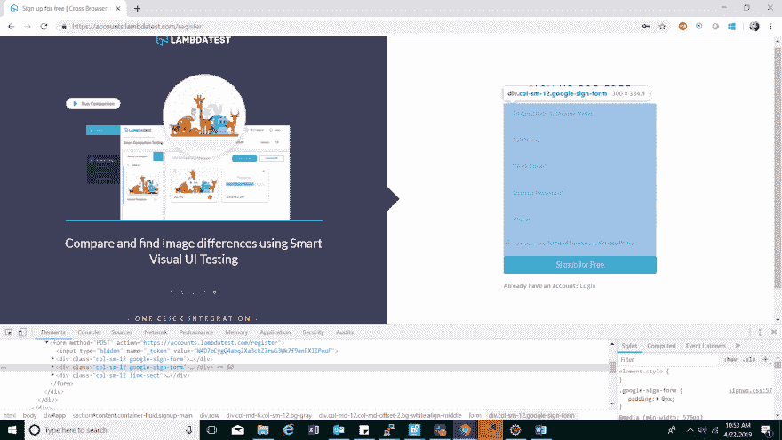](https://res.cloudinary.com/practicaldev/image/fetch/s--GRQrtcRK--/c_limit%2Cf_auto%2Cfl_progressive%2Cq_auto%2Cw_880/https://www.lambdatest.com/blog/wp-content/uploads/2019/05/Referenced-screenshot.png)

为了可视化上面的 XML 文档，我创建了下面的流程图。

[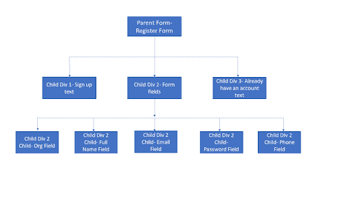](https://res.cloudinary.com/practicaldev/image/fetch/s--PHLHH_tA--/c_limit%2Cf_auto%2Cfl_progressive%2Cq_auto%2Cw_880/https://www.lambdatest.com/blog/wp-content/uploads/2019/05/flowchart.png)

这里，我将从根节点(在我们的例子中是表单标记)用 Selenium 编写 XPath，然后使用 div 2 子节点和全名字段的属性值来定位全名字段。在这种情况下创建的 XPath 如下所示:下面是一个代码片段，突出显示了使用相对 XPath 为 LambdaTest 的注册页面编写的 XPath。

`//form/div[@class=’ col-sm-12 google-sign-form’]/input[@name=’ name’]`

在这种情况下，我引用了 children 和 sun 的一个属性，以区别于每个父级的多个 children 和 sun。由此我们可以推导出 XPath 的一般语法如下:

`//tagname[@attribute name= ‘value’]` 

这里

1.  **//** 表示当前节点
2.  **标记名:**定义您正在引用的标记名，以定位元素。
3.  **属性值:**您希望通过其缩小搜索范围的 define 标记的属性。
4.  值:表示任何所选属性的值。

现在，充分使用多种插件和工具可以帮助人们相对容易地在 Selenium 中找到 XPath。我不鼓励人们这样做的原因是，这些工具提供的 XPath 有时很脆弱。此外，这可能会导致人们忘记创建 XPath 定位器的基本概念。使用 firebug 和 Chrome 开发工具，还可以在 Selenium 中复制所需的 XPath。

## 硒中 XPath 的类型

XPath 有两种类型

1.  绝对 XPath
2.  相对 XPath

### 硒中的绝对 XPath 示例

对于 Selenium 中的绝对 XPath，使用根节点中的选择来创建 XPath 表达式。它以一个斜杠“/”开始，从根遍历到整个 DOM，到达所需的元素。使用它来定位元素的最大缺点是，如果在开发过程中对路径进行了任何更改，可能会导致 XPath 表达式失败。例如:

`/html/body/div[1]/section/div/div[2]/div/form/div[2]/input[3]`

在上面 Selenium 中的 XPath 示例中，如果任何标记名(如 section)或 div 中的一个更改，整个 XPath 都会变得无效，从而导致脚本失败。

### 硒中相对 XPath 的例子

对于 Selenium 中的相对 XPath，XPath 表达式从 DOM 结构的中间生成。它由表示当前节点的双斜线“//”表示。在这种情况下，搜索将从提到的标记名和字符串值开始。它更紧凑，更容易使用，更不容易被打破。例如:

`//input[@name=’email’]`

在上面 Selenium 中的 XPath 示例中，我们从当前节点开始搜索，标记名输入的属性名的值为 email。

下面是一段代码，突出显示了使用 relative XPath 为 LambdaTest 的注册页面编写的 XPath。

```
import java.util.concurrent.TimeUnit;

import org.openqa.selenium.By;
import org.openqa.selenium.WebDriver;
import org.openqa.selenium.chrome.ChromeDriver;

public class RelativeXpathExample {

    public static void main(String[] args) {
        // TODO Auto-generated method stub

        System.setProperty("webdriver.chrome.driver", " path to chromedriver ");
        WebDriver driver=new ChromeDriver();
        driver.manage().timeouts().implicitlyWait(10, TimeUnit.SECONDS);
        driver.get("https://accounts.lambdatest.com/register");
        //Relative xpath for organization field
        driver.findElement(By.xpath("//input[@name='organization_name']")).sendKeys("Lambdatest Org");
        //Relative xpath for full name field
        driver.findElement(By.xpath("//input[@name='name']")).sendKeys("Sadhvi Singh");
        driver.close();

    }

} 
```

Enter fullscreen mode Exit fullscreen mode

## 编写复杂的&通过各种方法在硒中动态 XPath

### 使用基本 XPath

这是在 Selenium 中编写 XPath 的常用语法方法，Selenium 是标记名和属性值的组合。下面是 Selenium 中几个基本的 XPath 示例:

*   XPath =//input[[@ name](https://dev.to/name)= ' password ']
*   XPath =//a[[@ href](https://dev.to/href)= '【https://www.lambdatest.com/'
*   XPath =//*[[@ id](https://dev.to/id)= ' email _ 01 ']
*   XPath =//input[name = ' Email '][@ placeholder = ' Work Email ']

基本 XPath 列表中的前两个例子似乎不言自明。在这里，我们使用标签作为输入，锚标签带有它们相应的属性值。最后两个例子只是在 Selenium 中使用 XPath 的扩展版本。在第三个示例中，我们刚刚排除了 HTML 标记，并用星号(*)表示它。在这种情况下，脚本将在 DOM 中搜索 ID 属性值为“email_01”的任何 HTML 标记。在示例 4 中，我们使用单个 HTML 标记的多个属性创建了 XPath。

### 用‘或’&‘和’

如前所述，这些逻辑表达式用于属性条件。在或的情况下，任何一个条件应该为真或两个都为真，而在和的情况下，两个条件都应该满足。例如，对于下面的 DOM 结构，使用 AND 和 or 的 XPath 可以写成:

```
< input type="email" placeholder="Work Email*" name="email" value="" class="form-control sign-up-input-2 " > 
```

Enter fullscreen mode Exit fullscreen mode

*   Xpath= //input[@type= 'email '或 [@name](https://dev.to/name) = 'email']
*   XPath =//input[@ type = ' email ' and[@ name](https://dev.to/name)= ' email ']

在或的情况下，如果有任何属性值匹配，将定位元素，而在和的情况下，如果两个属性值都匹配且符合，则仅定位元素。上面定义的方法已经在下面的代码片段中反复灌输了，我们试图在 [LambdaTest 注册页面上输入值。](https://accounts.lambdatest.com/register)

```
import java.util.concurrent.TimeUnit;

import org.openqa.selenium.By;
import org.openqa.selenium.WebDriver;
import org.openqa.selenium.chrome.ChromeDriver;

public class XpathExampleWithAndOR {

    public static void main(String[] args) {
        // TODO Auto-generated method stub

        System.setProperty("webdriver.chrome.driver", " path to chromedriver ");
        WebDriver driver=new ChromeDriver();
        driver.manage().timeouts().implicitlyWait(10, TimeUnit.SECONDS);
        driver.get("https://accounts.lambdatest.com/register");

        //Finding the organization field via xpath using OR
        driver.findElement(By.xpath("//input[@name='organization_name' or @placeholder='Organization/Company Name']")).sendKeys("Lambdatest");

        //Finding the full name field via xpath using AND
        driver.findElement(By.xpath("//input[@name='name' and @placeholder='Full Name*']")).sendKeys("Lambdatest");

        //Finding the work email field via xpath using OR, where only one of the attribute defined is correct whereas the other incorrect and does not match, still this should work as one of them meets the condition.
        driver.findElement(By.xpath("//input[@name='email' or @id='not present']")).sendKeys("Lambdatest");

        //Finding the password field via xpath using AND, where only one of the attribute defined is correct whereas the other incorrect and does not match,this should NOT work as one of them does not meets the condition.
        driver.findElement(By.xpath("//input[@name='password' and @id='not present']")).sendKeys("Lambdatest");

    }

} 
```

Enter fullscreen mode Exit fullscreen mode

下面是控制台错误，显示为由于不满足条件而未找到的最后一个元素。

[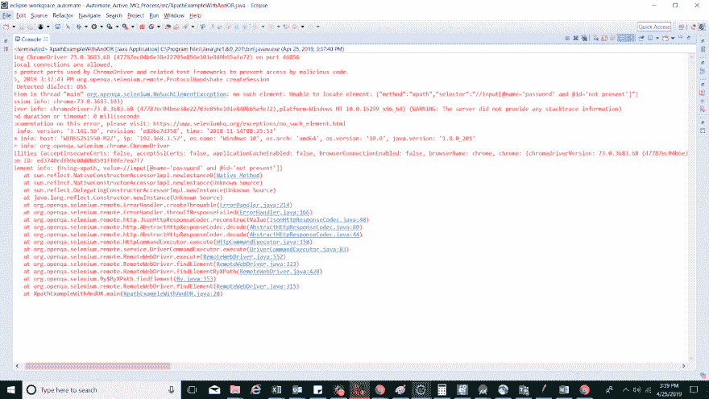](https://res.cloudinary.com/practicaldev/image/fetch/s--yAWMxQCW--/c_limit%2Cf_auto%2Cfl_progressive%2Cq_auto%2Cw_880/https://www.lambdatest.com/blog/wp-content/uploads/2019/05/error-showcasing-as-the-last-element-not-found.png)

请注意:**and 和 or 都应该区分大小写。如果您倾向于使用' OR '或' AND '，您将在控制台中得到一个错误，指出无效的 xpath 表达式**

### 利用包含()

当我们有一部分动态变化的属性值时，这种在 Selenium 中创建 XPath 的方法非常方便。例如，假设登录字段的 ID(例如 email_01)有一个结束编号，每次页面加载时，该编号都会不断变化。在这种情况下，使用 contains 有助于我们定位具有常量名称的元素，如本例中的“email”。创建包含以下 DOM 结构的 XPath 的示例是:

```
<input type="text" placeholder="Organization/Company Name" name="organization_name" value="" class="form-control sign-up-input-2 "> 
```

Enter fullscreen mode Exit fullscreen mode

*   XPath =//*[包含(@placeholder，'组织)]
*   XPath =//input[包含( [@name](https://dev.to/name) ，' organization)]
*   XPath =//*[包含(@class，'注册输入)]

在上面 Selenium 的 XPath 示例中，我们使用了占位符、名称等属性，并考虑使用 contains 关键字的部分值来标识元素。下面引用的代码片段强调了上述 XPath 创建的用法，在这里，我们单击 LambdaTest 主页上的**‘开始测试’**按钮。参考截图:

[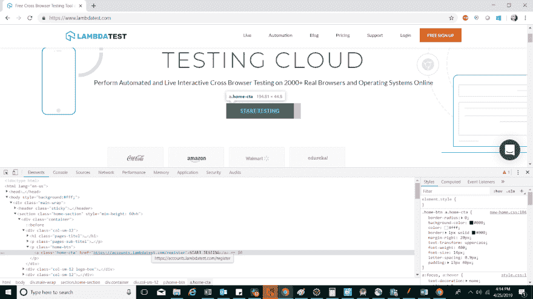](https://res.cloudinary.com/practicaldev/image/fetch/s--hmablvBO--/c_limit%2Cf_auto%2Cfl_progressive%2Cq_auto%2Cw_880/https://www.lambdatest.com/blog/wp-content/uploads/2019/05/LambdaTest-homepage.png)T3】

```
import java.util.concurrent.TimeUnit;

import org.openqa.selenium.By;
import org.openqa.selenium.WebDriver;
import org.openqa.selenium.chrome.ChromeDriver;

public class XpathContainsExample {

    public static void main(String[] args) {
        // TODO Auto-generated method stub

        System.setProperty("webdriver.chrome.driver", "path to chromedriver");
        WebDriver driver=new ChromeDriver();
        driver.manage().timeouts().implicitlyWait(10, TimeUnit.SECONDS);
        driver.get("https://www.lambdatest.com");

        //Finding the element 'Start testing' having text as same, here we will locate element using contains through xpath
        driver.findElement(By.xpath("//a[contains(text(), 'TESTING')]")).click();

        driver.close()

    }

} 
```

Enter fullscreen mode Exit fullscreen mode

### 使用 Starts-With()

这类似于上面的 contains 方法，唯一的区别是这里的比较值以一个初始字符串值开始。当给定属性的部分值发生变化时，这很有用。与上面的 XPath 示例一样，email 值会随着后面的值而改变。这里，可以使用 starts-with 方法来标识元素。在 Selenium 的 XPath 示例中，突出显示了下面 DOM 结构的 starts-with 用法:

```
<input type="text" placeholder="Organization/Company Name" name="organization_name" value="" class="form-control sign-up-input-2 "> 
```

Enter fullscreen mode Exit fullscreen mode

*   XPath =//input[以(@placeholder，' Organization)开头]
*   XPath = =//input[以( [@name](https://dev.to/name) ，' organization)开头]

在上面的例子中，我们使用了两个带有 starts-with 关键字的属性。该脚本将查找标记名，并与以“Organization”开头的属性值相匹配。引用的代码片段强调了在 Selenium 中通过 XPath 定位元素时 Starts-With 关键字的用法。我们将使用与上面相同的例子，唯一不同的是，我们将使用 **starts-with 来定位元素。**

```
import java.util.concurrent.TimeUnit;

import org.openqa.selenium.By;
import org.openqa.selenium.WebDriver;
import org.openqa.selenium.chrome.ChromeDriver;

public class XpathStartsWithExample {

    public static void main(String[] args) {
        // TODO Auto-generated method stub

        System.setProperty("webdriver.chrome.driver", "path to chromeDriver");
        WebDriver driver=new ChromeDriver();
        driver.manage().timeouts().implicitlyWait(10, TimeUnit.SECONDS);
        driver.get("https://www.lambdatest.com");

        //Finding the element 'Start testing' having text as same, here we will locate element using contains through xpath
        driver.findElement(By.xpath("//a[starts-with(text(), 'START')]")).click();

        driver.close();

    }

} 
```

Enter fullscreen mode Exit fullscreen mode

### 使用文本()

当我们在 HTML 标记中定义了文本，并且希望通过文本来标识元素时，这个关键字用于在 Selenium 中为 XPath 创建表达式。当其他属性值动态变化，而属性值的大部分不能通过 Starts-with 或 Contains 使用时，这就非常方便了。下面是 Selenium 中的 XPath 示例，突出显示了以下 DOM 结构的文本用法:

```
<button type="submit" class=" btn sign-up-btn-2 btn-block">Signup for Free</button> 
```

Enter fullscreen mode Exit fullscreen mode

*   Xpath= //button[text()= '免费注册']
*   Xpath=//button[contains(text()，' Signup' )]

在上面提到的例子中，我们使用了按钮上的文本来标识元素。这里使用了示例的两个实例，一个是文本完全匹配，另一个是使用 contains 关键字部分匹配。下面引用的片段突出显示了文本关键字的用法。在本例中，我们将点击 [LambdaTest blog](https://www.lambdatest.com/blog/continuous-testing-using-shift-left-testing-approach/?utm_source=Dzone&utm_medium=DzBlog&utm_campaign=SS-040319-1&utm_term=saif) 页面上的一个博客。参考截图如下:

[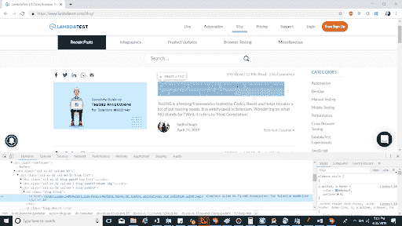](https://res.cloudinary.com/practicaldev/image/fetch/s--PBW2NfG3--/c_limit%2Cf_auto%2Cfl_progressive%2Cq_auto%2Cw_880/https://www.lambdatest.com/blog/wp-content/uploads/2019/05/LambdaTest-blog.png)T3】

```
import java.util.concurrent.TimeUnit;

import org.openqa.selenium.By;
import org.openqa.selenium.WebDriver;
import org.openqa.selenium.chrome.ChromeDriver;

public class XpathWithTextExample {

    public static void main(String[] args) throws InterruptedException {
        // TODO Auto-generated method stub

        System.setProperty("webdriver.chrome.driver", "path to the chromedriver");
        WebDriver driver=new ChromeDriver();
        driver.manage().timeouts().implicitlyWait(20, TimeUnit.SECONDS);
        driver.get("https://www.lambdatest.com/blog");

        //Finding the blog with text as 'complete guide on TestNG annotations' element
        driver.findElement(By.xpath("//a[text()='Complete Guide On TestNG Annotations For Selenium WebDriver']")).click();

        driver.close();

    }

} 
```

Enter fullscreen mode Exit fullscreen mode

### 使用索引

当您希望根据希望定位的索引值来指定给定的标记名时，可以使用这种方法。例如，考虑一个 DOM，每个不同的字段值有多个输入标签，您希望在第 4 个字段中输入文本。在这种情况下，您可以使用索引切换到给定的标记名。例如:

对于给定的 DOM 结构，我希望找到第二个输入标记字段:

```
<div class="col-sm-12 google-sign-form"><input type="text" placeholder="Organization/Company Name" name="organization_name" value="" class="form-control sign-up-input-2 "> <input type="text" placeholder="Full Name*" name="name" value="" class="form-control sign-up-input-2 "> <input type="email" placeholder="Work Email*" name="email" value="" class="form-control sign-up-input-2 "> 
```

Enter fullscreen mode Exit fullscreen mode

*   XPath =//div[@ class = ' col-sm-12 Google-sign-form ']/input[2]

在上述示例中，将选择字段为“全名”的定位器。第一个输入标签将被忽略，而另一个标签由于提到的索引而被考虑。在处理表中的数据时，这种方法非常方便。例如，当有多行时，可以使用索引引用所需的行。使用 LambdaTest 注册页面的表格形式数据的索引的参考代码片段，其中通过 form 类，我们使用索引导航到“全名”字段。

[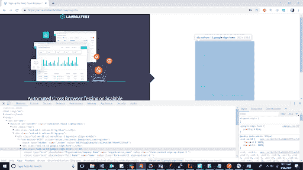](https://res.cloudinary.com/practicaldev/image/fetch/s--5JdGBQoV--/c_limit%2Cf_auto%2Cfl_progressive%2Cq_auto%2Cw_880/https://www.lambdatest.com/blog/wp-content/uploads/2019/05/lambdatest-login-page.png)T3】

```
import java.util.concurrent.TimeUnit;

import org.openqa.selenium.By;
import org.openqa.selenium.WebDriver;
import org.openqa.selenium.chrome.ChromeDriver;

public class XpathWithIndex {

    public static void main(String[] args) {
        // TODO Auto-generated method stub

        System.setProperty("webdriver.chrome.driver", "C:\\Users\\ss251550\\eclipse-workspace_automate\\Automate_Active_MQ_Process\\ChromeDriver\\chromedriver.exe");
        WebDriver driver=new ChromeDriver();
        driver.manage().timeouts().implicitlyWait(10, TimeUnit.SECONDS);
        driver.get("https://accounts.lambdatest.com/register");
        driver.manage().window().maximize();

        //finding the element through index using the reference of the form field containing the fields in it.
        driver.findElement(By.xpath("//div[@class='col-sm-12 google-sign-form']/input[2]")).sendKeys("sadhvi singh");

        driver.close();

    }

} 
```

Enter fullscreen mode Exit fullscreen mode

### 在 Selenium 中使用链式 XPath

顾名思义，我们可以使用多个 XPath 表达式并将它们链接起来。例如，在下面引用 LambdaTest 主页链接的 DOM 结构中:

```
<ul class="nav navbar-nav navbar-right">
<li><a href="https://www.lambdatest.com/feature">Live</a></li>
<li><a href="https://www.lambdatest.com/selenium-automation">Automation</a></li> <li><a href="https://www.lambdatest.com/blog">Blog</a></li>
 <li><a href="https://www.lambdatest.com/pricing">Pricing</a></li>
  <li><a href="https://www.lambdatest.com/support/">Support</a></li>
  <li class="sign-in"><a href="https://accounts.lambdatest.com/login">Login</a></li>
 <li class="login"><a href="https://accounts.lambdatest.com/register">Free Sign Up</a>
</li>
</ul> 
```

Enter fullscreen mode Exit fullscreen mode

[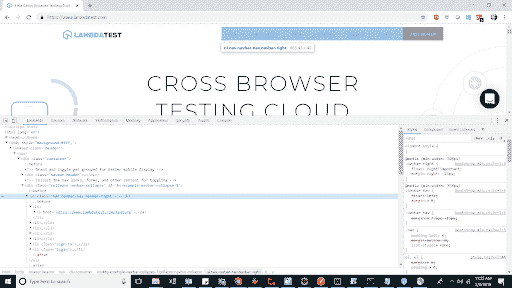](https://res.cloudinary.com/practicaldev/image/fetch/s--2_6w3HE9--/c_limit%2Cf_auto%2Cfl_progressive%2Cq_auto%2Cw_880/https://www.lambdatest.com/blog/wp-content/uploads/2019/05/Complete-Guide-For-Using-XPath-In-Selenium-With-Examples.png)

在这里，我们将尝试导航到“登录链接”。实现它的语法是。

*   XPath =//ul[@ class = ' nav navbar-nav navbar-right ']//Li[@ class = ' sign-in ']

在 Selenium 的上述 XPath 示例中，我找到了 link 标记的父类，然后使用“login”链接的链接导航到子类。上面的例子是使用下面的代码片段实现的。

```
import java.util.concurrent.TimeUnit;

import org.openqa.selenium.By;
import org.openqa.selenium.WebDriver;
import org.openqa.selenium.chrome.ChromeDriver;

public class XpathUsingChaining {

    public static void main(String[] args) {
        // TODO Auto-generated method stub

        System.setProperty("webdriver.chrome.driver", "path of chromeDriver");
        WebDriver driver=new ChromeDriver();
        driver.manage().timeouts().implicitlyWait(10, TimeUnit.SECONDS);
        driver.get("https://www.lambdatest.com/");
        driver.manage().window().maximize();

        //locating the 'login' link using xpath chaining and clicking on it.
        driver.findElement(By.xpath("//ul[@class='nav navbar-nav navbar-right']//li[@class='sign-in']")).click();

        //Verifying the current URL on which we post clicking on it.
        String currentURL= driver.getCurrentUrl();
        System.out.println(currentURL);

        driver.close();

    }

} 
```

Enter fullscreen mode Exit fullscreen mode

**控制台输出**

[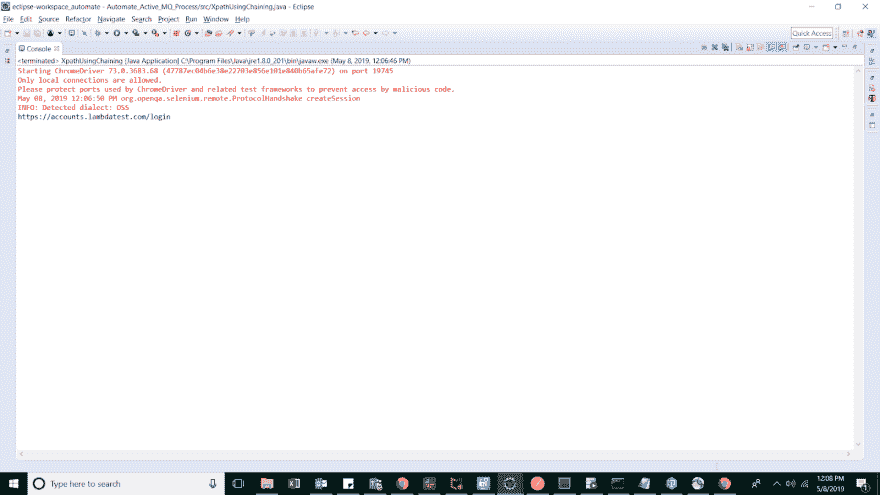](https://res.cloudinary.com/practicaldev/image/fetch/s--HZmFID-z--/c_limit%2Cf_auto%2Cfl_progressive%2Cq_auto%2Cw_880/https://www.lambdatest.com/blog/wp-content/uploads/2019/05/XPath-example-in-Selenium.png)

在云网格上运行 SELENIUM 脚本

2000 多种浏览器和操作系统

[免费注册](https://www.lambdatest.com/selenium-automation?utm_source=dev&utm_medium=Blog&utm_campaign=Sadhvi-28062019&utm_term=Sadhvi)

### XPath 坐标轴

当精确元素标记名或其属性值是动态的并且不能用来定位元素时，XPath 轴就派上了用场。在这种情况下，在遍历子/兄弟或父元素后定位元素将很容易。一些广泛使用的 XPath 轴有:

1.  **Following:** 这个 XPath 轴帮助定位当前节点后面的元素。下面提到的是 LambdaTest 注册页面的 DOM 结构。

```
<div class="col-sm-12 google-sign-form">
                              <input type="text" placeholder="Organization/Company Name" name="organization_name" value="" class="form-control sign-up-input-2 "> 
                             <input type="text" placeholder="Full Name*" name="name" value="" class="form-control sign-up-input-2 ">
                            <input type="email" placeholder="Work Email*" name="email" value="" class="form-control sign-up-input-2 ">
                           <input type="password" placeholder="Desired Password*" name="password" class="form-control sign-up-input-2 ">
                           <input type="phone" placeholder="Phone*" name="phone" value="" class="form-control sign-up-input-2 "> 
                            <p class="terms-cond">
                          <label for="terms_of_service" class="woo">
                         <input type="checkbox" name="terms_of_service" id="terms_of_service" value="1" class="form-check-input" style="position: relative; margin-left: 0px;"> &nbsp; I agree to the 
                         <a target="_blank" href="https://www.lambdatest.com/terms-of-service">Terms
                                    of Service</a>
                                and 
                      <a target="_blank" href="https://www.lambdatest.com/privacy">Privacy Policy</a>
</label>
</p> 
<button type="submit" class=" btn sign-up-btn-2 btn-block">Signup for Free</button>
</div> 
```

Enter fullscreen mode Exit fullscreen mode

引用的屏幕截图突出显示了两个输入元素，其中我们将尝试通过元素**‘组织’**字段定位元素**‘全名’**字段

[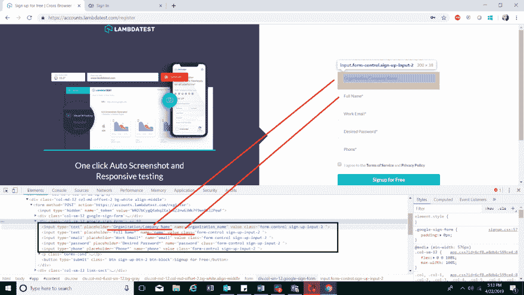](https://res.cloudinary.com/practicaldev/image/fetch/s--kmDI9Q80--/c_limit%2Cf_auto%2Cfl_progressive%2Cq_auto%2Cw_880/https://www.lambdatest.com/blog/wp-content/uploads/2019/05/image13.png)

*   XPath =//input[[@ name](https://dev.to/name)= ' organization _ name ']//following::input[1]
*   XPath =//input[[@ name](https://dev.to/name)= ' organization _ name ']//following::input

在上述示例中，第一个示例将选择 organization 元素之后的输入，而在第二个示例中，它将选择 organization 元素之后的所有具有 input 标记的元素。当我们打算在表中定位元素，或者当我们不知道当前节点的下一个元素的任何下落时，这些是有用的。下面提到的代码片段显示了通过以下方式定位的元素。在这个例子中，我们将使用 Lambatest 主页，在这里我们将使用单个 header 类遍历菜单标题选项。参考截图如下:

[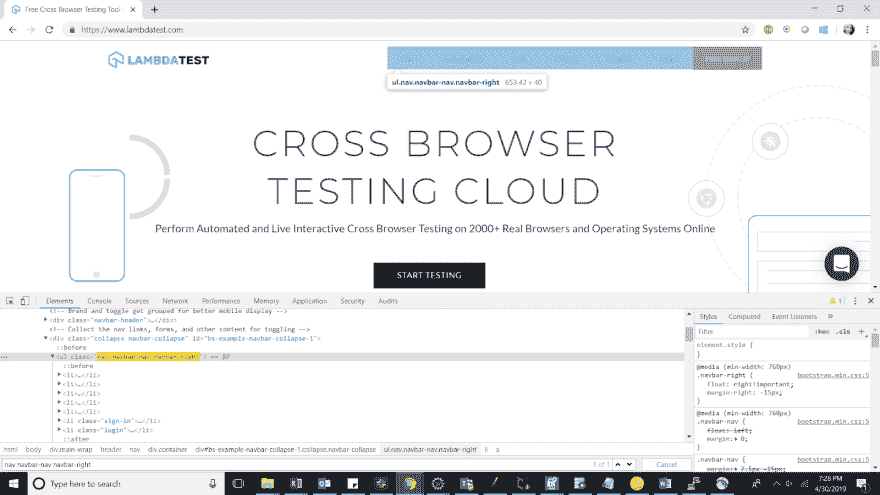](https://res.cloudinary.com/practicaldev/image/fetch/s--5ZGbSG5F--/c_limit%2Cf_auto%2Cfl_progressive%2Cq_auto%2Cw_880/https://www.lambdatest.com/blog/wp-content/uploads/2019/05/image11.png)T3】

```
import java.util.concurrent.TimeUnit;

import org.openqa.selenium.By;
import org.openqa.selenium.WebDriver;
import org.openqa.selenium.chrome.ChromeDriver;

public class XpathUsingFollowing {

    public static void main(String[] args) {
        // TODO Auto-generated method stub

        System.setProperty("webdriver.chrome.driver", " path of chromedriver ");
        WebDriver driver=new ChromeDriver();
        driver.manage().timeouts().implicitlyWait(10, TimeUnit.SECONDS);
        driver.get("https://www.lambdatest.com/");
        driver.manage().window().maximize();

        //Locate element with the link blog using following axes
        driver.findElement(By.xpath("//ul[@class='nav navbar-nav navbar-right']//following::li[3]")).click();

        driver.close();

    }

} 
```

Enter fullscreen mode Exit fullscreen mode

2.这是一个人们容易混淆的概念。你所能让自己清楚这个概念的，就是兄弟姐妹。在跟随的情况下，当前节点下的所有节点都是目标节点，不管它们是否在上下文节点下(子节点),但是跟随在上下文节点下。在以下兄弟节点的情况下，共享相同父节点的上下文节点的所有后续节点都适用。在这种情况下，所有兄弟节点都被称为父节点的子节点。因此，如果您引用其中一个子节点，并希望导航到跟在它后面的同一个父节点的其他子节点，那么跟在 sibling 后面就可以了。

例如，使用 LambdaTest 主页链接，在下面的 DOM 结构中，已经引用了其中一个子节点，我们将从它导航到它的兄弟节点。

```
<ul class="nav navbar-nav navbar-right">
<li><a href="https://www.lambdatest.com/feature">Live</a></li>
<li><a href="https://www.lambdatest.com/selenium-automation">Automation</a></li> <li><a href="https://www.lambdatest.com/blog">Blog</a></li>
 <li><a href="https://www.lambdatest.com/pricing">Pricing</a></li>
  <li><a href="https://www.lambdatest.com/support/">Support</a></li>
  <li class="sign-in"><a href="https://accounts.lambdatest.com/login">Login</a></li>
 <li class="login"><a href="https://accounts.lambdatest.com/register">Free Sign Up</a>
</li>
</ul> 
```

Enter fullscreen mode Exit fullscreen mode

在这种情况下，父节点是，其子节点是不同的 li，这里我们将定位登录链接，并从它们使用以下兄弟节点定位登录

*   XPath =//Li[@ class = ' sign-in ']//following-sibling::Li

下面是 Selenium 中 XPath 示例的代码片段。

```
package ChromeDriver;

import java.util.concurrent.TimeUnit;

import org.openqa.selenium.By;
import org.openqa.selenium.WebDriver;
import org.openqa.selenium.chrome.ChromeDriver;

public class XpathWithFollowingSibling {

    public static void main(String[] args) {
        // TODO Auto-generated method stub'

        System.setProperty("webdriver.chrome.driver", "path of chromeDriver");
        WebDriver driver=new ChromeDriver();
        driver.manage().timeouts().implicitlyWait(10, TimeUnit.SECONDS);
        driver.get("https://www.lambdatest.com/");
        driver.manage().window().maximize();

        //locating the 'sign-up' link using xpath following sibling and clicking on it.
        driver.findElement(By.xpath("//li[@class='sign-in']//following-sibling::li")).click();

        //Verifying the current URL on which we post clicking on it.
        String currentURL= driver.getCurrentUrl();
        System.out.println(currentURL);

        driver.close();

    }

} 
```

Enter fullscreen mode Exit fullscreen mode

**控制台输出**

[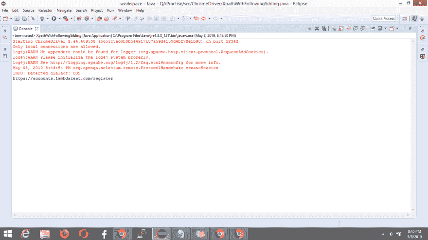](https://res.cloudinary.com/practicaldev/image/fetch/s--6oHp45nF--/c_limit%2Cf_auto%2Cfl_progressive%2Cq_auto%2Cw_880/https://www.lambdatest.com/blog/wp-content/uploads/2019/05/pasted-image-0-13.png)

3. **Preceding:** 这个方法有助于定位当前节点之前的元素，比如在 Selenium 中使用 XPath 定位当前节点之前的元素。下面是 DOM 结构的演示。

```
<input type="text" placeholder="Organization/Company Name" name="organization_name" value="" class="form-control sign-up-input-2 ">
<input type="text" placeholder="Full Name*" name="name" value="" class="form-control sign-up-input-2 ">
<input type="email" placeholder="Work Email*" name="email" value="" class="form-control sign-up-input-2 "> 
```

Enter fullscreen mode Exit fullscreen mode

参考截图如下:

[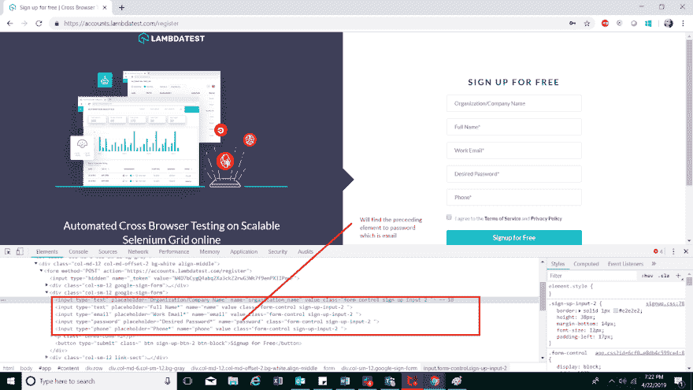](https://res.cloudinary.com/practicaldev/image/fetch/s--U0WofFdK--/c_limit%2Cf_auto%2Cfl_progressive%2Cq_auto%2Cw_880/https://www.lambdatest.com/blog/wp-content/uploads/2019/05/image17.png)

*   XPath =//input[[@ name](https://dev.to/name)= ' password ']//preceding::input[1]
*   XPath =//input[[@ name](https://dev.to/name)= ' password ']//preceding::input

在上面提到的例子中，第一个将定位字段为 email 的元素，而另一个将定位当前节点之前的所有元素，即密码字段。这对于定位无法通过任何方式定位但可以遍历的元素也很有用。比如在[跨浏览器测试](https://www.lambdatest.com/?utm_source=dev&utm_medium=Blog&utm_campaign=Sadhvi-28062019&utm_term=Sadhvi)的情况下，有时候很少有元素在 IE 浏览器上无法识别，旧版浏览器版本。在这种情况下，使用优先级或 following 遍历这些元素会很有帮助。下面的代码片段引用的例子，突出了如何使用 LambdaTest 主页上的博客链接，我们将通过[自动化标签](https://www.lambdatest.com/selenium-automation?utm_source=dev&utm_medium=Blog&utm_campaign=Sadhvi-28062019&utm_term=Sadhvi)循环。

[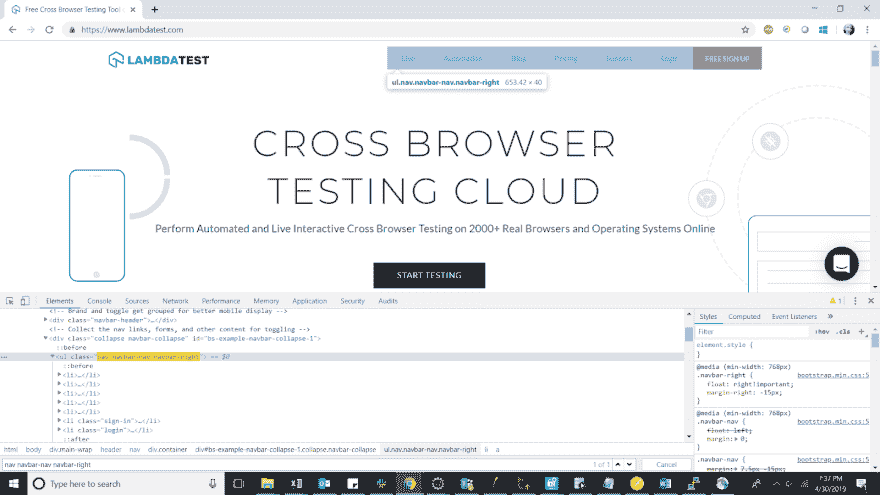](https://res.cloudinary.com/practicaldev/image/fetch/s---2fSQCGJ--/c_limit%2Cf_auto%2Cfl_progressive%2Cq_auto%2Cw_880/https://www.lambdatest.com/blog/wp-content/uploads/2019/05/image9.png)T3】

```
import java.util.concurrent.TimeUnit;

import org.openqa.selenium.By;
import org.openqa.selenium.WebDriver;
import org.openqa.selenium.chrome.ChromeDriver;

public class XpathUsingPreceeding {

    public static void main(String[] args) {
        // TODO Auto-generated method stub

        System.setProperty("webdriver.chrome.driver", "path of chromedriver");
        WebDriver driver=new ChromeDriver();
        driver.manage().timeouts().implicitlyWait(10, TimeUnit.SECONDS);
        driver.get("https://www.lambdatest.com/");
        driver.manage().window().maximize();

        //Fnding the automation link using the blog link
        driver.findElement(By.xpath("//a[text()='Blog']//preceding::li[1]")).click();

        driver.close();

    }

} 
```

Enter fullscreen mode Exit fullscreen mode

4.**previous-Sibling:**这是一个类似于 following sibling 的概念，唯一的功能区别是 previous。因此，在这种情况下，您可以在兄弟节点之间切换，但是在这种情况下，您将从作为子节点的上下文节点切换到您希望定位的前一个节点。两个孩子将分享同一个父母。使用下面兄弟中提到的同一个例子，我们现在将使用 preceding-sibling 从注册链接转移到登录链接。同样的语法是

*   XPath =//Li[@ class = ' log in ']//preceding-sibling::Li[1]

**注意:**如果您没有指定您希望导航的同级的索引，它可以选择任意。具体选择，需要提到指数。如果上下文节点只有一个兄弟节点，则不需要指定索引。下面是 Selenium 中相同 XPath 示例的代码片段。

```
package ChromeDriver;

import java.util.concurrent.TimeUnit;

import org.openqa.selenium.By;
import org.openqa.selenium.WebDriver;
import org.openqa.selenium.chrome.ChromeDriver;

public class XpathWithPrecedingSibling {

    public static void main(String[] args) {
        // TODO Auto-generated method stub'

        System.setProperty("webdriver.chrome.driver", "path of chromedriver");
        WebDriver driver=new ChromeDriver();
        driver.manage().timeouts().implicitlyWait(10, TimeUnit.SECONDS);
        driver.get("https://www.lambdatest.com/");
        driver.manage().window().maximize();

        //locating the 'login' link using xpath preceding sibling and clicking on it.
        driver.findElement(By.xpath("//li[@class='login']//preceding-sibling::li[1]")).click();

        //Verifying the current URL on which we post clicking on it.
        String currentURL= driver.getCurrentUrl();
        System.out.println(currentURL);

        driver.close();

    }

} 
```

Enter fullscreen mode Exit fullscreen mode

**控制台输出**

[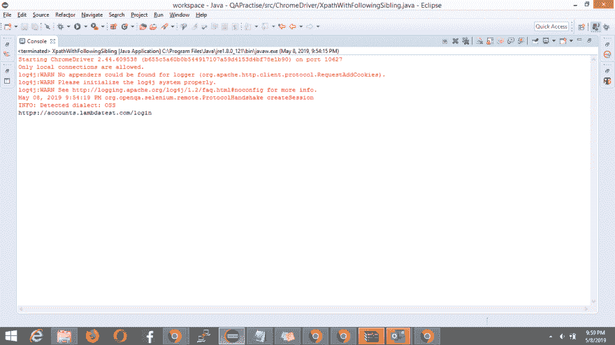](https://res.cloudinary.com/practicaldev/image/fetch/s--z6yOJKug--/c_limit%2Cf_auto%2Cfl_progressive%2Cq_auto%2Cw_880/https://www.lambdatest.com/blog/wp-content/uploads/2019/05/pasted-image-0-14.png)

5. **Child:** 顾名思义，当我们打算定位当前节点的所有子元素时，使用这种方法。这种方法的一个基本用例可能是当我们希望通过行遍历表中的所有数据时，在这种情况下，我们可以找到特定表的所有子表。例如，使用下面引用的 DOM 结构，我们可以在 Selenium 中创建如下 XPath:

```
<div class="col-sm-12 google-sign-form"><input type="text" placeholder="Organization/Company Name" name="organization_name" value="" class="form-control sign-up-input-2 "> <input type="text" placeholder="Full Name*" name="name" value="" class="form-control sign-up-input-2 "> <input type="email" placeholder="Work Email*" name="email" value="" class="form-control sign-up-input-2 "> <input type="password" placeholder="Desired Password*" name="password" class="form-control sign-up-input-2 "> <input type="phone" placeholder="Phone*" name="phone" value="" class="form-control sign-up-input-2 "> <p class="terms-cond"><label for="terms_of_service" class="woo"><input type="checkbox" name="terms_of_service" id="terms_of_service" value="1" class="form-check-input" style="position: relative; margin-left: 0px;"> &nbsp; I agree to the <a target="_blank" href="https://www.lambdatest.com/terms-of-service">Terms
                                    of Service</a>
                                and <a target="_blank" href="https://www.lambdatest.com/privacy">Privacy Policy</a></label></p> <button type="submit" class=" btn sign-up-btn-2 btn-block">Signup for Free</button></div> 
```

Enter fullscreen mode Exit fullscreen mode

参考截图相同。

[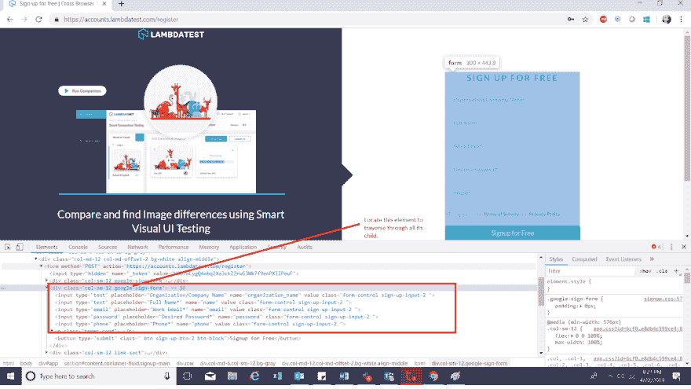](https://res.cloudinary.com/practicaldev/image/fetch/s--YhnPngsf--/c_limit%2Cf_auto%2Cfl_progressive%2Cq_auto%2Cw_880/https://www.lambdatest.com/blog/wp-content/uploads/2019/05/Complete-Guide-For-Using-XPath-In-Selenium-With-Examples1.png)

*   XPath =//div[@ class = ' col-sm-12 Google-sign-form ']/child::input
*   XPath =//div[@ class = ' col-sm-12 Google-sign-form ']/child::input[1]

在上面提到的例子中，第一个将定位 div 的所有输入字段，包括 organization 字段、name 字段、email 字段、password 字段和 phone number 字段，而另一个只用于定位 organization 字段的元素。

下面的代码片段突出显示了子轴在同一。我们使用相同的寄存器示例 [LambdaTest 寄存器页](https://accounts.lambdatest.com/register/?utm_source=dev&utm_medium=Blog&utm_campaign=Sadhvi-28062019&utm_term=Sadhvi)。

```
import java.util.concurrent.TimeUnit;

import org.openqa.selenium.By;
import org.openqa.selenium.WebDriver;
import org.openqa.selenium.chrome.ChromeDriver;

public class XpathUsingChild {

    public static void main(String[] args) {
        // TODO Auto-generated method stub

        System.setProperty("webdriver.chrome.driver", "path of chrome driver");
        WebDriver driver=new ChromeDriver();
        driver.manage().timeouts().implicitlyWait(10, TimeUnit.SECONDS);
        driver.get("https://accounts.lambdatest.com/register");
        driver.manage().window().maximize();

        //Finding the work email filed using the child locator xpath axes
        driver.findElement(By.xpath("//div[@class='col-sm-12 google-sign-form']/child::input[3]")).sendKeys("sadhvi singh");;

        driver.close();

    }

} 
```

Enter fullscreen mode Exit fullscreen mode

6. **Parent:** 该方法用于选择当前节点的父节点。例如，对于下面引用的 DOM 结构，父节点通过 XPath 定位。

```
<div class="col-sm-12 google-sign-form"><input type="text" placeholder="Organization/Company Name" name="organization_name" value="" class="form-control sign-up-input-2 "> <input type="text" placeholder="Full Name*" name="name" value="" class="form-control sign-up-input-2 "> <input type="email" placeholder="Work Email*" name="email" value="" class="form-control sign-up-input-2 "> <input type="password" placeholder="Desired Password*" name="password" class="form-control sign-up-input-2 "> <input type="phone" placeholder="Phone*" name="phone" value="" class="form-control sign-up-input-2 "> <p class="terms-cond"><label for="terms_of_service" class="woo"><input type="checkbox" name="terms_of_service" id="terms_of_service" value="1" class="form-check-input" style="position: relative; margin-left: 0px;"> &nbsp; I agree to the <a target="_blank" href="https://www.lambdatest.com/terms-of-service">Terms
                                    of Service</a>
                                and <a target="_blank" href="https://www.lambdatest.com/privacy">Privacy Policy</a></label></p> < button type="submit" class=" btn sign-up-btn-2 btn-block">Signup for Free< /button ></div> 
```

Enter fullscreen mode Exit fullscreen mode

参考截图:

[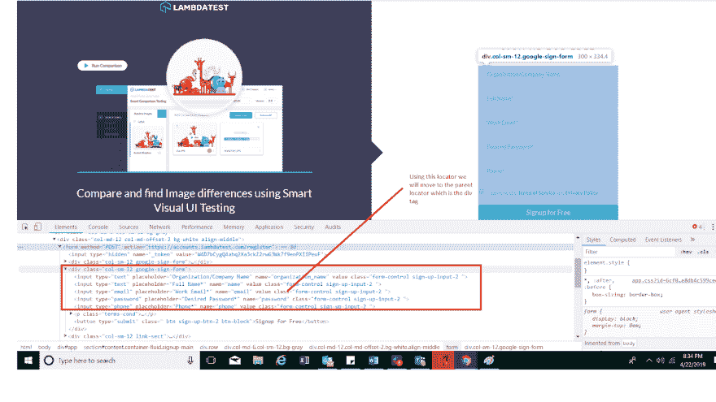](https://res.cloudinary.com/practicaldev/image/fetch/s--JzBvAPg6--/c_limit%2Cf_auto%2Cfl_progressive%2Cq_auto%2Cw_880/https://www.lambdatest.com/blog/wp-content/uploads/2019/05/image16.png)

*   XPath =//input[[@ name](https://dev.to/name)= ' email ']//parent::div

在上面的例子中，父元素是通过它的子元素定位的。我们从电子邮件字段遍历到它的父节点。请注意，对于子 XPath，只考虑当前节点的直接子节点，而不考虑其孙节点。如果当前节点是根节点，那么它的父节点将是空的，因此它没有父节点。下面是相同的代码片段:

```
import java.util.concurrent.TimeUnit;

import org.openqa.selenium.By;
import org.openqa.selenium.WebDriver;
import org.openqa.selenium.WebElement;
import org.openqa.selenium.chrome.ChromeDriver;

public class XpathUsingParent {

    public static void main(String[] args) {
        // TODO Auto-generated method stub

        System.setProperty("webdriver.chrome.driver", "path of chromedriver");
        WebDriver driver=new ChromeDriver();
        driver.manage().timeouts().implicitlyWait(10, TimeUnit.SECONDS);
               driver.get("https://accounts.lambdatest.com/register");
               driver.manage().window().maximize();

        //Finding the parent form usnig the password field as the current node.
        WebElement parentDiv=driver.findElement(By.xpath("//input[@name='password']//parent::div"));
        System.out.print(parentDiv.getAttribute("class"));

        driver.close();

    }

} 
```

Enter fullscreen mode Exit fullscreen mode

**控制台输出**

[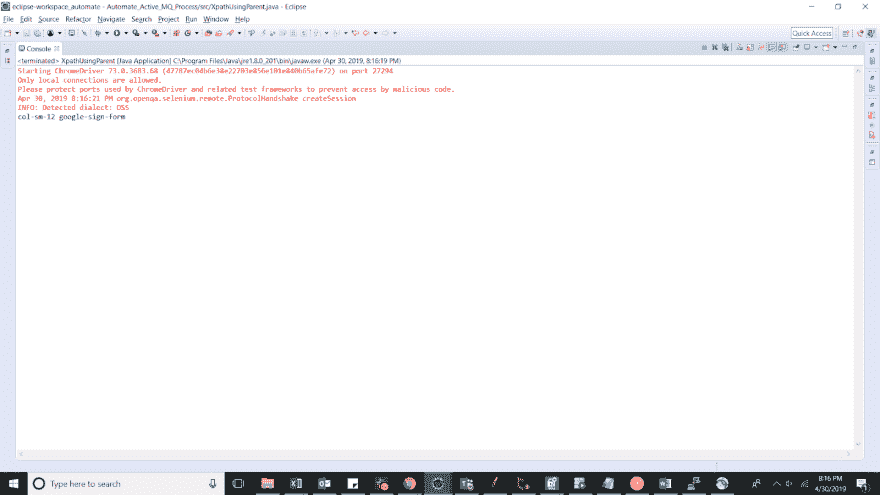](https://res.cloudinary.com/practicaldev/image/fetch/s--z97HdK-y--/c_limit%2Cf_auto%2Cfl_progressive%2Cq_auto%2Cw_880/https://www.lambdatest.com/blog/wp-content/uploads/2019/05/image5-2.png)

7. **Descendants:** 这种方法用于通过 XPath 为当前节点的所有子节点和子节点定位元素。对于下面的 DOM 结构，Selenium 中 XPath 的后代位于:

```
<div class="col-lg-3 col-md-4 col-sm-6 sign-form"><a href="https://www.lambdatest.com"></a> <h1 class="title text-center font-weight-light">Hello! Welcome back</h1> <input type="email" name="email" value="" placeholder="Email" required="required" autofocus="autofocus" class="form-control mt-3 form-control-lg"> <input type="password" name="password" placeholder="Password" class="form-control mt-3 form-control-lg"> <button type="submit" class="btn btn-primary btn-lg btn-block mt-3">LOGIN</button> <div class="form-group form-check mt-2"><input type="checkbox" name="remember" id="remember" class="form-check-input"> <label for="remember" class="form-check-label">Remember Me</label></div> <div class="row mt-2"><div class="col pr-2 text-pass"><a href="https://accounts.lambdatest.com/password/reset">Forgot Password?</a></div> <div class="col pl-2 text-pass text-right">No account? <a href="/register">Sign up</a></div></div></div> 
```

Enter fullscreen mode Exit fullscreen mode

参考截图:

[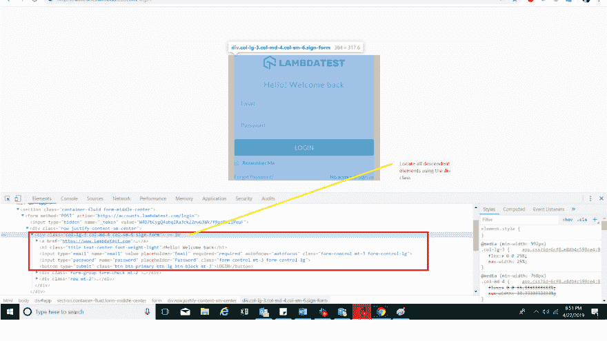](https://res.cloudinary.com/practicaldev/image/fetch/s--D5hsDWQS--/c_limit%2Cf_auto%2Cfl_progressive%2Cq_auto%2Cw_880/https://www.lambdatest.com/blog/wp-content/uploads/2019/05/image8.png)

*   XPath =//div[@ class = ' col-LG-3 col-MD-4 col-sm-6 sign-form ']//descendant::input

在上面的例子中，所有的元素，如电子邮件字段，密码字段和按钮将被选中。用户也可以使用索引选择上述字段之一。下面是一个代码片段，突出了它的使用。

```
import java.util.List;
import java.util.concurrent.TimeUnit;

import org.openqa.selenium.By;
import org.openqa.selenium.WebDriver;
import org.openqa.selenium.WebElement;
import org.openqa.selenium.chrome.ChromeDriver;

public class XpathUsingDescendants {

    public static void main(String[] args) {
        // TODO Auto-generated method stub

        System.setProperty("webdriver.chrome.driver", "path of chromedriver");
        WebDriver driver=new ChromeDriver();
        driver.manage().timeouts().implicitlyWait(10, TimeUnit.SECONDS);
        driver.get("https://accounts.lambdatest.com/login");
        driver.manage().window().maximize();

        //Finding the remember me grandchildren of the login form with field value as remember me.
        WebElement rememberMe=driver.findElement(By.xpath("//div[@class='col-lg-3 col-md-4 col-sm-6 sign-form']//descendant::label"));
        rememberMe.click();
        System.out.print(rememberMe.getText());

        driver.close();

    }

} 
```

Enter fullscreen mode Exit fullscreen mode

**控制台输出**

[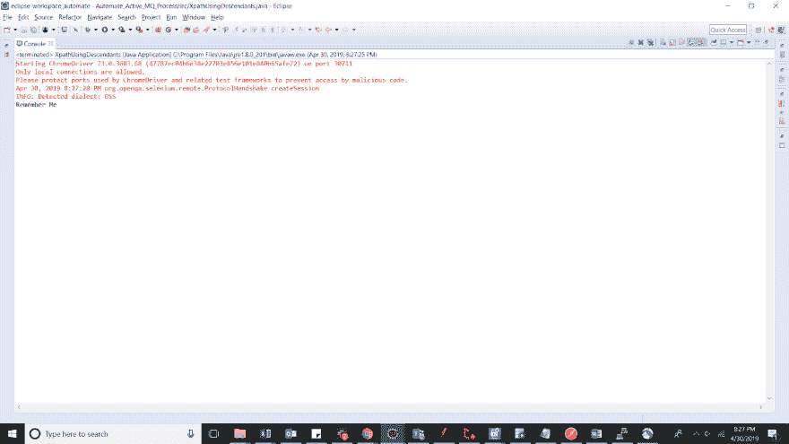](https://res.cloudinary.com/practicaldev/image/fetch/s--DHuPxp-J--/c_limit%2Cf_auto%2Cfl_progressive%2Cq_auto%2Cw_880/https://www.lambdatest.com/blog/wp-content/uploads/2019/05/image10.png)

8.**祖先:**在这种方法中，上下文节点、父节点或其祖父母是通过祖先轴选择的。例如，对于下面的 DOM 结构，祖先将被定义为:

```
 <form method="POST" action="https://accounts.lambdatest.com/login"><input type="hidden" name="_token" value="W4D7bCygQ4abq2Xa3ckZ2rwG3Wk7f9enPXIIPeuF"> <div class="row justify-content-sm-center"><div class="col-lg-3 col-md-4 col-sm-6 sign-form"><a href="https://www.lambdatest.com"></a> <h1 class="title text-center font-weight-light">Hello! Welcome back</h1> <input type="email" name="email" value="" placeholder="Email" required="required" autofocus="autofocus" class="form-control mt-3 form-control-lg"> <input type="password" name="password" placeholder="Password" class="form-control mt-3 form-control-lg"> <button type="submit" class="btn btn-primary btn-lg btn-block mt-3">LOGIN</button> <div class="form-group form-check mt-2"><input type="checkbox" name="remember" id="remember" class="form-check-input"> <label for="remember" class="form-check-label">Remember Me</label></div> <div class="row mt-2"><div class="col pr-2 text-pass"><a href="https://accounts.lambdatest.com/password/reset">Forgot Password?</a></div> <div class="col pl-2 text-pass text-right">No account? <a href="/register">Sign up</a></div></div></div></div></form> 
```

Enter fullscreen mode Exit fullscreen mode

参考截图:

[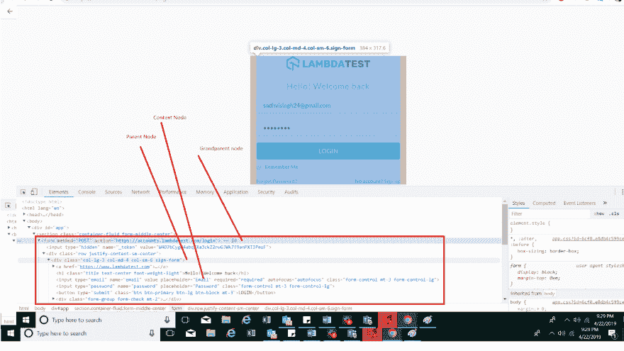](https://res.cloudinary.com/practicaldev/image/fetch/s--ZGVAgEHQ--/c_limit%2Cf_auto%2Cfl_progressive%2Cq_auto%2Cw_880/https://www.lambdatest.com/blog/wp-content/uploads/2019/05/image15.png)

*   XPath =//input[[@ name](https://dev.to/name)= ' email]//ancestor::div[1]
*   XPath =//input[[@ name](https://dev.to/name)= ' email]//ancestor::form

在上面的例子中，第一个将指向登录字段的父节点，而另一个将指向它的祖父节点，在本例中是标记表单。下面的代码片段突出显示了相同的用法。

```
import java.util.concurrent.TimeUnit;

import org.openqa.selenium.By;
import org.openqa.selenium.WebDriver;
import org.openqa.selenium.WebElement;
import org.openqa.selenium.chrome.ChromeDriver;

public class XpathUsingAncestor {

    public static void main(String[] args) {
        // TODO Auto-generated method stub

        System.setProperty("webdriver.chrome.driver", "path of chromedriver");
        WebDriver driver=new ChromeDriver();
        driver.manage().timeouts().implicitlyWait(10, TimeUnit.SECONDS);
        driver.get("https://accounts.lambdatest.com/login");
        driver.manage().window().maximize();

        //Finding the parent div using the password field of the login page.
        WebElement parentDiv=driver.findElement(By.xpath("//input[@name='password']//ancestor::div[1]"));
        System.out.println(parentDiv.getAttribute("class"));

        WebElement parentForm=driver.findElement(By.xpath("//input[@name='password']//ancestor::form"));
        System.out.println(parentForm.getAttribute("action"));

        driver.close();

    }

} 
```

Enter fullscreen mode Exit fullscreen mode

**控制台输出**

[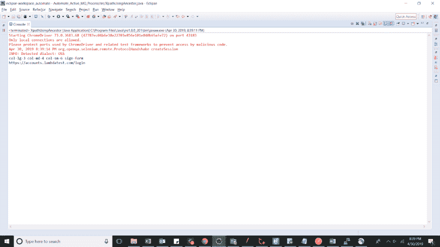](https://res.cloudinary.com/practicaldev/image/fetch/s--3kbtmJH4--/c_limit%2Cf_auto%2Cfl_progressive%2Cq_auto%2Cw_880/https://www.lambdatest.com/blog/wp-content/uploads/2019/05/image14.png)

## 结论

Selenium 中的 XPath 帮助个人在标准过程不起作用时找到定位元素的解决方案。当涉及到 DOM 结构的不同复杂性和功能需求时，什么时候使用哪个是重要的。正如我的文章前面所定义的，由于浏览器对 DOM 元素的不同行为，跨浏览器测试可能是您可以探索在 Selenium 中创建 XPath 的领域之一。确保无论选择哪种 XPath 方法都不容易出错，并使脚本更健壮、更整洁、更易于维护。干杯！

原创发布:**[LambdaTest](https://www.lambdatest.com/blog/complete-guide-for-using-xpath-in-selenium-with-examples/?utm_source=dev&utm_medium=Blog&utm_campaign=Sadhvi-28062044&utm_term=Sadhvi)T3】**

[](https://accounts.lambdatest.com/register/?utm_source=dev&utm_medium=Blog&utm_campaign=Sadhvi-28062019&utm_term=Sadhvi)

## **相关文章**

**[查找带有链接文本的元素&硒中的部分链接文本](https://www.lambdatest.com/blog/using-link-text-and-partial-link-text-in-selenium/?utm_source=dev&utm_medium=Blog&utm_campaign=Sadhvi-28062045&utm_term=Sadhvi)T3】**

**[Selenium Java 教程——Selenium 中的类名定位器](https://www.lambdatest.com/blog/selenium-java-tutorial-class-name-locator-in-selenium/?utm_source=dev&utm_medium=Blog&utm_campaign=Sadhvi-28062046&utm_term=Sadhvi)**