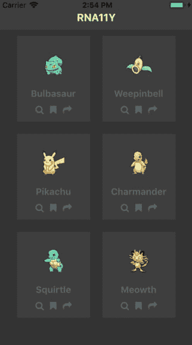
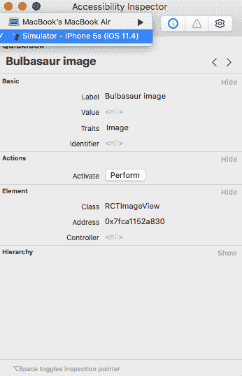
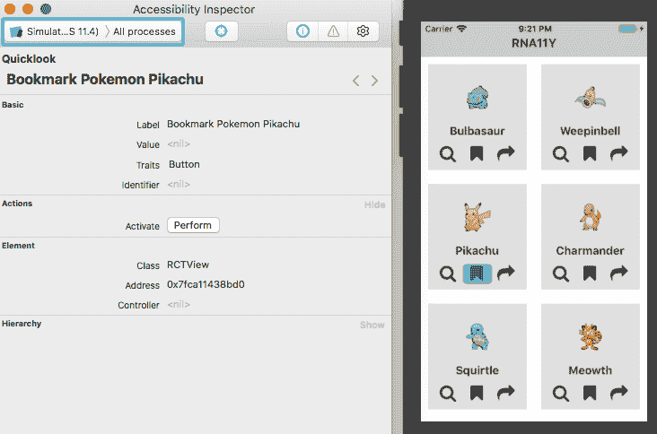
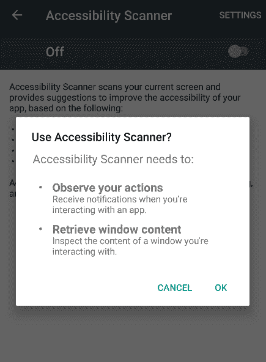
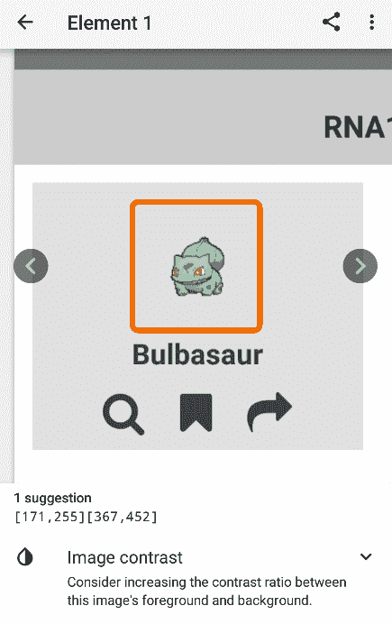
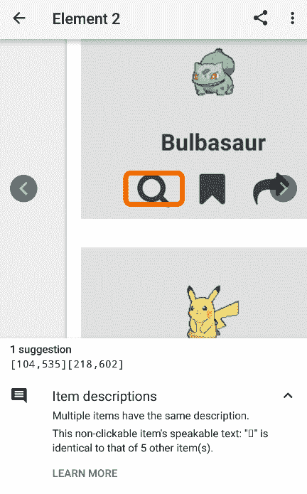

# 让 React 本地应用变得可访问

> 原文：<https://dev.to/wernancheta/making-accessible-react-native-apps-555>

在本教程中，您将学习如何使 React 原生应用程序更易于访问。具体来说，我们将涵盖以下内容:

*   什么是可访问性？
*   设计应用程序时要考虑可访问性
*   React 本地应用中的可访问性
*   易访问性测试工具

当然，我们不能指望涵盖可访问性的所有内容。这是一个相当大的主题，是一个持续的旅程。为了让某个用户的体验更好一点，总有一些事情你可以改进。相反，我们希望在本教程中实现的，是迈出制作更易访问的应用程序的第一步。

你可以在其 [GitHub repo](https://github.com/anchetaWern/RNa11y) 上查看本教程使用的代码。`starter`分支包含不太容易访问的版本，而`a11y`分支包含更容易访问的版本。

## 先决条件

要学习本教程，您需要了解创建 React 原生应用程序的基础知识。还应该在您的机器上设置 React 本地开发环境。

在本教程中，我们将使用 React 原生版本 0.56。我们还将使用[纱线](https://yarnpkg.com/en/)来安装包。

## 什么是无障碍？

在我们继续之前，很重要的一点是，在移动应用程序的环境中，我们都同意什么是可访问性。可访问性，或者 a11y，意味着让你的应用程序对普通用户和残疾用户都可用。任何人都可能有一种或多种残疾。这通常包括但不限于以下内容:

*   **视觉障碍** -例子包括低视力、色盲和全盲。
*   **身体或运动残疾** -脑瘫、骨骼和关节畸形。
*   **精神障碍** -自闭症谱系障碍，如阿斯伯格综合症和自闭症。
*   **听力障碍** -耳聋和部分听力丧失。
*   **阅读障碍** -诵读困难。

可访问性意味着在设计你的应用时，要考虑到所有这些障碍，以使用户体验对每个人来说都是愉快的。

## 你将建造什么

我们实际上不会从头开始构建任何东西。相反，我们要让一个预建的应用程序更容易访问。这是入门应用程序的样子:

[](https://res.cloudinary.com/practicaldev/image/fetch/s--F-lrx4nP--/c_limit%2Cf_auto%2Cfl_progressive%2Cq_auto%2Cw_880/https://d2mxuefqeaa7sj.cloudfront.net/s_C1F24C144762AD22B43421C5C1B7AAAB3A9F2F2FF6ED15245D20671A45E1AD0F_1533797671567_rna11y-starter.png)

这不会是最终输出的样子，因为我们也会考虑设计(虽然，只是一点点，因为我不是真正的设计师)。

如果您想继续，克隆 repo，切换到`starter`分支并安装依赖项:

```
git clone https://github.com/anchetaWern/RNa11y.git
cd RNa11y
git checkout starter
yarn install
react-native upgrade
react-native link
react-native run-android
react-native run-ios 
```

## 设计应用程序时要考虑可访问性

在这一部分，我们将重新设计应用程序，使其变得更易于访问。我们将使用来自 [GOV.UK](https://accessibility.blog.gov.uk/2016/09/02/dos-and-donts-on-designing-for-accessibility/) 网站的[关于无障碍设计的注意事项](https://accessibility.blog.gov.uk/2016/09/02/dos-and-donts-on-designing-for-accessibility/)作为指南。具体来说，我们将采用他们指南中的以下任务:

*   使用简单的颜色
*   使按钮具有描述性
*   构建简单一致的布局
*   遵循线性逻辑布局
*   写描述性链接和标题
*   使用良好的对比度和易读的字体大小
*   使用颜色、形状和文本的组合
*   做出大的可点击动作

很快，你就可以看到 starter 应用程序违反了其中的一些规则。该应用程序已经关注了一些，但我们仍然可以对它进行改进。

### 使用简单的颜色

starter 应用程序违反了这条规则，因为它使用了深色作为背景。这对眼睛来说并不容易，所以我们需要更新应用程序和卡片背景:

```
// file: App.js
const styles = {
  container: {
    flex: 10,
    backgroundColor: "#FFF" // update this
  }
};

// src/components/Card.js
const styles = StyleSheet.create({
  card: {
    width: 120,
    height: 140,
    backgroundColor: "#3e3e3e" // update this
  }
}); 
```

同样，更新`Header`组件以匹配。这是因为当使用深色背景时，状态栏中的项目可读性不是很好:

```
// src/components/Header.js
const styles = StyleSheet.create({
  header: {
    paddingTop: 10,
    backgroundColor: "#ccc" // update this
  },
  header_text: {
    fontWeight: "bold",
    color: "#333" // update this
  }
}); 
```

一旦完成，内容现在应该更具可读性。

### 做出大的可点击动作

接下来，我们需要让按钮变大。这一变化对身体和运动残疾的人特别有用，因为他们通常很难按下小按钮。

如果你现在检查应用程序，你会发现我们没有多少空间可以利用。因此，即使我们把按钮做得更大，仍然很难针对某个特定的按钮，因为它们之间没有足够的空白。尽管我们在每张卡之间还有一些空闲空间，所以我们将利用这些空间。

在您的`Card`组件中，包含`Dimensions`模块，以便我们可以获得设备的宽度。我们将使用它来确定每张卡可以使用的宽度。在这种情况下，我们每行有两张卡，所以我们将它除以 2 并添加一个填充。我们还将`height`做得更大，因为我们预计按钮会变得更大:

```
// src/components/Card.js

import { View, Text, Image, StyleSheet, Dimensions } from "react-native"; // add Dimensions

const { width } = Dimensions.get("window");

const cardPadding = 20;
const styles = StyleSheet.create({
  card: {
    width: width / 2 - cardPadding, // update this
    height: 150 // update this
  }
}); 
```

接下来，我们现在可以继续更新按钮的大小和填充:

```
// src/components/IconButton.js:

const icon_color = "#586069";
const icon_size = 25; // update this

const styles = StyleSheet.create({
  icon: {
    // update these:
    paddingLeft: 10,
    paddingRight: 10
  }
}); 
```

在这一点上，每个按钮应该是巨大的，可见的，足以点击。

### 使按钮具有描述性

不幸的是，由于设计的限制，这并不是一件可以一直实现的事情。如果你现在检查应用程序，你会发现没有足够的空间来容纳每个按钮的标签。

有一个解决方案，但我们最终将放弃当前的布局(每行两张卡)而采用每行一张卡的布局。因此，唯一可行的解决方案是为新用户提供一个演练。这样，您可以了解每个按钮的用途。我不会真的涵盖如何做到这一点，但有一个[好的组件](https://github.com/okgrow/react-native-copilot)可以让您轻松实现它。

### 使用良好的对比度和易读的字体大小

在我看来，这款应用的对比度已经相当不错了。但是为了安全起见，我们会再做一些调整。

首先，我们必须区分每张卡片和应用程序的背景。我们可以通过应用较暗的背景色来实现:

```
// src/components/Card.js
const cardPadding = 20;
const styles = StyleSheet.create({
  card: {
    width: width / 2 - cardPadding,
    height: 150,
    backgroundColor: "#e0e0e0" // update this
  }
}); 
```

接下来，我们需要区分卡片的主体和内容:

```
// src/components/Card.js
const styles = StyleSheet.create({
  name: {
    fontSize: 16,
    color: "#3a3f46" // update this
  }
});

// src/components/IconButton.js

const icon_color = "#3a3f46"; // update this
const icon_size = 25; 
```

最后，我们需要使文本更大。虽然对于我们应该使用什么样的字体大小来优化可访问性还没有普遍的一致意见，但是一些的人似乎非常信任`16px`，所以我们也同意这一点:

```
const styles = StyleSheet.create({
  name: {
    fontSize: 16 // update this
  }
}); 
```

我们跳过了以下内容，因为我们已经在关注它们:

*   写描述性链接和标题
*   遵循线性逻辑布局
*   使用颜色、形状和文本的组合
*   构建简单一致的布局

一旦完成，应用程序的设计应该非常容易理解。

## React 原生应用中的辅助功能

上一节主要讨论了可访问性的视觉组件。在这一部分，我们将看看如何让使用屏幕阅读器的人更容易使用这个应用程序。

对于那些不熟悉的人来说，屏幕阅读器为用户读出他们当前在屏幕上触摸的内容。这项技术主要由盲人或视障人士使用。如果启用了屏幕阅读器，用户必须双击才能激活预期的操作。

为了让屏幕阅读器有用，我们需要正确地标记用户最有可能交互的所有相关组件。在 React Native 中，这可以通过添加辅助功能道具来实现。以下是我们如何添加这些道具的示例:

```
// src/components/Header.js
const Header = ({ title }) => {
  return (
    <View
      style={styles.header}
      accessible={true}
      accessibilityLabel={"Main app header"}
      accessibilityRole={"header"}
    >
      <Text style={styles.header_text}>{title}</Text>
    </View>
  );
}; 
```

让我们仔细检查一下我们添加到`Header`组件中的每个可访问性道具:

*   `accessible` -接受一个布尔值，用来标记一个特定的组件是否是一个可访问的元素。这意味着屏幕阅读器会阅读你在上面贴的任何标签。但是要小心使用它，因为它会使它的所有子节点都不可访问。在上面的`Header`组件中，这使得`View`中的`Text`组件不可访问。所以屏幕阅读器实际上不会阅读标题中指示的标题。它只会读取您传递给`View`的`accessibilityLabel`。如果您知道组件没有任何子元素被视为可访问元素，那么只将`accessible`属性设置为`true`是一个很好的做法。
*   `accessibilityLabel` -当用户触摸时，您希望屏幕阅读器阅读的文本。使用这个道具的一个好习惯是尽可能的描述性。请记住，用户只会依赖屏幕阅读器所读取的内容。他们实际上不知道特定组件所处的上下文，所以在标签中重复它总是有用的。例如，每张卡片上的每个按钮都应该提到口袋妖怪的名字。
*   `accessibilityRole` -此应用程序中组件的一般角色。例子包括:`button`、`link`、`image`、`text`，以及本例中的`header`。注意`header`不仅仅表示应用的主标题。它也可以表示节标题或列表标题。

我们要更新的下一个组件是 IconButton，因为让用户知道我们添加的这些按钮实际上是按钮是很重要的:

```
// src/components/IconButton.js
const IconButton = ({ icon, onPress, data, label }) => {
  return (
    <TouchableOpacity
      accessible={true}
      accessibilityLabel={label}
      accessibilityTraits={"button"}
      accessibilityComponentType={"button"}
      onPress={() => {
        onPress(data.name);
      }}
    >
      <Icon
        name={icon}
        style={styles.icon}
        size={icon_size}
        color={icon_color}
      />
    </TouchableOpacity>
  );
}; 
```

从上面的代码中，您可以看到我们正在接受一个新的`label`属性，然后我们将它用作`accessibilityLabel`的值。我们还将组件设置为`accessible`，这意味着当用户的手指经过它时，屏幕阅读器将读出`accessibilityLabel`。

但是`accessibilityTraits`和`accessibilityComponentType`呢？嗯，他们是设置`accessibilityRole`的老方法。`accessibilityTraits`仅适用于 iOS，`accessibilityComponentType`仅适用于 Android。正如文件中提到的[，这些道具将很快被弃用。我们使用它只是因为`TouchableOpacity`似乎不接受`accessibilityRole`。当我用可访问性检查器测试时，这个特征(按钮)没有显示出来。我们将在下一节讨论这个工具。](https://facebook.github.io/react-native/docs/accessibility#accessibilitytraits-ios)

最后，我们更新了`Card`组件，以便它将正确的标签传递给每个 IconButton。我们也让口袋妖怪的图像和文字变得可访问:

```
// src/components/Card.js
const Card = ({ item, viewAction, bookmarkAction, shareAction }) => {
  return (
    <View style={styles.card}>
      <Image
        source={item.pic}
        style={styles.thumbnail}
        accessible={true}
        accessibilityRole={"image"}
        accessibilityLabel={`${item.name} image`}
      />
      <Text style={styles.name} accessibilityRole={"text"}>
        {item.name}
      </Text>
      <View style={styles.icons}>
        <IconButton
          icon="search"
          onPress={viewAction}
          data={item}
          label={`View Pokemon ${item.name}`}
        />
        <IconButton
          icon="bookmark"
          onPress={bookmarkAction}
          data={item}
          label={`Bookmark Pokemon ${item.name}`}
        />
        <IconButton
          icon="share"
          onPress={shareAction}
          data={item}
          label={`Share Pokemon ${item.name}`}
        />
      </View>
    </View>
  );
}; 
```

如果你想知道为什么我们没有在口袋妖怪标签中添加`accessible`和`accessibilityLabel`道具，那是因为`Text`组件是默认可访问的[。这也意味着屏幕阅读器会自动读取该组件中的文本。](https://facebook.github.io/react-native/docs/text#accessible)

## 易访问性测试工具

在这一节中，我们将看看四个工具，您可以使用它们来测试 React 本机应用程序的可访问性。

**测试辅助功能在 iOS 中开发 app**
时，可以使用 Xcode 中的辅助功能检查器工具。因为是在 Xcode 里面，所以要从 Xcode 里面运行 app。你可以通过打开项目的`ios`目录中的`RNa11y.xcodeproj`或`RNa11y.xcworkspace`文件来完成。然后使用屏幕左上方的大播放按钮运行应用程序。

一旦应用程序运行，你可以通过进入 **Xcode** → **打开开发者工具** → **辅助功能检查器**来打开辅助功能检查器工具。

在那里，您可以选择正在运行的 iOS 模拟器实例:

[](https://res.cloudinary.com/practicaldev/image/fetch/s--oBEPG44j--/c_limit%2Cf_auto%2Cfl_progressive%2Cq_auto%2Cw_880/https://d2mxuefqeaa7sj.cloudfront.net/s_C1F24C144762AD22B43421C5C1B7AAAB3A9F2F2FF6ED15245D20671A45E1AD0F_1533820555479_accessibility-inspector.png)

选择模拟器后，单击下拉列表右侧的目标图标。这将激活检查模式。然后，您可以将鼠标悬停在我们之前更新的组件上，验证检查员是否正确阅读了标签:

[](https://res.cloudinary.com/practicaldev/image/fetch/s--YxNBrEv4--/c_limit%2Cf_auto%2Cfl_progressive%2Cq_auto%2Cw_880/https://d2mxuefqeaa7sj.cloudfront.net/s_C1F24C144762AD22B43421C5C1B7AAAB3A9F2F2FF6ED15245D20671A45E1AD0F_1533821081295_accessibility-inspector-in-action.png)

对于 Android 测试，可以使用[辅助功能扫描仪](https://play.google.com/store/apps/details?id=com.google.android.apps.accessibility.auditor)应用。与 iOS 中的辅助功能检查器不同，您必须将它安装在模拟器或设备上才能使用。安装后，进入**设置** → **无障碍** → **无障碍扫描仪**并启用。

[](https://res.cloudinary.com/practicaldev/image/fetch/s--9N-3tGxW--/c_limit%2Cf_auto%2Cfl_progressive%2Cq_auto%2Cw_880/https://d2mxuefqeaa7sj.cloudfront.net/s_C1F24C144762AD22B43421C5C1B7AAAB3A9F2F2FF6ED15245D20671A45E1AD0F_1533867413752_enable-accessibility-scanner.png)

启用后，切换到我们正在使用的应用程序，然后单击浮动的蓝色按钮。这将扫描应用程序是否存在任何可访问性问题。扫描完成后，您可以点击任何指示区域查看建议:

[](https://res.cloudinary.com/practicaldev/image/fetch/s--CdHB0IlS--/c_limit%2Cf_auto%2Cfl_progressive%2Cq_auto%2Cw_880/https://d2mxuefqeaa7sj.cloudfront.net/s_C1F24C144762AD22B43421C5C1B7AAAB3A9F2F2FF6ED15245D20671A45E1AD0F_1533867916769_image-contrast.png)

解决这个问题最简单的方法是使卡片的背景颜色变浅。你也可以按照建议增加图像的对比度。

有趣的是，如果您从图像中移除辅助功能道具并再次扫描，您会发现它不再抱怨对比度:

```
// src/components/Card.js
const Card = ({ item, viewAction, bookmarkAction, shareAction }) => {
  return (
    <View style={styles.card}>
      <Image source={item.pic} style={styles.thumbnail} />
      ...
    </View>
  );
}; 
```

这可能意味着只有当您将组件标记为可访问时，扫描程序才会变得挑剔。要测试这一假设，请尝试从 IconButton 中删除辅助功能属性:

```
// src/components/IconButton.js
const IconButton = ({ icon, onPress, data, label }) => {
  return (
    <TouchableOpacity
      onPress={() => {
        onPress(data.name);
      }}
    >
      ...
    </TouchableOpacity>
  );
}; 
```

如果您再次运行扫描仪，您将看到它实际上发现了问题:

[](https://res.cloudinary.com/practicaldev/image/fetch/s--mhoI0C1O--/c_limit%2Cf_auto%2Cfl_progressive%2Cq_auto%2Cw_880/https://d2mxuefqeaa7sj.cloudfront.net/s_C1F24C144762AD22B43421C5C1B7AAAB3A9F2F2FF6ED15245D20671A45E1AD0F_1533868732531_button-issues.png)

### 手动无障碍测试

和任何事情一样，手动测试总是很重要的，这样你才能知道你的用户得到的实际体验。毕竟，可访问性是为了改善用户在使用应用程序时的体验。

#### 在 iOS 中测试

若要在 iOS 中手动测试，请打开 Xcode 并在 iOS 设备上运行该应用程序。你也可以在模拟器上做这个，但是这有点违背了手工测试的目的。如果你只是在屏幕上测试，你就不会真正有准确的体验。

一旦应用程序在你的设备上运行，进入**设置** → **辅助功能** → **画外音**。从那里，你可以选择**语音**菜单来改变声音(我个人更喜欢 Siri 女声)。还可以调整语速。对大多数人来说，从中点再调整一点应该够快了。

调整完设置后，启用 **VoiceOver** 设置，然后切换到应用程序。从那里，您可以点击我们设置的每个可访问性区域，以验证它是否被正确读取。

#### Android 中的测试

要在 Android 中测试，请在您的 Android 设备上运行该应用程序。应用程序运行后，进入**设置** → **语言**，将其设置为您的首选语言。

接下来，进入**辅助功能** → **文本到语音**选项，确保**默认语言状态**完全受支持。否则，您必须再次进入语言设置并选择支持的语言。

Android 中的 VoiceOver 相当于 TalkBack，你可以通过进入**辅助功能** → **TalkBack** 然后启用设置* *来启用它。* *启用后，切换到应用程序，并在点击时验证标签是否正确读取。

## 进一步阅读

这里有一些资源可以帮助您了解更多关于可访问性的信息:

*   Rob Dodson 的可访问性
*   [React Native 可访问性:在 React Native 中创建包容性应用](https://medium.com/@larenelg/creating-inclusive-apps-in-react-native-the-coding-bit-bd3832349009)
*   [反应原生:可访问性](https://facebook.github.io/react-native/docs/accessibility)
*   [Android 上的可访问性测试](https://robots.thoughtbot.com/accessibility-testing-on-android)
*   [iOS 辅助功能教程:入门](https://www.raywenderlich.com/845-ios-accessibility-tutorial-getting-started)

## 结论

就是这样！在本教程中，您已经学习了如何让 React 原生应用程序对残疾人来说更容易访问。我希望你能利用你所获得的知识，使可访问性成为你开发工作流程的一部分。因为你的所有用户都应该得到同等或相似的易用性。

你可以在其 [GitHub repo](https://github.com/anchetaWern/RNa11y) 上查看本教程中使用的代码。

*原载于[推杆教程枢纽](https://pusher.com/tutorials/accessible-react-native)* 。