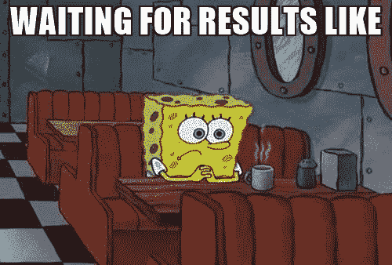

# JavaScript:微任务和宏任务

> 原文：<https://dev.to/oieduardorabelo/javascript-microtasks-e-macrotasks-35j3>

## 同一事件循环中的两个故事及其优先级

在 JavaScript/Node.js 的 Event Loop 中，有两种优先级截然不同的任务类型，例如:

*   **微任务** : process.nextTick，Promises，Object.observe，MutationObserver
*   **宏任务** : setTimeout、setInterval、setImmediate、requestAnimationFrame、I/O、UI 渲染

但是两者之间的实际区别是什么呢？我们可以总结如下:

如果事件回圈的伫列中有任何微作业悬置，则会在下一个回圈开始之前(在目前回圈的结尾)执行。巨集工作只会在下一个回圈执行。

此设置非常重要，因为某些操作的结果可能会使不熟悉 JavaScript 引擎的用户感到意外。

考虑到这一点，下面的代码片段将产生什么结果？

```
console.log('01-Console');

setTimeout(_ => console.log('02-Timeout'), 0);

Promise.resolve().then(_ => console.log('03-Promise'));

console.log('04-Console'); 
```

Enter fullscreen mode Exit fullscreen mode

在你看下面的答案之前，你能想象这个程序的输出吗？

[](https://res.cloudinary.com/practicaldev/image/fetch/s--tSejKnaN--/c_limit%2Cf_auto%2Cfl_progressive%2Cq_auto%2Cw_880/https://thepracticaldev.s3.amazonaws.com/i/zsqcrlgv3pohehki6ndq.jpg) 
*总有一天我们需要知道答案…*

执行上述片段时，我们会得到如下结果:

```
$ node tasks.js

01-Console
04-Console
03-Promise
02-Timeout 
```

Enter fullscreen mode Exit fullscreen mode

在代码中加上一些注释，我们有:

```
console.log('01-Console'); // [A]

setTimeout(_ => console.log('02-Timeout'), 0); // [B]

Promise.resolve().then(_ => console.log('03-Promise')); // [C]

console.log('04-Console'); // [D] 
```

Enter fullscreen mode Exit fullscreen mode

*   **【a】**:直接在□同步运行
*   **【b】**:作为今后的任务排队，优先顺序】，只会在下一个循环中运行
*   **【c】**:作为未来任务排队，优先级≤将在当前循环中的所有任务/任务之后和下一个循环之前立即运行
*   **【d】**:直接在□同步运行

* * *

📚链接关系

*   [https://jakearchibald . com/2015/tasks-micro tasks-queues-and-schedules/](https://jakearchibald.com/2015/tasks-microtasks-queues-and-schedules/)
*   [https://blog . rising stack . com/node-js-at-scale-understanding-node-js-event-loop/](https://blog.risingstack.com/node-js-at-scale-understanding-node-js-event-loop/)
*   [https://javascript.info/microtask-queue](https://javascript.info/microtask-queue)
*   [https://github.com/nodejs/node/issues/22257](https://github.com/nodejs/node/issues/22257)
*   [https://stack overflow . com/questions/25915634/difference-between-microtask-and-macro task-in-a-event-loop-context](https://stackoverflow.com/questions/25915634/difference-between-microtask-and-macrotask-within-an-event-loop-context)