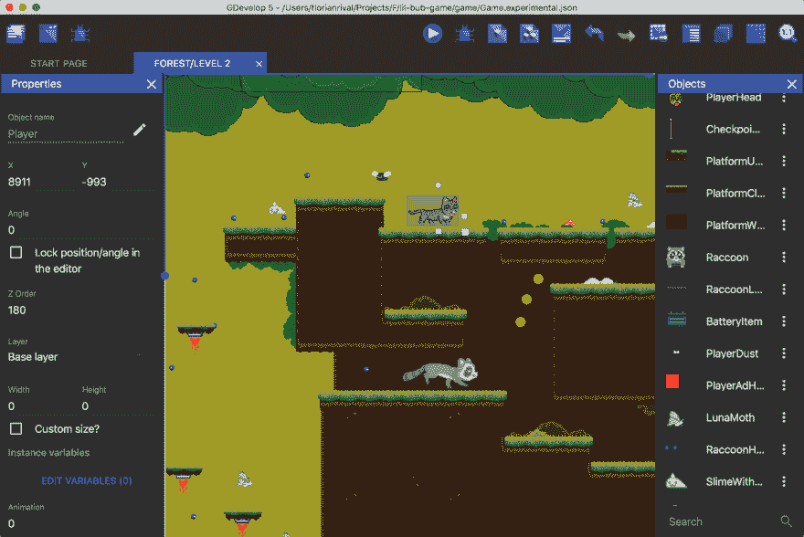

# 在校园电影节上...制作游戏

> 原文：<https://dev.to/triptych/at-campus-movie-fest-making-a-game-4gfk>

# 在校园电影节上...制作游戏

我在亚特兰大是为了🎬#campusmoviefest，而我的女儿和她的朋友可以查看关于电影制作的酷会议，并展示他们的短片。但是，我开始做我的副业。出于某种原因，我倾向于🎮 [GDevelop](https://gdevelop-app.com/) 。它看起来非常适合我——因为它接近我的游戏 javascript 核心，同时也很容易编码。用户界面还是有点...在某些方面很粗糙，但它仍然非常有用。让我感动的是，我见过的为这款引擎制作的游戏速度非常快。我没有看到任何帧速率下降，控制似乎相当敏感。我不知道用户界面，但肯定有一些真正的好东西在引擎盖下进行。

如果你还没有尝试过，我鼓励你去尝试一下。两者都存在很久了(2008？)但在这个最新版本 5 中似乎是新的。它是免费开源的，所以支持它！