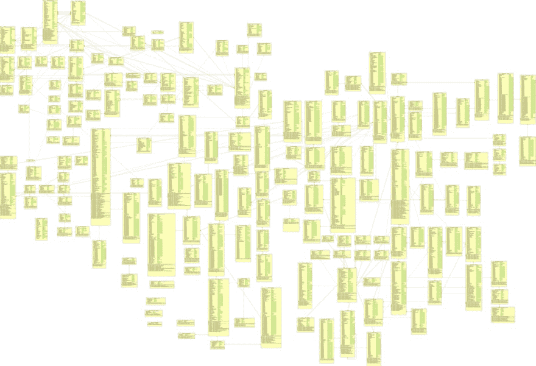
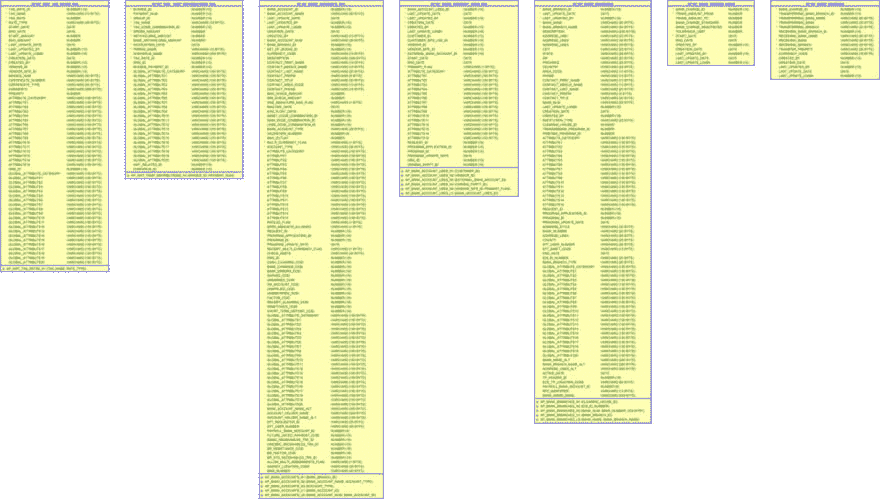

# 当 ER 图不够时

> 原文：<https://dev.to/dataedo/when-er-diagrams-are-not-enough-1pic>

本文节选:
[https://data edo . com/blog/you-dont-need-an-er-diagram-to-understand-your-database](https://dataedo.com/blog/you-dont-need-an-er-diagram-to-understand-your-database)

对于小型、简单、设计良好且具有明显领域的数据库，实体关系图是记录数据模型的好工具。但是如果你试图用它来可视化真实的数据库，它们可能会有所欠缺。这里有一些原因

## 表太多

如果您最多有几十个表，实体关系图可能会起作用。如果你写得太多，会让人困惑，而不是提供更多信息。

## 列太多

如果实体关系图有一组最小的列，那么它们可以很好地进行通信。有些表有超过 100 列，这些信息隐藏了全局

## 令人困惑的名字

真正的数据库有令人困惑、误导的名字和未使用的表和列，仅仅看名字并不能告诉你任何事情。

您认为 SAP 中的这个示例表包含哪些数据？

## 非显而易见的模型和域

您可能很容易从看到的示例图中理解数据模型，因为它描述了一些简单的、您熟知和理解的东西——学校课程、电影租赁等。这些都是我们生活中接触到的相对简单的过程。然而，有许多领域我们不知道，不理解，或者非常复杂，有许多警告。图表不会给你解释数据代表什么，它的逻辑是什么。

## 一解？

没有一个简单的解决方案，但是领域描述、一组简单的图表和完整的数据字典的良好组合可以达到目的。

[参见有效的示例数据库文档](https://dataedo.com/samples/html2/AdventureWorks/#/doc/d2/adventureworks-database)