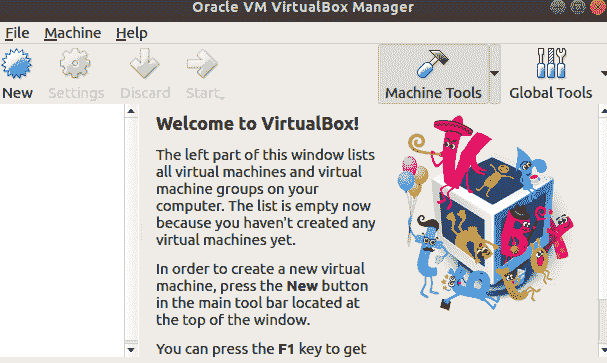

# Kubernetes for Java Developers - Setup

> 原文：[https://dev.to/sandrogiacom/kubernetes-for-java-developers-setup-41nk](https://dev.to/sandrogiacom/kubernetes-for-java-developers-setup-41nk)

[Kubernetes](https://kubernetes.io/docs/concepts/overview/what-is-kubernetes/) is a portable, extensible open-source platform for managing containerized workloads and services, that facilitates both declarative configuration and automation. It has a large, rapidly growing ecosystem. Kubernetes services, support, and tools are widely available.

## Introduction

> ***The ​​technology area is cyclical, from time to time the same technologies come back, with different names.*** (Heidemann, Vanei)

If you are over 35, you have seen many technologies being reinvented. In this case, we'll talk about application servers. As we can see in this article of [@rafabene](https://twitter.com/rafabene). [Why Kubernetes is The New Application Server](https://developers.redhat.com/blog/2018/06/28/why-kubernetes-is-the-new-application-server/)

As developers, we want to run the code on our machine, to have the control in our hands.
But now, applications are not only running on Docker containers. There are a number of things we need to worry about.

In this tutorial you will learn how to prepare the local environment for a kubernetes cluster. This is the first post of a series about Java and Kubernetes.

## Prerequisites

### Docker

[Docker](https://www.docker.com/) is an open source software platform to create, deploy and manage virtualized application containers on a common operating system (OS), with an ecosystem of allied tools.

### Minikube

[Minikube](https://github.com/kubernetes/minikube) implements a local Kubernetes cluster on macOS, Linux, and Windows.

### Kubectl

The [Kubernetes](https://kubernetes.io/docs/tasks/tools/install-kubectl/) command-line tool, kubectl, allows you to run commands against Kubernetes clusters.

### VirtualBox (Optional)

The Kubernetes cluster running inside a Virtual Machine
[https://www.virtualbox.org/](https://www.virtualbox.org/)

### If you don't have any of these tools, this can help you:

##  [ sandrogiacom ](https://github.com/sandrogiacom) / [k8s](https://github.com/sandrogiacom/k8s) 

### Kubernetes resources

<article class="markdown-body entry-content container-lg" itemprop="text">

# k8s

**Kubernetes development tools**

*   Docker
*   Kubectl
*   Minikube
*   Kubens
*   Stern
*   VirtualBox
*   OpenShift

# Clone this repository

`git clone https://github.com/sandrogiacom/k8s.git`

# Prerequisite

## Make

`sudo apt install make`

or

`sudo pacman -S make`

# Install tools

## All tools

`make install-all OS=deb`

## Separate tools

### Docker

`make install-docker OS=deb`

### VirtualBox

`make install-vbox OS=deb`

### Kubectl

`make install-kubectl OS=deb`

### Minikube

`make install-minikube OS=deb`

### OpenShift

`make install-oc OS=deb`

### Os Types

*   deb: Deabian , Mint, Ubuntu
*   arch: Arch Linux

</article>

[View on GitHub](https://github.com/sandrogiacom/k8s)

## Check if works

Type:

```
$ minikube version
minikube version: v1.1.1 
```

```
$ kubectl version
Client Version: version.Info{Major:"1", Minor:"14", GitVersion:"v1.14.2"... 
```

```
$ virtualbox 
```

[](https://res.cloudinary.com/practicaldev/image/fetch/s--y3jpO63F--/c_limit%2Cf_auto%2Cfl_progressive%2Cq_auto%2Cw_880/https://thepracticaldev.s3.amazonaws.com/i/j8chd9i6bpu2l6ymmk9r.png)

## Start minikube

To start minikube, just type `minikube start` on the terminal.
The command above creates the virtual machine with default values:
If you want to start with different flags, type `minikube start -h` to complete list

**The most important flags, is:**

*   --vm-driver: VM driver is one of: virtualbox parallels vmwarefusion kvm xhyve hyperv hyperkit kvm2 vmware none. default "virtualbox"
*   --memory int: Amount of RAM allocated to the minikube VM in MB (default 2048)
*   --cpus int: Number of CPUs allocated to the minikube VM (default 2)
*   --profile: The name of the minikube VM being used. This can be modified to allow for multiple minikube instances to be run independently (default "minikube")

`minikube start -p dev.to --cpus 2 --memory=4096`

## Dashboard

`minikube -p dev.to dashboard`

You can use Dashboard to get an overview of applications running on your cluster, as well as for creating or modifying individual Kubernetes resources (such as Deployments, Jobs, DaemonSets, etc).

## Create a namespace

It's a good practice to create a `namespace` for separating your workspace. Type:

`kubectl create namespace dev-to`

## Enable ingress

`minikube -p dev.to addons enable ingress`

Ingress exposes HTTP and HTTPS routes from outside the cluster to services within the cluster. Traffic routing is controlled by rules defined on the Ingress resource.

## Stop minikube machine

`minikube -p dev.to stop`

## Destroy minikube machine

`minikube -p dev.to delete`

## Conclusion

To be continued...

In this tutorial, we learn how to start a local kubernetes cluster and prepare to deploy our own application. In the next post, we will prepare a Java application to be deployed in the Kubernetes cluster.

See you soon.

## References

[https://github.com/arun-gupta/kubernetes-for-java-developers](https://github.com/arun-gupta/kubernetes-for-java-developers)

[https://github.com/arun-gupta/kubernetes-java-sample/blob/master/workshop.adoc#create-kubernetes-cluster](https://github.com/arun-gupta/kubernetes-java-sample/blob/master/workshop.adoc#create-kubernetes-cluster)

[https://developers.redhat.com/blog/2018/06/28/why-kubernetes-is-the-new-application-server/](https://developers.redhat.com/blog/2018/06/28/why-kubernetes-is-the-new-application-server/)

[](https://twitter.com/sandrogiacom)