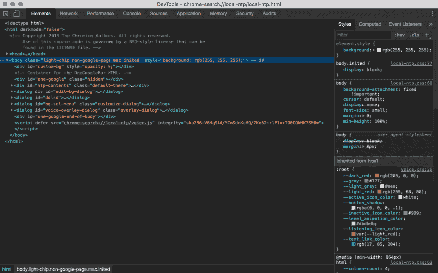

# 检测 chrome 开发工具(工作技巧)

> 原文：<https://dev.to/wanoo21/detect-chrome-dev-tools-working-trick-2obl>

[](https://res.cloudinary.com/practicaldev/image/fetch/s--7DwSPIAZ--/c_limit%2Cf_auto%2Cfl_progressive%2Cq_auto%2Cw_880/https://yon.fun/conteimg/2019/06/chrome-dev-tools-2.png)

你有没有想过如何检测 *chrome dev tools 是否打开*，更有甚者*在打开*的时候监听？我有，今天我要展示一个简单的技巧。

经过一些谷歌的研究，我发现了许多窍门，但不幸的是，其中许多不再管用了。只有一个解决方案(在我之后)可以解决这个问题。看看这个(复制并粘贴到你的代码中，它已经可以使用了):

<figure>

```
const element = new Image();
Object.defineProperty(element, 'id', {
  get: function () {
    /* Call callback function here */
  }
});
console.log('%c', element); 
```

<figcaption>Detect Chrome Dev Tools Javascript Code</figcaption>

</figure>

让我们深入研究一下，了解一下那里发生了什么。所以，首先，我们创建一个*元素*(不要求必须是`new Image()`，我认为`new Audio()`也可以)，我们使用`Object.defineProperty`来定义*元素*的`id`属性，并在`get`上添加一个*函数回调*。很聪明，对吧？现在，每次当 *element.id* 被获取时，*回调函数*将会运行——这就是我们所需要的，将 *chrome dev tools* 打开时运行的函数放在那里。

所以有趣的部分是最后一行，如果已经调用了`console.log`,这意味着 *element.id* ,为什么*回调函数*没有运行？嗯，这不是真的，`console.log`只在 **chrome dev 控制台工具**打开尝试`log` *元素*以及`id` *属性*时被调用**——当`id` *属性*被取用时会发生什么？对，触发(`get`)回调函数。**

你知道现在真正有效的其他技巧吗？与我们分享它们，我将在本文中介绍。