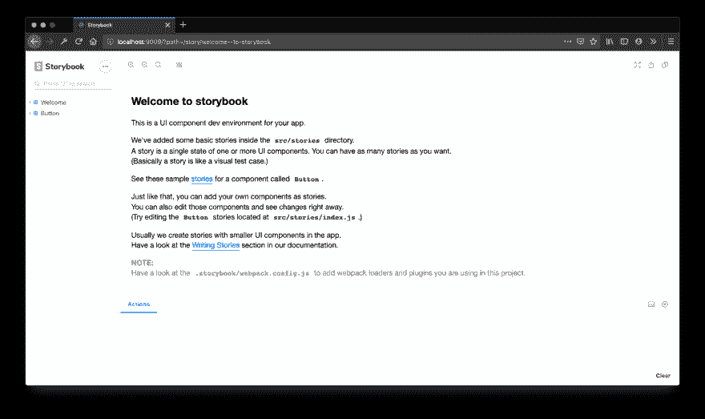
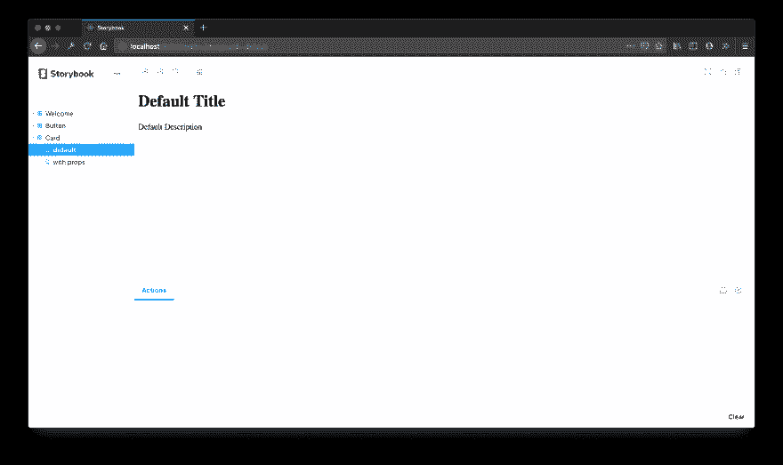

# 故事书:为什么，何时和如何。

> 原文：<https://dev.to/felipesousa/storybook-why-when-and-how-3jm5>

基于组件的应用对任何人来说都不是新闻，像 React、VueJS 和 Angular 这样的库基本上是我们创建新项目时的第一选择，因为它们对我们开发人员来说真的很好。

故事书是一个库，允许我们划分组件，模拟你的行为、动作、属性等。

*Ps:这里所有的例子都是基于 React。如果你想看看如何设置使用另一个库，检查一下[链接](https://storybook.js.org/)。*

好的，你开始你的项目，你进入你的`src`文件夹并创建一个名为`Button.js`的新文件，之后，你在你的`index.js`文件中调用这个组件并打开你的浏览器检查组件。每次创建一个新的，你都会重复它！好吧，如果你是一个人或者在一个小项目中工作，这不是问题，但是想象一下这个项目很大，或者你是和一个团队一起工作(最常见的情况)。如果其他人需要使用您的组件，这个人将需要打开您的`Button.js`文件，检查属性、样式、动作等。这是一个痛苦的过程，需要时间，当然还有**耐心！**。

## 设置

好吧，让我们开始一个新的`create-react-app`项目。

```
$ create-react-app your_project && cd your_project 
```

<svg width="20px" height="20px" viewBox="0 0 24 24" class="highlight-action crayons-icon highlight-action--fullscreen-on"><title>Enter fullscreen mode</title></svg> <svg width="20px" height="20px" viewBox="0 0 24 24" class="highlight-action crayons-icon highlight-action--fullscreen-off"><title>Exit fullscreen mode</title></svg>

之后，我们可以设置运行命令的故事书:

```
$ npx -p @storybook/cli sb init 
```

<svg width="20px" height="20px" viewBox="0 0 24 24" class="highlight-action crayons-icon highlight-action--fullscreen-on"><title>Enter fullscreen mode</title></svg> <svg width="20px" height="20px" viewBox="0 0 24 24" class="highlight-action crayons-icon highlight-action--fullscreen-off"><title>Exit fullscreen mode</title></svg>

现在你只需要运行:

```
$ yarn storybook 
```

<svg width="20px" height="20px" viewBox="0 0 24 24" class="highlight-action crayons-icon highlight-action--fullscreen-on"><title>Enter fullscreen mode</title></svg> <svg width="20px" height="20px" viewBox="0 0 24 24" class="highlight-action crayons-icon highlight-action--fullscreen-off"><title>Exit fullscreen mode</title></svg>

将在 **[创建一个本地服务器 http://localhost:9009](http://localhost:9009)** ，您将看到类似这样的内容:

[](https://res.cloudinary.com/practicaldev/image/fetch/s--VaF9reXG--/c_limit%2Cf_auto%2Cfl_progressive%2Cq_auto%2Cw_880/https://thepracticaldev.s3.amazonaws.com/i/a1naaowbvrlww4i2u6df.png)

这就是你需要设置和运行你的故事书仪表板。现在，我们将检查如何在 Storybook Dashboard 上添加您自己的组件。

在我们进入下一部分之前，在您的根项目中创建了一个名为`.storybook`的文件夹，该文件夹包含 Storybook CLI 生成的所有设置，现在不要关心它，我们稍后将讨论它。

## 添加自己的组件

现在，设置好之后，进入文件 *src/stories/index.js* ，你会看到:

```
import React from 'react';

import { storiesOf } from '@storybook/react';
import { action } from '@storybook/addon-actions';
import { linkTo } from '@storybook/addon-links';

import { Button, Welcome } from '@storybook/react/demo';

storiesOf('Welcome', module).add('to Storybook', () => <Welcome showApp={linkTo('Button')} />);

storiesOf('Button', module)
  .add('with text', () => <Button onClick={action('clicked')}>Hello Button</Button>)
  .add('with some emoji', () => (
    <Button onClick={action('clicked')}>
      <span role="img" aria-label="so cool">
        😀 😎 👍 💯
      </span>
    </Button>
  )); 
```

<svg width="20px" height="20px" viewBox="0 0 24 24" class="highlight-action crayons-icon highlight-action--fullscreen-on"><title>Enter fullscreen mode</title></svg> <svg width="20px" height="20px" viewBox="0 0 24 24" class="highlight-action crayons-icon highlight-action--fullscreen-off"><title>Exit fullscreen mode</title></svg>

在这里您可以检查所有在 *[显示的组件 http://localhost:9009](http://localhost:9009)* ，所有组件都在这里注册，以添加到故事书仪表板上。

好，让我们在我们的`src/components`文件夹中添加一个名为`Card.js`的新组件。

```
import React from 'react';
import PropTypes from 'prop-types';

const Card = ({ title, description, }) => (
  <div>
    <h1>{title}</h1>
    <p>{description}</p>
  </div>
);

Card.propTypes = {
  title: PropTypes.string,
  description: PropTypes.string,
};

Card.defaultProps = {
  title: 'Default Title',
  description: 'Default Description', 
};

export default Card; 
```

<svg width="20px" height="20px" viewBox="0 0 24 24" class="highlight-action crayons-icon highlight-action--fullscreen-on"><title>Enter fullscreen mode</title></svg> <svg width="20px" height="20px" viewBox="0 0 24 24" class="highlight-action crayons-icon highlight-action--fullscreen-off"><title>Exit fullscreen mode</title></svg>

我们的`Card`组件如此简单，组件接收两个可选属性，`title`和`description`，如果组件没有接收道具，它将显示您已经定义的默认值。

现在让我们将我们的`Card`组件添加到`src/stories/index.js`文件中。

```
...
import Card from '../components/Card';

...

storiesOf('Card', module)
  .add('default', () => (<Card />))
  .add('with props', () => (<Card title="Lorem Impsum" description="Hi everyone" />)) 
```

<svg width="20px" height="20px" viewBox="0 0 24 24" class="highlight-action crayons-icon highlight-action--fullscreen-on"><title>Enter fullscreen mode</title></svg> <svg width="20px" height="20px" viewBox="0 0 24 24" class="highlight-action crayons-icon highlight-action--fullscreen-off"><title>Exit fullscreen mode</title></svg>

你需要做的第一件事是调用方法`storiesOf`，它接收两个参数，第一个是你的故事(或组件)的名字，第二个是 storybook 提供的参数`module`。

之后，我添加了一个名为`add`的管道，它也接收两个参数，第一个是关于组件的故事名称(或预期行为)，我添加了“default ”,因为我没有传递任何参数，所以我希望看到组件的默认状态，第二个是组件，在这种情况下，只调用组件，而没有属性。第二个`add`管道接收不同的名称，在这种情况下，我用它们的属性调用组件，现在，如果我打开我的仪表板，我将能够看到我的组件的两个预期行为。

[](https://res.cloudinary.com/practicaldev/image/fetch/s--5Fu3YiB7--/c_limit%2Cf_auto%2Cfl_progressive%2Cq_auto%2Cw_880/https://thepracticaldev.s3.amazonaws.com/i/12o67kkx0vwagtr1lzbz.png)

## 附加组件

好的，Storybook 工作正常，你现在可以把你的组件一个一个分开看，但是如果你能够在仪表板里面编辑你的组件的属性呢？或者查看操作日志？那太好了，对吧？

Storybook 可以做的不仅仅是看到我们的组件被分开，有了它我们还可以做更多的事情，比如:模拟动作，在我们的仪表板上改变我们的道具，查看笑话更新，可访问性，改变你的组件的状态(在 React 的情况下)，等等。

现在，我将展示如何改变我们的道具和模拟动作。如果你对其他插件感兴趣，你可以在这里查看。

好的，让我们更新我们的`Card`组件，现在我们将添加一个按钮来调用一个叫做`onButtonClicked`的道具。让我们开始吧:

```
import React from 'react';
import PropTypes from 'prop-types';

const Card = ({ onButtonClicked, title, description }) => (
  <div>
    <h1>{title}</h1>
    <p>{description}</p>
    <button onClick={onButtonClicked}>Click here</button>
  </div>
);

Card.propTypes = {
  title: PropTypes.string,
  description: PropTypes.string,
  onButtonClicked: PropTypes.func,
};

Card.defaultProps = {
  title: 'Default Title',
  description: 'Default Description',
  onButtonClicked: () => null,
};

export default Card; 
```

<svg width="20px" height="20px" viewBox="0 0 24 24" class="highlight-action crayons-icon highlight-action--fullscreen-on"><title>Enter fullscreen mode</title></svg> <svg width="20px" height="20px" viewBox="0 0 24 24" class="highlight-action crayons-icon highlight-action--fullscreen-off"><title>Exit fullscreen mode</title></svg>

现在，让我们回到我们的`src/stories/index.js`文件，给我们的卡片故事添加一个新道具:

```
...

import Card from '../components/Card';

...

storiesOf('Card', module)
  .add('default', () => (<Card />))
  .add('with props', () => (
    <Card
      title="Lorem Impsum"
      description="Hi everyone"
      onButtonClicked={() => {console.log("button was clicked")}}
    />)) 
```

<svg width="20px" height="20px" viewBox="0 0 24 24" class="highlight-action crayons-icon highlight-action--fullscreen-on"><title>Enter fullscreen mode</title></svg> <svg width="20px" height="20px" viewBox="0 0 24 24" class="highlight-action crayons-icon highlight-action--fullscreen-off"><title>Exit fullscreen mode</title></svg>

现在，如果您打开仪表板并点击按钮，控制台将显示消息**按钮被点击**。好了，目前还没有消息，让我们先使用仪表盘编辑我们的道具。

您需要做的第一件事是安装`addon-knobs`模块:

```
 $ yarn add @storybook/addon-knobs --dev 
```

<svg width="20px" height="20px" viewBox="0 0 24 24" class="highlight-action crayons-icon highlight-action--fullscreen-on"><title>Enter fullscreen mode</title></svg> <svg width="20px" height="20px" viewBox="0 0 24 24" class="highlight-action crayons-icon highlight-action--fullscreen-off"><title>Exit fullscreen mode</title></svg>

之后，您需要更改您的`.storybook/addons.js`文件:

```
import '@storybook/addon-actions/register';
import '@storybook/addon-links/register';
import '@storybook/addon-knobs/register'; 
```

<svg width="20px" height="20px" viewBox="0 0 24 24" class="highlight-action crayons-icon highlight-action--fullscreen-on"><title>Enter fullscreen mode</title></svg> <svg width="20px" height="20px" viewBox="0 0 24 24" class="highlight-action crayons-icon highlight-action--fullscreen-off"><title>Exit fullscreen mode</title></svg>

好了，现在打开你的`src/stories/index.js`文件，导入模块，更改道具**标题**和**描述** :

```
...
import { withKnobs, text } from '@storybook/knobs';
...

storiesOf('Card', module)
  .addDecorator(withKnobs)
  .add('default', () => (<Card />))
  .add('with props', () => (
    <Card
      title={text('title', 'lorem impsun')}
      description={text('description', 'Hi everyone')}
      onButtonClicked={() => {console.log("button was clicked")}}
    />)) 
```

<svg width="20px" height="20px" viewBox="0 0 24 24" class="highlight-action crayons-icon highlight-action--fullscreen-on"><title>Enter fullscreen mode</title></svg> <svg width="20px" height="20px" viewBox="0 0 24 24" class="highlight-action crayons-icon highlight-action--fullscreen-off"><title>Exit fullscreen mode</title></svg>

如果你检查详细，我添加了一个新的管道后的`storiesOf`的方法，`.addDecorator`添加支持使用旋钮。**标题**和**描述**道具现在正在接收一个名为`text`的方法，该方法接收的第一个参数是属性的名称，第二个参数是默认值，现在，检查你的仪表板，在页脚部分，点击`Knobs`选项卡，你会看到道具可以被编辑！🥳

好了，现在让我们跟踪`onButtonClicked`动作，要做到这一点，我们需要使用`action`模块，并改变我们卡上的道具组件:

```
...
import { action } from '@storybook/addon-actions';
...

storiesOf('Card', module)
  .addDecorator(withKnobs)
  .add('default', () => <Card />)
  .add('with props', () => (
    <Card
      title={text('title', 'lorem impsun')}
      description={text('description', 'Hi everyone')}
      onButtonClicked={action('button clicked')}
    />)) 
```

<svg width="20px" height="20px" viewBox="0 0 24 24" class="highlight-action crayons-icon highlight-action--fullscreen-on"><title>Enter fullscreen mode</title></svg> <svg width="20px" height="20px" viewBox="0 0 24 24" class="highlight-action crayons-icon highlight-action--fullscreen-off"><title>Exit fullscreen mode</title></svg>

现在，回到您的仪表板，选择表*动作*并尝试点击按钮。🚀

好的，正如你所看到的，Storybook 是一个超级图书馆，可以帮助我们创建更高效和智能的应用程序，这篇文章只是一个介绍，你可以在这里查看更多内容。

这就是所有的乡亲，谢谢你的时间！

再见！