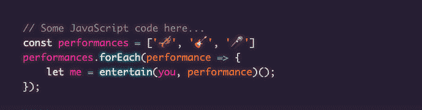

# 使用 VSCode Theme Synthwave '84 在您的网站语法突出显示

> 原文：<https://dev.to/themarcba/use-vscode-theme-synthwave-84-in-your-website-syntax-highlighting-p2e>

我现在有充分的理由欢呼。**我做出了我的第一个开源贡献**🎉🎉🎉🥳

几个月来，我一直在使用这个由 [Robb Owen](https://twitter.com/robb0wen) 创作的名为[synth wave’84](https://marketplace.visualstudio.com/items?itemName=RobbOwen.synthwave-vscode)的令人敬畏的 VS 代码主题。

我非常喜欢它，以至于我想用它作为我博客的语法突出主题。

我用 [PrismJS](http://prismjs.com) 作为语法高亮工具，但是在那里找不到主题，所以我决定试一试，把 Robb 的主题移植到 Prism。

可以在这里查看主题:
[https://github . com/themarcba/prism-themes/blob/master/themes/prism-synth wave 84 . CSS](https://github.com/themarcba/prism-themes/blob/master/themes/prism-synthwave84.css)

为了使用它，您只需要在 pre.language-*元素中包含 code.language-*，并添加 prism.js 文件。(*代表您想要突出显示的语言，例如 javascript、css)

```
<!DOCTYPE html>
<html lang="en">
<head>
    ...
    <link rel="stylesheet" href="./prism-synthwave84.css">
</head>
    <body>
        <pre class="language-javascript">
            <code class="language-javascript">
                // Some JavaScript code here...
                const performances = ['🎺', '🎸', '🎤']
                performances.forEach(performance => {
                    let me = entertain(you, performance)();
                });
            </code>
        </pre>
        <script src="./prism.js"></script>
    </body>
</html> 
```

Enter fullscreen mode Exit fullscreen mode

你可以从[他们的网站](https://prismjs.com/download.html)下载 prism.js 文件。

结果会是这样:
[](https://res.cloudinary.com/practicaldev/image/fetch/s--wFn-fKem--/c_limit%2Cf_auto%2Cfl_progressive%2Cq_auto%2Cw_880/https://thepracticaldev.s3.amazonaws.com/i/z4g3wt00k0013sjxjyx8.png)

或者，如果您已经使用 Prism，只需用 [Synthwave 文件](https://github.com/themarcba/prism-themes/blob/master/themes/prism-synthwave84.css)替换 CSS 文件。