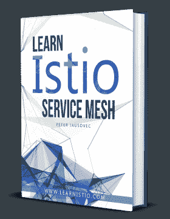

# 什么是粘性会话，如何用 Istio 配置它们？

> 原文：<https://dev.to/peterj/what-are-sticky-sessions-and-how-to-configure-them-with-istio-1e1a>

[](https://gum.co/learnistio)

粘性会话背后的思想是将特定会话的请求路由到为第一个请求提供服务的同一个端点。这样，就可以根据 HTTP 头或 cookies 将服务实例与调用者相关联。如果您的服务在第一次请求时执行开销很大的操作，但后来缓存了值，那么您可能希望使用粘性会话。这样，如果同一个用户发出请求，就不会执行昂贵的操作，而是使用缓存中的值。

为了演示粘性会话的功能，我将使用一个名为 *sticky-svc* 的示例服务。当被调用时，该服务检查是否存在 *x-user* 报头。如果标头存在，它会尝试在内部缓存中查找标头值。对于新的 *x-user* 的任何第一个请求，该值将不存在于缓存中，因此服务将休眠 5 秒钟(模拟一个昂贵的操作)，之后，它将缓存该值。具有相同 *x-user* 头值的任何后续请求将立即返回。下面是来自服务源代码的这个简单逻辑的片段:

```
var (
    cache = make(map[string]bool)
)

func process(userHeaderValue string) {
    if cache[userHeaderValue] {
        return
    }

    cache[userHeaderValue] = true
    time.Sleep(5 * time.Second)
} 
```

Enter fullscreen mode Exit fullscreen mode

为了查看正在运行的粘性会话，您需要运行服务的多个副本。这样，当您启用粘性会话时，具有相同 *x-user* 头值的请求将总是被定向到最初为相同 *x-user* 值的请求提供服务的 pod。我们发出的第一个请求总是需要 5 秒钟，但是，任何后续的请求都是即时的。

让我们先创建 Kubernetes 部署和服务:

```
cat <<EOF | kubectl apply -f -
apiVersion: apps/v1
kind: Deployment
metadata:
  name: sticky-svc
  labels:
    app: sticky-svc
    version: v1
spec:
  replicas: 5
  selector:
    matchLabels:
      app: sticky-svc
      version: v1
  template:
    metadata:
      labels:
        app: sticky-svc
        version: v1
    spec:
      containers:
        - image: learnistio/sticky-svc:1.0.0
          imagePullPolicy: Always
          name: svc
          ports:
            - containerPort: 8080
---
kind: Service
apiVersion: v1
metadata:
  name: sticky-svc
  labels:
    app: sticky-svc
spec:
  selector:
    app: sticky-svc
  ports:
    - port: 8080
      name: http
EOF 
```

Enter fullscreen mode Exit fullscreen mode

接下来，我们可以部署虚拟服务并将其与网关相关联。确保删除任何其他可能与网关关联或使用不同主机的虚拟服务。

```
cat <<EOF | kubectl apply -f -
apiVersion: networking.istio.io/v1alpha3
kind: VirtualService
metadata:
  name: sticky-svc
spec:
  hosts:
    - '*'
  gateways:
    - gateway
  http:
    - route:
      - destination:
          host: sticky-svc.default.svc.cluster.local
          port:
            number: 8080
EOF 
```

Enter fullscreen mode Exit fullscreen mode

让我们通过调用几次 */ping* 端点，并设置 *x-user* 头值:
，来确保在不配置粘性会话的情况下一切正常

```
$ curl -H "x-user: ricky" http://localhost/ping

Call was processed by host sticky-svc-689b4b7876-cv5t9 for user ricky and it took 5.0002721s 
```

Enter fullscreen mode Exit fullscreen mode

第一个请求(如预期的那样)需要 5 秒钟。如果您再发出几个请求，您会看到其中一些请求也需要 5 秒钟，而其中一些请求(被定向到前面的一个 pod)需要的时间要少得多，可能只有 500 微秒。

通过创建粘性会话，我们希望实现所有后续请求在几微秒内完成，而不是花费 5 秒钟。可以在服务的目标规则中配置粘性会话设置。

概括地说，有两个选项可以选择负载平衡器设置。第一个选项叫做 simple，我们只能选择一种负载平衡算法，例如 ROUND_ROBIN、LEAST_CONN、RANDOM 或 PASSTHROUGH。

例如，这个代码片段会将负载平衡算法设置为 *LEAST_CONN* :

```
apiVersion: networking.istio.io/v1alpha3
kind: DestinationRule
metadata:
    name: sticky-svc
spec:
    host: sticky-service.default.svc.cluster.local
    trafficPolicy:
      loadBalancer:
        simple: LEAST_CONN 
```

Enter fullscreen mode Exit fullscreen mode

设置负载平衡器设置的第二个选项是使用名为`consistentHash`的字段。该选项允许我们基于 HTTP 头(`httpHeaderName`)、cookie(`httpCookie`)或其他属性(例如，使用`useSourceIp: true`设置的源 IP)来提供会话关联性。

让我们使用 *x-user* 头名称在目的地规则中定义一个一致的散列算法，并部署它:

```
cat <<EOF | kubectl apply -f -
apiVersion: networking.istio.io/v1alpha3
kind: DestinationRule
metadata:
    name: sticky-svc
spec:
    host: sticky-svc.default.svc.cluster.local
    trafficPolicy:
      loadBalancer:
        consistentHash:
          httpHeaderName: x-user
EOF 
```

Enter fullscreen mode Exit fullscreen mode

在我们进行测试之前，让我们重新启动所有的 pod，这样我们就有了一个全新的开始，并清空了内存缓存。首先，我们将部署缩减到 0 个副本，然后再将其缩减到 5 个副本:

```
kubectl scale deploy sticky-svc --replicas=0
kubectl scale deploy sticky-svc --replicas=5 
```

Enter fullscreen mode Exit fullscreen mode

所有副本启动后，尝试向端点发出第一个请求:

```
$ curl -H "x-user: ricky" http://localhost/ping
Call was processed by host sticky-svc-689b4b7876-cq8hs for user ricky and it took 5.0003232s 
```

Enter fullscreen mode Exit fullscreen mode

正如所料，第一个请求花费了 5 秒钟，但是，任何后续请求都将发送到同一个实例，并且花费的时间会少得多:

```
$ curl -H "x-user: ricky" http://localhost/ping
Call was process by host sticky-svc-689b4b7876-cq8hs for user ricky and it took 47.4µs
$ curl -H "x-user: ricky" http://localhost/ping
Call was process by host sticky-svc-689b4b7876-cq8hs for user ricky and it took 53.7µs
$ curl -H "x-user: ricky" http://localhost/ping
Call was process by host sticky-svc-689b4b7876-cq8hs for user ricky and it took 46.1µs
$ curl -H "x-user: ricky" http://localhost/ping
Call was process by host sticky-svc-689b4b7876-cq8hs for user ricky and it took 76.5µs 
```

Enter fullscreen mode Exit fullscreen mode

这是一次棘手的会议！如果我们向不同的用户发出请求，最初需要 5 秒钟，但之后它会再次转到完全相同的 pod。

> 这是即将推出的 **Learn Istio 电子书**的节选——免费获得**[Learn Istio 服务网电子书](https://learnistio.com)的预览，或在此[预订](https://gum.co/learnistio)**