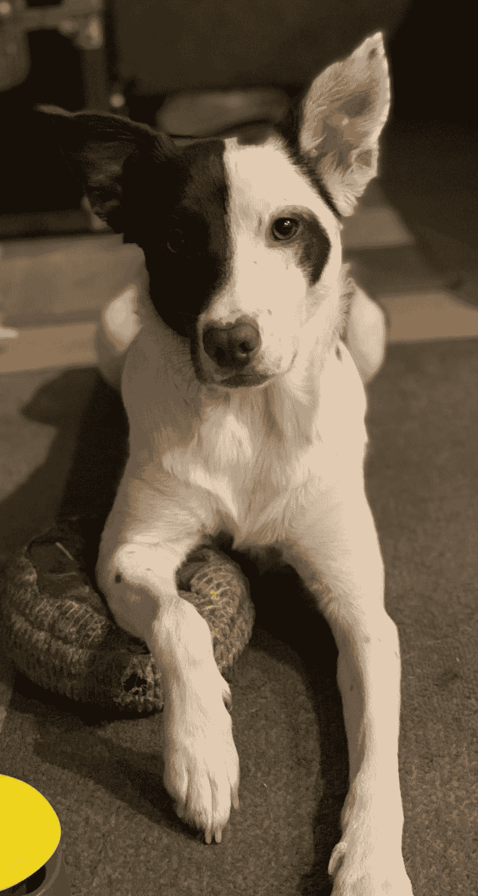
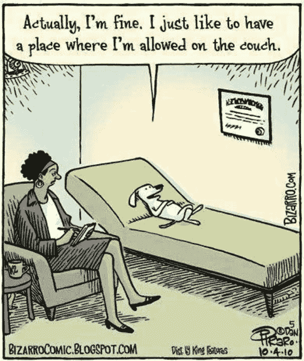

# 我的狗是一名治疗师

> 原文：<https://dev.to/taillogs/my-dog-is-a-therapist-f65>

[覆盖信用](https://www.onegreenplanet.org/animalsandnature/the-importance-of-therapy-dogs/)

今天有更多的个人帖子。想改变现状。

这是我们和我们 1.5 岁的边境牧羊犬奥德丽的一次经历。如果你在焦虑中挣扎，这可能是很有见地的。

## 奥黛丽和焦虑

奥黛丽

我们在训练奥德丽上下了很大功夫。自从我们得到她后，她几乎每天都进行 40 分钟的高质量 1:1 训练/游戏。她还每天散步 2 次，外加一大堆其他的随机关注。所以你可以理解几个月前奥黛丽开始出现焦虑问题时我们的困惑，尤其是在我们散步的时候。

珍妮(我的女朋友)和我都是非常焦虑的人。这是我们一生都在努力的事情。显然，我们都意识到了这一点，并非常努力地去改善这种情况，但有时你的大脑会有抽象的焦虑方式，而“你”并不明显。

几个星期以来，奥黛丽的焦虑越来越严重，看得我们心都碎了。我们一直在被动地解决这个问题，但我们决定开始采取真正有意识的行动来解决这个问题。我注意到，如果你在走路时与奥黛丽完全接触，她的焦虑就会消散。但是如果你在打电话或交谈时分心，她会再次回归。

我为我们和奥黛丽的散步定了一个新规则，如果你和她散步，你需要和她完全接触。我希望，如果有足够的时间，这将抑制她的大脑目前与行走的负面联系。由于这条规则的性质，在接下来的几周里，我花了很多时间观察她。

几个星期后，我开始认为她在散步时的焦虑可能是有规律的。因为她是一只牧羊犬，所以她有很强的从众心理。很明显，当这个团体“不在一起”时，她有多不安。事实上，如果团队成员分开了，她也不会看不到其他成员。所以当我带她散步时，她会一直看着珍妮，以确保我们呆在一起(反之亦然)。

这让我很好奇。我决定开始同时观察珍妮和奥黛丽的行为。没过多久，我就发现珍妮的肢体语言非常能说明她是否感到焦虑。她读起来像个糟糕的扑克玩家。因为狗(作为一个物种)已经变得非常擅长阅读人类的肢体语言，奥黛丽从和我相似的角度看待珍妮。突然间，我明白了。奥黛丽在散步时的焦虑反映了我们在散步时的焦虑。

如果还不清楚，这里有一个例子。我注意到珍妮走过人行横道的速度比她走在人行道上快得多。她下意识地对等待转弯的汽车(被我们行人挡住的汽车)感到焦虑，并会加快步伐来满足这种焦虑。奥黛丽，无法理解焦虑的背景，只看到珍妮是不满和警惕。我们每走一段路就要穿过街道 20 多次，而穿过街道只是许多焦虑诱导场景中的一个。将每天两次的散步中所有这些微小的经历结合起来，你就有了一只有严重焦虑问题的狗。

 
[功劳](https://i1.wp.com/arnoldzwicky.s3.amazonaws.com/Bizarro101410.jpg?zoom=2)

## 结论

有了这个发现后，珍妮和我开始尽最大努力减少我们自己在散步时的焦虑。这极大地改善了行走，几乎是立竿见影。这也迫使珍妮和我更加意识到我们自己的焦虑，以及我们对外表达焦虑的方式。

我坚信，我们从其他人那里获得了那些微妙的信号，而自己却不知道。这可能会彻底改变你对他人行为的看法。也许有些人你只是“不喜欢”，这是因为你的大脑下意识地感受到了他们的焦虑。也许有个人因为类似的原因不喜欢你。

别担心，这是每个人都可以改进的。注意，试着想象某人只能通过你的肢体语言来理解事情。那会是一次愉快的经历吗？如果不是，你会如何改变，让这种体验变得更愉快？

如果你想看奥黛丽的表演，这里有一段视频。

[https://www.youtube.com/embed/u1OjTMMzAqk](https://www.youtube.com/embed/u1OjTMMzAqk)