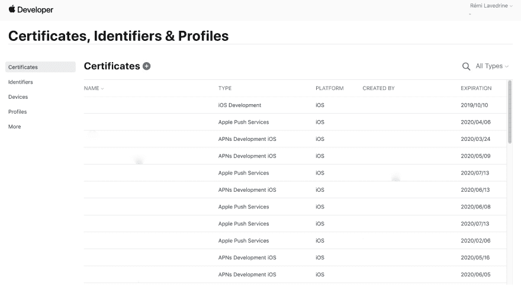
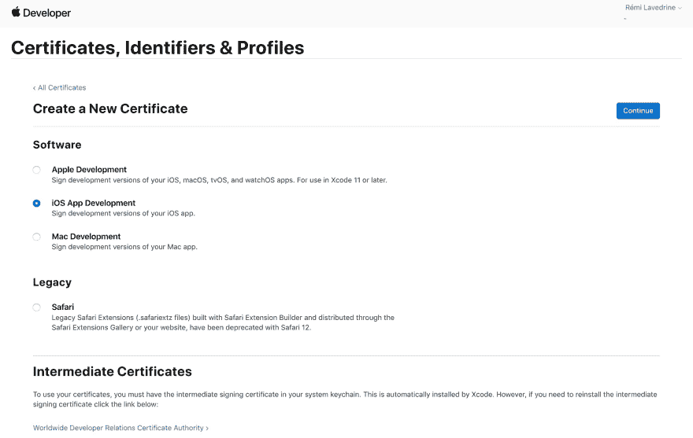
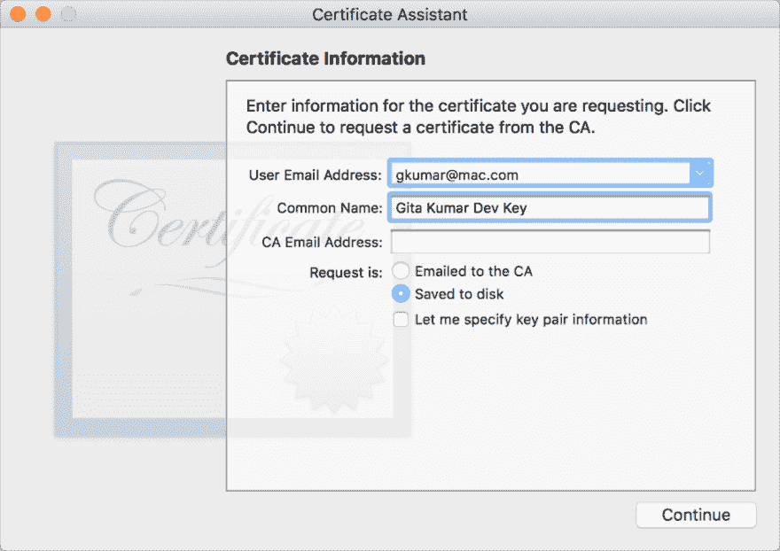
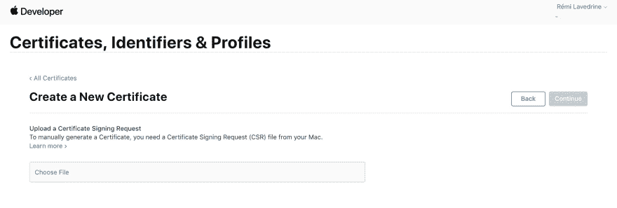
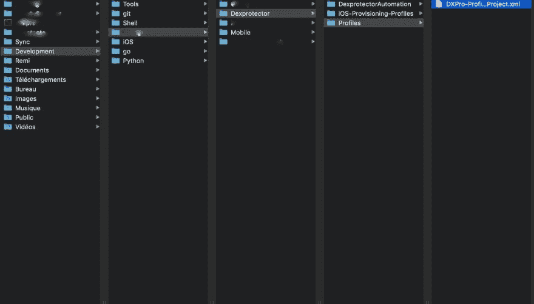
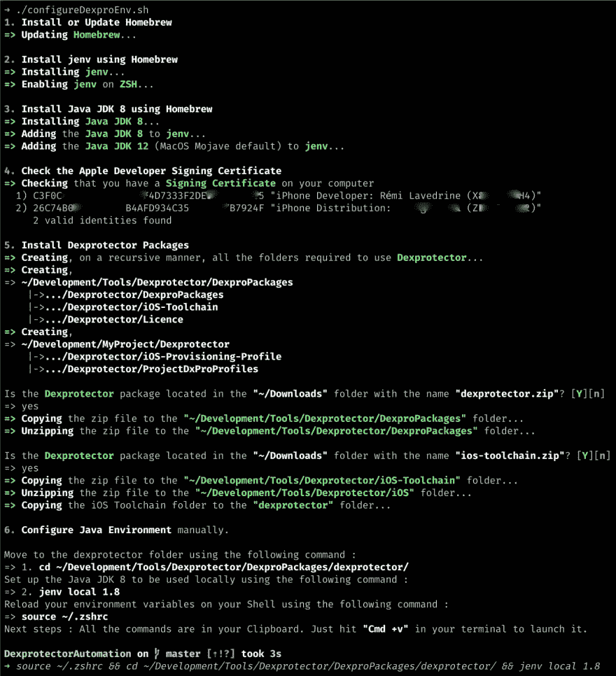

# iOS 上的应用程序混淆

> 原文：<https://dev.to/shostarsson/application-obfuscation-on-ios-3d2c>

### 简介

如[维基百科](https://en.wikipedia.org/wiki/Obfuscation_(software))所述

> 在软件开发中，混淆是指故意创建人类难以理解的源代码或机器代码的行为。
> 
> 就像自然语言中的模糊处理一样，它可能会使用不必要的迂回表达式来构成语句。程序员可能故意混淆代码，以隐藏其目的(通过模糊实现安全性)或其逻辑或嵌入其中的隐含值，主要是为了防止篡改、阻止逆向工程，或者甚至作为阅读源代码的人的难题或娱乐挑战。
> 
> 这可以手动或通过使用自动化工具来完成，后者是工业中优选的技术。

* * *

### 混淆的优点

自动化代码混淆有几个优点，这使得它在许多平台上流行和广泛使用。
在一些平台上(比如 Java，Android，和。反编译器可以对可执行文件或库的源代码进行逆向工程。

自动化代码混淆的一个主要优势是，它通过使**逆向工程程序变得困难和经济上不可行**来帮助保护软件中包含的商业秘密(知识产权)。
其他优势可能包括帮助**保护许可机制和未授权访问**，以及缩小源代码的大小，并可能缩小可执行文件的大小。
反编译有时被称为“中间人”攻击，这种攻击基于传统的密码攻击。

> 因此，通过使其在经济上无利可图，模糊处理使你更不容易遭遇“**许可欺诈**”、“**逆向工程**”和“**知识产权盗窃**”。

### 混淆视听的弊端

虽然模糊处理会使程序的读取、编写和逆向工程变得困难和耗时，但它不一定会使之变得不可能。一些反病毒软件，如 AVG AntiVirus，也会在用户登陆带有手动混淆代码的网站时提醒他们，因为混淆的目的之一是隐藏恶意代码。
然而，一些开发人员可能会采用代码混淆来减小文件大小或提高安全性。**普通用户可能不希望他们的反病毒软件提供关于一段无害代码的警告**，尤其是来自可信公司的，所以这样的功能实际上可能会阻止用户使用合法软件。

> 因此，针对反病毒领域的大牌测试你的混淆软件可能会很有趣。

### 混淆软件

有多种工具可以执行或辅助代码混淆。其中包括由学者创建的实验研究工具、业余爱好者的工具、专业人士编写的商业产品以及开源软件。

面向移动应用的同类最佳商业混淆产品之一是 [Dexprotector](https://dexprotector.com/) 。

* * *

## 在 MacOS 上安装 dex protector(Mojave)

由于我们想要混淆我们的 iOS 应用程序，我们首先必须在 MacOS 计算机上安装 Dexprotector(因为混淆只能在 MacOS 计算机上运行，因为它基于 XCode 来执行一些操作)。

* * *

## 1。安装自制软件包管理器

[家酿](https://brew.sh/)是苹果在 MacOS 上缺失的包管理器。
如果你还没有安装[家酿软件](https://brew.sh/)的话，请在你的 MacOS 上安装。
家酿安装你需要的苹果没有的东西。

要安装家酿，只需粘贴在 macOS 终端提示符。

```
/usr/bin/ruby -e "$(curl -fsSL https://raw.githubusercontent.com/Homebrew/install/master/install)" 
```

<svg width="20px" height="20px" viewBox="0 0 24 24" class="highlight-action crayons-icon highlight-action--fullscreen-on"><title>Enter fullscreen mode</title></svg> <svg width="20px" height="20px" viewBox="0 0 24 24" class="highlight-action crayons-icon highlight-action--fullscreen-off"><title>Exit fullscreen mode</title></svg>

* * *

## 2。安装 Jenv 来处理多个 Java JDK

根据项目的位置来管理将要使用的 Java Jdk 是很好的。jEnv 非常适合高效、轻松地管理您的 Java 环境。

### 2.1。用自制软件安装 Jenv

```
brew install jenv 
```

<svg width="20px" height="20px" viewBox="0 0 24 24" class="highlight-action crayons-icon highlight-action--fullscreen-on"><title>Enter fullscreen mode</title></svg> <svg width="20px" height="20px" viewBox="0 0 24 24" class="highlight-action crayons-icon highlight-action--fullscreen-off"><title>Exit fullscreen mode</title></svg>

### 2.2。在您的 Shell 上启用 jenv

正如在终端上的`jenv`安装结束时提到的，您必须通知您的 shell】在哪里，以便您可以在系统范围内使用它。
**痛击**

```
echo 'export PATH="$HOME/.jenv/bin:$PATH"' >> ~/.bash_profile
echo 'eval "$(jenv init -)"' >> ~/.bash_profile 
```

<svg width="20px" height="20px" viewBox="0 0 24 24" class="highlight-action crayons-icon highlight-action--fullscreen-on"><title>Enter fullscreen mode</title></svg> <svg width="20px" height="20px" viewBox="0 0 24 24" class="highlight-action crayons-icon highlight-action--fullscreen-off"><title>Exit fullscreen mode</title></svg>

**Zsh**

```
echo 'export PATH="$HOME/.jenv/bin:$PATH"' >> ~/.zshrc
echo 'eval "$(jenv init -)"' >> ~/.zshrc 
```

<svg width="20px" height="20px" viewBox="0 0 24 24" class="highlight-action crayons-icon highlight-action--fullscreen-on"><title>Enter fullscreen mode</title></svg> <svg width="20px" height="20px" viewBox="0 0 24 24" class="highlight-action crayons-icon highlight-action--fullscreen-off"><title>Exit fullscreen mode</title></svg>

### 2.3。重新加载您的 shell 环境

猛击

```
source ~/.bash_profile 
```

<svg width="20px" height="20px" viewBox="0 0 24 24" class="highlight-action crayons-icon highlight-action--fullscreen-on"><title>Enter fullscreen mode</title></svg> <svg width="20px" height="20px" viewBox="0 0 24 24" class="highlight-action crayons-icon highlight-action--fullscreen-off"><title>Exit fullscreen mode</title></svg>

zsh
的缩写形式

```
source ~/.zshrc 
```

<svg width="20px" height="20px" viewBox="0 0 24 24" class="highlight-action crayons-icon highlight-action--fullscreen-on"><title>Enter fullscreen mode</title></svg> <svg width="20px" height="20px" viewBox="0 0 24 24" class="highlight-action crayons-icon highlight-action--fullscreen-off"><title>Exit fullscreen mode</title></svg>

或者关闭并重新打开您的终端。

* * *

## 3。安装 Java JDK 8

要在 MacOS 上使用 Dexprotector，必须使用 Java JDK 8，因为 Dexprotector 正在使用一个不推荐使用的 Java 方法。
的确，在最新的 MacOS (Mojave)上，Java 是默认安装的。默认的 Java JDK 是 JDK 12。

### 3.1 使用自制软件安装 Java JDK 8

使用自制软件
安装 [Java JDK 8](https://github.com/AdoptOpenJDK/homebrew-openjdk)

```
brew cask install adoptopenjdk/openjdk/adoptopenjdk8 
```

<svg width="20px" height="20px" viewBox="0 0 24 24" class="highlight-action crayons-icon highlight-action--fullscreen-on"><title>Enter fullscreen mode</title></svg> <svg width="20px" height="20px" viewBox="0 0 24 24" class="highlight-action crayons-icon highlight-action--fullscreen-off"><title>Exit fullscreen mode</title></svg>

Java 8 Jdk 应该安装在以下位置:

```
ls /Library/Java/JavaVirtualMachines/adoptopenjdk-8.jdk 
```

<svg width="20px" height="20px" viewBox="0 0 24 24" class="highlight-action crayons-icon highlight-action--fullscreen-on"><title>Enter fullscreen mode</title></svg> <svg width="20px" height="20px" viewBox="0 0 24 24" class="highlight-action crayons-icon highlight-action--fullscreen-off"><title>Exit fullscreen mode</title></svg>

### 3.2 向 jenv 注册 JDK

我们将在`jenv`发布 Java JDK 8 和 Java JDK 12 (MacOS 默认)。

```
# Adding the Java JDK 8 to jenv
jenv add /Library/Java/JavaVirtualMachines/adoptopenjdk-8.jdk/Contents/Home/

# Adding the Java JDK 12 to jenv
jenv add /Library/Java/JavaVirtualMachines/jdk-12.0.1.jdk/Contents/Home 
```

<svg width="20px" height="20px" viewBox="0 0 24 24" class="highlight-action crayons-icon highlight-action--fullscreen-on"><title>Enter fullscreen mode</title></svg> <svg width="20px" height="20px" viewBox="0 0 24 24" class="highlight-action crayons-icon highlight-action--fullscreen-off"><title>Exit fullscreen mode</title></svg>

检查所有内容是否正确添加到 jenv:

```
jenv versions 
```

<svg width="20px" height="20px" viewBox="0 0 24 24" class="highlight-action crayons-icon highlight-action--fullscreen-on"><title>Enter fullscreen mode</title></svg> <svg width="20px" height="20px" viewBox="0 0 24 24" class="highlight-action crayons-icon highlight-action--fullscreen-off"><title>Exit fullscreen mode</title></svg>

您应该看到`openjdk64-1.8.0.212`和`oracle64-12.0.1`被添加到 jenv 中。

* * *

## 4。Apple 开发人员控制台配置

为了使 Dexprotector 运行以混淆 iOS 应用程序，我们必须从发布应用程序的苹果开发者帐户中获取一些信息。

首先，我们必须得到一个“**签名证书名**

### 4.1 检查已安装的签名证书

签名证书的身份可以是 **iOS 开发**或 **iOS 分发**。例如， *iPhone 分销:Licel Corporation(1 nkdrjykbe)*。
如果您有多个名称相同但有效期不同的签名证书，您可以使用其 ID。ID 可以通过下面的控制台命令获得:

```
security find-identity -v -p codesigning
    1) 869B7011A78D50FFD7B9F9488A18BE8A5F1500A1 "iPhone Distribution: Licel Corporation (1NKDRJYKBE)" 
```

<svg width="20px" height="20px" viewBox="0 0 24 24" class="highlight-action crayons-icon highlight-action--fullscreen-on"><title>Enter fullscreen mode</title></svg> <svg width="20px" height="20px" viewBox="0 0 24 24" class="highlight-action crayons-icon highlight-action--fullscreen-off"><title>Exit fullscreen mode</title></svg>

869 b 7011 a 78d 50 ffd 7 b 9 f 9488 a 18 be 8 a5f 1500 a 1 的值是证书 ID。

### 4.2 如何获取有效的签名证书？

前往苹果开发者账户上的“[证书、标识符&档案](https://developer.apple.com/account/resources/certificates/list)”。

单击“+”图标创建新证书。
[T3】](https://res.cloudinary.com/practicaldev/image/fetch/s--0BOO4I5M--/c_limit%2Cf_auto%2Cfl_progressive%2Cq_auto%2Cw_880/https://thepracticaldev.s3.amazonaws.com/i/xl593gr6f377rywtw9yt.jpg)

选择“iOS 应用程序开发”,因为您想要混淆 iOS 应用程序。

点击“继续”按钮。
[T3】](https://res.cloudinary.com/practicaldev/image/fetch/s--0VgZHGYN--/c_limit%2Cf_auto%2Cfl_progressive%2Cq_auto%2Cw_880/https://thepracticaldev.s3.amazonaws.com/i/vv1mq91nez0ue5q2t208.jpg)

按照以下步骤创建证书签名请求。

1.  启动位于“/应用程序/实用工具”中的“钥匙串访问”。

2.  选取“钥匙串访问”>“证书助理”>“向证书颁发机构申请证书”。

3.  在“证书助理”对话框中，在“用户电子邮件地址”栏中输入电子邮件地址。

4.  在“通用名称”字段中，输入密钥的名称(例如，Gita Kumar Dev 密钥)。

5.  将 CA 电子邮件地址字段留空。

6.  选取“存储到磁盘”，然后点按“继续”。
    [T3】](https://res.cloudinary.com/practicaldev/image/fetch/s--2x6oHhwc--/c_limit%2Cf_auto%2Cfl_progressive%2Cq_auto%2Cw_880/https://thepracticaldev.s3.amazonaws.com/i/rpnl439sf15iectip7af.png)

上传您刚刚创建的证书签名请求，然后单击“继续”。然后，您可以下载您的证书，并双击它将其添加到您的钥匙串中。
[](https://res.cloudinary.com/practicaldev/image/fetch/s--SBqCuSF0--/c_limit%2Cf_auto%2Cfl_progressive%2Cq_auto%2Cw_880/https://thepracticaldev.s3.amazonaws.com/i/ivo4ty5g1ztmywnj5jjf.jpg)

检查所有配置是否正确:

```
security find-identity -v -p codesigning 
```

<svg width="20px" height="20px" viewBox="0 0 24 24" class="highlight-action crayons-icon highlight-action--fullscreen-on"><title>Enter fullscreen mode</title></svg> <svg width="20px" height="20px" viewBox="0 0 24 24" class="highlight-action crayons-icon highlight-action--fullscreen-off"><title>Exit fullscreen mode</title></svg>

您应该会看到您的新签名身份已正确安装并可在 Mac 上使用。

* * *

## 5。在 iOS 上安装和配置 Dexprotector

### 5.1 检索 Dexprotector 包

我假设您从编辑器收到了 Dexprotector 包。

如果你没有 dexprotector 的许可证，只是想试试看它是否有效，你可以在这里申请一个免费的试用许可证。

现在您已经有了有效的许可证，让我们为 iOS 安装我们的 Dexprotector 环境。

### 5.2 安装包

我通常把我需要的所有黑客工具都放在一个文件夹里。

让我们创建使用 Dexprotector 所需的所有文件夹。

```
# Create on a recursive manner all the folders required to use Dexprotector.
mkdir -p ~/Development/Tools/Dexprotector

# Create the folder that is going to store the Dexprotector Packages
mkdir ~/Development/Tools/Dexprotector/DexproPackages
# Create the folder that is going to store the Dexprotector iOS Toolchain Tool
mkdir ~/Development/Tools/Dexprotector/iOS-Toolchain
# Create the folder that is going to store the Dexprotector Licence
mkdir ~/Development/Tools/Dexprotector/Licence

# Creating the folder that is going to store all the informations for that project.
mkdir -p ~/Development/MyProject/Dexprotector
# Creating the folder that is going to store all the iOS provisioning profiles used for this project's applications.
mkdir -p ~/Development/MyProject/Dexprotector/iOS-Provisioning-Profiles
# Creating the folder that is going to store all the Profiles that we are going to use to obfuscate the applications.
mkdir ~/Development/MyProject/Dexprotector/ProjectDxProProfiles 
```

<svg width="20px" height="20px" viewBox="0 0 24 24" class="highlight-action crayons-icon highlight-action--fullscreen-on"><title>Enter fullscreen mode</title></svg> <svg width="20px" height="20px" viewBox="0 0 24 24" class="highlight-action crayons-icon highlight-action--fullscreen-off"><title>Exit fullscreen mode</title></svg>

所有工具(Dexprotector 包和 Toolchain 工具)都存储在“`Downloads`”文件夹中，因为我们是从互联网上下载的。

```
# Store the package for future use to the relevant folder.
cp ~/Downloads/dexprotector.zip ~/Development/Tools/Dexprotector/DexproPackages

# Unzip the package to the relevant folder.
unzip ~/Downloads/dexprotector.zip -d ~/Development/Tools/Dexprotector/DexproPackages 
```

<svg width="20px" height="20px" viewBox="0 0 24 24" class="highlight-action crayons-icon highlight-action--fullscreen-on"><title>Enter fullscreen mode</title></svg> <svg width="20px" height="20px" viewBox="0 0 24 24" class="highlight-action crayons-icon highlight-action--fullscreen-off"><title>Exit fullscreen mode</title></svg>

```
# Store the Toolchain tool for future use
cp ~/Downloads/ios-toolchain-clang-7.zip ~/Development/Tools/Dexprotector/iOS-Toolchain/

# Unzip the toolchain
unzip ~/Downloads/ios-toolchain-clang-7.zip -d ~/Development/Tools/Dexprotector/iOS-Toolchain/

# Copy it to the proper location within the Dexprotector folder as mentionned in the documentation
cp ~/Development/Tools/Dexprotector/iOS/ios-toolchain-clang-7 ~/Development/Tools/Dexprotector/DexproPackages/dexprotector/ios-toolchain/ 
```

<svg width="20px" height="20px" viewBox="0 0 24 24" class="highlight-action crayons-icon highlight-action--fullscreen-on"><title>Enter fullscreen mode</title></svg> <svg width="20px" height="20px" viewBox="0 0 24 24" class="highlight-action crayons-icon highlight-action--fullscreen-off"><title>Exit fullscreen mode</title></svg>

然后，您应该有一个如下所示的文件夹树:

[](https://res.cloudinary.com/practicaldev/image/fetch/s--RGiGERK2--/c_limit%2Cf_auto%2Cfl_progressive%2Cq_auto%2Cw_880/https://thepracticaldev.s3.amazonaws.com/i/gee0qt0w9lsiiomy5i87.jpg)

[](https://res.cloudinary.com/practicaldev/image/fetch/s--1F6UTvp7--/c_limit%2Cf_auto%2Cfl_progressive%2Cq_auto%2Cw_880/https://thepracticaldev.s3.amazonaws.com/i/o06jlv3fi5m955hnx13x.jpg)

### 5.3 配置 Java 环境

正如我前面说过的，由于一个不推荐使用的方法，Dexprotector 只在 Java JDK8 上工作。在步骤 3.2 中配置了 Jenv。

如 [jenv 文档](http://www.jenv.be/)所述，您可以设置全局、本地或基于 shell 使用哪个 JDK。

因此，我们将在本地设置 Jdk 8 的使用，在 dexprotector 文件夹中。

```
# Move to the proper directory
cd ~/Development/Tools/Dexprotector/DexproPackages/dexprotector/

# Set up the Jdk 8 use locally
jenv local 1.8

# Reload the shell to take the change into effect
# Bash
source ~/.bash_profile
# Zsh
source ~/.zshrc

# Check that everything works
# You should see a "star" in front of the 1.8
jenv versions 
```

<svg width="20px" height="20px" viewBox="0 0 24 24" class="highlight-action crayons-icon highlight-action--fullscreen-on"><title>Enter fullscreen mode</title></svg> <svg width="20px" height="20px" viewBox="0 0 24 24" class="highlight-action crayons-icon highlight-action--fullscreen-off"><title>Exit fullscreen mode</title></svg>

### 5.4 检查 Dexprotector 是否工作

只需检查你的执照是否正确

```
java -jar dexprotector.jar -info 
```

<svg width="20px" height="20px" viewBox="0 0 24 24" class="highlight-action crayons-icon highlight-action--fullscreen-on"><title>Enter fullscreen mode</title></svg> <svg width="20px" height="20px" viewBox="0 0 24 24" class="highlight-action crayons-icon highlight-action--fullscreen-off"><title>Exit fullscreen mode</title></svg>

* * *

### 6。脚本来实现自动化

为了实现这一切的自动化，我创建了一个脚本，您可以使用它一次性完成所有这些工作。

可在 Github 上获得

## [【shosta】](https://github.com/Shosta)/[【右旋保护自动化】](https://github.com/Shosta/DexprotectorAutomation)

### 自动设置 Dexprotector 以及如何运行它

<article class="markdown-body entry-content container-lg" itemprop="text">

### 介绍

如[维基百科](https://en.wikipedia.org/wiki/Obfuscation_(software))所述

> 在软件开发中，混淆是指故意创建人类难以理解的源代码或机器代码的行为。
> 
> 就像自然语言中的模糊处理一样，它可能会使用不必要的迂回表达式来构成语句。程序员可能故意混淆代码，以隐藏其目的(通过模糊实现安全性)或其逻辑或嵌入其中的隐含值，主要是为了防止篡改、阻止逆向工程，或者甚至作为阅读源代码的人的难题或娱乐挑战。
> 
> 这可以手动或通过使用自动化工具来完成，后者是工业中优选的技术。

* * *

### 模糊处理的优势

自动化代码混淆有几个优点，这使得它在一些平台(如 Java、Android 和 Java)上的许多平台上非常流行和有用。反编译器可以对可执行文件或库的源代码进行逆向工程。

自动化的一个主要优势…

</article>

[View on GitHub](https://github.com/Shosta/DexprotectorAutomation)

下面是脚本在一个终端上执行的结果:
[](https://res.cloudinary.com/practicaldev/image/fetch/s--7hLM6SDK--/c_limit%2Cf_auto%2Cfl_progressive%2Cq_auto%2Cw_880/https://thepracticaldev.s3.amazonaws.com/i/7ydoryu67cfsu9su9wxx.jpg)

* * *

接下来，我将对一个 iOS 应用程序进行模糊处理，并向您展示逆向工程的结果。