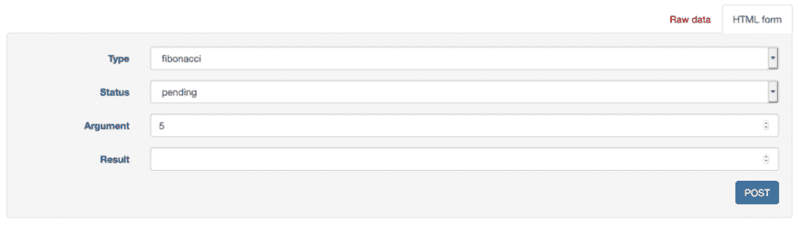
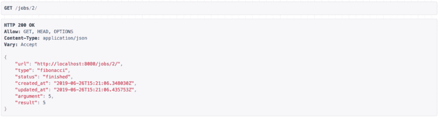

# 在 Kubernetes 开发 Django +芹菜应用程序

> 原文：<https://dev.to/okteto/develop-a-django-celery-app-in-kubernetes-3apk>

### 在 Kubernetes 开发一个 Django +芹菜 App

Django + [Celery](http://www.celeryproject.org/) 可能是开发需要在后台运行任务的网站最流行的解决方案。在本地开发 Django + Celery 应用程序很复杂，因为你需要运行不同的服务:Django、Celery worker、Celery beat、Redis、databases……[docker-compose](https://docs.docker.com/compose/)在这种情况下是一个非常方便的工具。您可以使用 docker-compose 在一个命令中启动您的本地环境。由于使用了卷装载，您可以在几秒钟内热重装应用程序。

在这篇博文中，我们想更进一步，解释为什么你应该直接在 Kubernetes 中开发你的 Django + Celery 应用。好处是:

*   通过在更像生产的环境中开发，从开发中使用 Kubernetes 清单、秘密、卷或配置映射，减少集成问题。
*   克服当地发展限制。您将能够针对任何本地或远程的 Kubernetes 集群进行开发。而拥有大量的微服务，让整个开发环境在本地运行越来越难。

但是众所周知，在 Kubernetes 开发是很乏味的。让我们一起探索如何在 Kubernetes 中开发**云原生方式**💥💥💥💥。

### 部署 Django +芹菜样本 App

通过在本地终端执行以下命令，获得 Django + Celery 示例应用程序的本地版本:

```
$ git clone https://github.com/okteto/math
$ cd math 
```

Django + Celery 示例应用程序是一个多服务应用程序，它在后台计算数学运算。它由一个 web 视图、一个工作器、一个队列、一个缓存和一个数据库组成。

执行下面的命令，在 Kubernetes 集群中部署应用程序:

```
$ kubectl apply -f manifests
statefulset.apps "cache" created
service "cache" created
statefulset.apps "db" created
service "db" created
statefulset.apps "queue" created
service "queue" created
deployment.apps "web" created
service "web" created
deployment.apps "worker" created 
```

等待几秒钟，让应用程序准备就绪。通过执行以下命令检查所有吊舱是否准备就绪:

```
$ kubectl get pod
NAME READY STATUS RESTARTS AGE
cache-0 1/1 Running 0 2m
db-0 1/1 Running 0 2m
queue-0 1/1 Running 0 2m
web-7bccc4bc99-2nwtc 1/1 Running 0 2m
worker-654d7b8bd5-42rq2 1/1 Running 0 2m 
```

### 用 Okteto 高效开发 Kubernetes

现在我们已经有了运行在 Kubernetes 集群中的 Django + Celery 示例应用程序，我们可以将它用作我们的开发环境。当在 Kubernetes 中工作时，每次想要测试代码更改时，您都必须重新构建 docker 映像，将它们推送到注册表中，并重新部署您的应用程序。这个循环既复杂又耗时。以这种方式扼杀你的生产力听起来是个坏主意。

如果您熟悉 docker-compose，您就会知道将本地文件夹挂载到容器中以避免 docker 构建/推送/重新部署循环是多么有用。卷安装是开发 Docker 应用程序的游戏规则改变者，也是加速 Kubernetes 开发周期的缺失部分。

我们开发了 [Okteto](https://github.com/okteto/okteto) 来解决这个问题。向您介绍在开发时使用 docker-compose 的所有优点，同时将您的开发迁移到 Kubernetes 集群中。Okteto 是开源的，代码是 github 中可用的[。请随意查看、投稿并开始使用它🤗！](https://github.com/okteto/okteto)

要在您的计算机上安装 Okteto CLI，请遵循[安装说明](https://github.com/okteto/okteto/blob/master/docs/installation.md)并通过运行
来检查它是否正确安装

```
$ okteto version
okteto version 1.8.18 
```

> 要学习本教程，需要 Okteto CLI >= 1.8.18。

为了开始开发 Django + Celery 示例应用程序，执行:

```
$ okteto up
✓ Files synchronized
✓ Okteto Environment activated
 Namespace: pchico83
 Name: web
 Forward: 8080 -> 8080

curl: (52) Empty reply from server
Database is ready
No changes detected in app ‘myproject’
Created migrations
Operations to perform:
Apply all migrations: auth, contenttypes, myproject, sites
Running migrations:
No migrations to apply.
Migrated DB to latest version
Performing system checks…
System check identified no issues (0 silenced).
June 26, 2019–11:00:02
Django version 1.11.21, using settings ‘myproject.settings’
Starting development server at http://0.0.0.0:8080/
Quit the server with CONTROL-C. 
```

让我们看一下`okteto.yml`文件来理解 okteto up 命令的作用:

```
name: web
command: ./run_web.sh
sync:
  - .:/app
services:
  - name: worker
    command: ./run_celery.sh
    sync:
      - .:/app
forward:
  - 8080:8080 
```

`okteto up`将本地源代码同步到部署 *web* 和 *worker* 的容器中。您的源代码与容器路径 */app* 同步。此外，端口 8080 会在您的开发容器和您的计算机之间自动转发。如果你想知道更多关于 Okteto 的工作原理，请点击这个[链接](https://github.com/okteto/okteto/blob/master/docs/how-does-it-work.md)。

### 让我们写一些代码并修复一个错误

通过打开您的浏览器并导航到[http://localhost:8080/jobs/](http://localhost:8080/jobs/)，验证该应用程序已启动并正在运行。继续计算数字 5 的*斐波纳契*:

[](https://res.cloudinary.com/practicaldev/image/fetch/s--rxWYsjCD--/c_limit%2Cf_auto%2Cfl_progressive%2Cq_auto%2Cw_880/https://cdn-images-1.medium.com/max/1024/1%2AmEeMsXH3n_jsvQ_1IMviZg.png)

按 *POST* 按钮提交操作。响应负载将包括作业的 url。去[http://localhost:8080/jobs/1/](http://localhost:8080/jobs/1/)你会发现结果是错的(*提示:5 的斐波那契数不是 32* )。这是因为我们的工人有一个错误🙀！

通常，解决这个问题需要你在本地运行应用程序，修复错误，构建一个新的容器，推送并重新部署你的应用程序。相反，我们要做的是**云原生方式** *。*

在您最喜欢的本地 IDE 中打开`myproject/myproject/models.py`。看看第 29 行中任务变量的值。似乎有人硬编码了操作的名称，而不是从作业中读取。我们把它改成`self.type`来修复吧，如下图:

```
task = TASK_MAPPING[‘power’] 
```

至

```
task = TASK_MAPPING[self.type] 
```

保存您的文件并返回到 [http://localhost:8080/jobs/。](http://localhost:8080/jobs/,)提交新的*斐波那契*计算，与之前的值相同。前往[http://localhost:8080/jobs/2/](http://localhost:8080/jobs/2/)验证结果。这次结果看起来是正确的，成功！

[](https://res.cloudinary.com/practicaldev/image/fetch/s--vOO_kcLK--/c_limit%2Cf_auto%2Cfl_progressive%2Cq_auto%2Cw_880/https://cdn-images-1.medium.com/max/1024/1%2A_-wSVERUQj5tDdugQ7jPtg.png)

这是怎么发生的？使用 Okteto，您的更改会在保存后立即自动应用到远程容器中。不需要提交、构建、推送或重新部署💪！

Okteto 可以在本地 Kubernetes 安装中使用，但是当您可以以云的速度开发时，为什么要限制自己在本地开发呢？在云中开发有几个优势，其中包括:

*   云提供了更快的硬件。
*   您的公司可能会部署一些服务，使它们可用于每个开发环境，比如 Kafka 实例或公司身份服务。
*   从开发阶段使用基础设施服务，如 Elasticsearch 或 Prometheus，以促进调试。
*   与团队的其他成员共享您的开发环境端点，以便快速验证。

> 每个开发人员都应该在一个隔离的名称空间中工作，共享同一个 Kubernetes 集群。Okteto Enterprise 负责设置角色、网络策略、Pod 安全策略、配额、限制范围和所有其他繁琐的工作，以便为多个开发人员提供对同一个 Kubernetes 集群的受控访问。如果你想尝试一下，请遵循我们的[入门指南](https://okteto.com/docs/getting-started/)。

### 清理

通过按 Ctrl + C 取消 okteto up 命令，并运行以下命令删除本指南创建的资源:

```
$ okteto down -v
✓ Okteto Environment deactivated

$ kubectl delete -f manifests
statefulset.apps "cache" deleted
service "cache" deleted
statefulset.apps "db" deleted
service "db" deleted
statefulset.apps "queue" deleted
service "queue" deleted
deployment.apps "web" deleted
service "web" deleted
deployment.apps "worker" deleted 
```

### 结论

我们已经展示了在 Kubernetes 中直接开发的优势，同时保持了与在本地机器上工作相同的开发人员体验。在云上工作总是更好。您不会在本地处理电子表格和收听媒体文件，对吗？停止应对本地环境，立即[成为云原生开发者](https://okteto.com)！