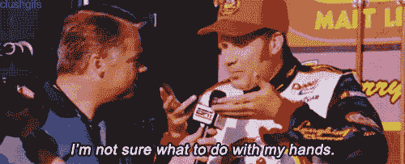
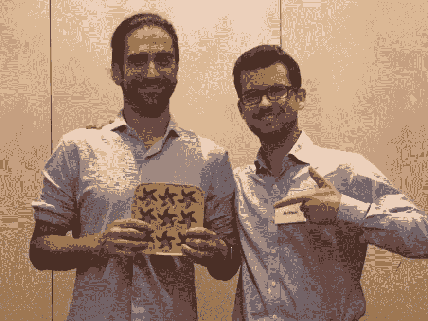

# 我在演讲会的第一次演讲

> 原文：<https://dev.to/dvddpl/my-first-speech-at-toastmasters-pnn>

我今年给自己设定的目标之一是投身于公众演讲。
背后没有什么特别的原因。我没有担任领导职务，我的公司也不打算派我去参加一些会议。我只是觉得这样总体来说对我自己有好处。

**我过去已经有机会在小观众面前演讲了**，但主要是在新员工*入职*期间的技术研讨会上，或者是向我或其他团队介绍某个主题的简短演示。公众被限制在 5 到 15 人之间，内容严格依赖于文档/幻灯片，形式更像是“无聊”的课程，而不是演讲。

两年多前，我有机会参加了我们技术负责人的一次演讲，当时他想向整个工程部门展示他的革命性(至少对我们公司而言)开发和交付新方法。在一个 45 分钟的演讲中，我可以用总共 4 分钟和 3 张幻灯片的精彩发言。没有真正的舞台，但仍然是在 80 个人面前，我背后有一个麦克风和一个巨大的屏幕。太令人激动了。

在过去的两年里，[我参加了许多关于 React / Node 和无服务器的会议](https://dev.to/dvddpl/serverless-days-hamburg-2019---day-2-1kii)，每次我都想做一些关于我工作过的有趣事情或我职业生涯中发生的趣事的演讲。作为一个新的一年的决议，我决定在工作中开始更多的演讲，并且**我计划在今年年底或明年第一季度的一次聚会上做一次演讲。让我想想。**

几乎是偶然的，我发现了关于[演讲会](http://www.toastmasters.org/)(在我们汉堡区被称为[强力演讲者](https://www.powerspeakers.de/))，这是**一个很棒的地方，在这里可以见到非常有趣和鼓舞人心的人**，同时练习公开演讲(以及给予和接受反馈)。我一定会再写一篇文章，解释为什么如果你对公共演讲、领导力或个人发展感兴趣，总的来说，你真的应该和你当地的演讲会团体联系。

无论如何，作为学习路径的一部分，我必须给其他成员做一个介绍性的演讲:我必须讲一个故事，大约 5 分钟，没有幻灯片，没有技术话题，没有笔记。跟我过去的经历很不一样，很有挑战性，也很有动力。

我心中有数，但我不知道我能/应该写多少才能在分配的时间内发言。我写下一个脚本，然后用类似于[单词计数器](https://wordcounter.net/)的工具检查文本有多少单词/字符，用[演讲时间](http://www.speechinminutes.com/)来大概知道实际说一遍需要多长时间(考虑到平均每分钟 130 个单词)。

嗯，我肯定写多了！预计持续时间超过 9 分钟，但对于我的**“破冰者”**，这就是演讲会/Powerspeakers 的第一次演讲，持续时间必须最少 4 分钟，最多 6 分钟。

我删掉了一些东西，然后开始排练。刮掉了一些其他的部分然后排练。一次又一次，直到我得到略低于 6 分钟。起初，我只是大声朗读，练习流畅，停顿，音高，当然也试着记忆课文。然后我练习了肢体语言和眼神交流(T4):我开始在房间里走来走去重复我的故事，并试图看着一个假想的观众。我倾向于移动、摇摆和做很多手势(好吧，毕竟我是意大利人)，当紧张时，我倾向于盯着地面，所有这些都是你在公开演讲时想要避免的。

最后，我在我的妻子和孩子面前排练了几次(他们很高兴**在房间里到处摆放他们可爱的玩具，只是为了增加观众数量**

因为我是一个痴迷的完美主义者，我知道我会非常紧张**，所以我在做其他事情的时候多练习了几次，比如骑自行车和洗碗**。我想确保没有什么会分散我的注意力，打断我的演讲。

然而，每次我都试图改变一些单词，或者稍微修改一下脚本，这样看起来更自然(这样如果我在演讲中忘记了什么，我就不会开始担心:*“哦，天哪，我忘记了**那个**单词，现在我搞砸了，我卡住了！!"*)。

我第一次演讲的那天晚上，我当然非常紧张，实际上，是我演讲的那天，还有前一天晚上。我知道我已经准备好了——我对剧本了如指掌，我对我选择的主题充满热情——然而，**怯场是不可预知的**，我担心我可能会昏过去，开始口吃，变得僵硬，看起来像个白痴。

当我接近会场时，直到我被宣布并站在那 15 个人面前的那一刻(那天俱乐部不是很拥挤)，我有**通常的症状:口干、心率加快和反胃**，但当你开始说话时，你会很快忘记这些。我不是说一切都消失了，我确实比我想的要紧张得多，但这和“期待”比起来算不了什么。

演讲很快就结束了，我超过了 15 秒的规定时间，但这还不算太糟。然后是反馈的时候了。在演讲过程中，许多评估者会关注你的“表现”:

*   目光接触
*   身体语言
*   填充词和动词性抽搐
*   综合评价

除此之外，每个成员都有 1 分钟的时间来填写一个小表格，说明发现了什么好的和什么不好的。

我得到的评论都很中肯，非常有用:*试着更自然，更有趣，更放松，多微笑，大声说话，增加音调和节奏的变化*但总体来说，评论是积极的，尤其是对一个破冰者来说。
实际上，我收到的最大的批评是**对于一个破冰演讲，我没有真正谈论自己**——主题很有趣，表达得很好，但目标没有真正实现。

有趣的是，演讲中的“个人”部分，我详细讲述了我的个人背景和我的感受，这些确实在最初的剧本中，但后来我在每次排练后都一个接一个地删掉了，试图将剧本压缩在规定的时间内:**“不管怎样，谁在乎这些呢！让我们坚持有用的信息"** -我在想...

总的来说，这是一次非常好的经历，我计划更频繁地重复这种经历，直到我决定真正采取行动，申请在当地集会上做一次科技演讲。(当然，与此同时——回去在工作中做尽可能多的简短演示和研讨会)。

这是我和汉堡演讲会主席在晚会结束时的合影，每位新会员在发表第一次演讲后都会得到奖励(称为“破冰者”)。