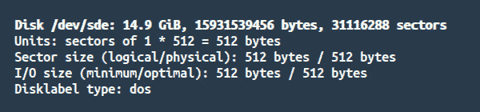
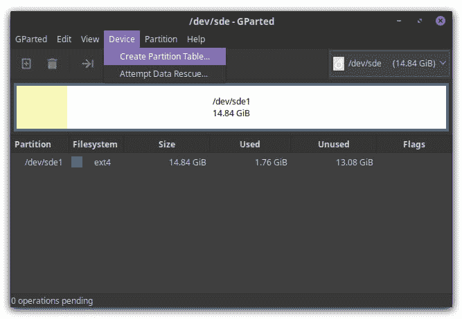
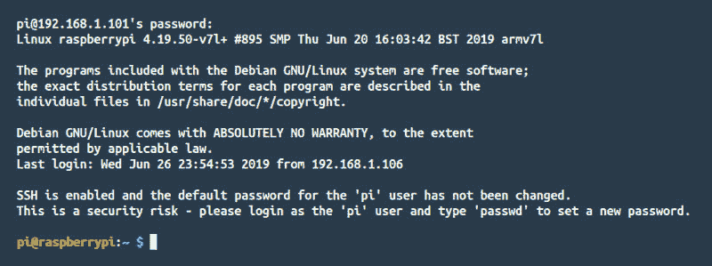

# 仅使用带有电源适配器的 Raspberry Pi 4

> 原文：<https://dev.to/limal/i-forgot-to-buy-a-micro-hdmi-cable-for-my-raspberry-pi-4-2ocf>

## 故事

周一早上，我在去伦敦的火车上，在树莓 Pi 4 全球首映一小时后订购了它。我匆匆忙忙地通过了 https://thepihut.com/的结账流程，以确保在他们缺货之前拿到我的冲浪板，更重要的是，我的手机还有 3G 信号。

我承认网站提示我购买 HDMI 线，但我友好地拒绝了。毕竟，我也有一个 Raspberry Pi Zero W，它使用一个迷你 HDMI 端口，所以我确信我完全被覆盖，我不需要另一根 HDMI 电缆。

我错了！第二天晚上，我收到了主板，我注意到我的迷你 HDMI 与 Raspberry Pi 4 现在使用的微型 HDMI 连接器相比非常大。

我很快订购了一根微型 HDMI 电缆，并在第二天送达，但我现在仍然想使用我新收到的主板。不，我是认真的。现在！

## 无头模式

幸运的是，我知道有一种方法可以在无头模式下运行以前版本的 Raspberry Pi，即没有显示器、键盘和鼠标。所以我想，也许不需要连接显示器就可以安装操作系统。

的确如此。我是这样做的。关键部分是完全跳过 NOOBS 安装程序(即使它的`silentinstall`选项对我不起作用),直接将 Raspbian 镜像克隆到 SD 卡上。

只需一个电源适配器，您就可以开始享受您的新主板了:

*   带有 SD 读卡器的基于 Unix 的计算机
*   SD 卡

## 下载 Raspbian

前往[https://www.raspberrypi.org/downloads/raspbian/](https://www.raspberrypi.org/downloads/raspbian/)并开始下载 **Raspbian Buster Lite** zip 文件。

## 准备好你的 SD 卡

将 SD 卡插入读卡器，运行`sudo fdisk -l`检查其`/dev/sdX`路径。

[](https://res.cloudinary.com/practicaldev/image/fetch/s--k6ENvnJY--/c_limit%2Cf_auto%2Cfl_progressive%2Cq_auto%2Cw_880/https://thepracticaldev.s3.amazonaws.com/i/qi2e8gq2c7up6gmwxb1f.jpg)

在我的情况下，SD 卡读卡器在`/dev/sde`。

现在运行一个名为`gparted`的应用程序，从右上角的下拉列表中选择你的设备。

如果您的 SD 卡是全新的，还没有格式化，您可能需要创建一个分区表。只需在主菜单中点击*设备* → *创建分区表……*。

[](https://res.cloudinary.com/practicaldev/image/fetch/s--xOsbljPZ--/c_limit%2Cf_auto%2Cfl_progressive%2Cq_auto%2Cw_880/https://thepracticaldev.s3.amazonaws.com/i/lxpnhqawg1fe7s8ufw35.jpg)

您现在可以创建一个新的分区。只需创建一个具有最大容量的文件系统，并使用`ext4`文件系统对其进行格式化。

## 安装 Raspbian

从下载的 *Raspbian Buster Lite* zip 包中解压一个`2019-06-20-raspbian-buster-lite.img`文件。

使用以下命令将图像写入 SD 卡:

```
sudo dd if=2019-06-20-raspbian-buster-lite.img of=/dev/sde bs=4M conv=fsync 
```

<svg width="20px" height="20px" viewBox="0 0 24 24" class="highlight-action crayons-icon highlight-action--fullscreen-on"><title>Enter fullscreen mode</title></svg> <svg width="20px" height="20px" viewBox="0 0 24 24" class="highlight-action crayons-icon highlight-action--fullscreen-off"><title>Exit fullscreen mode</title></svg>

## 启用 SSH 并设置 WiFi

上面的`dd`实用程序已经在你的 SD 卡上创建了两个分区:`boot`和`roofs`。

在文件浏览器中转到`boot`目录，创建一个名为`ssh`的空文件。这将为您启用 SSH 协议。

在相同的引导路径中创建另一个名为`wpa_supplicant.conf`的文件，并将以下内容粘贴到其中:

```
country=GB
ctrl_interface=DIR=/var/run/wpa_supplicant GROUP=netdev
update_config=1

network={
    ssid="Your network name, e.g. BTHub1-123QWE"
    psk="Y0ur_P455w0rd"
    key_mgmt=WPA-PSK
} 
```

<svg width="20px" height="20px" viewBox="0 0 24 24" class="highlight-action crayons-icon highlight-action--fullscreen-on"><title>Enter fullscreen mode</title></svg> <svg width="20px" height="20px" viewBox="0 0 24 24" class="highlight-action crayons-icon highlight-action--fullscreen-off"><title>Exit fullscreen mode</title></svg>

替换`country`、`ssid`和`psk`值以匹配您的 WiFi 设置。

## 大结局

您的 SD 卡现在准备好了。将其插入主板底部的 Raspberry Pi SD 卡插槽。

连接电源适配器。

扫描您的本地网络(在我的例子中是`192.168.1.*`)来查看 Raspberry Pi 分配了什么 IP 地址。

```
sudo nmap -sS -p 22 192.168.1.0/24 | grep "Nmap scan" 
```

<svg width="20px" height="20px" viewBox="0 0 24 24" class="highlight-action crayons-icon highlight-action--fullscreen-on"><title>Enter fullscreen mode</title></svg> <svg width="20px" height="20px" viewBox="0 0 24 24" class="highlight-action crayons-icon highlight-action--fullscreen-off"><title>Exit fullscreen mode</title></svg>

您可以关闭板的电源，查看哪些 IP 地址将从列表中消失，以识别 Pi。

连接到板卡:

```
ssh pi@192.168.1.101 
```

<svg width="20px" height="20px" viewBox="0 0 24 24" class="highlight-action crayons-icon highlight-action--fullscreen-on"><title>Enter fullscreen mode</title></svg> <svg width="20px" height="20px" viewBox="0 0 24 24" class="highlight-action crayons-icon highlight-action--fullscreen-off"><title>Exit fullscreen mode</title></svg>

密码是`raspberry`。

[](https://res.cloudinary.com/practicaldev/image/fetch/s--PKb2vVTg--/c_limit%2Cf_auto%2Cfl_progressive%2Cq_auto%2Cw_880/https://thepracticaldev.s3.amazonaws.com/i/no8yiigcf93c8o4mztgi.jpg)

你又回来了！使用`passwd`更改您的密码，尽情享受吧！

## 奖金！安装后更改 WiFi

假设您更改了 WiFi 密码，但您的树莓不再处于预安装模式。放心吧！对于已经安装了操作系统的树莓来说，更改 WiFi 密码要容易得多。

只需从您的黑莓手机中弹出一张 SD 卡，并在您电脑的读卡器上读取即可。然后找到`/etc/wpa_supplicant/wpa_supplicant.conf`文件，在那里替换你的 WiFi 设置。为了访问和覆盖这个文件，记得自己`sudo`。