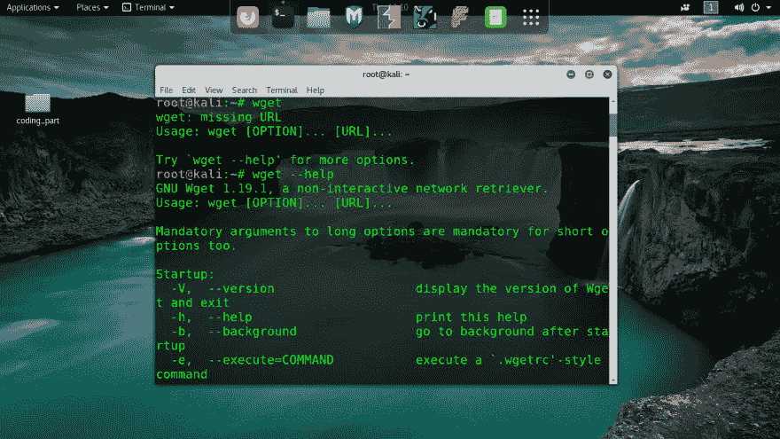
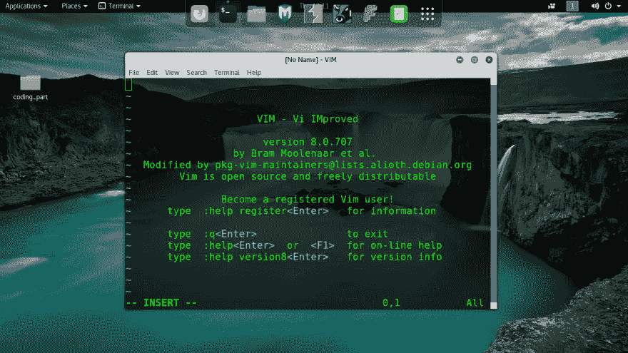
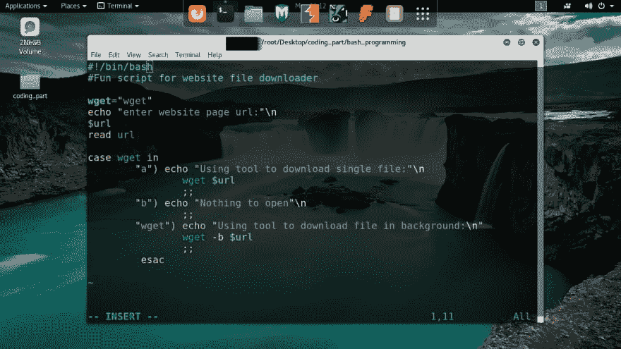

# 如何使用#bash 脚本抓取网站？

> 原文：<https://dev.to/powerexploit/how-to-crawl-website-using-bash-script-28cf>

Bash script 是用于在 Linux & Unix 中自动执行任务的令人惊叹的脚本语言之一，也是我最喜欢的自动执行任务的脚本语言之一。

前几天我在搜索如何抓取网页？在网上找到很多东西后，我了解了 linux 系统中的“Wget”工具。

Wget 对于下载和抓取网页非常有用。
[T3】](https://res.cloudinary.com/practicaldev/image/fetch/s--LIDzrLYQ--/c_limit%2Cf_auto%2Cfl_progressive%2Cq_auto%2Cw_880/https://thepracticaldev.s3.amazonaws.com/i/qt5h83jewi96x67k5j4w.png)

所以在这之后，我开始写一个网页抓取的 bash 脚本。
- >首先打开我最喜欢的 vim 编辑器

->然后开始写脚本，用案例语句

->正如你所看到的，我在一个简单的 bash 脚本中使用了 case 语句和自动化 wget 工具，这是一个工作代码..

关于 bash 和自动化的更多细节，请访问我的 github 账户