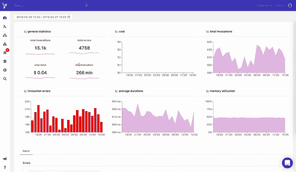
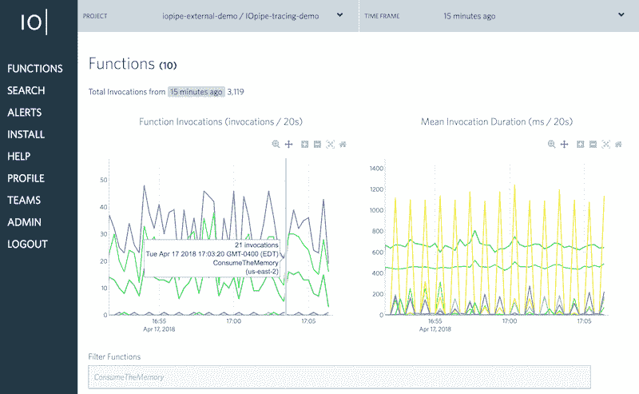

# 2019 年 FaaS 最佳观测平台

> 原文：<https://dev.to/codetips/top-faas-observability-platforms-in-2019-4078>

让我们沿着记忆的小路走一走。今年是 2018 年，AWS Lambda 已经在无服务器世界中站稳了脚跟。像微软 Azure 函数和谷歌云函数一样，亚马逊网络服务在世界上最好的无服务器计算平台中占有一席之地。

当我们想到功能即服务(FaaS)时，我们知道对开发者来说控制他们的工作是多么重要。监控和跟进你的职能变化是最重要的。因此，可观测性平台成为了成功开发所需要的另一个关键因素，而没有太多的压力。

在查看了[什么是无服务器架构](https://www.codetips.co.uk/what-is-serverless/)以及如何[用 Nodejs 和 AWS Lambda](https://www.codetips.co.uk/creating-your-first-serverless-api/) 构建一个简单的 API 之后，您可能开始了解无服务器架构可以有多大，但是要在生产中实际使用它，您必须找到一个好的解决方案来为您的堆栈带来可观察性，因为默认情况下，您没有。因此，要了解幕后发生的事情，你必须采用一些你可能不太熟悉的策略。

在这篇文章中，我将带你了解 2019 年 FaaS 的顶级可观察性平台，我们想邀请你在下面的评论部分讨论这个话题。

## 什么是 FaaS？

FaaS 是一个计算机云服务或在线平台，如果你愿意，它允许用户远程运行、开发和管理他们的应用程序。如果您使用 FaaS，您应该知道的重要一点是，您不需要构建任何基础架构，也不需要执行复杂的维护。这就是它优于所有其他解决方案的地方。你可以找到关于“[什么是 FaaS](https://dashbird.io/blog/what-is-faas-function-as-a-service/) ”的更详细的文章在我们的 Dashbird 博客页面上。

现在，当您已经熟悉功能即服务模型时，让我们再深入一点。

## FaaS 可观测平台

假设你已经在开发一个应用程序，一切正常，但是你遇到了一个问题；就像一个请求没有得到正确的响应或者根本没有启动。在这种情况下，你需要做的是检查你的整个代码，寻找错误，或者依靠 [Cloudwatch](https://aws.amazon.com/cloudwatch/) 来确定问题。

如果你曾经有一个应用程序在生产中，有成千上万次调用，你可能知道 Cloudwatch 在容量方面做得不好，找到罪魁祸首可能是一项艰巨的任务。

有各种各样的监测和观察平台可以记录你的功能进度，如果有任何异常，它们会让你知道。今天，我们将在 2019 年提到一些最好的 FaaS 可观测性平台。

## [【大山鸟】](https://www.codetips.co.uk/serverless/top-faas-observability-platforms-in-2019/www.dashbird.io)

Dashbird 是一个无服务器的 observability 平台，因其易用性、用户友好的界面、高质量和卓越的管理而脱颖而出。要使用 Dashbird 的平台，您的 Lambdas 无论如何都不会改变。

您需要做的一件事是部署一个 CloudFormation 预配置模板。

Dashbird 可以在几分钟内检测并修复任何问题，让您高枕无忧。它可以管理开发中和大规模的无服务器应用程序。

让您更好地了解您的无服务器应用程序意味着 Dashbird 对无服务器有更深入的了解。它让您有可能找到瓶颈，并可视化资源的使用。如果您考虑成本优化和速度，Dashbird 提供了出色的解决方案，例如精确显示导致功能变慢的原因，它还可以识别成本最高的系统部分。

调试和错误提示是 Dashbird 必须向用户提供的最重要的功能之一。当谈到弹性时，您应该知道快速了解异常或错误的根本原因是一项非常重要的额外好处，Dashbird 可以为您做到这一点。

[IOpipe](https://www.codetips.co.uk/serverless/top-faas-observability-platforms-in-2019/www.iopipe.com)

另一个优秀的函数可观测性平台是 IOpipe。当被分解成几十甚至几百个函数时，它允许你查看无服务器的应用程序。IOpipe 将您从文件挖掘和日志搜索中解放出来。通过查看函数的行为，IOpipe 可以确定函数中是否有错误以及如何调试它们。问题解决后，您会立即得到通知，并且监控会继续进行。

IOpipe 实时工作，这意味着没有滞后时间，也不需要您测试您的函数来查看是否有错误。一旦出现问题，IOpipe 将进行调查，采取措施，并通知您日志文件中的任何更改。

概要分析允许用户快速地逐行查看他们的代码在哪里运行以及运行了多长时间——这意味着不再需要等待日志出现。

跟踪是另一种工具，它允许用户直观地确认在每次调用中是什么占用了这么多时间，以及为什么。如果是从 S3 读取一个对象，或者甚至是向 DynamoDB 写入一个值，您将确切地知道发生了什么以及为什么。

一个主要的区别是 IOPipe 扭曲了函数，这意味着您必须编辑每个函数才能获得日志。然而，他们确实有一个解决方案，可以让包装函数变得更加容易。

## 泻药

Epsagon 是顶级可观测性平台的第三选择，因为它为现代应用提供自动监控和故障排除。Epsagon 允许其用户搜索每一个踪迹、日志和有效负载，从而节省了大量挖掘 Cloudwatch 日志的时间。

关于 Epsagon 需要了解的另一个重要事情是它是无代理的——这意味着您可以跨所有生产工作负载(AWS Lambda、containers、AWS Fargate、Kubernetes 等)运行它。Epsagon 的分布式可视化和跟踪功能让您可以直观地了解您的功能内部发生的一切。它确保您的应用程序的外观和行为符合您的预期。

Epsagon 还有一个监控仪表板，您可以随时查看堆栈内的所有情况。通知管理器会让您实时了解是否发生了任何更改。Epsagon 还有一个问题管理器，它提供了发生在您的功能中的所有问题的概述。

## 路到此为止

正如我们到目前为止所看到的，所有三个 FaaS 可观察性平台都有自己的额外津贴，并且都工作得很好。他们之间有区别，你必须把自己区分开来。了解你的需求是成功的一半。

了解每个可观察性平台的不同特性的另一个好方法是查看用户反馈。

如果您有幸测试过这些平台，请在下面分享您的想法。

* * *

[CodeTips](https://www.codetips.co.uk) 致力于帮助零经验或很少经验的初学者学习编码。

我们确实会交叉发布到其他网站以获得更广泛的受众，但是为什么不订阅我们的时事通讯并把最新的文章直接发到你的邮箱里呢？

此内容的原始来源是[代码提示](https://www.codetips.co.uk)。原始内容保持最新，但其他来源可能不是最新版本。