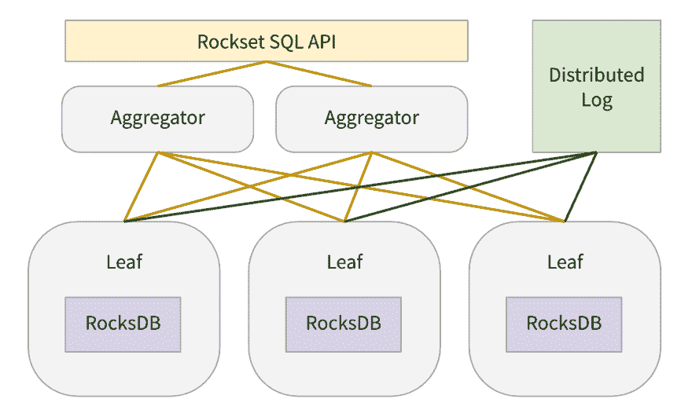

# 我们如何在 rocket 使用 rocksdb

> 原文：<https://dev.to/rocksetcloud/how-we-use-rocksdb-at-rockset-3pb7>

*作者[桑迪普·杜特](https://www.linkedin.com/in/sandeepdhoot/)T3】*

在这篇博客中，我将描述我们如何在 Rockset 中使用 RocksDB，以及我们如何调整它以获得最佳性能。我假设读者普遍熟悉基于日志结构合并树的存储引擎(如 RocksDB)的工作方式。

在 Rockset，我们希望我们的用户能够以亚秒级的写入延迟将数据连续接收到 Rockset 中，并在几十毫秒内查询数据。为此，我们需要一个能够支持快速在线写入和快速读取的存储引擎。RocksDB 是一个高性能存储引擎，旨在支持此类工作负载。RocksDB 在脸书、LinkedIn、优步和许多其他公司的生产中使用。像 MongoRocks，Rocksandra，MyRocks 等项目。使用 RocksDB 作为现有流行数据库的存储引擎，并成功显著降低了空间放大和/或写入延迟。RocksDB 的键值模型也最适合实现[聚合索引](https://rockset.com/blog/converged-indexing-the-secret-sauce-behind-rocksets-fast-queries/)，其中输入文档中的每个字段都存储在基于行的存储、基于列的存储和搜索索引中。所以我们决定使用 RocksDB 作为我们的存储引擎。我们很幸运，我们的团队中有很多关于 RocksDB 的专业知识，比如我们的首席技术官 Dhruba Borthakur，他在脸书创立了 RocksDB。对于输入文档中的每个输入字段，我们生成一组键值对，并将它们写入 RocksDB。

让我快速描述一下 RocksDB 存储节点在整个系统架构中的位置。

[](https://res.cloudinary.com/practicaldev/image/fetch/s--7sujhq_S--/c_limit%2Cf_auto%2Cfl_progressive%2Cq_auto%2Cw_880/https://images.ctfassets.net/1d31s1aajogl/2K2s3gSMdck0X9PV609AMs/19c99442086f6e2ee4a1819b3e3a2800/rocksdb1.png)

当用户创建一个集合时，我们在内部为该集合创建 N 个碎片。每个碎片被 k 次复制(通常 k=2)以实现高读取可用性，并且每个碎片副本被分配给一个叶节点。每个叶节点被分配了许多集合的许多分片副本。在我们的生产环境中，每个叶节点分配有大约 100 个分片副本。叶节点为分配给它们的每个分片副本创建 1 个 RocksDB 实例。对于每个碎片副本，叶节点不断从分布式日志存储中提取更新，并将更新应用于 RocksDB 实例。当接收到查询时，叶节点被分配查询计划片段，以提供来自分配给它们的一些 RocksDB 实例的数据。关于叶节点的更多细节，请参考[聚合器叶裁缝](https://rockset.com/blog/aggregator-leaf-tailer-an-architecture-for-live-analytics-on-event-streams/)博客或 [Rockset 白皮书](https://www.rockset.com/Rockset_Concepts_Design_Architecture.pdf)。

为了在持续应用传入更新的同时，在每个叶节点的持续查询负载低于 1000s 的情况下实现毫秒级的查询延迟，我们花费了大量时间来调优我们的 RocksDB 实例。下面，我们描述我们如何针对我们的用例调整 RocksDB。

**RocksDB-Cloud**

RocksDB 是一个嵌入式键值存储。1 个 RocksDB 实例中的数据不会复制到其他计算机。RocksDB 无法从计算机故障中恢复。为了实现耐用性，我们构建了 [RocksDB-Cloud](https://github.com/rockset/rocksdb-cloud) 。RocksDB-Cloud 将 RocksDB 实例的所有数据和元数据复制到 S3。因此，叶节点编写的所有 SST 文件都被复制到 S3。当一个叶节点机器出现故障时，该机器上的所有分片副本都被分配给其他叶节点。对于每个新的碎片副本分配，叶节点从相应的 S3 桶中读取该碎片的 RocksDB 文件，并从失败的叶节点停止的地方继续。

**禁用预写日志**

RocksDB 将其所有更新写入预写日志和活动的内存 memtable。预写日志用于在进程重启时恢复 memtables 中的数据。在我们的例子中，集合的所有传入更新首先被写入 DistributedLogStore。分布式日志存储本身充当传入更新的预写日志。此外，我们不需要保证跨查询的数据一致性。在重新启动时，丢失 memtables 中的数据并从 DistributedLogStore 中重新获取它是可以的。为此，我们禁用了 RocksDB 的预写日志。这意味着我们所有的 RocksDB 写入都发生在内存中。

**写入器速率限制**

如上所述，叶节点负责应用传入的更新和为查询提供数据。与查询相比，我们可以容忍相对更高的写入延迟。我们总是希望尽可能将一小部分可用计算能力用于处理写入，而将大部分计算能力用于服务查询。我们限制了每秒可以写入分配给叶节点的所有 RocksDB 实例的字节数。我们还限制了用于向 RocksDB 实例应用写操作的线程数量。这有助于最小化 RocksDB 写入对查询延迟的影响。此外，通过以这种方式限制写入，我们永远不会以不平衡的 LSM 树结束，也不会触发 RocksDB 内置的不可预测的背压/停止机制。注意，这两个特性在 RocksDB 中都不可用，但是我们在 RocksDB 之上实现了它们。RocksDB 支持速率限制器来限制对存储设备的写入，但是我们需要一种机制来限制从应用程序到 RocksDB 的写入。

**排序写批**

如果在`WriteBatch`中对各个更新进行批处理，并且如果写批处理中的连续键是有序的，则 RocksDB 可以实现更高的写吞吐量。我们利用这两个优势。我们将传入的更新分成大约 100KB 大小的小批，并在将它们写入 RocksDB 之前对它们进行排序。

**动态水平目标尺寸**

在采用分级压缩策略的 LSM 树中，在超过当前级别的目标大小之前，某一级别的文件不会与下一级别的文件一起被压缩。并且基于指定的 L1 目标大小和级别大小乘数(通常为 10)来计算每个级别的目标大小。这通常会导致比预期更高的空间放大，直到最后一级达到其目标大小，如 [RocksDB 博客](https://rocksdb.org/blog/2015/07/23/dynamic-level.html)所述。为了缓解这种情况，RocksDB 可以基于最后一级的当前大小来动态设置每个级别的目标大小。不管 RocksDB 实例中存储了多少数据，我们都使用这个特性来实现 RocksDB 的 1.111 倍空间放大。可以通过将`AdvancedColumnFamilyOptions::level_compaction_dynamic_level_bytes`设置为 true 来打开它。

**共享块缓存**

如上所述，叶节点被分配了许多集合的许多分片副本，并且每个分片副本都有一个 RocksDB 实例。我们没有为每个 RocksDB 实例使用单独的块缓存，而是为叶节点上的所有 RocksDB 实例使用 1 个全局块缓存。这有助于通过将所有碎片副本中未使用的块逐出叶内存来实现更好的内存利用率。我们为块缓存分配了叶 pod 上大约 25%的可用内存。我们有意不使块缓存变得更大，即使有未用于处理查询的备用内存。这是因为我们希望操作系统页面缓存有多余的内存。页面缓存存储压缩的块，而块缓存存储未压缩的块，因此页面缓存可以更密集地打包不太热的文件块。正如在 RocksDB 的论文[优化空间放大中所述，在脸书观察的三个 RocksDB 部署中，页面缓存帮助减少了 52%的文件系统读取。并且页面缓存由机器上的所有容器共享，因此共享的页面缓存服务于机器上运行的所有叶容器。](http://cidrdb.org/cidr2017/papers/p82-dong-cidr17.pdf)

**没有对 L0 进行压缩& L1**

根据设计，LSM 树中的 L0 和 L1 级别与其他级别相比包含的数据非常少。压缩这些级别的数据没有什么好处。但是，我们可以通过不压缩这些级别的数据来节省一些 cpu。每次 L0 到 L1 压缩都需要访问 L1 的所有文件。此外，范围扫描不能使用布隆过滤器，需要查找 L0 中的所有文件。如果 L0 和 L1 中的数据在读取时不需要解压缩，或者在写入时不需要压缩，那么这两种频繁的 cpu 密集型操作都会使用较少的 cpu。这就是为什么，正如 RocksDB 团队所建议的，我们不压缩 L0 和 L1 中的数据，而对所有其他级别使用 LZ4。

**关键前缀上的布隆过滤器**

正如在[聚合索引](https://rockset.com/blog/converged-indexing-the-secret-sauce-behind-rocksets-fast-queries/)博客中所描述的，我们以 3 种不同的方式和 3 个不同的键范围在 RocksDB 中存储每个文档的每一列。对于查询，我们以不同的方式读取每个键范围。具体来说，我们从来不使用确切的键在这些键范围中查找键。我们通常简单地使用一个更小的共享前缀来寻找一个密钥。因此，我们将`BlockBasedTableOptions::whole_key_filtering`设置为 false，这样就不会使用整个键来填充从而污染为每个 SST 创建的 bloom 过滤器。我们还使用了一个自定义的`ColumnFamilyOptions::prefix_extractor`,这样只有密钥的有用前缀被用于构建布隆过滤器。

**迭代器自由池**

当从 RocksDB 读取数据进行处理查询时，我们需要创建 1 个或多个`rocksdb::Iterator` s，对于执行范围扫描或检索许多字段的查询，我们需要创建许多迭代器。我们的 cpu 配置文件显示，创建这些迭代器是非常昂贵的。我们使用这些迭代器的自由池，并尝试在一个查询中重用迭代器。我们不能跨查询重用迭代器，因为每个迭代器引用一个特定的 RocksDB 快照，并且我们对一个查询使用相同的 RocksDB 快照。

最后，这里是我们为 RocksDB 实例指定的配置参数的完整列表。

```
Options.max_background_flushes: 2
Options.max_background_compactions: 8
Options.avoid_flush_during_shutdown: 1
Options.compaction_readahead_size: 16384
ColumnFamilyOptions.comparator: leveldb.BytewiseComparator
ColumnFamilyOptions.table_factory: BlockBasedTable
BlockBasedTableOptions.checksum: kxxHash
BlockBasedTableOptions.block_size: 16384
BlockBasedTableOptions.filter_policy: rocksdb.BuiltinBloomFilter
BlockBasedTableOptions.whole_key_filtering: 0
BlockBasedTableOptions.format_version: 4
LRUCacheOptionsOptions.capacity : 8589934592
ColumnFamilyOptions.write_buffer_size: 134217728
ColumnFamilyOptions.compression[0]: NoCompression
ColumnFamilyOptions.compression[1]: NoCompression
ColumnFamilyOptions.compression[2]: LZ4
ColumnFamilyOptions.prefix_extractor: CustomPrefixExtractor
ColumnFamilyOptions.compression_opts.max_dict_bytes: 32768 
```

Enter fullscreen mode Exit fullscreen mode