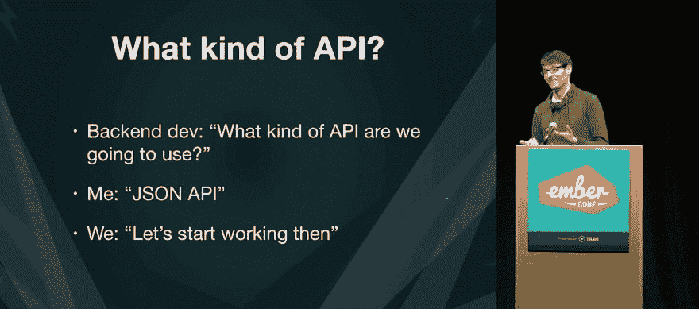

# JSON:API 的真正威力——让别人来做

> 原文：<https://dev.to/real_ate/the-true-power-of-json-api-have-someone-else-do-it-h9h>

这篇文章试图展示使用标准方法定义 API 的真正威力，以及如何使用 JSON:API 作为“反自行车脱落武器”。我将从一些理论开始，首先尝试探索为什么这是一个好主意，然后我将向您展示我们在很短的时间内构建标准 JSON:API 服务器的解决方案。

## 理论

最好从什么是 JSON:API 的定义开始:

> JSON API 是一个规范，说明了客户机应该如何请求获取或修改资源，以及服务器应该如何响应这些请求。
> 
> JSON API 旨在最大限度地减少客户端和服务器之间的请求数量和数据传输量。这种效率是在不牺牲可读性、灵活性或可发现性的情况下实现的。

我对 JSON:API 的 *why* 的许多理解来自于史蒂夫·克拉布尼克在巴黎 API Days 上的一个演讲视频。我嵌入了下面的视频，因为我**强烈推荐**你看完整个视频就能理解为什么这是一个如此重要的话题。

[https://www.youtube.com/embed/Foi54om6oGQ](https://www.youtube.com/embed/Foi54om6oGQ) *Steve Klabnik speaking about JSON:API at APIDays Paris*

很难对这段视频进行提炼，因为史蒂夫在整个讨论中说了很多重要的事情，他所说的很多价值在于他将这些事情放在上下文中的方式。

> 当你创建独特的、个人的、雪花式的、定制的、时尚的沟通模式时，它们是没有用的，因为只有少数人知道它们
> 
> 当你想与人交流时，你想与尽可能多的人交流

我特别喜欢视频中的一部分，史蒂夫提到了软件咨询公司在与拥有定制设计 API 的客户合作时面临的具体挑战

> 如果你在一家咨询公司工作，并且定期为你的客户开发 API:
> 有时候【感觉】很像土拨鼠日，你一遍又一遍地做着同样的事情
> 。因此，如果你一遍又一遍地构建 API，你知道这只是一个
> 的新机会，让你和你的整个团队就 HTTP 语义争论几个星期。
> 
> 我做出让你做更多工作的选择，你做出让他们做更多工作的选择...这一切都在发生，我们只是按小时计费

解决这整个过程的方法是我们预先决定我们将使用 API 的一个标准定义，并把我们的时间和精力集中在为我们的客户构建应用程序和服务上。

> 当你有一个描述 HTTP 语义和 JSON 结构的网页时，你不能浪费两周的开发时间去争论是否应该在你的标识符中使用 camelCase 或下划线，或者是否应该在你的模型数据中使用名称间隔，或者是否不应该发布这个 URL

[ ](https://res.cloudinary.com/practicaldev/image/fetch/s--vPD1_Z9e--/c_limit%2Cf_auto%2Cfl_progressive%2Cq_auto%2Cw_880/https://thepracticaldev.s3.amazonaws.com/i/r8w8ir19tdn0mr7ovhsb.jpg) *巴林特·尔迪在 [EmberConf 2107](https://www.youtube.com/watch?v=kPxiiAGMSzE)* 演讲

我认为在更广泛的 JSON:API 讨论中没有足够提及的另一个要点是，不应该直接使用 JSON:API 序列化。

> 重点不是我希望你们每个人都去重新实现规范。我希望你们中的一个成为重新实现规范的牺牲品，然后其他人可以使用他们的劳动成果。

说到 [EmberJS](https://emberjs.com) 我们可以直接与任何 JSON:API 服务器实现对话，而无需在客户端进行任何配置。其中一个问题是没有足够的符合 JSON:API 的服务器，这是我们希望在下一节中改变的。

## 修行

这篇文章的目标是让您在不到五分钟的时间内(取决于 npm 安装的网速)启动并运行一个全功能的 JSON:API 后端。还需要安装一些东西，但是到最后，您将拥有一个可以部署的生产就绪系统。我们开始吧！

### 设置数据库

在我们开始之前，您将需要一个 [MongoDB](https://www.mongodb.com) 数据库。我们将这个系统基于 MongoDB 有很多原因，但是我将把这个讨论留到另一篇博文中。我曾经推荐人们去 [mLab](https://mlab.com/) 获取他们的数据库，因为他们提供免费的在线沙盒数据库，但现在 MongoDB 自己也推出了一款名为 [MongoDB Atlas](https://www.mongodb.com/cloud/atlas) 的产品，非常不错，我自己也在用。

您需要创建一个数据库，并创建一个对该数据库具有写权限的用户。mLab 和 MongoDB 都有关于如何完成这个过程的全面文档。

### 安装 NodeJS

这个后端运行在 NodeJS 上，我们建议您在开发后端时使用最新的 LTS 版本 10.x。您可以直接从 [NodeJS 网站](https://nodejs.org)为您的系统下载 node。

### 安装约曼和发电机

[Yeoman](http://yeoman.io/) 是一款轻松生成项目脚手架的工具。要检查您是否已经安装了 Yeoman，请在命令行上运行`yo --version`，否则通过 npm:
全局安装

```
npm install -g yo 
```

接下来，我们需要安装我们将用来搭建后端的 Yeoman 生成器。这是我们开始构建与 Authmaker 兼容的后端时使用的同一生成器，但是在这个快速介绍中我们不会使用任何 Authmaker 服务，因此我们可以删除/忽略任何特定于 Authmaker 的内容。

```
npm install -g @authmaker/generator-express 
```

### 生成你的后台 app

下一步是生成你的后端

```
mkdir my-app-backend
cd my-app-backend
yo @authmaker/express 
```

生成器将提示您输入一个数据库连接字符串，其中大部分将由 mLab 或 MongoDB Atlas 在其 web 界面中提供。您需要确保用户名和密码是正确的(记住用户名和密码是针对您创建的数据库用户，而不是您的个人**mLab 或 MongoDB Atlas 凭证)。这个信息将被添加到一个非 git 跟踪的文件`settings/secure.json`中，你应该确保你永远不会提交这个文件。**

生成器还会创建两个示例文件供参考，`models/example.js`(一个模型)和`server/routes/v1/example.js`(一条路线)。可以参考这些，最终删除。

### 定义你的模式

我们在这个设置中使用 MongoDB 的原因之一是，我们希望能够使用[mongose](http://mongoosejs.com/index.html)来定义我们的**模型**。这将允许我们定义我们希望如何与我们的数据库交互，同时也为我们提供了足够的信息来为我们的 API 自动生成完整的 CRUD(创建、检索、更新和删除)系统。

假设我们正在开发一个博客，需要对帖子执行 CRUD 操作。在`models`文件夹中，创建`post.js`并为 **post** 模型定义模式，如下所示。您可以使用生成的文件`models/example.js`作为格式化参考，并将其重命名为`post.js`开始使用。

```
// models/post.js
const mongoose = require('mongoose');

const schema = new mongoose.Schema({
  body: String,
  created: Date,
});

module.exports = schema;
module.exports.modelName = 'Post'; 
```

### 创建您的路线

最终为您生成 JSON:API 兼容路线的包是
[express-autoroute-JSON](https://github.com/stonecircle/express-autoroute-json)。项目生成器已经安装了它，所以您不需要再次安装它。不是定义 API 的直接行为，而是使用定义 API 特定业务逻辑的声明性配置块`find`、`create`、`update`和`delete`与`express-autoroute-json`进行交互。

通过将块`find: {}`包含在路由文件中，`express-autoroute-json`将生成功能齐全的“查找全部”和“按 Id 查找”端点来访问您的数据库——无需配置。

使用`server/routes/v1/example.js`文件作为指导，创建一个新文件来为我们在上一步中创建的`post`模型定义路线:

```
// server/routes/v1/post.js
const autorouteJson = require('express-autoroute-json');
const { models } = require('../../../models');

module.exports.autoroute = autorouteJson({
  model: models.post,

  // default CRUD
  find: {},
  create: {},
  update: {},
  delete: {},
}); 
```

上面的例子是用`express-autoroute-json`创建路线的最基本实现。启动后端应用程序时，它会自动为 posts 上的所有 CRUD 操作生成专用路径。向`/posts`或`/posts/1`发出 GET 请求将会从数据库中返回适当的数据。

此外，您可以将路由定义限制为特定的请求类型。
`express-autoroute-json`只会生成你明确定义的路线类型。要完全禁止特定的请求类型，比如 DELETE，只需从路由文件中省略整个块`delete: {}`。

## 结论

我一直在非常努力地将 EmberJS 的“[零配置生产率](https://emberjs.com)”的精髓提炼到`express-autoroute-json`中，这样你就可以很快开始变得高效。我在这个平台上工作了四年多，目前它正在为一些相当大的 API 提供支持。

我想把这篇文章留给史蒂夫·克拉布尼克在他的演讲中所说的一些东西，这些东西与我试图用 [Authmaker](https://authmaker.com) 和我正在从事的许多其他开源项目实现的一切产生了共鸣:

> 停止构建超级定制 API！看看我们都在开发的一种定制格式，选择一种并使用它。构建共享的工具来停止浪费每个人的时间，让我们构建酷的东西来做整洁的事情。

* * *

这是我个人网站上[博客的转载](https://chris.manson.ie/the-true-power-of-json:api-have-someone-else-do-it/)