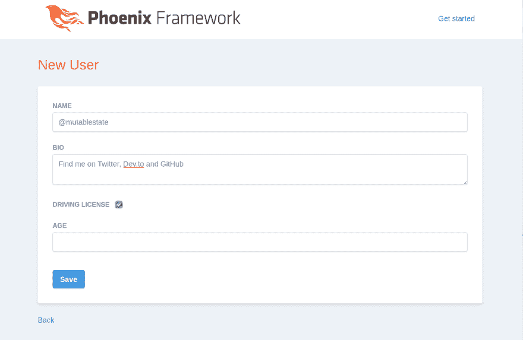

# 定制一个新的 Phoenix 应用程序(第 2 部分-风格)

> 原文：<https://dev.to/mutablestate/customise-a-new-phoenix-app-part-2-style-1dh4>

> TL；在一个新的 Phoenix 项目中，DR try [CustomPhx - GitHub](https://github.com/mutablestate/custom_phx) 自动安装 Tailwindcss 并生成 HTML。

在本系列的[第 1 部分](https://dev.to/mutablestate/customise-a-new-phoenix-app-part-1-outdated-packages-a1o)中，我们在一个新的 Phoenix 项目中更新了`mix`和`NPM`依赖项。让我们继续定制一些风格！

您生成了一个新的 Phoenix 项目。您是否继续在默认样式的基础上构建？还是*选择自己的冒险*？

### 凤凰默认

从 Phoenix 1.4 开始，所有新项目都在`assets/phoenix.css`中包含了最小 CSS 框架[毫克](https://milligram.io/)。这为用 phx.gen.html 混合 T4 生成的任何 HTML 提供了标记。

### 样式同毫克

你选了毫克！

您有合理的默认值，可以使用生成器快速启动并运行。

要对项目进行主题化，请编写自定义类并将它们添加到您的标记中。查看[牛逼毫克](https://github.com/milligram/awesome-milligram)获取更多资源。

### 用别的东西做样式

你选择了替换毫克！

你有选择。很多选择。从这个分类列表开始[牛逼的 CSS 框架](https://github.com/troxler/awesome-css-frameworks)。

安装说明是特定于每个框架的，但是如果它带有一个预处理器(LESS，SCSS，SASS，PostCSS)，你需要安装一个`loader`到`package.json`并在`webpack.config.js`中配置它。参见 [Webpack 装载机-造型](https://webpack.js.org/loaders/#styling)。

不幸的是，Phoenix HTML 生成的文件看起来没有风格，可能需要显著的标记更改和额外的类，以便在新的框架中看起来更好。或者你可以[定制你的 Phoenix HTML 生成器](https://dev.to/mutablestate/customise-your-phoenix-html-generator-2l85)。

### 带尾翼的样式

我选了 [Tailwindcss](https://tailwindcss.com/#what-is-tailwind) ！

这个实用程序优先的框架最近成熟成了一个`1.0`版本，并引起了广泛关注(完全合理的 IMO)。

对于基本安装，请参见优秀的[使用顺风与凤凰](https://www.derrickreimer.com/tech/2019/06/12/tailwind-phoenix.html)指南。

为了获得更全面的方法，我创建了一个 mix 归档文件，用一个定制的 HTML 生成器 [CustomPhx - GitHub](https://github.com/mutablestate/custom_phx) 来自动安装。试试看！

*生成表单字段标记*

```
<%= label class: "block mb-6" do %>
  <span class="form-label block">name</span>
  <%= text_input f, :name, class: "form-input w-full mt-1" %>
<% end %>
<%= error_tag f, :name %> 
```

<svg width="20px" height="20px" viewBox="0 0 24 24" class="highlight-action crayons-icon highlight-action--fullscreen-on"><title>Enter fullscreen mode</title></svg> <svg width="20px" height="20px" viewBox="0 0 24 24" class="highlight-action crayons-icon highlight-action--fullscreen-off"><title>Exit fullscreen mode</title></svg>

*生成表格*
[](https://res.cloudinary.com/practicaldev/image/fetch/s--pBaEu06W--/c_limit%2Cf_auto%2Cfl_progressive%2Cq_auto%2Cw_880/https://thepracticaldev.s3.amazonaws.com/i/htmghusaih16gww7rcd4.png)