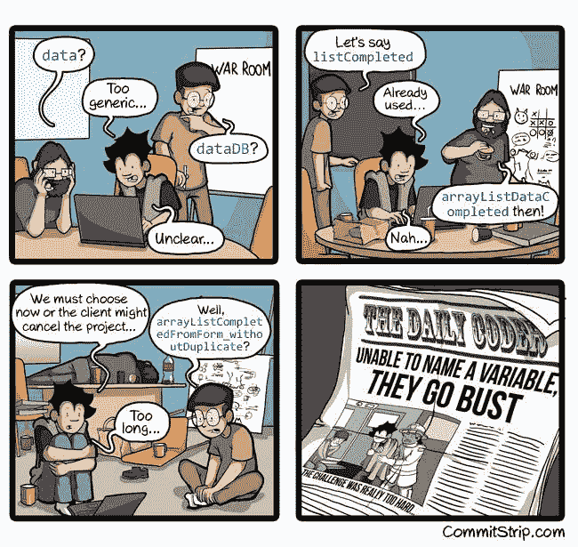
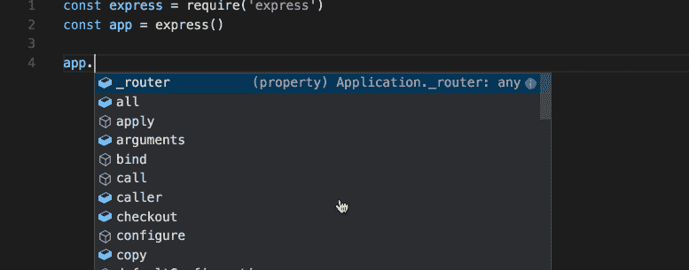

# 为什么你可能需要检查你的代码

> 原文：<https://dev.to/faraazahmad/why-you-might-need-to-type-check-your-code-4edo>

你有多少次让你的代码说，‘这是未定义的’或者‘这不是一个函数’？找到这些错误的根源需要多长时间？更别说修理它们了。

最糟糕的事情之一是发现你有一个运行时错误，即使你没有写任何不正确的代码。有时，可能需要很多个不眠之夜才能意识到你犯了一个类型错误，你把一个 Dog 类的对象赋给了一个应该是 Car 类对象的变量。

这种错误通常可以通过使用类型检查来避免。你问什么是类型检查？嗯，(非常)简单地说，你使用像`int`、`char`、`MediaStream`等数据类型。在定义变量、函数和其他东西时，这些数据类型被用来检查是否使用了具有正确数据类型的变量。所以，如果你把一个类 Car 的对象赋给一个类 Dog 的对象，你会得到一个错误，假如这两种类型不兼容的话。

听着，我明白。强类型增加了代码的冗长性。没有人喜欢一遍又一遍地写`SessionUtilDataTokenizer`这样的类名。甚至想出合适的名字有时也会令人望而生畏(这是另一个话题)。

通过使用强类型，您可以在编译时避免大多数(IMO)类型错误，并逐一消除它们。我认为这绝对比揪着你的头发试图找出到底是什么错误要方便得多。

## 哦！我告诉过你智能感知吗？

IntelliSense 是各种代码编辑功能的统称，包括代码完成、参数信息、快速信息和成员列表。简单地说，它帮助你记住哪个函数或属性在哪个变量上可用，它的类型和它的作用。这样，你就不需要把所有的事情都记在脑子里。

最终，您要对任何潜入代码的错误负责，但是类型检查可以帮助您减少它们。