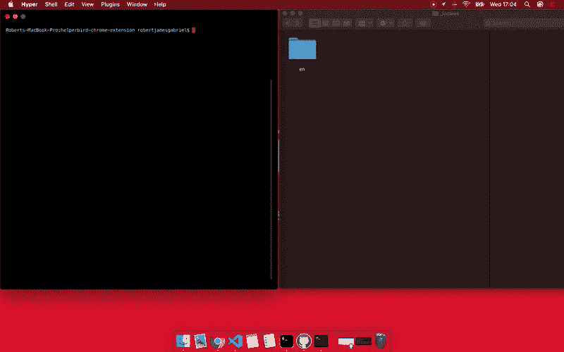

# 在几秒钟内翻译您的浏览器扩展

> 原文：<https://dev.to/robertjgabriel/translate-your-browser-extension-in-seconds-60a>

[](https://res.cloudinary.com/practicaldev/image/fetch/s--BcGuep2_--/c_limit%2Cf_auto%2Cfl_progressive%2Cq_66%2Cw_880/https://thepracticaldev.s3.amazonaws.com/i/auj1bos16fpfau4z9q6g.gif)

嘿👋,

如果你读到这封信，你可能和我过去来的原因一样。如何轻松地将我的浏览器扩展翻译成其他语言？

作为我的创业公司 Helperbird 的一部分，我需要将浏览器扩展翻译成其他语言以扩大覆盖范围。所以我研究了不同的解决方案，找到了一个很有前途的 GitHub 回购，但它并不完美。

有了 Chrome 或浏览器扩展，你就有了这样的文件夹布局。

```
_locales/{{languageCode}}/messages.json 
```

Thomas Brüggemann 的原始版本虽然很棒，但并不适合浏览器扩展开发流程。

所以我分叉扩展并重写它，使它适合浏览器开发(也不用担心，我会在原来的母版上添加功能)。所以如果你是一个浏览器扩展开发者。您现在可以执行以下操作。

## 安装

```
npm install -g translate-extension-json 
```

## 用法

你需要一个[谷歌翻译 API 键](https://cloud.google.com/translate/)。

```
translate-extension {{apiKey}} {{location of json file}} {{Translate from}  {{Tanslate too,Tanslate too,Tanslate too,}} 
```

例如

```
translate-extension-json iuOHAEbo9H788d34h93h4dioue2I locales en es,fr 
```

这将根据 Google Translate API 语言代码，将`_locales/en/messages.json`(相对于 shell 中的当前文件夹)中的所有字符串从英语翻译成西班牙语和法语。

目标语言列表是可选的。如果不存在，它将被翻译成谷歌翻译支持的所有语言。

# 见其行动。

[](https://res.cloudinary.com/practicaldev/image/fetch/s--5W9jZZxC--/c_limit%2Cf_auto%2Cfl_progressive%2Cq_66%2Cw_880/https://github.com/Helperbird/i18n-translate-json/raw/master/demo/kap.gif)

如果你喜欢这个项目和指南，你可以跟我来这里。

*   [推特](https://www.twitter.com/robertjgabriel)
*   [Github](https://www.github.com/robertjgabriel)

这里的节点模块代码是[，这里](https://www.npmjs.com/package/translate-extension-json)的 Github 源代码是