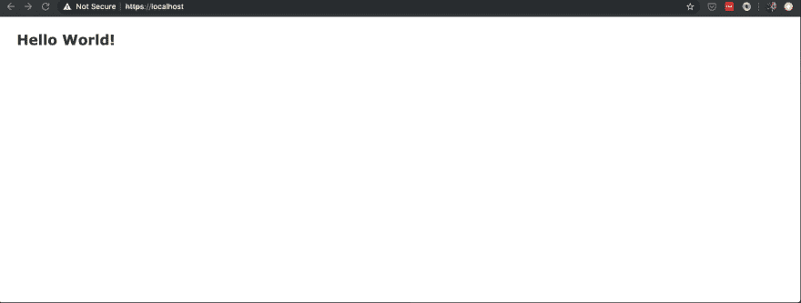

# 使用 Docker 和 Caddyserver 设置 Rails

> 原文：<https://dev.to/dstull/setting-up-rails-with-docker-and-caddyserver-1li7>

# 目标

展示如何使用 Docker 设置 Ruby on Rails 的基本实现，利用 [Caddyserver](https://caddyserver.com/) 作为反向代理、 [tls](https://en.wikipedia.org/wiki/Transport_Layer_Security) 和[负载平衡器](https://en.wikipedia.org/wiki/Load_balancing_(computing))。

对于本教程，我将使用一个简单的演示 Rails 应用程序，您可以在这里找到[的源代码。还有一个用于基本 Caddyserver 设置的](https://github.com/dstull/docker-rails/tree/caddy) [repo](https://github.com/dstull/caddy_rails) 。

我将把它分成两步:

*   创建 Caddyserver Docker 映像
*   用 Docker 配置 Rails 和 Caddyserver

# 创建 Caddyserver Docker 映像

对于这一部分，我们将检查 caddyfile、Dockerfile 和 docker-compose.yml 文件。

## [caddyfile](https://github.com/dstull/caddy_rails/blob/master/src/caddyfile)

注意:下面的所有项目都将引用上面链接的文件，如果在单独的窗口中打开该文件进行引用，将会很有帮助。

### 站点/主机声明

```
https://localhost 
```

<svg width="20px" height="20px" viewBox="0 0 24 24" class="highlight-action crayons-icon highlight-action--fullscreen-on"><title>Enter fullscreen mode</title></svg> <svg width="20px" height="20px" viewBox="0 0 24 24" class="highlight-action crayons-icon highlight-action--fullscreen-off"><title>Exit fullscreen mode</title></svg>

*   对于我们的简单演示，我们将为我们的本地开发进行设置。在生产中，这将被设置为在 tls 证书中验证的 dns 名称

### [代理](https://caddyserver.com/docs/proxy)设置

```
proxy / http://rails:3000 http://rails2:3000 
```

<svg width="20px" height="20px" viewBox="0 0 24 24" class="highlight-action crayons-icon highlight-action--fullscreen-on"><title>Enter fullscreen mode</title></svg> <svg width="20px" height="20px" viewBox="0 0 24 24" class="highlight-action crayons-icon highlight-action--fullscreen-off"><title>Exit fullscreen mode</title></svg>

*   这将指示 Caddy 将所有请求路由到运行 puma/rails 的 2 个容器，两个容器都在端口 3000 上监听 docker 网络上的请求，其中 rails 和 rails2 被设置为[别名](https://docs.docker.com/compose/compose-file/#aliases)

```
transparent 
```

<svg width="20px" height="20px" viewBox="0 0 24 24" class="highlight-action crayons-icon highlight-action--fullscreen-on"><title>Enter fullscreen mode</title></svg> <svg width="20px" height="20px" viewBox="0 0 24 24" class="highlight-action crayons-icon highlight-action--fullscreen-off"><title>Exit fullscreen mode</title></svg>

*   根据[文档](https://caddyserver.com/docs/proxy)，这是以下内容的简写:

```
header_upstream Host {host}
header_upstream X-Real-IP {remote}
header_upstream X-Forwarded-For {remote}
header_upstream X-Forwarded-Port {server_port}
header_upstream X-Forwarded-Proto {scheme} 
```

<svg width="20px" height="20px" viewBox="0 0 24 24" class="highlight-action crayons-icon highlight-action--fullscreen-on"><title>Enter fullscreen mode</title></svg> <svg width="20px" height="20px" viewBox="0 0 24 24" class="highlight-action crayons-icon highlight-action--fullscreen-off"><title>Exit fullscreen mode</title></svg>

```
websocket 
```

<svg width="20px" height="20px" viewBox="0 0 24 24" class="highlight-action crayons-icon highlight-action--fullscreen-on"><title>Enter fullscreen mode</title></svg> <svg width="20px" height="20px" viewBox="0 0 24 24" class="highlight-action crayons-icon highlight-action--fullscreen-off"><title>Exit fullscreen mode</title></svg>

*   根据[文档](https://caddyserver.com/docs/proxy)，这是以下内容的简写:

```
header_upstream Connection {>Connection}
header_upstream Upgrade {>Upgrade} 
```

<svg width="20px" height="20px" viewBox="0 0 24 24" class="highlight-action crayons-icon highlight-action--fullscreen-on"><title>Enter fullscreen mode</title></svg> <svg width="20px" height="20px" viewBox="0 0 24 24" class="highlight-action crayons-icon highlight-action--fullscreen-off"><title>Exit fullscreen mode</title></svg>

*   在 rails 中，如果使用[动作索](https://guides.rubyonrails.org/action_cable_overview.html)，我们将需要这个

```
policy round_robin 
```

<svg width="20px" height="20px" viewBox="0 0 24 24" class="highlight-action crayons-icon highlight-action--fullscreen-on"><title>Enter fullscreen mode</title></svg> <svg width="20px" height="20px" viewBox="0 0 24 24" class="highlight-action crayons-icon highlight-action--fullscreen-off"><title>Exit fullscreen mode</title></svg>

*   我将默认的`random`改为更具预见性，这有助于故障排除。

```
fail_timeout 30s
max_fails 1
try_duration 90s
health_check /stats?token=stats
health_check_interval 30s
health_check_port 9191
health_check_timeout 10s 
```

<svg width="20px" height="20px" viewBox="0 0 24 24" class="highlight-action crayons-icon highlight-action--fullscreen-on"><title>Enter fullscreen mode</title></svg> <svg width="20px" height="20px" viewBox="0 0 24 24" class="highlight-action crayons-icon highlight-action--fullscreen-off"><title>Exit fullscreen mode</title></svg>

*   我很困惑/无法理解关于这一切是如何一起工作的官方文档，所以我尝试用一种对我来说有意义的方式来解释...
    *   失败超时:
        *   在声明一个请求失败并继续尝试另一个后端之前，尝试 X 次，进入`try_duration`。
    *   尝试持续时间:
        *   在第一次到达`fail_timeout`之后，它会继续运行并尝试寻找另一个后端，这样请求就不会失败。
        *   所以如果`fail_timeout`是 30s 而`try_duration`是 90s，并且两个后端都向下...这将是 2 分钟前，你得到一个坏的网关(502)响应从球童。
        *   `try_duration`必须大于`fail_timeout` +发现后端和服务请求(rails 请求部分)的时间，否则它将在失败的后端的第一次响应中返回 502。
    *   运行状况 _ 检查:
        *   点击`puma`控制应用程序以获取状态，因此需要专门设置端口。关于这个设置的更多细节，请参见 [puma 配置](https://github.com/dstull/docker-rails/blob/caddy/config/puma.rb#L60)中的后端 rails 应用设置

```
errors stdout
header / {
  Strict-Transport-Security "max-age=31536000"
}
log / stdout "{combined} cache={cache_status}"
gzip
tls self_signed 
```

<svg width="20px" height="20px" viewBox="0 0 24 24" class="highlight-action crayons-icon highlight-action--fullscreen-on"><title>Enter fullscreen mode</title></svg> <svg width="20px" height="20px" viewBox="0 0 24 24" class="highlight-action crayons-icon highlight-action--fullscreen-off"><title>Exit fullscreen mode</title></svg>

*   Docker 比`stdout`更喜欢日志，所以我们将在这里这样做，为缓存添加一些格式，以防我们将来打开它。
*   由于我们正在使用的当前 Caddyserver 映像上的这个[问题](https://github.com/nicolasazrak/caddy-cache/issues/18)，缓存暂时关闭。
*   gzip 内容加速一切。我认为这个和 Rails 可能会有问题，但没有，它在页面加载方面提供了很大的速度改进。
*   在此演示中使用简单的自签名证书

## [Dockerfile](https://github.com/dstull/caddy_rails/blob/master/Dockerfile)

在这个文件中，我将强调几个可能不太直接项目。

```
RUN apk add --no-cache \
    libcap \
    && \
    :

RUN setcap cap_net_bind_service=+ep /usr/sbin/caddy 
```

<svg width="20px" height="20px" viewBox="0 0 24 24" class="highlight-action crayons-icon highlight-action--fullscreen-on"><title>Enter fullscreen mode</title></svg> <svg width="20px" height="20px" viewBox="0 0 24 24" class="highlight-action crayons-icon highlight-action--fullscreen-off"><title>Exit fullscreen mode</title></svg>

*   安装 alpine linux 包 libcap，这将使我们能够在下一行向 caddy 二进制文件授予绑定特权。
*   这反过来将允许我们在低于 1024(443)的端口上以非特权用户(非 root)的身份运行 caddy 容器。

```
VOLUME /tmp 
```

<svg width="20px" height="20px" viewBox="0 0 24 24" class="highlight-action crayons-icon highlight-action--fullscreen-on"><title>Enter fullscreen mode</title></svg> <svg width="20px" height="20px" viewBox="0 0 24 24" class="highlight-action crayons-icon highlight-action--fullscreen-off"><title>Exit fullscreen mode</title></svg>

*   如果使用 caddy [高速缓存模块](https://caddyserver.com/docs/http.cache)，则需要对要写入的高速缓存进行写操作。
    *   注意:默认情况下，我们以只读方式运行容器，因此，任何需要写入文件的区域都需要声明为[卷](https://docs.docker.com/storage/volumes/)。

## [【坞站-化合物。yaml](https://github.com/dstull/caddy_rails/blob/master/docker-compose.yaml)

在这个文件中，我们声明了一些将有助于构建和测试我们的应用程序的项目:

### 本地构建

```
15:25 $ docker-compose build caddy_rails
Building caddy_rails
Step 1/10 : FROM jumanjiman/caddy:v0.11.0-20181002T1350-git-3d0ba71
 ---> 6b039a312afc
Step 2/10 : USER root
 ---> Using cache
 ---> ab346bccfd06
Step 3/10 : COPY src/caddyfile /etc/caddy/caddyfile
 ---> Using cache
 ---> 27bcf28474ae
Step 4/10 : COPY src/init.sh /usr/bin
 ---> Using cache
 ---> 047528cc4a11
Step 5/10 : COPY src/healthcheck /var/opt/healthcheck
 ---> Using cache
 ---> d15a10faa15c
Step 6/10 : RUN apk add --no-cache          libcap          &&      :
 ---> Using cache
 ---> e0a9d0b2b44e
Step 7/10 : RUN setcap cap_net_bind_service=+ep /usr/sbin/caddy
 ---> Using cache
 ---> d23679349861
Step 8/10 : VOLUME /tmp
 ---> Using cache
 ---> 2e94a84380e6
Step 9/10 : USER caddy
 ---> Using cache
 ---> b2d343318687
Step 10/10 : ENTRYPOINT ["/usr/bin/init.sh"]
 ---> Using cache
 ---> 8b6a28c0ab20

Successfully built 8b6a28c0ab20
Successfully tagged caddy_rails:latest 
```

<svg width="20px" height="20px" viewBox="0 0 24 24" class="highlight-action crayons-icon highlight-action--fullscreen-on"><title>Enter fullscreen mode</title></svg> <svg width="20px" height="20px" viewBox="0 0 24 24" class="highlight-action crayons-icon highlight-action--fullscreen-off"><title>Exit fullscreen mode</title></svg>

### 本地运行

```
15:25 $ docker-compose up -d
Creating network "caddy_rails_default" with the default driver
Creating caddy_rails_caddy_rails_1 ... done
15:26 $ docker ps
CONTAINER ID        IMAGE               COMMAND              CREATED             STATUS              PORTS                  NAMES
13e9cf1dd292        caddy_rails         "/usr/bin/init.sh"   4 seconds ago       Up 4 seconds        0.0.0.0:443->443/tcp   caddy_rails_caddy_rails_1 
```

<svg width="20px" height="20px" viewBox="0 0 24 24" class="highlight-action crayons-icon highlight-action--fullscreen-on"><title>Enter fullscreen mode</title></svg> <svg width="20px" height="20px" viewBox="0 0 24 24" class="highlight-action crayons-icon highlight-action--fullscreen-off"><title>Exit fullscreen mode</title></svg>

# 用 Docker 配置 Rails 和 Caddyserver

在这一节中，我将把重点放在 Rails 与我们的 Caddy 设置一起工作所需的设置上，有时会忽略一些更具体的 Rails/Docker 项目。

## [Dockerfile](https://github.com/dstull/docker-rails/blob/caddy/Dockerfile)

```
ENTRYPOINT ["/web/script/entrypoint"]
CMD ["puma", "-C", "config/puma.rb"] 
```

<svg width="20px" height="20px" viewBox="0 0 24 24" class="highlight-action crayons-icon highlight-action--fullscreen-on"><title>Enter fullscreen mode</title></svg> <svg width="20px" height="20px" viewBox="0 0 24 24" class="highlight-action crayons-icon highlight-action--fullscreen-off"><title>Exit fullscreen mode</title></svg>

*   设置入口点脚本，该脚本将只执行传递的命令，并允许它接管 [PID 1](https://tandrepires.wordpress.com/2016/11/15/the-importance-of-pid-1-in-containers/)

## [【坞站-化合物。yml](https://github.com/dstull/docker-rails/blob/caddy/docker-compose.yml)

在这个文件中，我们设置了本地构建和运行时环境。

我们定义:

*   2 个 Rails 实例，这样 caddy 可以在`rails`和`rails2`之间实现负载平衡。我们在我们的网络上为这些实例声明了别名，这使得 caddy 能够在 [caddyfile](https://github.com/dstull/caddy_rails/blob/master/src/caddyfile#L2) 中引用它们作为后端
*   docker 的基本健康检查设置，用于确定集装箱健康状态，如`docker ps`所示

```
 healthcheck:
      test: ["CMD", "curl", "http://localhost:3000"]
      interval: 10s
      timeout: 10s
      retries: 20 
```

<svg width="20px" height="20px" viewBox="0 0 24 24" class="highlight-action crayons-icon highlight-action--fullscreen-on"><title>Enter fullscreen mode</title></svg> <svg width="20px" height="20px" viewBox="0 0 24 24" class="highlight-action crayons-icon highlight-action--fullscreen-off"><title>Exit fullscreen mode</title></svg>

*   我已经将上面的 caddy_rails 示例配置为在更新 [dockerhub](https://cloud.docker.com/repository/docker/hammer098/caddy_rails) 上的主分支时自动构建映像，并在文件中引用它。

```
image: hammer098/caddy_rails:latest 
```

<svg width="20px" height="20px" viewBox="0 0 24 24" class="highlight-action crayons-icon highlight-action--fullscreen-on"><title>Enter fullscreen mode</title></svg> <svg width="20px" height="20px" viewBox="0 0 24 24" class="highlight-action crayons-icon highlight-action--fullscreen-off"><title>Exit fullscreen mode</title></svg>

*   在 Caddy 上，将端口 443 暴露给底层主机

```
 ports:
      - 443:443 
```

<svg width="20px" height="20px" viewBox="0 0 24 24" class="highlight-action crayons-icon highlight-action--fullscreen-on"><title>Enter fullscreen mode</title></svg> <svg width="20px" height="20px" viewBox="0 0 24 24" class="highlight-action crayons-icon highlight-action--fullscreen-off"><title>Exit fullscreen mode</title></svg>

*   完成依赖链的设置，这样当我们以`docker-compose up -d caddy`开始所有事情时，它将按照`rails`->->-`caddy`的顺序开始

```
 depends_on:
      - rails2 
```

<svg width="20px" height="20px" viewBox="0 0 24 24" class="highlight-action crayons-icon highlight-action--fullscreen-on"><title>Enter fullscreen mode</title></svg> <svg width="20px" height="20px" viewBox="0 0 24 24" class="highlight-action crayons-icon highlight-action--fullscreen-off"><title>Exit fullscreen mode</title></svg>

## 打造

```
15:54 $ sdlc/build
Building rails
Step 1/11 : FROM hammer098/ruby_24
 ---> ba1ba3ccbaca
Step 2/11 : WORKDIR /web
 ---> Using cache
 ---> 1d49ff0018bb
Step 3/11 : COPY .ruby-version /web/.ruby-version
 ---> Using cache
 ---> f187344f9c6c
Step 4/11 : COPY Gemfile /web/Gemfile
 ---> Using cache
 ---> 5592d6874d91
Step 5/11 : COPY Gemfile.lock /web/Gemfile.lock
 ---> Using cache
 ---> 96ae9333a90e
Step 6/11 : RUN /bin/bash -l -c "bundle install"
 ---> Using cache
 ---> c593b6c4f41e
Step 7/11 : COPY . /web
 ---> 7ab2c7c6ac96
Step 8/11 : ENV TEMP /web/tmp
 ---> Running in 610cb512b3d1
Removing intermediate container 610cb512b3d1
 ---> ba400993482d
Step 9/11 : VOLUME /web/tmp
 ---> Running in aa2e71bc9236
Removing intermediate container aa2e71bc9236
 ---> 4489c90a69bb
Step 10/11 : ENTRYPOINT ["/web/script/entrypoint"]
 ---> Running in 9bb7c471c455
Removing intermediate container 9bb7c471c455
 ---> 602ff0fd2660
Step 11/11 : CMD ["puma", "-C", "config/puma.rb"]
 ---> Running in 99f2a4c59410
Removing intermediate container 99f2a4c59410
 ---> cc6672106b95
Successfully built cc6672106b95
Successfully tagged rails:latest

real    0m2.346s
user    0m0.328s
sys 0m0.098s

REPOSITORY              TAG                                 IMAGE ID            CREATED                  SIZE
rails                   latest                              cc6672106b95        Less than a second ago   1.13GB 
```

<svg width="20px" height="20px" viewBox="0 0 24 24" class="highlight-action crayons-icon highlight-action--fullscreen-on"><title>Enter fullscreen mode</title></svg> <svg width="20px" height="20px" viewBox="0 0 24 24" class="highlight-action crayons-icon highlight-action--fullscreen-off"><title>Exit fullscreen mode</title></svg>

## 运行

```
15:54 $ sdlc/run

Starting application container(s)

Creating network "docker-rails_railsnet" with driver "bridge"
Creating docker-rails_rails_1 ... done
Creating docker-rails_rails2_1 ... done
Creating docker-rails_caddy_1  ... done

15:55 $ docker ps
CONTAINER ID        IMAGE                          COMMAND                  CREATED             STATUS                            PORTS                  NAMES
a85a08b577c1        hammer098/caddy_rails:latest   "/usr/bin/init.sh"       5 seconds ago       Up 3 seconds                      0.0.0.0:443->443/tcp   docker-rails_caddy_1
20e44a42434a        rails                          "/web/script/entrypo…"   7 seconds ago       Up 4 seconds (health: starting)                          docker-rails_rails2_1
f07ac602d1d4        rails                          "/web/script/entrypo…"   18 seconds ago      Up 16 seconds (healthy)                                  docker-rails_rails_1 
```

<svg width="20px" height="20px" viewBox="0 0 24 24" class="highlight-action crayons-icon highlight-action--fullscreen-on"><title>Enter fullscreen mode</title></svg> <svg width="20px" height="20px" viewBox="0 0 24 24" class="highlight-action crayons-icon highlight-action--fullscreen-off"><title>Exit fullscreen mode</title></svg>

## 打开浏览器查看穿过 Caddy 的轨道

打开到`https://localhost`并接受证书警告。

[](https://res.cloudinary.com/practicaldev/image/fetch/s--DBlFi27h--/c_limit%2Cf_auto%2Cfl_progressive%2Cq_auto%2Cw_880/https://thepracticaldev.s3.amazonaws.com/i/9kk0w5fp20a2e7gzcdl9.png)