# 电子表格驱动的人工智能

> 原文：<https://dev.to/taillogs/spreadsheet-powered-ai-294k>

[TL；DR 多层感知器，仅使用电子表格公式即可解决 XOR 问题](https://docs.google.com/spreadsheets/d/1u09NiBKYD7KZMa6BdT-oxQGSy5TQw4akTqNY_9Zc87I/copy?usp=sharing)

## 如何使用 AI 工作表

#### 获得自己的副本

[直接进入正题，这里有一个自动复制表格的链接，我对这种方法有疑问，所以我仍然包括下面的手动步骤。](https://docs.google.com/spreadsheets/d/1u09NiBKYD7KZMa6BdT-oxQGSy5TQw4akTqNY_9Zc87I/copy?usp=sharing)

#### 获取自己的副本(手动方式)

[如果该链接不起作用，这是主表(不是副本)。](https://docs.google.com/spreadsheets/d/1u09NiBKYD7KZMa6BdT-oxQGSy5TQw4akTqNY_9Zc87I/edit?usp=sharing)。由于明显的原因，主版本是只读的。要使用它，选择`File->Make a Copy`。

[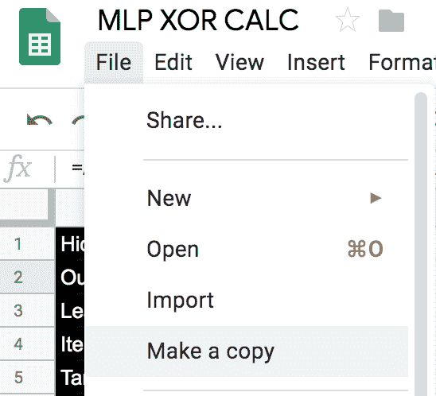](https://res.cloudinary.com/practicaldev/image/fetch/s--_DwePCBP--/c_limit%2Cf_auto%2Cfl_progressive%2Cq_auto%2Cw_880/https://thepracticaldev.s3.amazonaws.com/i/5jthy7wgp0ojkt8abkyu.png)

这将为您提供您自己版本的表单。

#### 迭代问题

> 有时，图纸的迭代设置不会延续到副本。要启用此设置，请转至`File->Spreadsheet settings`

[](https://res.cloudinary.com/practicaldev/image/fetch/s--aoJUZAVn--/c_limit%2Cf_auto%2Cfl_progressive%2Cq_auto%2Cw_880/https://thepracticaldev.s3.amazonaws.com/i/nvo2y795o4rik0ptplyr.png)

接下来，导航到`Calculation`选项卡，选择类似的设置(随意使用最大迭代次数，为潜在的延迟做准备)。

[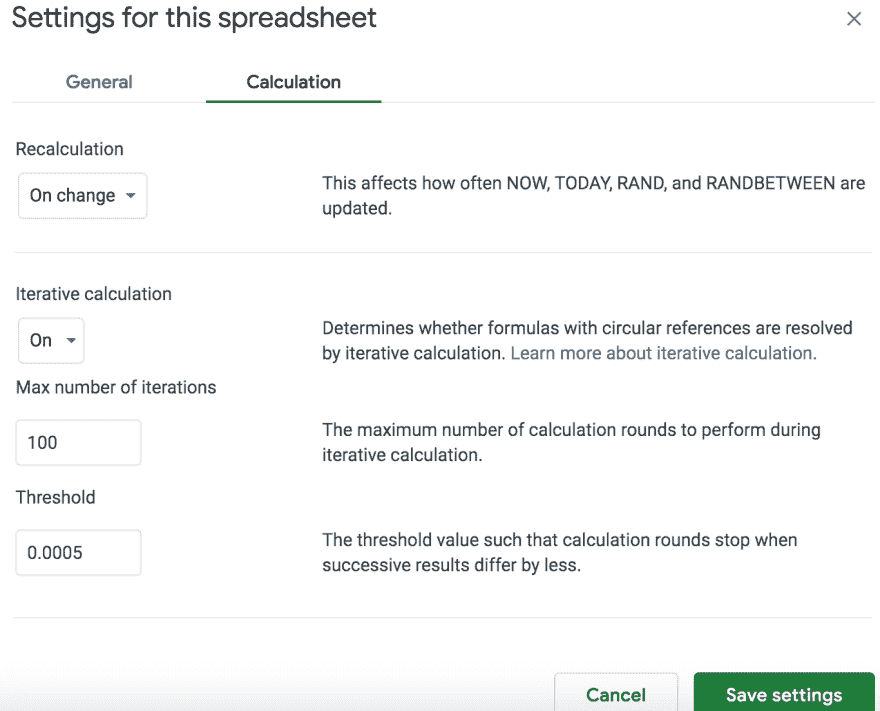](https://res.cloudinary.com/practicaldev/image/fetch/s--3thXFzfX--/c_limit%2Cf_auto%2Cfl_progressive%2Cq_auto%2Cw_880/https://thepracticaldev.s3.amazonaws.com/i/fmqrf5lq9966cpazxcdq.png)

#### 运行网络

要让网络工作，不需要任何 ML 知识。工作表的工作方式类似于 for 循环,“当前迭代”单元 D1 在网络的每次迭代后递增。在递增之前，它检查“目标迭代”单元格 B5 的值。这相当于下面的代码。

```
for (int current_iterations = 0; current_iterations < target_iterations; current_iterations++) {
  // run the network
} 
```

因此，如果您希望网络运行，只需增加目标迭代的值。我建议以小的增量(10 - 50)来做这件事，否则网络会出问题。如果网络确实摆脱了 wack，我发现复制细胞 B69:E78，然后删除并立即粘贴细胞特别有效。

我还提供了一个“更新”按钮，该按钮简单地将“目标迭代”单元格的值增加了`10`。您可能需要在您的工作表副本上启用脚本。

“成功”是指“当前预测”G9:G15 与“目标结果”E9:E15 相匹配。此时，它对任何 XOR 输入都具有 100%的准确性(尝试移动输入)。

## 讲解/前兆知识

[如果你已经了解了神经网络，请随意跳过](#getting-the-sheet-ready)

### 线性可分性

如果一条直线可以清晰地在图上分离数据的特征，那么称数据为[“线性可分的”](https://en.wikipedia.org/wiki/Linear_separability)。例如，这是两个可线性分离(绿线)的不同组(红色和蓝色)的图表。

[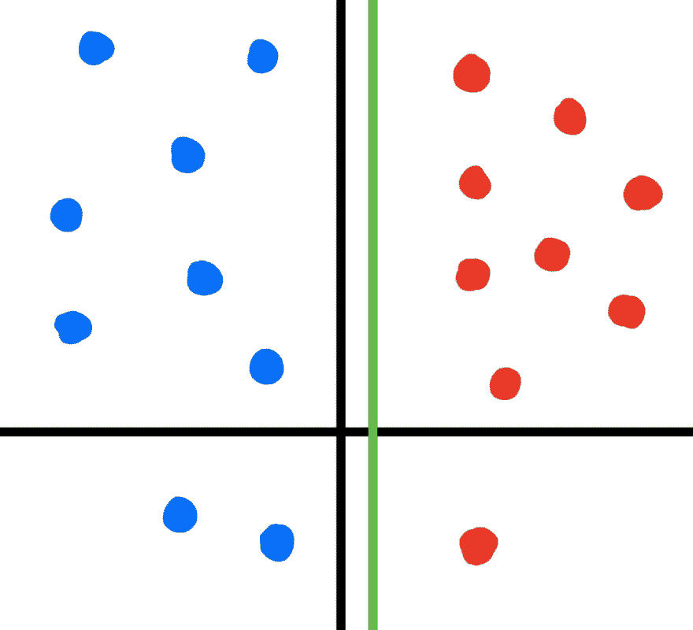](https://res.cloudinary.com/practicaldev/image/fetch/s--rZs576bI--/c_limit%2Cf_auto%2Cfl_progressive%2Cq_auto%2Cw_880/https://thepracticaldev.s3.amazonaws.com/i/fwd6vkj4gd87xzdvllp2.png)

为了线性地分离数据，你通常会求助于一个方程，比如线性回归。但是，如果我们想要处理不能线性分离的数据(如下所示)，该怎么办呢？

[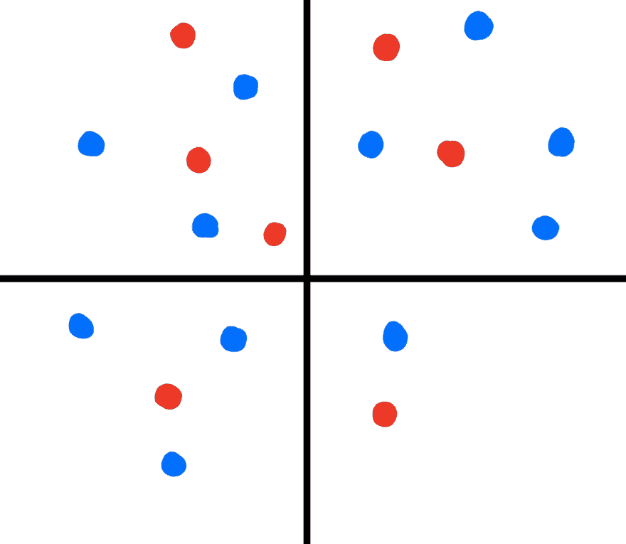](https://res.cloudinary.com/practicaldev/image/fetch/s--uRplvlXx--/c_limit%2Cf_auto%2Cfl_progressive%2Cq_auto%2Cw_880/https://thepracticaldev.s3.amazonaws.com/i/f945e1ptg46wx91hvkdu.png)

像 [SVM](https://en.wikipedia.org/wiki/Support-vector_machine) 这样的算法通过人为地给你的数据增加维度来处理这个问题。这样做是希望在更高的维度上，存在一条单独的线来分隔数据。但是还有另一种选择，神经网络！

### 感知器

神经网络最简单的形式是[感知器](https://en.wikipedia.org/wiki/Perceptron)(又名“人工神经元”)。感知器接收`n`输入，并给出一个二进制输出，指示所提供的输入是低于还是高于预定义的阈值。由于这些原理，感知器经常被用作二进制线性分隔符。

但是我们刚才不是说要解决非线性数据的分离问题吗？感知器对我们有什么用？

### 多层感知器

虽然单个感知器只能以线性方式分离数据，但几组感知器一起工作也能完成分离非线性数据的任务。我们将这些一起工作的感知机集合称为 MLP( [多层感知机](https://en.wikipedia.org/wiki/Multilayer_perceptron))。多层感知器至少包括三层(感知器组)，即输入层、隐藏层和输出层。

MLP 是一个[监督算法](https://en.wikipedia.org/wiki/Supervised_learning)，这意味着当它正确或错误地预测某事时，它需要被“告知”。MLP 通过两个不同的阶段实现了这一点。

**前馈阶段**:在此阶段，网络的输入感知器被输入训练输入数据。输入通过每一层感知器，最终产生一个二进制输出，代表网络所做的“预测”。

**反向传播阶段**:将前馈阶段的输出预测与训练集定义的预期输出进行比较。如果预测是正确的，那就没什么可做的了。但是如果预测不正确，网络会将预期结果和实际结果之间的差异“传播”回网络。这个过程给了网络一个“纠正”导致预测失败的错误的机会，有望提高后续运行的准确性。通常，这是通过使用优化函数来实现的，例如 [SGD(随机梯度下降)算法。](https://en.wikipedia.org/wiki/Stochastic_gradient_descent)

## 异或问题

我们需要一个非线性问题，我们可以尝试使用网络来解决。为了简单起见，我们将尝试构建一个“AI ”,当给定一组输入时，它可以正确预测 [XOR](https://en.wikipedia.org/wiki/Exclusive_or) 。对于那些不熟悉的人来说，XOR 是一个简单的按位运算符，由下面的真值表定义。

| 输入位 0 | 输入位 1 | 输入位 2 | 预期产出 |
| --- | --- | --- | --- |
| one | Zero | Zero | one |
| Zero | one | Zero | one |
| Zero | Zero | one | one |
| Zero | one | one | Zero |
| one | one | Zero | Zero |
| one | Zero | one | Zero |
| one | one | one | Zero |

如果 XOR 表的一行中有 1 位以上，则表达式为假。如果只存在一位(如第 1、2、3 行)，则表达式为真。

#### 准备好纸张

要开始构建电子表格 XOR 预测器，我们需要首先从我们的表(如上)中复制 XOR 训练集。

[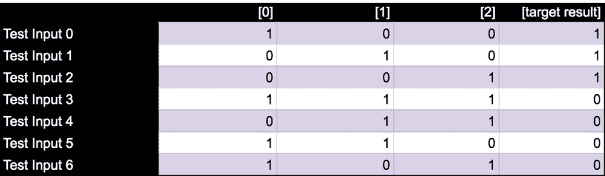](https://res.cloudinary.com/practicaldev/image/fetch/s--GksGk6LD--/c_limit%2Cf_auto%2Cfl_progressive%2Cq_auto%2Cw_880/https://thepracticaldev.s3.amazonaws.com/i/zhqv6gl8zgoo7sj2jbq8.png)

*B9:E15*

我们还需要定义一些有状态变量，以确保我们的网络能够持续和学习。具体来说，这些变量代表了网络每一层的感知器“权重”。

[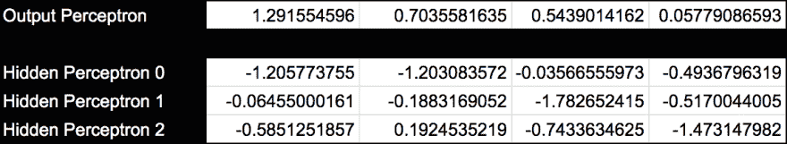](https://res.cloudinary.com/practicaldev/image/fetch/s--E1iBYxD8--/c_limit%2Cf_auto%2Cfl_progressive%2Cq_auto%2Cw_880/https://thepracticaldev.s3.amazonaws.com/i/ohqvmzadbhwwnp22fmbc.png)

*B74:E78*

这是上面某个单元格的公式。

```
IF(ISNUMBER(B69), B69, (RAND() * 2) - 1) 
```

感知器的权重需要从-1 到+1 的定义范围内的随机值开始。使用`(RAND() * 2) - 1`公式很容易做到这一点(`RAND()`从 0 - 1 产生一个随机数)。

一旦我们需要更新权重，问题就出现了。我们不希望它们被随机设置，从而覆盖我们的网络所取得的进展。`IF`允许我们从随机值开始，但是一旦单元格`B69`有内容，公式将使用该单元格的值(而不是随机生成)。

### 前馈阶段

#### 输入激活电位 B17:E23

接下来，我们将开始实施网络的前馈阶段。第一步是通过取训练输入数据 B9:D15 的每一行和隐藏感知器权重 B76:E78 的每一列的点积来计算“输入激活电位”。

[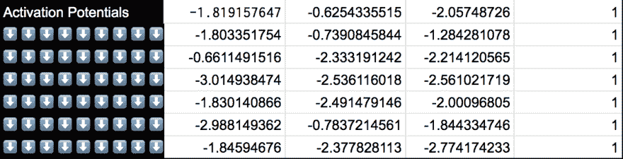](https://res.cloudinary.com/practicaldev/image/fetch/s--XeAA7cr9--/c_limit%2Cf_auto%2Cfl_progressive%2Cq_auto%2Cw_880/https://thepracticaldev.s3.amazonaws.com/i/yej6w65bbvm53fqa0pgj.png)T3】

```
=ARRAYFORMULA(
 IF(
 AND(current_iteration < target_iterations,
  ISNUMBER(current_iteration)),
    { 
      MMULT({training_inputs, ones},
        TRANSPOSE(hidden_perceptrons)),
      ones
    },
    INDIRECT("RC", FALSE))) 
```

`IF`部分通过检查保存当前迭代次数的单元，简单地阻止网络无限循环。

```
IF(
AND(current_iteration < target_iterations,
 ISNUMBER(current_iteration)), 
```

`IF`后面的参数根据分支的结果进行计算。如果...

`current iterations == target iterations`

我们使用`INDIRECT("RC", FALSE)`，这相当于在现代编程语言中使用`this`。否则，我们使用`MMULT`计算点积(矩阵乘法就是多个点积)。

#### 隐藏层激活器 B25:E31

接下来我们需要计算网络隐藏层的激活器。为了计算激活剂，我们对势 B17:E23 运行[“激活函数”](https://en.wikipedia.org/wiki/Activation_function)。实际上，激活器有多种选择，在这种情况下，我们将使用【this 形函数。

> Sigmoid 函数`1 / (1 + exp(-x))`

[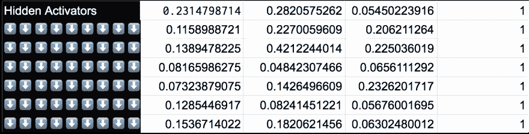](https://res.cloudinary.com/practicaldev/image/fetch/s--Dy3UC9tH--/c_limit%2Cf_auto%2Cfl_progressive%2Cq_auto%2Cw_880/https://thepracticaldev.s3.amazonaws.com/i/ommsrxs81u1uczy0vgs0.png)T3】

```
={
  ARRAYFORMULA(1 / ( 1 + EXP(-potentials))),
  potentials_bias
 } 
```

#### 输出层激活器 B33:B39

接下来是计算我们输出的激活。与隐藏激活不同，我们不需要通过激活器功能运行我们的输出电位。这使得计算我们的输出激活更加容易。

[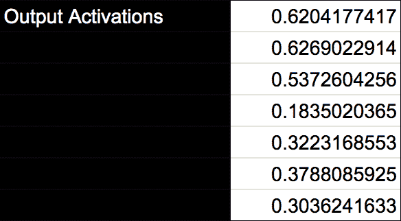](https://res.cloudinary.com/practicaldev/image/fetch/s--tis57vT---/c_limit%2Cf_auto%2Cfl_progressive%2Cq_auto%2Cw_880/https://thepracticaldev.s3.amazonaws.com/i/6enjnbsw4ew2pkvst2xw.png)T3】

```
=MMULT(
  hidden_activators, TRANSPOSE(output_perceptron)
 ) 
```

就像我们对隐藏势所做的那样，我们取输出感知器 B74:E74 与“输入”(隐藏激活器 B25:E31)的点积来生成网络的初始输出。

#### 输出二进制 D33:D39

我们现在需要获取从输出层 B33:B39 发出的“原始”值，并将它们转换成二进制表示。这是必需的，因为我们试图解决一个 XOR 问题，其中只有布尔值被认为是有效的。

[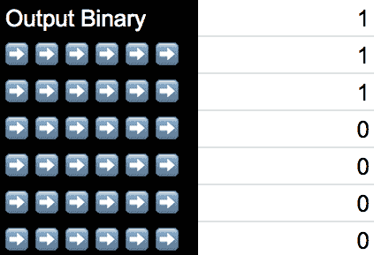](https://res.cloudinary.com/practicaldev/image/fetch/s--9aAynruM--/c_limit%2Cf_auto%2Cfl_progressive%2Cq_auto%2Cw_880/https://thepracticaldev.s3.amazonaws.com/i/lrxgjbrtbu8h1gg6026l.png)T3】

```
=IF(B33 < 0.5, 0, 1) 
```

“输出二进制”D33:D39 的每个单元格检查它在“输出激活”中的伙伴单元格(在上一步中计算的内容，单元格 B33:B39)。如果输出激活值低于 0.5，则二进制结果为 0。否则，二进制结果为 1。

*恭喜你！即使当前的预测在统计学上几乎肯定是错误的，你至少可以说 a 你到达了做出预测的点！*

### 反向传播阶段

这个阶段是真正的“学习”发生的地方。使用预测和预期结果，我们计算导数来调整我们的权重。

#### 输出层增量 F33:F39

为了继续，我们需要计算输出与目标结果之间的差异。这是通过从相应的输出激活器(B33:B39)中减去每个目标结果(E9:E15)来实现的。`2`只是一个标量，用于增加差异的显著性。

[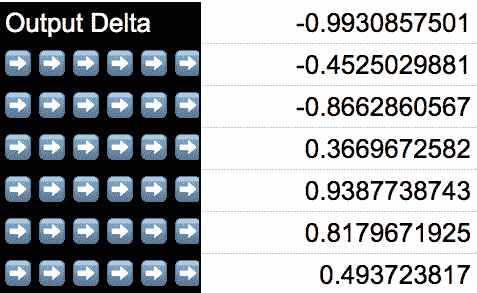](https://res.cloudinary.com/practicaldev/image/fetch/s--XEij_yfL--/c_limit%2Cf_auto%2Cfl_progressive%2Cq_auto%2Cw_880/https://thepracticaldev.s3.amazonaws.com/i/xtif1jiykta3bofgk6nl.png)T3】

```
=(B33 - E9) * 2 
```

#### 隐藏层总和 B41:E47

下一步非常类似于前馈阶段的一部分。我们只是计算先前计算的输出增量和当前“输出感知器”权重值之间的点积。

[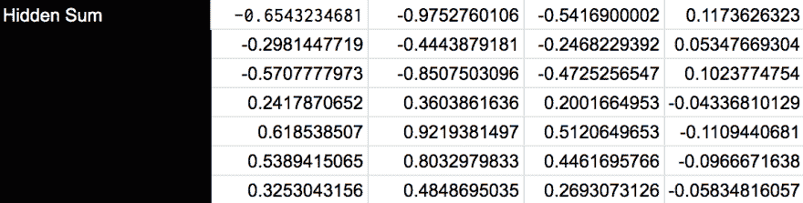](https://res.cloudinary.com/practicaldev/image/fetch/s--Pdc1ojQ5--/c_limit%2Cf_auto%2Cfl_progressive%2Cq_auto%2Cw_880/https://thepracticaldev.s3.amazonaws.com/i/dahtmnp9h65xl4bnzc29.png)T3】

```
=MMULT(
  output_delta, output_perceptron
 ) 
```

#### 隐藏层增量 B49:E55

接下来，我们确定应该更新多少隐藏层权重。这是使用我们的隐藏激活器 B25:E31 和 sigmoid 函数的[导数(我们的激活器在前馈阶段的导数)计算的。](https://math.stackexchange.com/questions/78575/derivative-of-sigmoid-function-sigma-x-frac11e-x)

[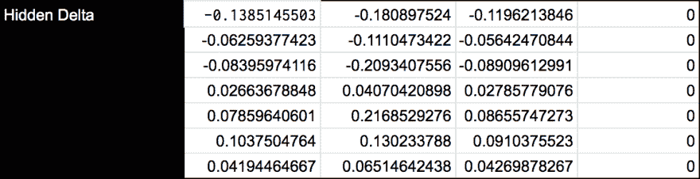](https://res.cloudinary.com/practicaldev/image/fetch/s--TrEHAQJB--/c_limit%2Cf_auto%2Cfl_progressive%2Cq_auto%2Cw_880/https://thepracticaldev.s3.amazonaws.com/i/h4k85fbmk97r91zllx8m.png)

> 衍生的 Sigmoid 函数`x * (1 - x)`

```
=ARRAYFORMULA(
  (hidden_activators * (1 - hidden_activators)) * hidden_sum
 ) 
```

#### 输出变化 B57:E63，输出变化平均值 B65:E65 和更新输出 B67:E67

我们想根据“输出增量”F33:F39、我们的“隐藏激活器”B25:E31 和“学习率”B3 来计算我们的输出应该改变多少。由于纸张的限制，我们不得不分三步进行。

**输出变化 B57:E63**

我们想计算输出感知器应该改变多少。“产出增量”代表我们的预测与预期结果的差异程度。我们乘以“隐藏激活器”，因为它们代表了产生最近预测的状态。

“学习率”B3 是一个标量，它控制每次迭代对网络“学习”的影响程度。高学习率听起来很诱人，但是它引入了超过最小值和错过收敛的可能性。你可以随意调整学习速度，但是要循序渐进。

[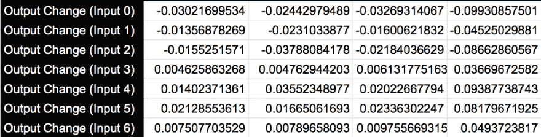](https://res.cloudinary.com/practicaldev/image/fetch/s--34IUWBVG--/c_limit%2Cf_auto%2Cfl_progressive%2Cq_auto%2Cw_880/https://thepracticaldev.s3.amazonaws.com/i/pdr9nvjl076maigq1on7.png)T3】

```
=ARRAYFORMULA(
  ((output_delta * hidden_activators) * learning_rate)
 ) 
```

**输出变化平均值 B65:E65**

出于清晰性和实用性的考虑，将我们的变更平均化为一个单独的步骤更容易。求平均值是必要的，因为我们实际上是同时向网络 7 输入 B9:E15。这意味着我们实际上同时处理 7 个输出，求平均值提供了一种将它们合并成一个值的方法。

[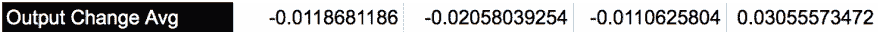](https://res.cloudinary.com/practicaldev/image/fetch/s--6Ka3gBHI--/c_limit%2Cf_auto%2Cfl_progressive%2Cq_auto%2Cw_880/https://thepracticaldev.s3.amazonaws.com/i/bbdi7kbonm26ubwwg4fr.png)T3】

```
=SUM(dim0_output_change) 
```

**更新输出 B67:E67**

最后，从“输出感知器”B74:E74 的当前值中减去计算的“输出变化平均值”B65:E65。

[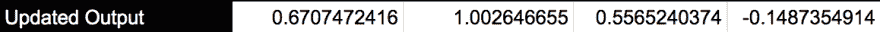](https://res.cloudinary.com/practicaldev/image/fetch/s--_ESILiZF--/c_limit%2Cf_auto%2Cfl_progressive%2Cq_auto%2Cw_880/https://thepracticaldev.s3.amazonaws.com/i/8nh829jdljfvy4xte2gm.png)T3】

```
=ARRAYFORMULA(
  output_perceptron - output_weights_avg_change
 ) 
```

#### 更新隐藏 B69:E72

我们刚刚更新了“输出感知器”的权重，所以现在我们需要更新“隐藏感知器”的权重。镜像上一步中使用的结构，我们使用“隐藏增量”B49:E55“学习速率”B3 和“测试输入”B9:E15，根据网络的前一次迭代，计算我们的“隐藏感知器”应该改变多少。

`TRANSPOSE({1,1,1,1,1,1,1})`代表我们的[偏置神经元](https://en.wikipedia.org/wiki/Artificial_neuron)，其功能类似于`y = mx + b`中的`b`。

[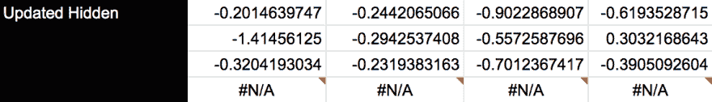](https://res.cloudinary.com/practicaldev/image/fetch/s--3u30YhKi--/c_limit%2Cf_auto%2Cfl_progressive%2Cq_auto%2Cw_880/https://thepracticaldev.s3.amazonaws.com/i/b5xnyyeddb8sga7mpuvl.png)T3】

```
=ARRAYFORMULA(
  hidden_perceptrons - ARRAYFORMULA(
    (learning_rate * (
        MMULT(
          TRANSPOSE(hidden_delta),
          { 
            training_inputs, TRANSPOSE({1,1,1,1,1,1,1})
          }
        )
      )
    )
  )
 ) 
```

我们没有采用 3 个不同的步骤来计算“输出变化”，而是将其压缩为一个步骤。

#### 循环

在解释的开始，我们描述了如何将我们的权重初始化为随机值(使用`RAND`公式)。具体来说，`IF`条件引用了一组单元格，如果这些单元格为空，`RAND`就是后备。现在我们已经为“更新输出”和“更新隐藏”计算了有效值，`IF`不再评估`RAND`分支。相反，它将那些“更新的”值代理为自己的值。

**输出感知器**

[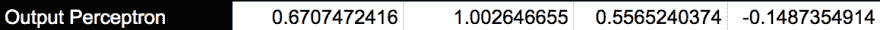](https://res.cloudinary.com/practicaldev/image/fetch/s--HlookdCd--/c_limit%2Cf_auto%2Cfl_progressive%2Cq_auto%2Cw_880/https://thepracticaldev.s3.amazonaws.com/i/z7j9lmt4b3nqz9qqs9yx.png)T3】

```
=IF(ISNUMBER(B67), B67, (RAND() * 2) - 1) 
```

**隐藏感知器**

[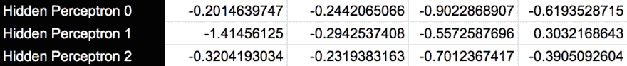](https://res.cloudinary.com/practicaldev/image/fetch/s--B43sTGhQ--/c_limit%2Cf_auto%2Cfl_progressive%2Cq_auto%2Cw_880/https://thepracticaldev.s3.amazonaws.com/i/jwb8wotdxko6q1ahdm0z.png)T3】

```
=IF(ISNUMBER(B69), B69, (RAND() * 2) - 1) 
```

因为我们的“激活势”B17:E23 依赖于“隐藏感知器”，所以对“隐藏感知器”的任何更新都会强制重新计算“激活势”。这意味着，只要“当前迭代”D1 小于“目标迭代”B5，网络就会循环。

## 观念起源

在之前的一家公司，我带领一个技术团队在我们的核心产品(横向扩展分布式计算平台)之上实施高性能神经网络。在此期间，我很快了解到，对于大多数人(包括上层管理人员)，神经网络与外星技术没有什么区别。

很明显，我需要一种方法来解释深度学习背后的基本机制，而不是解释实现高性能神经网络的复杂性。起初，我尝试使用用 python 编写的简单网络引擎，但这只对那些已经是 python 程序员的人有意义。但是后来，我恍然大悟！我意识到完全用电子表格公式建立一个简单的神经网络是可能的。

[我的博客](https://www.cdevn.com/spreadsheet-powered-ai)

 [T3】](https://twitter.com/taillogs)