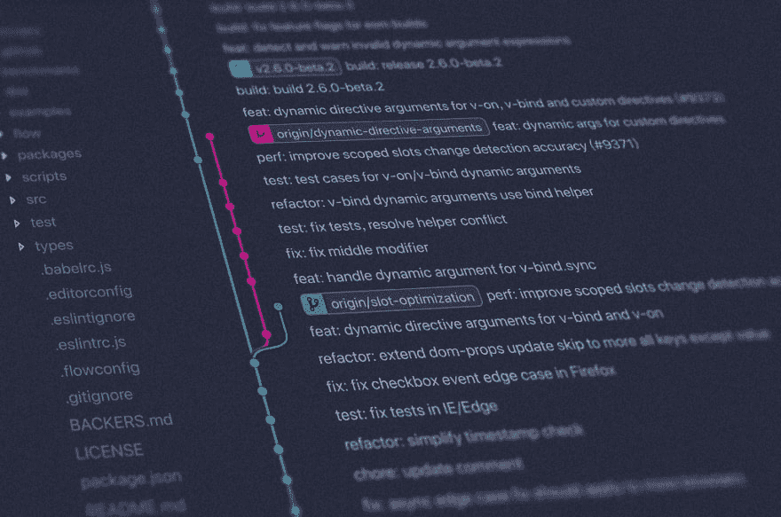

# Coding Tips For New Web Developers

> 原文：[https://dev.to/edezekiel/coding-tips-for-new-web-developers-3hh](https://dev.to/edezekiel/coding-tips-for-new-web-developers-3hh)

If you follow my blog you know that I recently graduated from a coding bootcamp and started work as a web developer.

I can’t believe I’ve been on the job about a month already! Here are some of the tips and pitfalls I’ve come across during my first month.

### React Hooks are Amazing

The first project I worked at at web3devs used React Hooks extensively. Before working at web3devs I had been putting off learning hooks. I didn’t see the point of adding Hooks when React already seemed to work fine.

After using hooks for a few weeks, I intend on using them in every React project moving forward. I love being able to forget about class components. My favorite part about JavaScript is the emphasis on functional programming. React hooks do a great job of building on top of this programming style.

I find that my components are more composable, flexible, and fun to use.

### HTML5 has a Built-in API for Form Validation, But Use Cases Are Limited.

If you’ve ever added required to an input field, then you've used HTML5's built-in api for form validation. required is a simple way to prevent a user from submitting a form if they, e.g., forgot to enter their email in the form. If the use clicks submit, a standard message will pop up telling the user that the field is required.

However, using the native HTML5 form validation causes some issues when you’re working in a react project. Specifically, it gives the browser’s DOM control over input fields (making it an uncontrolled component), whereas most react forms should use the virtual DOM (making it a controlled component).

One of my favorite bloggers, [Flavio Copes](https://dev.to/flaviocopes/handling-forms-in-react-4dnd-temp-slug-2218922), eloquently explains the importance of controlled components:

> *There are two main ways of handling forms in React, which differ on a fundamental level: how data is managed.*

*   if the data is handled by the DOM, we call them uncontrolled components
*   if the data is handled by the components we call them controlled components

> *As you can imagine, controlled components is what you will use most of the time.*

Sonny Recio [explains](https://codeburst.io/how-to-use-html5-form-validations-with-react-4052eda9a1d4) that “[w]e’re potentially violating React’s design patterns while doing so as we’re accessing the DOM properties using native javascript.”

My personal approach is to add required to a form input, then use the .checkValidity() api in the handleSubmit function.

### Use git mv To Rename and Move Files

The toughest bug I’ve ran into so far was a git merge issue caused because I didn't use git mv. Using git mv to rename and move files lets you be explicit about your intention and helps to avoid some errors.

Here is a fantastic [article on git mv](https://koukia.ca/rename-or-move-files-in-git-e7259bf5a0b7) explaining this issue. And no I didn’t find this article until after I resolved the bug. 😞.

### Git projects are case-insensitive by Default.

When you initialize git in a project directory it automatically creates a config file. In that config file, you will see a line that says ignorecase = true. This means that if you rename a folder from "Components" to "components", on GitHub the folder will still be called "Components."

This issue came up simultaneously with my git mv bug, which lead to some very interesting behavior.