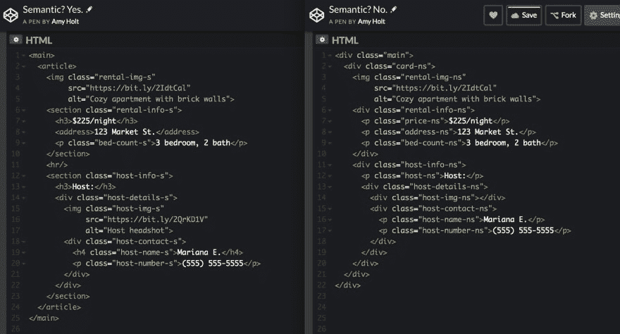

# 语义 HTML？你怎么知道？

> 原文：<https://dev.to/ameseee/semantic-html-how-can-you-tell-13am>

当 HTML5 在 2014 年发布时，开发者被赋予了一系列新元素。它们中的许多是用来替代无味的果冻`
`、内嵌的``以及其他一些名字没有传达太多意义的元素。

利用这些元素赋予我们的 HTML 尽可能多的意义，这就是编写“语义 HTML”的意义。使用语义 HTML 会使我们的站点在浏览器中呈现相同的外观，但是它为用户和开发人员都提供了很多好处。

## 语义 HTML 的好处

### 增加可达性

语义元素有助于屏幕阅读器更好地理解网站内容的上下文；因此更有效地与用户沟通。当搜索引擎有语义标签参考时，它们也更有效。

### 开发移情

我们都见过有 14 个嵌套的`
`元素的代码库，即使有完美的缩进，也很难阅读。在适当的时候，使用语义元素，如`<nav>`、`<section>`、`<article>`和`<footer>`来代替`
`元素，可以缓解这种情况。这也将使 *future-you* 更容易阅读和更新文档。对开发人员来说，另一个好处是当我们需要对元素进行样式化时——我们现在有了不同的元素名称，不需要添加太多的属性，而不是 14 个`
`元素都需要自己的属性。

## 什么样子？

下面两张卡片中的一张是用语义 HTML 构建的；一个不是。你能分辨出哪个是哪个吗？

答案是——你*不应该*能够通过在浏览器中查看结果来判断。语义 HTML 应该产生相同的外观；但是我们使用的元素应该向我们、开发人员和阅读我们代码的技术传达意义，以便为所有用户提供更好的体验。

这是代码的截图，并排显示。点击下面的链接查看完整的代码。

找到密码笔[这里](https://codepen.io/ameseee/pen/NZGYwR)和[这里](https://codepen.io/ameseee/pen/ewJdYK)。

注意:有许多不同的方式可以为这张卡片编写 HTML 都使用语义元素。这绝不是最好或唯一的解决方案！

### 那`
` s 呢？

这并不意味着**不是**就意味着你再也不应该使用`
`了！注意，在“语义？Yes”的例子，我选择使用一个`
`来包装主机细节。我不希望*与*就内容块进行任何交流，但是我需要容器在我的 CSS 中使用 FlexBox。然而，我选择为卡片本身使用一个`<article>`元素，然后使用一个`<section>`来区分租赁信息和主机信息。

元素可能仍然在你的网站中占有一席之地。当你不确定是否应该使用一个`
`或者一个更具语义的元素时，问问你自己，“这些元素组合在一起是因为它们的内容属于一起吗？它们组合在一起是因为我需要一个容器来进行造型吗？”这可以成为做决定的起点。

## 你的挑战

读完这篇文章后，你可能会想“我已经使用了一些语义 HTML”——太棒了！我鼓励你通读一个你正在做的项目，并评估你对语义 HTML 的使用。如果你发现了什么，重构它！

## 总结起来

就像编程中的其他事情一样，没有一种正确的方式来编写语义 HTML，但重要的是我们要深思熟虑，并不断努力使我们的应用程序对用户更容易访问，对其他开发人员更容易阅读。

查看 MDN 在[语义元素](https://developer.mozilla.org/en-US/docs/Glossary/Semantics#Semantic_elements)上的页面，了解更多可供您使用的元素！