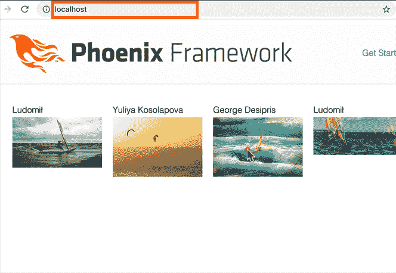
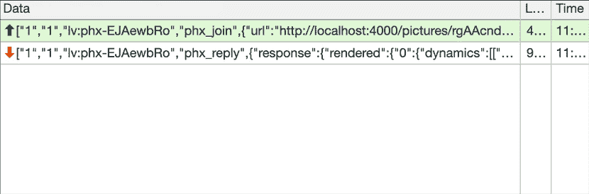

# Phoenix LiveView live_link

> 原文：<https://dev.to/alvisesus/phoenix-liveview-livelink-1ih3>

[https://www.youtube.com/embed/MIKMZpPPuMI](https://www.youtube.com/embed/MIKMZpPPuMI)

**[通过邮件订阅获取免费教程](https://pages.convertkit.com/c021826e86/5ddcb20a27)** 。开始学习仙丹和凤凰建立功能和应用程序！

在[上一篇关注`live_redirect`](https://www.poeticoding.com/phoenix-liveview-change-the-url-without-refreshing-the-page/) 的文章中，我们已经看到了如何在 Phoenix LiveView 中改变 URL 而不改变位置或刷新页面。

通过这种方式，我们可以用当前的页面状态来更新 URL，让用户可以更容易地添加书签或共享它。

[](https://res.cloudinary.com/practicaldev/image/fetch/s--S92DEku_--/c_limit%2Cf_auto%2Cfl_progressive%2Cq_66%2Cw_880/https://1o6jjh24p1t92lcqci49qg8a-wpengine.netdna-ssl.com/wp-content/uploads/2019/06/liveview_pictures_pushstate-1.gif)

我们将看到如何使用 [live_link](https://github.com/phoenixframework/phoenix_live_view/blob/957b7ebfb66034cb093a81d991c044f7e532aa5d/lib/phoenix_live_view.ex#L913) 重构代码，使代码更简单，并减少浏览器和 LiveView 之间交换的消息数量。

## 图片示例同`live_redirect/2`

让我们考虑一下 [LiveView 图片页面示例](https://www.poeticoding.com/phoenix-liveview-change-the-url-without-refreshing-the-page#pictures-example)，看看在这种情况下，如何方便地使用`live_link/2`而不是`live-redirect/2`。

在这个例子中，我们有一个缩略图列表。当我们点击缩略图时，LiveView 会更改 URL 并更新显示全尺寸图像的页面。

```
 defmodule DemoWeb.PicturesLive do

  ...

  def render(assigns) do

    ~L"""

    ...

    <%= for {id, pic} <- pictures do %>

    <div class="column" 

         phx-click="show" 

         phx-value="<%= id %>">

      <%= pic.author %>

      ">

    </div>

    <% end %>

    ...

    """

  end

end 
```

每个缩略图元素都有`phx-click="show"`和`phx-value="<%= id %>"`属性。这样，当我们点击一个缩略图时，`"show"`事件会和图片 id 一起发送到服务器。

```
 def handle_event("show", id, socket) do

  {:noreply, live_redirect(socket, to: Routes.live_path(socket, DemoWeb.PicturesLive, id))}

end 
```

LiveView 进程使用`handle_event("show", id, socket)`函数处理该事件，向浏览器发回一条`live_redirect`消息。

## 检查 LiveView 消息

让我们更好地看看发生了什么，检查浏览器和 Phoenix 之间交换的消息。

*我用的是 Chrome inspector，不过用其他浏览器应该差不多。*

我们打开检查器，选择 network 选项卡并单击`WS`,我们只显示 WebSocket 连接。刷新页面，我们现在看到 Phoenix LiveView 使用的 WebSocket 连接，单击它，我们可以看到浏览器和 LiveView 之间交换的消息。

[](https://res.cloudinary.com/practicaldev/image/fetch/s--eWmjK5NK--/c_limit%2Cf_auto%2Cfl_progressive%2Cq_66%2Cw_880/https://www.poeticoding.com/wp-content/uploads/2019/06/liveview_messages_live_redirect.gif)

点击缩略图，我们会看到四条消息

```
 [...,"event",{"type":  "click",  "event":  "show",  "value":"XesILKdmkwM"}]  [...,"live_redirect",{"kind":  "push",  "to":  "/pictures/XesILKdmkwM"}] 
```

*   单击缩略图时，浏览器会向 LiveView 发送“显示”事件消息。

*   Phoenix 发回一个带有新的`URL`的 *live_redirect* 消息，LiveView 前端 javascript 库[使用`history.pushState()`](https://github.com/phoenixframework/phoenix_live_view/blob/bcacd1d0545e923f069738fe244c27904a58973d/assets/js/phoenix_live_view.js#L573) 将 URL 更改为新的。

```
 [...,"link",{"url":"/pictures/XesILKdmkwM"}]  [...,"phx_reply",{"response":{"diff":  {...}}}] 
```

*   更改 URL 后，浏览器会用新的 URL 向服务器发回一条消息

*   LiveView 使用 [`handle_params/3`](https://github.com/poeticoding/phoenix_live_view_example/blob/master/lib/demo_web/live/pictures_live.ex#L39) 处理该消息，呈现新页面，并发回一个响应，其中包含要在页面上应用的差异。

这种来回的消息是多余的，我们可以用`live_link`来避免前两条消息(*点击*和*直播 _ 重定向*)。

## 直播 _ 链接

通过使用`live_link`,我们不需要自己处理点击事件。然后我们可以删除两个属性，`phx-click`和`phx-values`，以及`handle_event("show", id, socket)`函数。

```
 defmodule DemoWeb.PicturesLive do

  def render(assigns) do

    ... 

    <%= for {id, pic} <- pictures do %>

      <%= live_link to: Routes.live_path(@socket, DemoWeb.PicturesLive, id) do %>

        <div class="column">

          <%= pic.author %>

          ">

        </div>

      <% end %>

    <% end %>

        ...

    end

end 
```

我们用`live_link`包装缩略图标签，并使用与`live_redirect`相同的`Routes.live_path/3`函数。

因为我们在一个 LiveView 模板中，我们只需要使用`@socket`而不是`socket`。

我们看到代码是如何以这种方式变得更简单的，并且使用浏览器检查器，我们还看到每次点击我们只有两条消息。

```
 [...,"link",{"url":"http://localhost:4000/pictures/XesILKdmkwM"}]  [...,"phx_reply",{"response":{"diff":  {...}}}] 
```

使用 *live_link* ，浏览器会立即更改 URL，而不会发送任何点击事件(就像我们之前做的那样)。更改后，新的 URL 被发送到服务器，服务器重新呈现页面并发回一条消息，说明要应用的差异。

## 什么时候用`live_link`什么时候用`live_redirect`？

那么，什么时候用`live_link`，什么时候用`live_redirect`？

在[图片示例](https://www.poeticoding.com/phoenix-liveview-change-the-url-without-refreshing-the-page/#pictures-example)中，用户点击链接与前端交互。很明显,`live_link`是正确的选择——它使代码更简单，我们得到的交换信息更少。

在动画 URL 的例子中，没有用户交互(除了开始/停止动画)。每隔 100 毫秒，服务器告诉浏览器改变 URL，所以在这个`live_redirect`中是要走的路。

**[通过邮件订阅获取免费教程](https://pages.convertkit.com/c021826e86/5ddcb20a27)** 。开始学习仙丹和凤凰建立功能和应用程序！